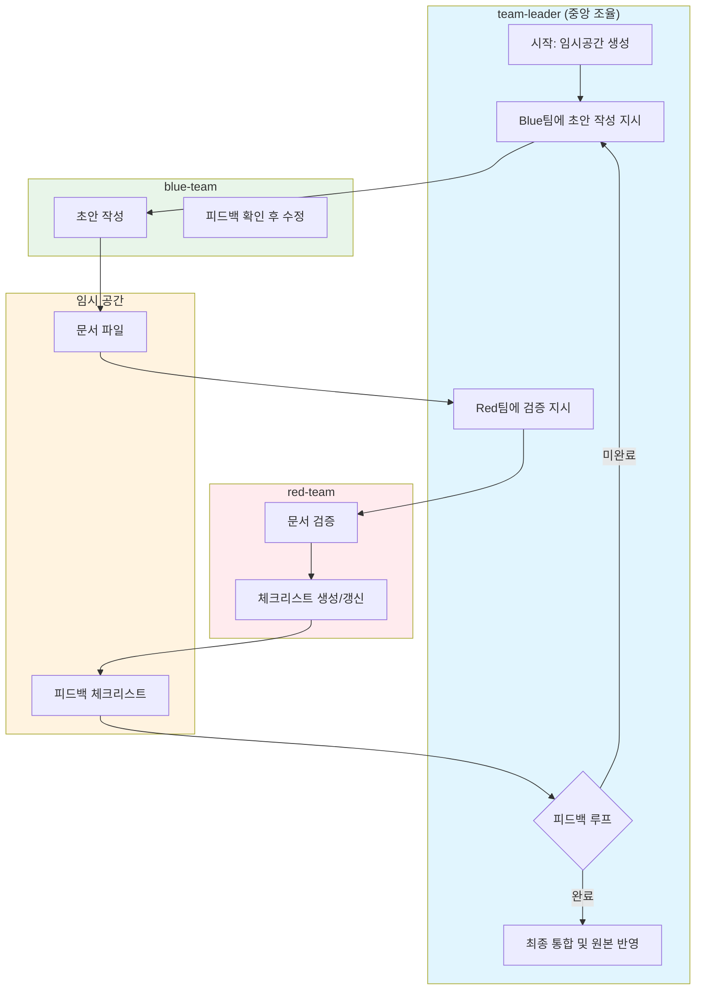

# Doc Rewrite

**IMPORTANT:**

- 이 Skill은 클로드 코드의 `Agent Team`으로 실행됩니다. subagent가 tmux span 구조로 병렬/순차 실행됩니다.
- subagent의 tmux span 에서 클로드 코드 CLI 실행시 명령어에 `--model Default`를 지정하여 호출하세요.
    - 에이전트 팀에 구성된 모든 멤버(subagent)가 등록이 되어야지만 작업을 진행합니다.
    - 반드시 모든 멤버와 통신이 되는지 확인 후 작업을 진행합니다.
- ${ARGUMENTS}: 문서 경로 = {filepath}
- {filename}: 파일명에서 .md 확장자를 제거한 이름 (예: claude-code.md → claude-code)
- {command-name}: 현재 명령어 이름입니다.
- {tmp-path}: 임시 디렉토리 `.claude/.tmp/{command-name}/{filename}/`
- **금지 사항:** 블루 팀은, 레드 팀의 피드백을 무시하거나, 토론 라운드를 건드지 마세요.

## Process Overview

**원본 보호 원칙:** 작업 중 원본 파일은 절대 수정하지 않습니다. 임시 공간에서 작업 완료 후 최종 승인 시에만 원본을 갱신합니다.

**조율 중심 구조:** team-leader가 모든 흐름의 중앙 허브 역할을 합니다. Blue와 Red 팀은 직접 통신하지 않고, team-leader를 통해 메시지를 주고받습니다.

---

## 상세 실행 절차

**⚠️ 아래 단계를 반드시 순서대로 실행하세요.**

### Phase 1: 초기화 (team-leader)

1. **임시 공간 생성**
    - `{tmp-path}` 디렉토리 확인 → 존재 시 삭제 후 새로 생성
    - 원본 `{filepath}`를 `{tmp-path}/{filename}.md`로 복사

2. **Blue 팀에게 초안 작성 지시**
    - 대상 파일: `{tmp-path}/{filename}.md`
    - 완료 메시지 대기

### Phase 2: 초안 작성 (blue-team)

3. **초안 작성**
    - `{tmp-path}/{filename}.md`에 초안 작성
    - 작업 완료 후 team-leader에게 완료 메시지

### Phase 3: 검증 루프 (최대 3회)

**평가 체크리스트 템플릿:** 📋 [feedback_checklist.md](templates/feedback_checklist.md) 파일을 참조하세요.

4. **Red 팀에게 검증 지시** (team-leader)
    - Blue 팀 완료 메시지 수신 후 Red 팀에 검증 요청
    - 검토 대상: `{tmp-path}/{filename}.md`

5. **검증 및 피드백 생성** (red-team)
    - 문서 검토 후 `{tmp-path}/feedback_checklist.md` 생성/갱신
    - 미체크 항목에 개선 방향 코멘트 작성
    - 작업 완료 후 team-leader에게 완료 메시지

6. **피드백 전달 및 판정** (team-leader)
    - Red 팀 완료 메시지 수신
    - 체크리스트 확인: 모든 항목 체크 시 → Phase 4로 이동
    - 미체크 항목 있음 → Blue 팀에게 수정 지시 (Phase 2로)

7. **피드백 기반 수정** (blue-team)
    - `{tmp-path}/feedback_checklist.md` 확인
    - 미체크 항목 반영하여 `{tmp-path}/{filename}.md` 수정
    - 작업 완료 후 team-leader에게 완료 메시지 (Phase 3-4로)

### Phase 4: 완료 처리 (team-leader)

8. **최종 승인 및 통합**
    - 3라운드 내 완료 시: 최종 포맷팅
    - 3라운드 초과 시: 사용자에게 선택 요청 (수락/선택반영/추가라운드/종료)

9. **원본 반영 및 정리**
    - 성공: 임시 작업본을 원본 `{filepath}`에 반영
    - `{tmp-path}` 완전 삭제
    - 실패/중단: `{tmp-path}` 보관 (사용자 디버깅용)

---

## 3라운드 한도 및 에스컬레이션

- **최대 3라운드**까지 체크리스트 완료 시도
- 3라운드까지 모든 항목이 체크되지 않은 경우:
    1. team-leader가 체크리스트 파일 확인
    2. 사용자에게 다음 중 선택 요청:
        - 현재 버전으로 수락하고 진행
        - 특정 미체크 항목만 선택하여 반영
        - 추가 라운드 진행 (사용자가 직접 피드백 제공)
        - 프로세스 종료
