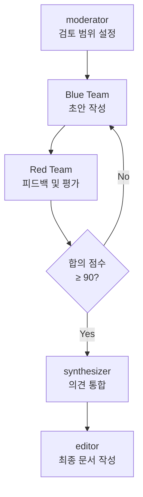

# 블로그 콘텐츠 검토 팀

**IMPORTANT:**

- 이 Skill은 클로드 코드의 `Agent Team`으로 실행됩니다. subagent가 tmux span 구조로 병렬/순차 실행됩니다.
- subagent의 tmux span 에서 클로드 코드 CLI 실행시 명령어에 `--model Default`를 지정하여 호출하세요.

- **필수:** 
  - 에이전트 팀에 구성된 모든 멤버(subagent)가 등록이 되어야지만 작업을 진행합니다.
  - 반드시 모든 멤버와 통신이 되는지 확인 후 작업을 진행합니다.
- **금지 사항:** 블루 팀은, 레드 팀의 피드백을 무시하거나, 토론 라운드를 건드지 마세요.

## Process

**중요:** 컨텍스트 폭발을 방지하기 위해 최대 2라운드로 제한합니다.

1. `moderator`가 검토 프로세스의 진행자로, 전체 흐름을 조율하고 각 단계의 입력/출력을 관리합니다.
    - 검토 범위 및 우선순위 설정
    - 각 에이전트에 명확한 작업 지시
    - 점수 기준(90점) 합의 여부 판정
    - 반복 라운드 관리 (최대 2라운드)
    - 200토큰 요약 준수 여부 확인
2. **Blue Team** - 초안 작성 및 Red Team 피드백 반영 개선 (순차 실행)
    - `content-strategist`: 문서 구조, 섹션 계층, 콘텐츠 흐름 분석 및 작성
    - `tech-writer`: 기술적 정확성, 용어 사용, 코드 예시 검토 및 작성
    - `diagram-designer`: Mermaid 차트, 다이어그램, 시각적 표현 작성
    - Red Team 피드백 수신 시 개선안 작성하여 재제출
3. **Red Team** - Blue Team 문서 검증 및 점수 평가 (병렬 실행)
    - `critic`: 공격적 검증, 숨겨진 가정, 모순점 발굴 및 점수 산정
    - `reader-advocate`: 독자 관점 접근성 및 가독성 평가 및 점수 산정
    - 각 항목 100점 만점 기준 평가, 종합 90점 이상 시 합의 완료
    - 90점 미만 시 구체적 개선 피드백 Blue Team에 전달
4. **통합 단계** - 합의된 문서 최종 정제 (순차 실행)
    - `synthesizer`: Blue/Red Team 최종 의견 통합 및 정리
    - `editor`: 최종 문서 품질 보증 및 포맷팅
