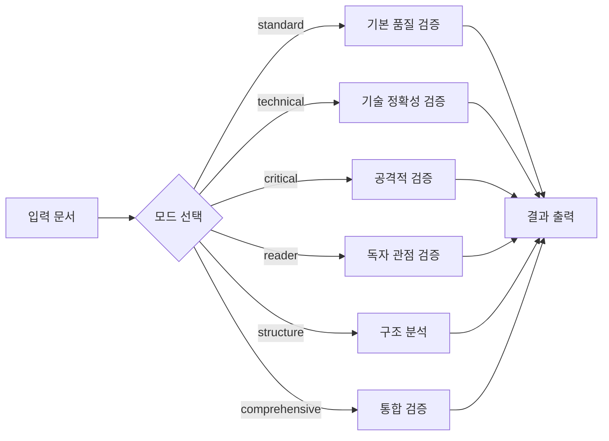
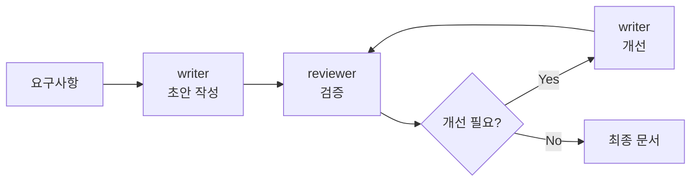

# Docs Skill (통합 문서 관리)

통합 문서 에이전트를 활용한 문서 검증 및 작성 스킬입니다. reviewer, writer, translator 3개 에이전트를 오케스트레이션합니다.

> **버전:** 2.0
> **통합 에이전트:** reviewer, writer, translator
> **지원 모드:** standard, technical, critical, reader, structure, comprehensive

---

## 주요 기능

| 기능 | 설명 | 에이전트 |
|------|------|---------|
| **문서 검증** | 5가지 관점에서 문서 품질 검증 | reviewer |
| **초안 작성** | 요구사항 기반 문서 초안 작성 | writer |
| **피드백 개선** | 검증 결과 기반 문서 개선 | writer + reviewer |
| **번역** | 영→한 기술 문서 번역 | translator |

---

## 통합 에이전트 구조

### reviewer (통합 검증)

**5가지 검증 모드 지원:**

| 모드 | 설명 | 기반 |
|-----|------|------|
| `standard` | 기본 6가지 품질 기준 | doc-reviewer |
| `technical` | 기술 정확성 및 용어 | tech-writer |
| `critical` | 공격적 검증 및 가정 발굴 | critic |
| `reader` | 독자 관점 접근성 | reader-advocate |
| `structure` | 문서 구조 및 중복 분석 | content-strategist |
| `comprehensive` | 모든 모드 통합 실행 | - |

**특수 기능:**
- 한국어 자동 감지 (settings.json `language: korean`)
- 통합 체크리스트 출력
- 심각도 기반 우선순위 (CRITICAL/WARNING/INFO)

### writer (작성/개선)

**2가지 작업 모드:**

| 모드 | 설명 |
|-----|------|
| `draft` | 초안 작성 |
| `revise` | 피드백 기반 개선 |

**작업 원칙:**
- 원본 보호 (직접 수정 금지)
- `${CLAUDE_TMP_DIR}`에서만 작업
- 피드백 체크리스트 기반 개선

### translator (번역)

**settings.json 연동:**
```json
{ "language": "korean" }
```

| 설정값 | 동작 |
|-------|------|
| `korean` | 영→한 번역 활성화 |
| `english` | 번역 비활성화 또는 정제 |
| `auto` | 언어 자동 감지 |

---

## 워크플로우

### 1. 문서 검증 워크플로우



### 2. 작성-검증 피드백 루프



---

## 사용법

### 기본 검증

```bash
# standard 모드 (기본)
/docs review docs/post.md

# 특정 모드로 검증
/docs review docs/api.md --mode technical
/docs review docs/guide.md --mode comprehensive
```

### 작성-검증 루프

```bash
# 초안 작성
/docs write "API 엔드포인트 문서" --target docs/api/endpoints.md

# 작성 + 검증 통합
/docs write-validate "가이드 작성" --target docs/guide.md
```

### 한국어 문서 검증

```bash
# settings.json language=korean 기준
/docs review docs/korean-guide.md --lang korean
```

---

## 설정

### settings.json

```json
{
  "language": "korean",
  "env": {
    "CLAUDE_TMP_DIR": "${CLAUDE_PROJECT_DIR}/.claude/.tmp"
  }
}
```

### 에이전트 매핑

| 통합 에이전트 | 파일 경로 | 지원 모드/액션 |
|--------------|----------|---------------|
| reviewer | `.claude/agents/docs/reviewer.md` | standard/technical/critical/reader/structure/comprehensive |
| writer | `.claude/agents/docs/writer.md` | draft/revise |
| translator | `.claude/agents/docs/translator.md` | translate |

---

## 출력

### 검증 결과

**파일:** `${CLAUDE_TMP_DIR}/review_result.md`

```markdown
## 검증 리포트 (Mode: technical)

### 기술 검증
- [ ] 코드 예제 오류: line 23
  → 문법 수정 필요

### 용어 검증
- [ ] 미정의 용어: "MCP" - 1.2절
  → 정의 추가 필요
```

### 작성 결과

**파일:** `${CLAUDE_TMP_DIR}/draft.md`

### 작업 공간

```
${CLAUDE_TMP_DIR}/
├── review_result.md
├── draft.md
└── writer_workspace/
```

---

## 오케스트레이션 설정

### config.yaml

```yaml
skill_name: docs
version: 2.0

agents:
  reviewer:
    path: ".claude/agents/docs/reviewer.md"
    supported_modes:
      - standard
      - technical
      - critical
      - reader
      - structure
      - comprehensive

  writer:
    path: ".claude/agents/docs/writer.md"
    actions:
      - draft
      - revise

  translator:
    path: ".claude/agents/docs/translator.md"

workflows:
  blog-review:
    description: "블로그 콘텐츠 멀티 모드 검증"
    steps:
      - agent: reviewer
        mode: technical
      - agent: reviewer
        mode: critical
      - agent: reviewer
        mode: reader

  korean-doc-validation:
    description: "한국어 문서 종합 검증"
    steps:
      - agent: reviewer
        mode: comprehensive
        language: auto
```

---

## 이전 버전과의 차이

### v1.0 (Legacy)
- 에이전트: 8개 (blog/) + 3개 (docs/) = 11개
- 방식: 개별 에이전트 직접 호출
- 복잡도: 높음

### v2.0 (Current)
- 에이전트: 3개 (통합)
- 방식: reviewer 모드 선택
- 복잡도: 낮음
- 확장성: 모드 추가로 확장

---

## 참고

- **기반:** 기존 blog/ 8개 + docs/ 3개 에이전트 통합
- **통합 계획서:** `.claude/docs/plans/agent-consolidation-plan.md`
- **작성일:** 2026-03-21
