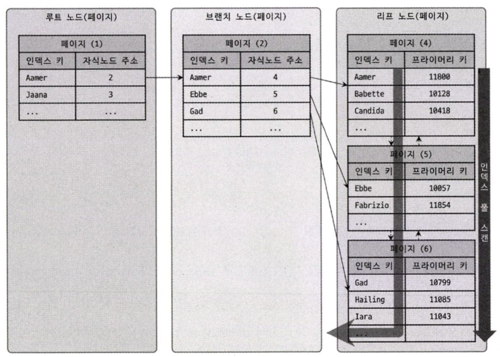

# B Tree VS B+Tree

대부분의 RDBMS 의 인덱스는 b+tree 구조로 저장된다.

## B Tree

- 방대한 양의 데이터를 저장하고, 빠른 검색을 위해 설계된 자료구조다.
- 노드가 중위 순회 방식으로 정렬되어 있기 때문에 "자체 균형 트리"로 알려져 있다.
- [m-way]((https://webdocs.cs.ualberta.ca/~holte/T26/m-way-trees.html)) 탐색 트리의 유형이다.
- 노드엔 여러 payload 로 구성된다.
- payload 는 key/value 쌍을 가진 데이터로 "satellite data", 그냥 "data" 라고도 불린다.
- 노드에 구성된 여러 payload 는 key를 기준으로 오름차순(AES)으로 정렬된다.
    - 모든 하위 트리의 키가 왼쪽에 있는 하위 트리의 키보다 크도록 구성된다.
- 데이터베이스 관점에서 Payload는?
    - key는 행의 "PK" 또는 "Index Columns",
    - value는 자식 노드 참조 값, 레코드의 행 자체 저장하거나, 레코드 식별자(ROWID) 또는 데이터 블록이 존재하는 디스크의 물리적인 주소를 참조한다.

### Conditional

- m 순서가 있는 노드는 최대 m 자식을 가진다.
- 각 내부 노드는 최소한 m/2 개의 자식을 가진다.
- 루트에는 최소한 두 개의 자식이 있어야 한다.
- 리프 노드를 제외한 노드는, k 자식과 k-1 키를 가지고 있다.
- 모든 리프 노드는 같은 트리 level 에 존재한다.

## B+ Tree

빠른 탐색을 위해선 낮은 깊이를 유지하는게 중요하다.

B+ Tree 는 B Tree의 단점을 고안된 자료구조다.

- 루트 노드, 내부 노드엔 자식 노드에 대한 키와 포인터만 관리한다.
    - 레코드 검색을 제어하는 매개체 역할
    - 키와 포인터만 관리하기에 하나의 노드에 많은 payload 를 관리할 수 있다.
    - 데이터베이스 관점에서 Payload는?
        - key는 행의 "PK" 또는 "Index Columns",
        - value는 자식 노드 주소(페이지)
- 리프 노드에만 데이터 포인터를 저장한다.
    - 디스크의 물리적인 주소 또는 PK 값을 가지고 있다.
    - 실제 디스크에 엑세스하여 데이터 블록을 읽는 역할
- 리프 노드는 연결 리스트로 관리한다.
    - 오름차순으로 정렬되어, Sequential 접근 방식을 제공한다.
    - 범위 검색에 용이하다.

### Benchmark

|         | B tree                                    | B+ tree                                      |
|---------|-------------------------------------------|----------------------------------------------|
| 데이터 포인터 | 모든 노드에 데이터 포인터 존재                         | 	리프 노드에만 데이터 포인터가 존재                         |
| 탐색      | 모든 노드의 키 값을 비교 탐색 한다.                     | 모든 키는 리프 노드에 있으므로 검색이 더 빠르고 정확해진다.           |
| 중복 키    | 키의 중복은 허용하지 않는다.                          | 	키의 중복을 허용하고, 모든 키는 리프 노드에 존재                |
| 삽입      | 삽입에는 시간이 더 걸리고 때로는 예측할 수 없다.              | 삽입이 더 쉽고 결과는 항상 동일                           |
| 삭제      | 내부 노드를 삭제하는 것은 매우 복잡하며 트리는 많은 변형을 거쳐야 한다. | 모든 데이터는 리프 노드에서 관리됨으로 삭제가 쉽다.                |
| 리프  노드  | 리프 노드는 구조적 연결 리스트로 저장되지 않는다.              | 리프 노드는 구조적 연결 리스트로 저장된다.                     |
| 접근      | 노드에 대한 순차적 접근이 불가능                        | 연결 리스트처럼 순차적 접근이 가능                          |
| 키       | 특정 수의 노드 높이가 더 크다.                        | 동일한 수의 노드에 대해 높이가 B Tree보다 작다.               |
| 사용      | 데이터베이스, 검색 엔진에 사용                         | "Multilevel Indexing" 또는 "Database Indexing" |
| 노드 수    | 	내부 노드는 'l', '2l' 노드 수를 지닌다.              | 각 내부 노드에는 n/2~n개의 하위 노드가 있을 수 있다.            |

## Reference

- [baeldung-cs - The Difference Between B-trees and B+trees](https://www.baeldung.com/cs/b-trees-vs-btrees)
- [webdocs - M-way Search Trees](https://webdocs.cs.ualberta.ca/~holte/T26/m-way-trees.html)
- [www.geeksforgeeks.org - b+tree vs b-tree](https://www.geeksforgeeks.org/difference-between-b-tree-and-b-tree/)
- [www.geeksforgeeks.org - b-tree](https://www.geeksforgeeks.org/introduction-of-b-tree-2/)
- [studytonight - B+ Trees Data Structure](https://www.studytonight.com/advanced-data-structures/b-plus-trees-data-structure)
