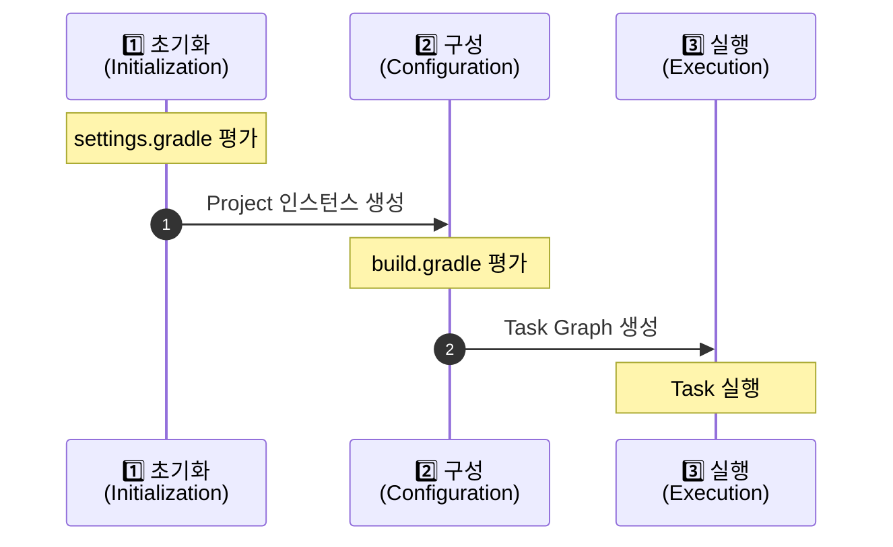

# Gradle Build Lifecycle

Gradle 빌드는 세 가지 단계로 구성되며, 각 단계는 순차적으로 실행됩니다.

---

## 빌드 단계 개요




---

## 1️⃣ 초기화 단계 (Initialization Phase)

### 목적

빌드에 참여할 프로젝트들을 식별하고 Project 인스턴스를 생성합니다.

### 수행 작업

| 순서 | 작업                            | 설명                                                      |
|----|-------------------------------|---------------------------------------------------------|
| 1  | `settings.gradle(.kts)` 파일 탐지 | 루트 디렉토리에서 설정 파일을 찾습니다                                   |
| 2  | `Settings` 인스턴스 생성            | 빌드 설정을 담을 객체를 생성합니다                                     |
| 3  | `settings.gradle(.kts)` 파일 평가 | 설정 파일을 실행하여 빌드 구조를 파악합니다                                |
| 4  | `Project` 인스턴스 생성             | `include()`, `includeBuild()`로 선언된 모든 프로젝트의 인스턴스를 생성합니다 |

### 예시

```kotlin
// settings.gradle.kts
rootProject.name = "my-project"

include(
    "platform",
    "platform:auth-server",
    "platform:api-gateway"
)

// 위 코드는 초기화 단계에서 평가되어
// root, platform, auth-server, api-gateway의 Project 인스턴스를 생성함
```

**핵심 포인트**:

- 초기화 단계에서는 **어떤 프로젝트가 빌드에 참여하는지만** 결정
- 아직 `build.gradle` 파일은 평가하지 않음
- 멀티 프로젝트 구조와 Composite Builds를 설정

---

## 2️⃣ 구성 단계 (Configuration Phase)

### 목적

모든 프로젝트의 빌드 스크립트를 평가하고 Task 의존성 그래프를 생성합니다.

### 수행 작업

| 순서 | 작업                            | 설명                                              |
|----|-------------------------------|-------------------------------------------------|
| 1  | 모든 `build.gradle(.kts)` 파일 평가 | 초기화 단계에서 생성된 모든 Project의 빌드 스크립트를 실행합니다         |
| 2  | Task 등록                       | 플러그인이 추가한 Task와 사용자 정의 Task를 등록합니다              |
| 3  | Task 의존성 파악                   | Task 간 `dependsOn`, `mustRunAfter` 등의 관계를 분석합니다 |
| 4  | Task Graph 생성                 | 실행할 Task들의 순서를 결정한 방향성 비순환 그래프(DAG)를 생성합니다      |

### 예시

```kotlin
// build.gradle.kts
plugins {
    id("java")  // Configuration 단계에서 java 플러그인이 적용되어
    // compileJava, test 등의 Task가 등록됨
}

tasks.register("hello") {
    doLast {
        println("Hello!")  // 이 코드는 Configuration 단계에서 실행되지 않음
    }
}

// 아래 코드는 Configuration 단계에서 즉시 실행됨
println("Configuring project...")  // ⚠️ Configuration 시점에 출력
```

**핵심 포인트**:

- **모든 프로젝트의** `build.gradle`이 평가됨 (실행할 Task와 무관하게)
- Task의 `doFirst`, `doLast` 블록은 실행되지 않고, Task 설정만 수행됨
- 실행 시간이 오래 걸리는 작업은 Configuration 단계에서 수행하면 안 됨

**⚠️ 주의사항**:

```kotlin
// ❌ 나쁜 예: Configuration 단계에서 시간이 오래 걸리는 작업
val result = someExpensiveComputation()  // 매번 실행됨!

tasks.register("myTask") {
    doLast {
        // ✅ 좋은 예: Task 실행 시점에만 수행됨
        someExpensiveComputation()
    }
}
```

---

## 3️⃣ 실행 단계 (Execution Phase)

### 목적

Task Graph에 따라 선택된 Task들을 실제로 실행합니다.

### 수행 작업

| 순서 | 작업         | 설명                                         |
|----|------------|--------------------------------------------|
| 1  | Task 선택    | 사용자가 요청한 Task (예: `./gradlew build`)를 찾습니다 |
| 2  | 의존 Task 확인 | Task Graph를 사용하여 실행해야 할 모든 Task를 결정합니다     |
| 3  | Task 스케줄링  | 실행 순서를 결정하고 병렬 실행 가능한 Task를 식별합니다          |
| 4  | Task 실행    | 각 Task의 `doFirst`, `doLast` 블록을 실행합니다      |

### 예시

```bash
# 사용자가 다음 명령을 실행
./gradlew :platform:auth-server:build

# Gradle의 동작:
# 1. build Task를 찾음
# 2. build가 의존하는 Task들을 Task Graph에서 확인
#    - compileJava
#    - processResources
#    - classes
#    - compileTestJava
#    - processTestResources
#    - testClasses
#    - test
#    - jar
#    - assemble
#    - check
# 3. 의존성 순서에 따라 실행
# 4. 병렬 실행 가능한 Task는 동시에 실행 (--parallel 옵션 사용 시)
```

**핵심 포인트**:

- **요청된 Task와 그 의존 Task만** 실행됨
- Task의 `doFirst`, `doLast` 액션이 실제로 수행됨
- Up-to-date 체크를 통해 불필요한 재실행 방지
- `--parallel` 옵션으로 병렬 실행 가능

---

## 실전 예시: 각 단계에서의 출력

```kotlin
// settings.gradle.kts
println("⏱️ [INIT] Evaluating settings.gradle.kts")
rootProject.name = "demo"
include("app")

// build.gradle.kts (root)
println("⚙️ [CONFIG] Configuring root project")

tasks.register("hello") {
    println("⚙️ [CONFIG] Configuring hello task")

    doFirst {
        println("🚀 [EXEC] Executing hello task - doFirst")
    }

    doLast {
        println("🚀 [EXEC] Executing hello task - doLast")
    }
}

// app/build.gradle.kts
println("⚙️ [CONFIG] Configuring app project")
```

**실행 결과**:

```bash
$ ./gradlew hello

⏱️ [INIT] Evaluating settings.gradle.kts
⚙️ [CONFIG] Configuring root project
⚙️ [CONFIG] Configuring hello task
⚙️ [CONFIG] Configuring app project

> Task :hello
🚀 [EXEC] Executing hello task - doFirst
🚀 [EXEC] Executing hello task - doLast

BUILD SUCCESSFUL
```

---

## 성능 최적화 팁

### 1. Configuration 단계 최적화

```kotlin
// ❌ 느림: 매번 Configuration 단계에서 실행
val files = fileTree("src").files.size
println("File count: $files")

// ✅ 빠름: 필요할 때만 실행
tasks.register("countFiles") {
    doLast {
        val files = fileTree("src").files.size
        println("File count: $files")
    }
}
```

### 2. 조건부 Task 평가

```kotlin
// ❌ 모든 프로젝트에서 평가됨
subprojects {
    tasks.register("expensiveTask") { ... }
}

// ✅ 필요한 프로젝트에서만 평가
subprojects {
    if (projectDir.resolve("special-marker.txt").exists()) {
        tasks.register("expensiveTask") { ... }
    }
}
```

### 3. Configuration Cache 활용

```bash
# Configuration 단계 결과를 캐싱하여 두 번째 빌드부터 생략
./gradlew build --configuration-cache
```

---

## 요약

| 단계          | 시점    | 평가되는 파일               | 생성되는 객체               | 주의사항            |
|-------------|-------|-----------------------|-----------------------|-----------------|
| **1️⃣ 초기화** | 빌드 시작 | `settings.gradle.kts` | `Settings`, `Project` | 프로젝트 구조만 결정     |
| **2️⃣ 구성**  | 초기화 후 | 모든 `build.gradle.kts` | Task 인스턴스, Task Graph | 시간 오래 걸리는 작업 금지 |
| **3️⃣ 실행**  | 구성 후  | 없음 (스크립트 실행 안 함)      | Task 실행 결과            | 요청된 Task만 실행    |

**핵심 원칙**:

- Configuration 단계는 **항상** 실행됨 → 가볍게 유지
- Execution 단계는 **필요한 Task만** 실행됨 → 무거운 작업은 여기서

## Reference

- [Gradle Docs - Build Lifecycle](https://docs.gradle.org/current/userguide/build_lifecycle.html)
