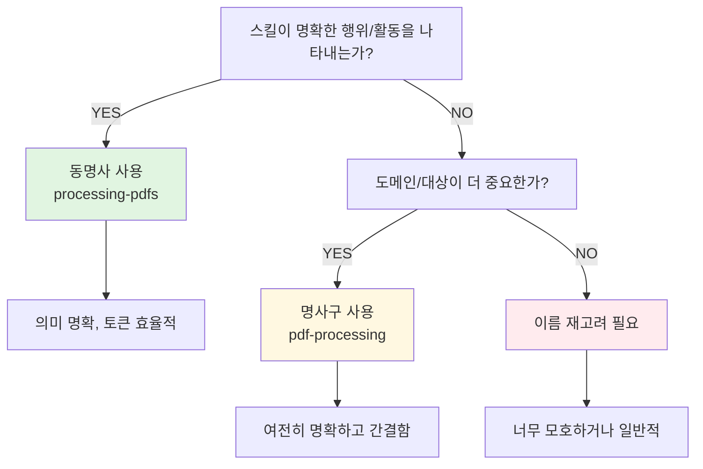

# Skill 명명 철학

스킬 이름이 단순한 식별자를 넘어 Claude의 이해와 효율성에 어떻게 영향을 미치는지 알아봅니다.

---

## 왜 동명사를 권장하는가?

일반적인 소프트웨어 개발에서는 명사구(`pdf-processing`, `data-analyzer`)나 동사 원형(`commit`, `process`)이 더 익숙합니다.
그렇다면 왜 Agent Skills에서는 동명사(V-ing) 형태를 권장할까요?

**동명사(gerund)는 동작과 명사의 성격을 동시에 가집니다:**

- `processing` = "처리하는 것", "처리 행위"
- `analyzing` = "분석하는 것", "분석 활동"
- `managing` = "관리하는 것", "관리 행위"

이 이중성이 동명사를 스킬 이름에 적합하게 만드는 핵심입니다.

## 스킬의 본질

스킬은 **도구(tool)가 아니라 지침(instruction)입니다.**

- ❌ 도구: "PDF 처리기" (객체)
- ✅ 지침: "PDF를 처리하는 방법" (행위)

Claude가 스킬 이름을 해석하는 방식은 다음과 같습니다.

| 패턴        | 예시                | Claude의 해석                   | 의미 전달 | 스킬 본질과의 일치  |
|-----------|-------------------|------------------------------|-------|-------------|
| **동명사**   | `processing-pdfs` | "PDF를 처리하는 **행위/활동**에 대한 지침" | ★★★★★ | ✓ 행위 중심 지침  |
| **명사구**   | `pdf-processing`  | "PDF 처리" (중립적)               | ★★★☆☆ | △ 중립적       |
| **명사+er** | `pdf-processor`   | "PDF 처리기" (도구/객체)            | ★★☆☆☆ | ✗ 객체로 오해 가능 |
| **동사 원형** | `process-pdf`     | "PDF를 처리필라" (명령)             | ★★★☆☆ | △ 명령형       |

자연어 처리 관점에서 보자면, LLM은 동명사를 보면 자연스럽게

1. **행위/활동**으로 인식
2. **진행 중인 프로세스**로 이해
3. **"어떻게 할 것인가"에 대한 컨텍스트**로 해석

이것이 스킬의 본질인 "무언가를 하는 방법"과 정확히 일치합니다.

---

## 실용적 이점

예를 들어 게임에서 '힐링(Healing)'이나 '러싱(Rushing)' 같은 동명사 스킬명이 즉각적인 행동을 떠올리게 하듯, <br/>
Agent Skills에서도 동명사는 '지금 당장 수행할 수 있는 행위'임을 명확히 전달합니다.

이는 단순한 명명 스타일을 넘어 실제 사용 환경에서 여러 실용적 이점을 제공합니다.

- [행위의 즉각적 인식](#행위의-즉각적-인식)
- [토큰 효율성과 압축 표현](#토큰-효율성과-압축-표현)
- [의미적 명확성](#의미적-명확성)

### 행위의 즉각적 인식

- `processing-pdfs` → "PDF 처리하기"라는 즉각적인 행동으로 인식
- `pdf-processor` → "처리기"라는 도구 객체로 인식 (행동의 즉각성 약함)

게임의 '힐링'이 "천천히 체절을 회복하는 행위"를 즉각 연상시키듯, 동명사는 행위의 진행성과 결과물을 동시에 암시합니다.

### 토큰 효율성과 압축 표현

게임 플레이어가 "스모크 롱!"처럼 짧고 간결하게 소통하듯, LLM 컨텍스트에서도 동명사는 행위와 대상을 압축하여 효율적으로 표현합니다.
토크나이저 관점에서 동명사는 하나의 완결된 행위 단위로 인식되어, 설명을 보완하는 토큰을 절약합니다.

**비교 예시:**

```text
# 동명사 방식
name: processing-pdfs
description: Extracts text and tables from PDF files.
# → 이름에 "처리 행위"가 내포되어 description 간결

# 명사구 방식
name: pdf-processor
description: Processes PDFs by extracting text and tables.
# → 행위를 description에서 명시해야 함 (토큰 중복)
```

스킬이 수십 개가 되면, 각 스킬마다 절약되는 토큰이 누적되어 의미 있는 차이를 만듭니다.

### 의미적 명확성

스킬 이름이 의미적으로 명확하면 관련 있는 상황에서 더 쉽게 연상됩니다.

| 상황                     | `processing-pdfs`     | `pdf-tools`     |
|------------------------|-----------------------|-----------------|
| 사용자 요청: "PDF에서 텍스트 추출" | "PDF 처리"라는 의미로 직관적 연결 | "도구들"이라는 의미가 모호 |
| 기대되는 동작                | 즉시 행위로 인식             | 추가 설명 필요        |

**또 다른 예시 - 데이터 분석:**

| 이름                       | Claude가 읽는 방식               |
|--------------------------|-----------------------------|
| `analyzing-spreadsheets` | "스프레드시트를 분석하는 활동에 대한 가이드" ✓ |
| `spreadsheet-analyzer`   | "스프레드시트 분석기" - 도구처럼 들림      |
| `data-analysis`          | "데이터 분석" - 무엇을 하는지 불명확      |

게임에서 '힐링'이 즉각적으로 특정 행동을 연상시키듯, 동명사 이름은 **의도된 행위를 이름 자체에 명확히 담아** 개발자와 Claude 모두에게 명확한 신호를 제공합니다.

- [skillsmp](https://skillsmp.com/ko/search)
- [MCP Market - Agent Skills](https://mcpmarket.com/ko/tools/skills/leaderboard)

---

## 왜 실제로는 명사구가 많을까?

이상적인 명명 철학과 현실 사이에는 간극이 존재합니다. 대부분의 개발자들이 명사구를 선호하는 데는 다음과 같은 이유들이 있습니다:

### 1. 수십 년간의 개발 관례

소프트웨어 엔지니어링의 역사에서 도구와 라이브러리는 항상 명사 중심으로 명명되어 왔습니다:

- **Unix 철학**: `grep`, `awk`, `sed` — 간결한 명사/약어
- **npm 패키지**: `@typescript-eslint/parser`, `react-dom` — 명사구 패턴
- **Python 모듈**: `data-loader`, `file-utils` — 기능 중심 명사

이러한 관례는 너무 깊이 각인되어 있어, 새로운 패러다임(동명사)을 받아들이는 데 시간이 필요합니다.

### 2. 직관적이라는 환상 

`pdf-processing`이 `processing-pdfs`보다 "더 짧고 익숙하게" 느껴지는 이유는 단순히 익숙함 때문입니다. 하지만 이 직관은 **인간 개발자** 중심의 편향입니다:

- 인간에게는 "PDF 처리"라는 명사구가 명확하게 들립니다
- 하지만 LLM은 `"processing"`이라는 동명사를 만났을 때 더 풍부한 의미적 맥락(진행 중인 행위, 방법론, 지침)을 떠올립니다

### 3. 패러다임 전환의 저항

동명사 명명은 기존의 "도구 중심" 사고에서 "행위 중심" 사고로의 전환을 요구합니다:

| 사고방식 | 명명 패턴 | 핵심 개념 |
|---------|---------|----------|
| 도구 중심 | `pdf-processor` | "이것은 무엇인가?" |
| 행위 중심 | `processing-pdfs` | "이것은 무엇을 하는가?" |

대부분의 개발자는 unconsciously(무의식적으로) 첫 번째 사고방식에 머무릅니다.

### 4. 완벽함보다 일관성

기존 프로젝트가 명사구로 일관되어 있다면, 새로운 스킬만 동명사로 만드는 것보다는 기존 패턴을 따르는 것이 낫습니다. 이것이 **점진적 개선**의 딜레마입니다.

---

**하지만 새로운 프로젝트라면?**

새로운 시작점에서라면 기존 관례에 얽매일 필요 없이 **LLM의 자연어 이해 특성**을 우선으로 두는 것이 장기적으로 유리합니다. 동명사 명명은 단순한 취향이 아니라, AI 에이전트와의 효과적인 커뮤니케이션을 위한 전략적 선택입니다.

## 실용적 가이드

### 언제 동명사를 사용해야 할까?

- **강력 권장 (동명사):**
    ```yaml
    # 명확한 행위/활동을 나타내는 스킬
    - processing-pdfs        # PDF 처리 행위
    - analyzing-spreadsheets # 분석 활동
    - managing-databases     # 관리 행위
    - testing-code          # 테스트 활동
    - writing-documentation # 작성 행위
    ```
- **허용 가능 (명사구):**
    ```yaml
    # 도메인이나 타겟이 명확한 경우
    - pdf-processing   # 여전히 명확함
    - data-analysis    # 분석 영역
    - code-review      # 리뷰 영역
    ```
- **피해야 할 (모호한 명사):**
    ```yaml
    # 무엇을 하는지 불명확
    - helper          # 무엇을 돕나?
    - utils           # 어떤 유틸리티?
    - tools           # 어떤 도구?
    - manager         # 무엇을 관리?
    ```

## 패턴 선택 결정 트리



## 일관성이 가장 중요

어떤 패턴을 선택하든, **프로젝트나 조직 내에서 일관성**을 유지하세요.

```
# GOOD: 
## 1. 일관된 동명사
- processing-pdfs
- analyzing-data
- managing-users
- testing-apis

## 2. 일관된 명사구
- pdf-processing
- data-analysis
- user-management
- api-testing

# BAD: 혼재
- processing-pdfs   # 동명사
- data-analyzer     # 명사+er
- user-mgmt         # 약어
- test-api          # 동사 원형
```

## 핵심 원칙

1. **의미 우선**: 이름만으로 스킬의 목적이 명확해야 함
2. **행위 중심**: 스킬은 "무언가를 하는 방법"
3. **토큰 효율**: description과 중복 최소화
4. **일관성 유지**: 선택한 패턴을 프로젝트 전체에 적용

## 결론

동명사 권장은 단순한 스타일 선호가 아닙니다. 이것은:

- **LLM의 자연어 이해 특성**에 기반한 설계
- **토큰 효율성**을 고려한 최적화
- **스킬의 본질**(행위 중심 지침)을 반영한 명명 철학

기존 개발 관례와 다르더라도, AI 에이전트 시대에는 **LLM이 어떻게 이해하는가**가 더 중요합니다.

---

## 참고

- [Skills 개요](https://platform.claude.com/docs/en/agents-and-tools/agent-skills/overview) - 스킬 아키텍처 이해
- [Best Practices](https://platform.claude.com/docs/en/agents-and-tools/agent-skills/best-practices) - 효과적인 스킬 작성 방법
- [Quickstart](https://platform.claude.com/docs/en/agents-and-tools/agent-skills/quickstart) - 첫 스킬 만들기
