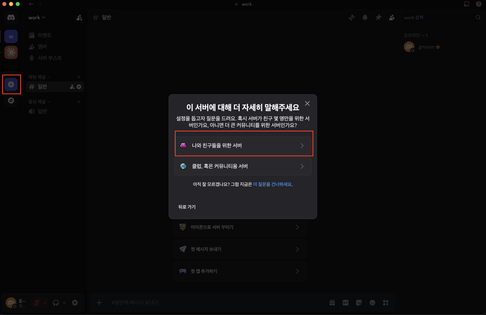
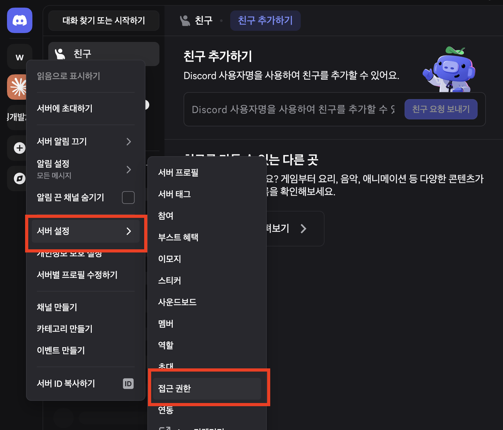
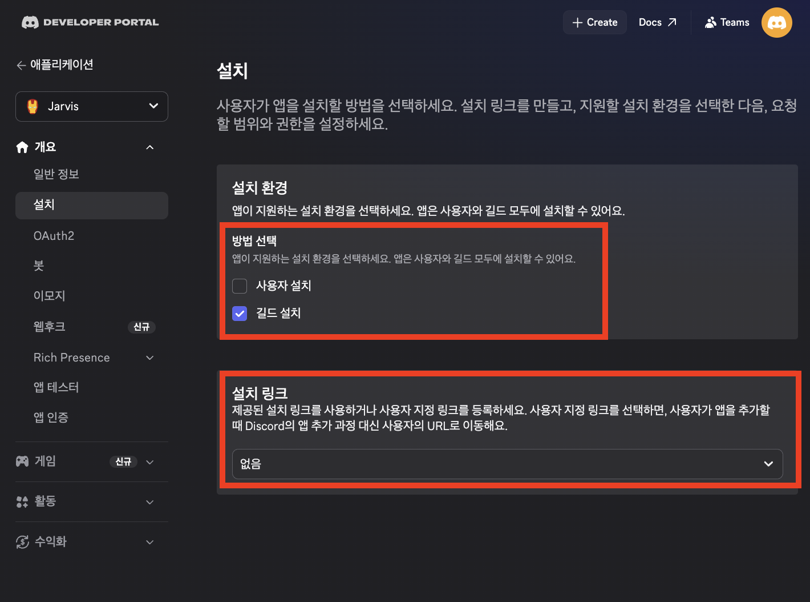

# Claude Code Channel + Discord 연동

Discord 봇을 통해 Claude Code 세션과 실시간으로 메시지를 주고받는 방법을 알아봅니다.

Discord에서 본낸 메시지가 Claude Code에 전달되고, Claude의 답장이 Discord로 돌아오는 양방향 채널을 설정합니다.

---

## 시작 전에

- **Claude Code v2.1.80 이상** 필요 (`claude --version`으로 확인)
- 인증 요구사항
  - **claude.ai 로그인 필수**: `claude login`으로 인증
  - **Console/API 키 인증은 지원되지 않음**: Anthropic Console의 API 키로는 채널 기능을 사용할 수 없습니다.
  - **팀/엔터프라이즈 조직**: 관리자가 [claude.ai Admin Console](https://claude.ai/admin-settings/claude-code)에서 채널 기능을 명시적으로 활성화해야 함
    - `channelsEnabled: true` 설정 필요
    - 조직 설정에서 승인된 채널 플러그인 목록(`allowedChannelPlugins`) 관리 가능

### 런타임 및 패키지

채널은 MCP 서버로 실행되며 다음이 필요합니다:

```bash
brew install bun
npm install @modelcontextprotocol/sdk zod
```

- **Bun (권장)**
  - 공식 플러그인들이 Bun 기반으로 작성됨
  - 설치: [참고 bun.sh/docs/installation](https://bun.sh/docs/installation)
  - 확인: `bun --version`
- **MCP SDK**
  - [`@modelcontextprotocol/sdk`](https://www.npmjs.com/package/@modelcontextprotocol/sdk) 패키지 필요
  - Node.js나 Deno도 사용 가능하지만, 프리뷰 플러그인은 Bun 기준으로 작성됨

**플러그인 마켓플레이스 등록**
```bash
# 공식 마켓플레이스가 등록되지 않았다면 먼저 추가
claude plugin marketplace add anthropics/claude-plugins-official
```

## Discord 연동

Discord 봇으로 Claude Code 세션과 메시지를 주고받는 양방향 채널을 만들어 봅니다.

### 1단계: 디스코드 비공개 서버(길드) 생성



1. 서버 생성
2. 나와 친구들을 위한 서버

### 2단계: 서버 접근 권한 설정



- [X] 서버 설정 > 접근 권한
- [X] "초대 전용 설정" 활성화 확인

### 3단계: Discord 봇 만들기


1. [Discord Developer Portal](https://discord.com/developers/applications)에서 **New Application** 클릭
2. **Bot** 섹션에서 봇 생성 후
    - [X] **Reset Token** → 토큰 복사
    - [X] **공개 봇 비활성화**
3. **Privileged Gateway Intents**에서
    - [X] **Message Content Intent** 활성화

### 4단계: 앱 설치 방법 설정



1. 설치 환경
    - [X] 길드 설치
2. 설치 링크
    - [X] 없음

### 5단계: 봇을 서버에 초대

**OAuth2 > URL Generator**에서 초대 URL을 만듭니다:


- 스코프:
    - [X] `bot`
- 봇 권한:
    - [X] 채널 보기(`View Channels`)
    - [X] 메시지 보내기(`Send Messages`)
    - [X] 스레드에서 메시지 보내기(`Send Messages in Threads`)
    - [X] 파일 첨부(`Attach Files`)
    - [X] 메시지 기록 보기(`Read Message History`)
    - [X] 반응 추가(`Add Reactions`)
- 연동 유형
    - [X] 길드 설치

생성된 URL로 접속해서 봇을 추가할 서버를 고릅니다.


### 6단계: Claude Code CLI 플러그인 설치

```bash
# 플러그인 설치
claude plugin install discord@claude-plugins-official

# 설치 확인
claude plugin list
```

> 마켓플레이스를 못 찾는다는 오류가 나면 먼저 등록 후 플러그인 재설치를 진행하세요.
> ```bash
> claude plugin marketplace add anthropics/claude-plugins-official
> ```

### 7단계: 봇 토큰 설정

Claude Code CLI에서 실행합니다:

```
/discord:configure <복사한_봇_토큰>
```

> 토큰은 `~/.claude/channels/discord/.env`에 자동으로 저장됩니다. 환경변수로 넣어도 됩니다:
> ```bash
> export DISCORD_BOT_TOKEN=<토큰>
> ```

### 8단계: 채널 활성화

```bash
claude --channels plugin:discord@claude-plugins-official
```

> `claude --dangerously-skip-permissions --channels plugin:discord@claude-plugins-official`

### 9단계: 계정 페어링

1. Discord에서 봇에게 DM을 보내면 봇이 페어링 코드로 답합니다
   
2. Claude Code에서 코드를 입력합니다:
   
   ```
   /discord:access pair <코드>
   ```
3. 본인 계정만 메시지를 전달하도록 허용 목록 정책을 켭니다:
   ```
   /discord:access policy allowlist
   ```

페어링이 끝나면 Discord DM으로 보내는 메시지가 Claude Code 세션에 전달되고, 답장이 Discord로 돌아옵니다.

봇이 응답하지 않으면 Claude Code가 `--channels` 플래그와 함께 실행 중인지 확인해 주세요. 세션이 열려 있어야 메시지를 받을 수 있습니다.

---

## 참고 자료

- [Claude Code - Channels Reference](https://code.claude.com/docs/en/channels-reference)
- [Claude Code - Supported Channels](https://code.claude.com/docs/en/channels#supported-channels)
