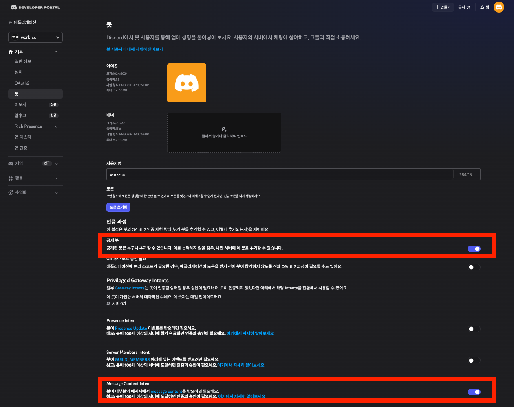
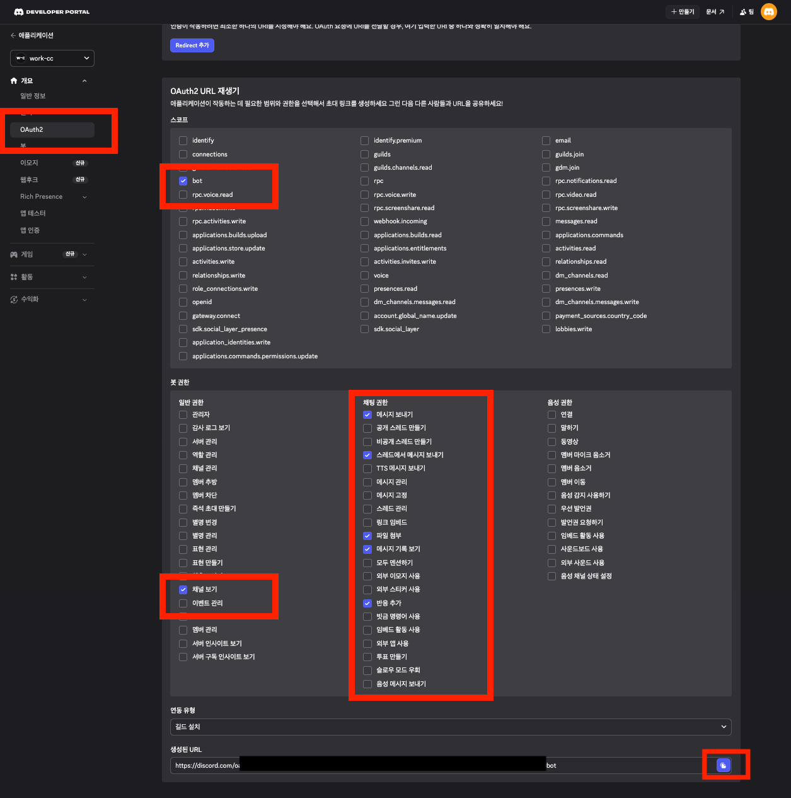
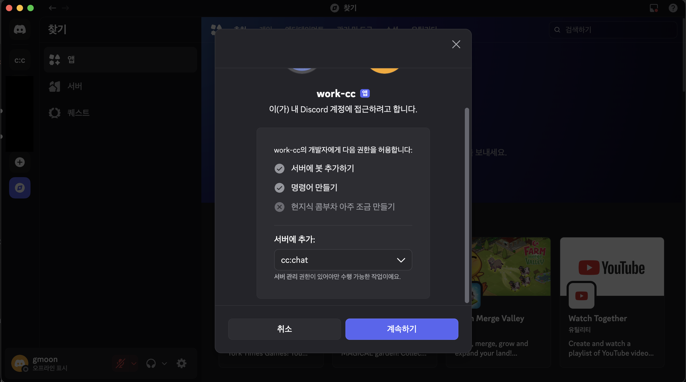
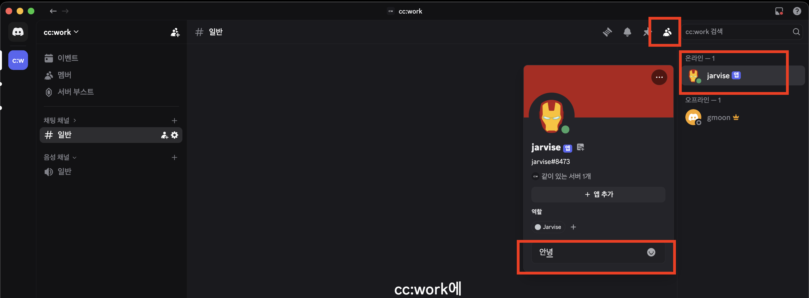
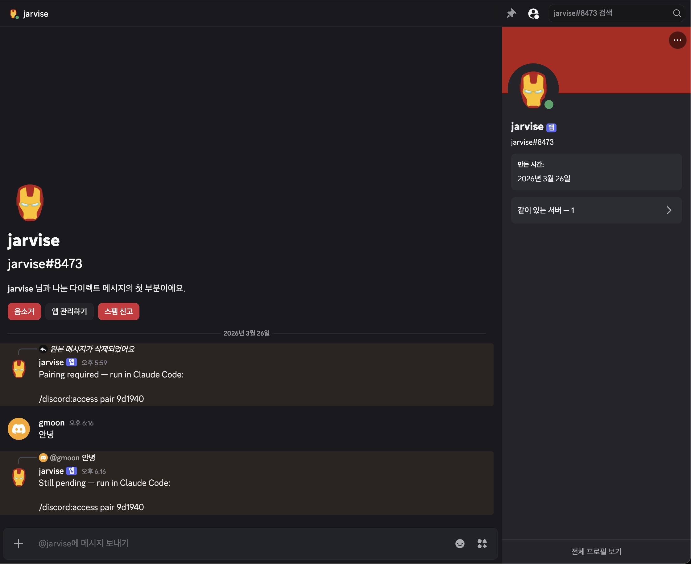

# Claude Code Channel

외부 메시지 시스템에서 Claude Code 세션으로 이벤트를 실시간으로 전달하는 방법을 알아봅니다.

CI/CD 알림, 모니터링 경고, 커스텀 웹훅까지 — HTTP POST를 보낼 수 있다면 무엇이든 Claude에게 직접 전달할 수 있습니다.

---

## 시작 전에

| 항목          | 설명                                                                                         |
|:------------|:-------------------------------------------------------------------------------------------|
| Claude Code | **v2.1.80 이상** (`claude --version`으로 확인)                                                   |
| 인증          | **claude.ai 로그인** 필수. Console/API 키는 사용할 수 없습니다                                            |
| MCP SDK     | [`@modelcontextprotocol/sdk`](https://www.npmjs.com/package/@modelcontextprotocol/sdk) 패키지 |
| 런타임         | [Bun](https://bun.sh), [Node](https://nodejs.org), [Deno](https://deno.com) 중 하나           |

미리 빌드된 플러그인은 Bun 기반이지만, 직접 채널을 만들 때는 런타임을 자유롭게 골라 쓸 수 있습니다.

### 채널 서버가 하는 일

채널 서버의 역할은 단순합니다. `claude/channel` 기능을 선언해서 Claude Code가 이벤트를 구독하게 하고, `notifications/claude/channel`로 이벤트를 전송하며, stdio
트랜스포트로 Claude Code와 연결됩니다. Claude Code가 서버를 하위 프로세스로 직접 실행하는 구조입니다.

> 리서치 프리뷰 기간에는 커스텀 채널이 허용 목록에 없습니다. 로컬 테스트에는 `--dangerously-load-development-channels` 플래그가 필요합니다.

---

## 웹훅 채널 직접 만들기

HTTP 요청을 받아 Claude Code 세션으로 넘기는 채널을 처음부터 만들어 봅니다.

### 1단계: 프로젝트 생성

```bash
mkdir webhook-channel && cd webhook-channel
bun add @modelcontextprotocol/sdk
```

### 2단계: 채널 서버 작성

`webhook.ts` 파일을 만들어 줍니다:

```ts
#!/usr/bin/env bun
import {Server} from '@modelcontextprotocol/sdk/server/index.js'
import {StdioServerTransport} from '@modelcontextprotocol/sdk/server/stdio.js'

// MCP 서버 생성 및 채널로 선언
const mcp = new Server(
    {name: 'webhook', version: '0.0.1'},
    {
        // 이 키가 채널로 만드는 핵심 — Claude Code가 리스너를 등록합니다
        capabilities: {experimental: {'claude/channel': {}}},
        // Claude의 시스템 프롬프트에 추가 — 이벤트 처리 방법 안내
        instructions: 'Events from the webhook channel arrive as <channel source="webhook" ...>. They are one-way: read them and act, no reply expected.',
    },
)

// stdio로 Claude Code에 연결 (Claude Code가 이 프로세스를 실행)
await mcp.connect(new StdioServerTransport())

// HTTP 서버 시작 — 모든 POST를 Claude에게 전달
Bun.serve({
    port: 8788,
    hostname: '127.0.0.1',  // localhost 전용: 외부 접근 차단
    async fetch(req) {
        const body = await req.text()
        await mcp.notification({
            method: 'notifications/claude/channel',
            params: {
                content: body,  // <channel> 태그의 본문이 됨
                // 각 키는 태그 속성이 됩니다, 예: <channel path="/" method="POST">
                meta: {path: new URL(req.url).pathname, method: req.method},
            },
        })
        return new Response('ok')
    },
})
```

핵심은 세 군데입니다. `capabilities`에 `claude/channel`을 넣는 순간 "이건 채널입니다"라는 선언이 됩니다. `instructions`는 Claude 시스템 프롬프트에 그대로 들어가서
이벤트를 어떻게 처리할지 알려줍니다. 그리고 `StdioServerTransport`로 연결하면 Claude Code가 이 프로세스를 직접 띄웁니다. `mcp.notification()`에서 `content`는
이벤트 본문, `meta`의 각 키는 `<channel>` 태그 속성이 됩니다.

### 3단계: Claude Code에 서버 등록

`.mcp.json`에 추가합니다. 프로젝트 루트의 `.mcp.json`에는 상대 경로를, `~/.claude.json`에는 절대 경로를 씁니다:

```json
{
  "mcpServers": {
    "webhook": {
      "command": "bun",
      "args": [
        "./webhook.ts"
      ]
    }
  }
}
```

### 4단계: 테스트

개발 플래그로 Claude Code를 시작합니다:

```bash
claude --dangerously-load-development-channels server:webhook

────────────────────────────────────────────────────────────────────────────────────────────────────────────
  WARNING: Loading development channels

  --dangerously-load-development-channels is for local channel development only. Do not use this option to
   run channels you have downloaded off the internet.

  Please use --channels to run a list of approved channels.

  Channels: server:webhook

  ❯ 1. I am using this for local development
    2. Exit

  Enter to confirm · Esc to cancel
```

서버는 Claude Code가 알아서 띄워줍니다. 별도로 실행할 필요가 없습니다.

다른 터미널에서 요청을 보내봅니다:

```bash
curl -X POST localhost:8788 -d "build failed on main: https://ci.example.com/run/1234"
```

Claude Code 터미널에 이렇게 잡힙니다:

```text
<channel source="webhook" path="/" method="POST">build failed on main: https://ci.example.com/run/1234</channel>
```

Claude가 메시지를 받으면 파일을 읽거나 명령을 실행하는 등 세션 안에서 동작합니다. 단방향 채널이라 웹훅으로 답장을 보내지는 않습니다.

---

## 리서치 프리뷰 중 테스트하기

리서치 프리뷰 기간에는 모든 채널이 허용 목록에 있어야 합니다. 개발 플래그를 쓰면 확인 프롬프트 한 번 거치고 목록을 우회할 수 있습니다.

```bash
# 개발 중인 플러그인 테스트
claude --dangerously-load-development-channels plugin:yourplugin@yourmarketplace

# .mcp.json 서버 테스트
claude --dangerously-load-development-channels server:webhook
```

몇 가지 알아두면 좋은 점들입니다:

- 우회는 항목별로만 적용됩니다. `--channels`와 함께 쓰면 그쪽 항목엔 적용되지 않습니다
- 이 플래그는 허용 목록만 우회합니다. 조직의 `channelsEnabled` 정책은 그대로 유지됩니다
- "blocked by org policy"가 뜨면 Team/Enterprise 관리자에게 채널을 먼저 활성화해 달라고 요청해야 합니다
- 인터넷에서 받은 채널에는 사용하지 마세요

---

## 서버 옵션

`Server` 생성자에서 설정하는 옵션들입니다:

| 필드                                            | 타입       | 설명                                                                                                |
|:----------------------------------------------|:---------|:--------------------------------------------------------------------------------------------------|
| `capabilities.experimental['claude/channel']` | `object` | **필수**. 항상 `{}`. 이게 있으면 알림 리스너가 등록됩니다.                                                            |
| `capabilities.tools`                          | `object` | **양방향 전용**. 항상 `{}`. 표준 MCP 도구 기능.                                                                |
| `instructions`                                | `string` | **권장**. Claude 시스템 프롬프트에 들어갑니다. 어떤 이벤트가 오는지, `<channel>` 속성이 뭘 뜻하는지, 답장 여부, 쓸 도구 등을 여기서 알려주면 됩니다. |

단방향으로 쓰려면 `capabilities.tools`를 빼면 됩니다. 양방향 설정은 이렇게 합니다:

```ts
const mcp = new Server(
    {name: 'your-channel', version: '0.0.1'},
    {
        capabilities: {
            experimental: {'claude/channel': {}},  // 채널 리스너 등록
            tools: {},  // 단방향 채널의 경우 생략
        },
        // Claude의 시스템 프롬프트에 추가되어 이벤트를 처리하는 방법을 알 수 있게 합니다
        instructions: 'Messages arrive as <channel source="your-channel" ...>. Reply with the reply tool.',
    },
)
```

---

## 알림 형식

`notifications/claude/channel`로 이벤트를 보냅니다:

| 필드        | 타입                       | 설명                                                                                                           |
|:----------|:-------------------------|:-------------------------------------------------------------------------------------------------------------|
| `content` | `string`                 | 이벤트 본문. `<channel>` 태그 안에 들어갑니다.                                                                             |
| `meta`    | `Record<string, string>` | 선택사항. 라우팅 컨텍스트(chat ID, 발신자, 심각도 등)용으로 `<channel>` 태그 속성이 됩니다. 키는 문자·숫자·밑줄만 허용되며, 하이픈 같은 문자가 들어가면 조용히 무시됩니다. |

CI 실패 알림 예시:

```ts
await mcp.notification({
    method: 'notifications/claude/channel',
    params: {
        content: 'build failed on main: https://ci.example.com/run/1234',
        meta: {severity: 'high', run_id: '1234'},
    },
})
```

Claude 컨텍스트에는 이렇게 들어옵니다:

```text
<channel source="your-channel" severity="high" run_id="1234">
build failed on main: https://ci.example.com/run/1234
</channel>
```

---

## Discord 연동

Discord 봇으로 Claude Code 세션과 메시지를 주고받는 양방향 채널을 만들어 봅니다.

> [Bun](https://bun.sh)이 설치되어 있어야 합니다 (`bun --version`으로 확인).

### 1단계: Discord 봇 만들기



1. [Discord Developer Portal](https://discord.com/developers/applications)에서 **New Application** 클릭
2. **Bot** 섹션에서 봇 생성 후 **Reset Token** → 토큰 복사
3. **Privileged Gateway Intents**에서 **Message Content Intent** 활성화

### 2단계: 봇을 서버에 초대

**OAuth2 > URL Generator**에서 초대 URL을 만듭니다:



- 스코프(Scope): `bot`
- 봇 권한:
    - 채널 보기(`View Channels`)
    - 메시지 보내기(`Send Messages`)
    - 스레드에서 메시지 보내기(`Send Messages in Threads`)
    - 파일 첨부(`Attach Files`)
    - 메시지 기록 보기(`Read Message History`)
    - 반응 추가(`Add Reactions`)

생성된 URL로 접속해서 봇을 추가할 서버를 고릅니다.



### 3단계: 플러그인 설치

```bash
claude plugin install discord@claude-plugins-official
```

마켓플레이스를 못 찾는다는 오류가 나면 먼저 등록합니다:

```bash
claude plugin marketplace add anthropics/claude-plugins-official
```

설치 확인:

```bash
claude plugin list
```

### 4단계: 봇 토큰 설정

Claude Code CLI에서 실행합니다:

```
/discord:configure <복사한_봇_토큰>
```

토큰은 `~/.claude/channels/discord/.env`에 저장됩니다. 환경변수로 넣어도 됩니다:

```bash
export DISCORD_BOT_TOKEN=<토큰>
```

### 5단계: 채널 활성화

```bash
claude --channels plugin:discord@claude-plugins-official
```

> `claude --dangerously-skip-permissions --channels plugin:discord@claude-plugins-official`

### 6단계: 계정 페어링

1. Discord에서 봇에게 DM을 보내면 봇이 페어링 코드로 답합니다
   
2. Claude Code에서 코드를 입력합니다:
   
   ```
   /discord:access pair <코드>
   ```
3. 본인 계정만 메시지를 전달하도록 허용 목록 정책을 켭니다:
   ```
   /discord:access policy allowlist
   ```

페어링이 끝나면 Discord DM으로 보내는 메시지가 Claude Code 세션에 전달되고, 답장이 Discord로 돌아옵니다.

봇이 응답하지 않으면 Claude Code가 `--channels` 플래그와 함께 실행 중인지 확인해 주세요. 세션이 열려 있어야 메시지를 받을 수 있습니다.

---

## 트러블슈팅

| 증상                      | 원인                      | 해결                                                                 |
|:------------------------|:------------------------|:-------------------------------------------------------------------|
| `curl` 성공, Claude에 미수신  | 서버 import 오류            | `~/.claude/debug/<session-id>.txt` 확인                              |
| `connection refused`    | 포트 미바인딩 or 이전 프로세스 점유   | `lsof -i :8788` 후 해당 프로세스 kill                                     |
| `blocked by org policy` | Team/Enterprise 정책 미활성화 | 관리자에게 채널(`channelsEnabled`) 활성화 요청                                 |
| 채널 이벤트 미등록              | Claude Code 버전 부족       | `claude --version`으로 v2.1.80+ 확인 후 업데이트                            |
| Discord 봇 응답 없음         | 채널 미활성화                 | `--channels plugin:discord@claude-plugins-official` 플래그 확인         |
| `plugin not found` 오류   | 마켓플레이스 미등록 or 구버전       | `/plugin marketplace add anthropics/claude-plugins-official` 후 재설치 |

---

## 보안

공개 엔드포인트나 채팅 플랫폼에 연결하는 채널은 **프롬프트 인젝션** 위험이 있습니다. 엔드포인트에 접근할 수 있는 사람이라면 누구나 Claude에게 텍스트를 주입할 수 있기 때문입니다.

이벤트를 보내기 전에 반드시 **발신자 인증(sender gating)** 을 걸어야 합니다:

```ts
const allowed = new Set(['trusted-sender-id'])

// mcp.notification() 호출 전에 발신자 확인
if (!allowed.has(senderId)) {
    return  // 허용되지 않은 발신자는 무시
}
await mcp.notification({...})
```

채팅 그룹에서는 채널(room) ID가 아닌 **발신자(sender) ID**로 검증해야 합니다. 그룹 채팅에서는 둘이 다릅니다.

---

## 참고 자료

- [Claude Code - Channels Reference](https://code.claude.com/docs/en/channels-reference)
- [Claude Code - Supported Channels](https://code.claude.com/docs/en/channels#supported-channels)
