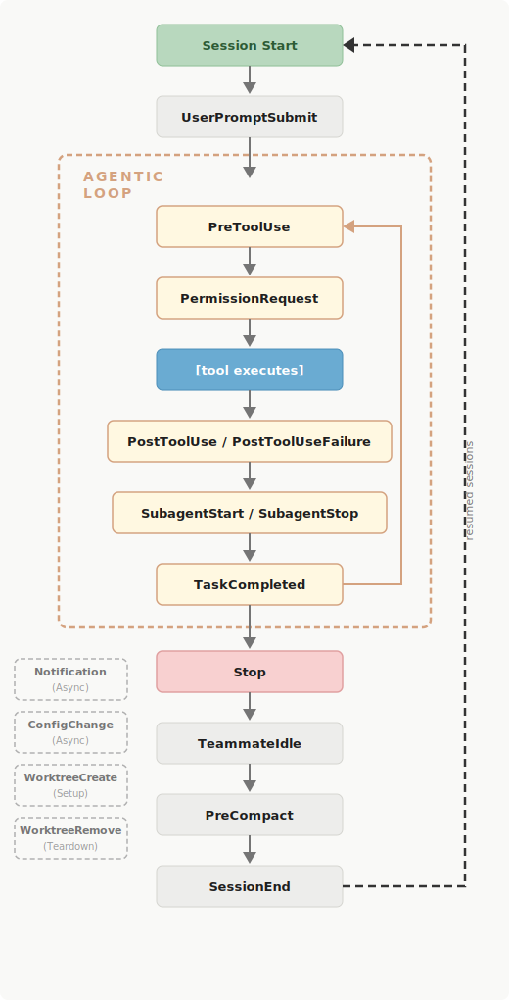

# Claude Code Hooks

Hooks는 Claude Code의 라이프사이클 특정 시점에서 실행되는 **사용자 정의 shell 명령어(command)입니다.**

코드 포맷팅, 알림 전송, 명령어 검증, 프로젝트 규칙 강제 등의 작업을 자동화할 수 있습니다.

> Hook은 셸 명령어를 직접 호출하여 결정론적인 응답을 산출하므로, LLM 추론 비용이 발생하지 않습니다.
> - **Hooks**: 라이프사이클 이벤트에 따른 자동화
> - **Skills**: 추가 지침 및 실행 가능한 명령 제공
> - **Subagents**: 격리된 컨텍스트에서 작업 실행
> - **Plugins**: 확장 기능 패키징 및 공유

---

## Claude Code 알림 Hook 설정 예제

`.claude/settings.json` 설정 파일에 알림 `hooks`를 설정합니다.

```json
{
  "hooks": {
    "Notification": [
      {
        "matcher": "",
        "hooks": [
          {
            "type": "command",
            "command": "osascript -e 'display notification \"Claude Code needs your attention\" with title \"Claude Code\"'",
            "async": false
          }
        ]
      }
    ]
  }
}
```

- `Notification` 이벤트 선택
- Matcher 설정 (`*`로 모든 유형 매칭)
- 실행할 셸 명령어 입력
  - macOS: `osascript -e 'display notification "Claude Code needs your attention" with title "Claude Code"'`
  - Linux: `notify-send 'Claude Code' 'Claude Code needs your attention'`
  - Windows (PowerShell): `powershell.exe -Command "[System.Reflection.Assembly]::LoadWithPartialName('System.Windows.Forms'); [System.Windows.Forms.MessageBox]::Show('Claude Code needs your attention', 'Claude Code')"`

> 이외에도 Hook 을 이용한 다음 작업들을 자동화 할 수 있습니다.
> - [파일 편집 후 소스 코드 포매팅](https://code.claude.com/docs/en/hooks-guide#auto-format-code-after-edits)
> - [보호된 파일에 대한 편집 차단](https://code.claude.com/docs/en/hooks-guide#block-edits-to-protected-files)
> - [컨텍스트 뷰 압축(compact) 후 컨텍스트 재주입](https://code.claude.com/docs/en/hooks-guide#re-inject-context-after-compaction)
> - [설정 파일 변경 감사](https://code.claude.com/docs/en/hooks-guide#audit-configuration-changes)
> 
> 자세한 자동화 예제는 다음 [Claude Code - What you can automate](https://code.claude.com/docs/en/hooks-guide#what-you-can-automate) 섹션을 참고해주세요.

---

## Hook 설정하기

`Claude Code 알림 Hook 설정 예제`처럼 `settings.json` 설정 파일에 command 를 지정하여 설정할 수 있습니다.

Claude Code CLI 에서`/hooks` 명령어로 대화형 메뉴를 열어 쉽게 설정할 수 있습니다.

```bash
❯ /hooks  
────────────────────────────────────────────────────────────────────────────────────
 Hooks
 6 hooks

 ❯ 1.  PreToolUse - Before tool execution
   2.  PostToolUse - After tool execution
   3.  PostToolUseFailure - After tool execution fails
   4.  Notification - When notifications are sent
 ↓ 5.  UserPromptSubmit - When the user submits a prompt

 Enter to confirm · Esc to cancel
```

1. `/hooks` 입력하여 메뉴 열기
2. 이벤트 선택 (예: `Notification`)
3. Matcher 설정 (`*`로 모든 유형 매칭)
4. 실행할 셸 명령어 입력
5. 저장 위치 선택 (`User settings` 또는 `Project settings`)

---

## Hook 이벤트 라이프사이클

Hook 이벤트는 Claude Code의 라이프사이클의 특정 지점에서 발생합니다. 

이벤트가 발생하면 일치하는 모든 hooks가 병렬로 실행되고 동일한 hook 명령은 자동으로 중복 제거됩니다.



- 세션 관리
  - `SessionStart`: 세션 시작/재개 시
  - `InstructionsLoaded`: `CLAUDE.md` 또는 `.claude/rules/*.md` 파일이 컨텍스트에 로드될 때
  - `UserPromptSubmit`: 프롬프트 제출 전
- **Agentic Loop** 
  - `PreToolUse`: 도구 호출 실행 전 (차단 가능)
  - `PermissionRequest`: 권한 대화 상자 표시 시
  - `[Tool Execution]`: 도구 실제 실행
    - `PostToolUse`: 도구 성공 후
    - `PostToolUseFailure`: 도구 실패 후
  - `SubagentStart`: 서브에이전트가 작업을 시작할 때(spawned)
  - `SubagentStop`: 서브에이전트가 작업을 마칠 때
  - `TaskCompleted`: 작업 완료 시
- **응답 완료**
  - `Stop`: Claude 응답 완료 시
  - `TeammateIdle`: 팀원(`agent team`) 유휴 상태 전환 시
  - `PreCompact`: 컨텍스트 압축 전
  - `SessionEnd`: 세션 종료 시
- **비동기/설정**
  - `Notification`: 알림 발생 시
  - `ConfigChange`: 설정 파일 변경 시
  - `WorktreeCreate`: worktree 생성 시
  - `WorktreeRemove`: worktree 제거 시

각 hook에는 실행 방식을 결정하는 `type`이 있습니다. 대부분의 hooks는 `"type": "command"`를 사용하여 셸 명령을 실행합니다. 

세 가지 다른 유형을 사용할 수 있습니다

- `"type": "http"`: [웹훅, 외부 알림 서비스 또는 API 기반에 사용됩니다.](https://code.claude.com/docs/en/hooks-guide#http-hooks) (v2.1.63+ 부터 지원)
- `"type": "prompt"`: [Claude 모델에 단일 턴 프롬프트를 전송합니다.](https://code.claude.com/docs/en/hooks-guide#prompt-based-hooks) (v2.1.32+ 부터 지원)
- `"type": "agent"`: [도구 접근 권한이 있는 다중 턴 검증에 사용합니다.](https://code.claude.com/docs/en/hooks-guide#agent-based-hooks) (v2.1.32+ 부터 지원)

`$ARGUMENTS`를 hook의 JSON 입력에 대한 플레이스홀더로 사용합니다. 

두 유형 모두 model(기본값은 빠른 모델)과 timeout 필드를 지원합니다. 
지원되는 이벤트: PreToolUse, PostToolUse, PostToolUseFailure, PermissionRequest, UserPromptSubmit, Stop, SubagentStop, TaskCompleted. TeammateIdle은 프롬프트/에이전트 hooks를 지원하지 않습니다.

| 이벤트                                                                                                                                 | 지원 타입                                |
|-------------------------------------------------------------------------------------------------------------------------------------|--------------------------------------|
| `PermissionRequest`, `PostToolUse`, `PostToolUseFailure`, `PreToolUse`, `Stop`, `SubagentStop`, `TaskCompleted`, `UserPromptSubmit` | `command`, `http`, `prompt`, `agent` |
| 그 외 모든 이벤트                                                                                                                          | `command`만 지원                        |

라이프사이클을 이해했으니, 실제로 Hook을 어떻게 설정하는지 알아 보겠습니다.

---

## Hook 설정 스키마

### Hook 설정 위치

| 위치                            | 범위         | 공유 가능           |
|-------------------------------|------------|-----------------|
| `~/.claude/settings.json`     | 모든 프로젝트    | 아니오 (로컬 머신)     |
| `.claude/settings.json`       | 단일 프로젝트    | 예 (repo에 커밋 가능) |
| `.claude/settings.local.json` | 단일 프로젝트    | 아니오 (gitignore) |
| 관리 정책 설정                      | 조직 전체      | 예 (관리자 제어)      |
| Plugin `hooks/hooks.json`     | 플러그인 활성화 시 | 예 (플러그인 번들)     |
| Skill 또는 Agent frontmatter    | 활성화 동안     | 예 (컴포넌트 파일에 정의) |

### 모든 Hook 비활성화

`/hooks` 메뉴 하단의 토글 사용 또는 설정 파일에 `"disableAllHooks": true` 추가

### Matcher 패턴

각 이벤트 타입별로 매칭되는 필드가 다릅니다:

| 이벤트                                                                    | 매처 필터 대상 | 예제 값                                                                               |
|------------------------------------------------------------------------|----------|------------------------------------------------------------------------------------|
| `PreToolUse`, `PostToolUse`, `PostToolUseFailure`, `PermissionRequest` | 도구 이름    | `Bash`, `Edit\|Write`, `mcp__.*`                                                   |
| `SessionStart`                                                         | 세션 시작 방식 | `startup`, `resume`, `clear`, `compact`                                            |
| `SessionEnd`                                                           | 세션 종료 이유 | `clear`, `logout`, `prompt_input_exit`, `bypass_permissions_disabled`, `other`     |
| `Notification`                                                         | 알림 유형    | `permission_prompt`, `idle_prompt`, `auth_success`, `elicitation_dialog`           |
| `SubagentStart`, `SubagentStop`                                        | 에이전트 타입  | `Bash`, `Explore`, `Plan`                                                          |
| `ConfigChange`                                                         | 설정 소스    | `user_settings`, `project_settings`, `local_settings`, `policy_settings`, `skills` |
| `PreCompact`                                                           | 압축 트리거   | `manual`, `auto`, `custom`                                                         |

> **참고**: `UserPromptSubmit`, `Stop`, `TeammateIdle`, `TaskCompleted`, `WorktreeCreate`, `WorktreeRemove`는 matcher를 지원하지
> 않습니다.

### MCP 도구 매칭

MCP 도구는 `mcp__<server>__<tool>` 패턴을 따릅니다:

| 예시                                 | 설명                            |
|------------------------------------|-------------------------------|
| `mcp__memory__create_entities`     | Memory 서버의 create entities 도구 |
| `mcp__filesystem__read_file`       | Filesystem 서버의 read file 도구   |
| `mcp__github__search_repositories` | GitHub 서버의 검색 도구              |

```json
{
  "hooks": {
    "PreToolUse": [
      {
        "matcher": "mcp__memory__.*",
        "hooks": [
          {
            "type": "command",
            "command": "echo 'Memory operation initiated' >> ~/mcp-operations.log"
          }
        ]
      }
    ]
  }
}
```

### Hook 종류별 설정

#### 1. Command Hooks (`type: "command"`)

| 필드              | 필수  | 설명               |
|-----------------|-----|------------------|
| `type`          | 예   | `"command"`      |
| `command`       | 예   | 실행할 셸 명령어        |
| `async`         | 아니오 | `true`면 백그라운드 실행 |
| `timeout`       | 아니오 | 타임아웃(초). 기본 600초 |
| `statusMessage` | 아니오 | 실행 중 표시할 스피너 메시지 |

#### 2. Prompt-based Hooks (`type: "prompt"`)

| 필드        | 필수  | 설명                                    |
|-----------|-----|---------------------------------------|
| `type`    | 예   | `"prompt"`                            |
| `prompt`  | 예   | 모델에 보낼 프롬프트. `$ARGUMENTS`로 입력 JSON 주입 |
| `model`   | 아니오 | 사용할 모델 (기본: 빠른 모델)                    |
| `timeout` | 아니오 | 타임아웃(초). 기본 30초                       |

응답 형식:

```json
{
  "ok": true | false,
  "reason": "결정에 대한 설명"
}
```

#### 3. Agent-based Hooks (`type: "agent"`)

| 필드        | 필수  | 설명                                  |
|-----------|-----|-------------------------------------|
| `type`    | 예   | `"agent"`                           |
| `prompt`  | 예   | 검증할 내용 설명. `$ARGUMENTS`로 입력 JSON 주입 |
| `model`   | 아니오 | 사용할 모델                              |
| `timeout` | 아니오 | 타임아웃(초). 기본 60초                     |

- 최대 50개의 도구 사용 턴
- Read, Grep, Glob 등 도구 사용 가능

#### 4. HTTP Hooks (`type: "http"`)

| 필드               | 필수  | 설명                               |
|------------------|-----|----------------------------------|
| `type`           | 예   | `"http"`                         |
| `url`            | 예   | POST 요청을 보낼 URL                  |
| `headers`        | 아니오 | HTTP 헤더. `$VAR_NAME` 환경 변수 보간 지원 |
| `allowedEnvVars` | 아니오 | 보간 허용할 환경 변수 목록                  |
| `timeout`        | 아니오 | 타임아웃(초). 기본 30초                  |

> **참고**: HTTP hooks는 `/hooks` 대화형 메뉴에서 설정할 수 없습니다. settings JSON을 직접 편집해야 합니다.

이벤트의 종류를 알았으니, 각 이벤트가 정확히 어떤 데이터를 주고받는지 살펴 보겠습니다.

---

## 6. 입출력 및 제어 방식

### 공통 입력 필드 (모든 이벤트)

```json
{
  "session_id": "abc123",
  "transcript_path": "/Users/.../.claude/projects/.../transcript.jsonl",
  "cwd": "/Users/...",
  "permission_mode": "default",
  "hook_event_name": "PreToolUse"
}
```

| 필드                | 설명                                                                          |
|-------------------|-----------------------------------------------------------------------------|
| `session_id`      | 현재 세션 식별자                                                                   |
| `transcript_path` | 대화 JSON 파일 경로                                                               |
| `cwd`             | Hook 호출 시 현재 작업 디렉토리                                                        |
| `permission_mode` | 현재 권한 모드 (`default`, `plan`, `acceptEdits`, `dontAsk`, `bypassPermissions`) |
| `hook_event_name` | 발생한 이벤트 이름                                                                  |

### 도구별 입력 스키마

#### Bash

| 필드                  | 타입      | 설명             |
|---------------------|---------|----------------|
| `command`           | string  | 실행할 셸 명령어      |
| `description`       | string  | 명령어 설명 (선택)    |
| `timeout`           | number  | 타임아웃 (밀리초, 선택) |
| `run_in_background` | boolean | 백그라운드 실행 여부    |

#### Write

| 필드          | 타입     | 설명        |
|-------------|--------|-----------|
| `file_path` | string | 파일의 절대 경로 |
| `content`   | string | 파일에 쓸 내용  |

#### Edit

| 필드            | 타입      | 설명             |
|---------------|---------|----------------|
| `file_path`   | string  | 파일의 절대 경로      |
| `old_string`  | string  | 찾아서 교체할 텍스트    |
| `new_string`  | string  | 교체할 텍스트        |
| `replace_all` | boolean | 모든 발생을 교체할지 여부 |

#### Read

| 필드          | 타입     | 설명           |
|-------------|--------|--------------|
| `file_path` | string | 파일의 절대 경로    |
| `offset`    | number | 시작 라인 (선택)   |
| `limit`     | number | 읽을 라인 수 (선택) |

#### Glob

| 필드        | 타입     | 설명            |
|-----------|--------|---------------|
| `pattern` | string | 검색할 glob 패턴   |
| `path`    | string | 검색할 디렉토리 (선택) |

#### Grep

| 필드            | 타입     | 설명            |
|---------------|--------|---------------|
| `pattern`     | string | 검색할 정규식 패턴    |
| `path`        | string | 검색할 경로 (선택)   |
| `glob`        | string | 파일 필터 패턴 (선택) |
| `output_mode` | string | 출력 모드 (선택)    |

#### WebFetch

| 필드       | 타입     | 설명          |
|----------|--------|-------------|
| `url`    | string | 가져올 URL     |
| `prompt` | string | 콘텐츠 처리 프롬프트 |

#### WebSearch

| 필드      | 타입     | 설명  |
|---------|--------|-----|
| `query` | string | 검색어 |

#### Agent

| 필드              | 타입     | 설명              |
|-----------------|--------|-----------------|
| `description`   | string | 에이전트 작업 설명      |
| `prompt`        | string | 에이전트에게 전달할 프롬프트 |
| `subagent_type` | string | 에이전트 유형         |

### 출력 (Exit Code)

| Exit Code | 동작                              |
|-----------|---------------------------------|
| **0**     | 작업 진행 (stdout은 Claude 컨텍스트에 추가) |
| **2**     | 작업 차단 (stderr는 Claude에게 피드백)    |
| **기타**    | 작업 진행 (stderr는 로그에만 기록)         |

### Exit Code 2 동작 (이벤트별)

| 이벤트                  | 차단 가능 | Exit 2 발생 시 동작                     |
|----------------------|-------|------------------------------------|
| `PreToolUse`         | ✅     | 도구 호출 차단                           |
| `PermissionRequest`  | ✅     | 권한 거부                              |
| `UserPromptSubmit`   | ✅     | 프롬프트 처리 차단 및 삭제                    |
| `Stop`               | ✅     | Claude 중단 방지, 대화 계속                |
| `SubagentStop`       | ✅     | 서브에이전트 중단 방지                       |
| `TeammateIdle`       | ✅     | 팀원 유휴 상태 전환 방지                     |
| `TaskCompleted`      | ✅     | 작업 완료 표시 방지                        |
| `ConfigChange`       | ✅     | 설정 변경 적용 차단 (`policy_settings` 제외) |
| `WorktreeCreate`     | ✅     | 생성 실패                              |
| `PostToolUse`        | ❌     | stderr를 Claude에게 표시 (이미 실행됨)       |
| `PostToolUseFailure` | ❌     | stderr를 Claude에게 표시                |
| 그 외                  | ❌     | stderr만 로그                         |

### JSON 출력 필드 (Exit 0)

#### Universal Fields (모든 이벤트)

| 필드               | 기본값     | 설명                             |
|------------------|---------|--------------------------------|
| `continue`       | `true`  | `false`면 Claude 완전 중단          |
| `stopReason`     | 없음      | `continue`가 `false`일 때 표시할 메시지 |
| `suppressOutput` | `false` | `true`면 verbose 모드에서 stdout 숨김 |
| `systemMessage`  | 없음      | 사용자에게 표시할 경고 메시지               |

#### Decision Control 패턴별

**Top-level decision** (`UserPromptSubmit`, `PostToolUse`, `PostToolUseFailure`, `Stop`, `SubagentStop`,
`ConfigChange`):

```json
{
  "decision": "block",
  "reason": "Test suite must pass before proceeding"
}
```

**PreToolUse** (`hookSpecificOutput` 사용):

| 필드                         | 설명                           |
|----------------------------|------------------------------|
| `permissionDecision`       | `"allow"`, `"deny"`, `"escalate"` |
| `permissionDecisionReason` | 결정 이유                        |
| `updatedInput`             | 실행 전 도구 입력 파라미터 수정           |
| `additionalContext`        | Claude 컨텍스트에 추가              |

```json
{
  "hookSpecificOutput": {
    "hookEventName": "PreToolUse",
    "permissionDecision": "deny",
    "permissionDecisionReason": "Use rg instead of grep for better performance",
    "updatedInput": {
      "command": "rg 'pattern'"
    }
  }
}
```

**PermissionRequest** (`hookSpecificOutput.decision` 사용):

| 필드                   | 설명                       |
|----------------------|--------------------------|
| `behavior`           | `"allow"` 또는 `"deny"`    |
| `updatedInput`       | `"allow"`일 때 도구 입력 수정    |
| `updatedPermissions` | `"allow"`일 때 권한 규칙 업데이트  |
| `message`            | `"deny"`일 때 표시할 메시지      |
| `interrupt`          | `"deny"`일 때 Claude 중단 여부 |

```json
{
  "hookSpecificOutput": {
    "hookEventName": "PermissionRequest",
    "decision": {
      "behavior": "allow",
      "updatedInput": {
        "command": "npm run lint"
      }
    }
  }
}
```

기본적인 입출력을 이해했으니, 이제 각 이벤트별로 상세한 스펙을 정리했습니다.

---

## 7. 이벤트별 상세 참조

### SessionStart

세션이 시작되거나 재개될 때 실행됩니다.

**Matcher:** `startup`, `resume`, `clear`, `compact`

**추가 입력 필드:**

| 필드           | 설명                        |
|--------------|---------------------------|
| `source`     | 세션 시작 방식                  |
| `model`      | 사용 중인 모델 식별자              |
| `agent_type` | `--agent`로 시작한 경우 에이전트 이름 |

**Decision Control:**

| 필드                  | 설명                   |
|---------------------|----------------------|
| `additionalContext` | Claude 컨텍스트에 추가할 문자열 |

**환경 변수 지속:**

`CLAUDE_ENV_FILE` 환경 변수를 통해 세션 전체에서 사용할 환경 변수를 설정할 수 있습니다:

```bash
#!/bin/bash
if [ -n "$CLAUDE_ENV_FILE" ]; then
  echo 'export NODE_ENV=production' >> "$CLAUDE_ENV_FILE"
  echo 'export PATH="$PATH:./node_modules/.bin"' >> "$CLAUDE_ENV_FILE"
fi
exit 0
```

### UserPromptSubmit

사용자가 프롬프트를 제출하기 전에 실행됩니다.

**추가 입력 필드:**

| 필드       | 설명                |
|----------|-------------------|
| `prompt` | 사용자가 제출한 프롬프트 텍스트 |

**Decision Control:**

| 필드                  | 설명                            |
|---------------------|-------------------------------|
| `decision`          | `"block"`으로 설정하면 프롬프트 차단 및 삭제 |
| `reason`            | 차단 시 사용자에게 표시할 이유             |
| `additionalContext` | Claude 컨텍스트에 추가               |

### PreToolUse

도구 호출 실행 전에 실행됩니다.

**추가 입력 필드:**

| 필드            | 설명         |
|---------------|------------|
| `tool_name`   | 호출될 도구 이름  |
| `tool_input`  | 도구 입력 파라미터 |
| `tool_use_id` | 도구 사용 식별자  |

### PermissionRequest

권한 대화 상자가 표시될 때 실행됩니다.

**추가 입력 필드:**

| 필드                       | 설명                   |
|--------------------------|----------------------|
| `tool_name`              | 권한을 요청하는 도구 이름       |
| `tool_input`             | 도구 입력 파라미터           |
| `permission_suggestions` | "always allow" 옵션 목록 |

> **참고**: 비대화형 모드(`-p` 플래그)에서는 실행되지 않습니다.

### PostToolUse

도구가 성공적으로 실행된 후 실행됩니다.

**추가 입력 필드:**

| 필드              | 설명         |
|-----------------|------------|
| `tool_name`     | 실행된 도구 이름  |
| `tool_input`    | 도구 입력 파라미터 |
| `tool_response` | 도구 실행 결과   |
| `tool_use_id`   | 도구 사용 식별자  |

**Decision Control:**

| 필드                     | 설명                 |
|------------------------|--------------------|
| `decision`             | `"block"`으로 피드백 전달 |
| `reason`               | 차단 이유              |
| `additionalContext`    | 추가 컨텍스트            |
| `updatedMCPToolOutput` | MCP 도구 출력 수정       |

### PostToolUseFailure

도구 실행이 실패했을 때 실행됩니다.

**추가 입력 필드:**

| 필드             | 설명                 |
|----------------|--------------------|
| `tool_name`    | 실패한 도구 이름          |
| `tool_input`   | 도구 입력 파라미터         |
| `tool_use_id`  | 도구 사용 식별자          |
| `error`        | 오류 설명              |
| `is_interrupt` | 사용자 인터럽트로 인한 실패 여부 |

### Stop / SubagentStop

Claude(또는 서브에이전트)가 응답을 완료할 때 실행됩니다.

**추가 입력 필드:**

| 필드                       | 설명                             |
|--------------------------|--------------------------------|
| `stop_hook_active`       | 이미 Stop hook으로 인해 계속 실행 중인지 여부 |
| `last_assistant_message` | Claude의 최종 응답 텍스트              |

SubagentStop의 추가 필드:

| 필드                      | 설명               |
|-------------------------|------------------|
| `agent_id`              | 서브에이전트 고유 식별자    |
| `agent_type`            | 에이전트 타입          |
| `agent_transcript_path` | 서브에이전트 트랜스크립트 경로 |

**Stop Hook 무한 루프 방지:**

```bash
#!/bin/bash
INPUT=$(cat)
if [ "$(echo "$INPUT" | jq -r '.stop_hook_active')" = "true" ]; then
  exit 0
fi
# ... 나머지 로직
```

### TeammateIdle

에이전트 팀 팀원이 유휴 상태가 되려 할 때 실행됩니다.

**추가 입력 필드:**

| 필드              | 설명             |
|-----------------|----------------|
| `teammate_name` | 유휴 상태가 될 팀원 이름 |
| `team_name`     | 팀 이름           |

> **참고**: JSON decision control이 아닌 exit code만 사용합니다.

### TaskCompleted

작업이 완료로 표시될 때 실행됩니다.

**추가 입력 필드:**

| 필드                 | 설명                       |
|--------------------|--------------------------|
| `task_id`          | 작업 식별자                   |
| `task_subject`     | 작업 제목                    |
| `task_description` | 작업 상세 설명 (optional)      |
| `teammate_name`    | 작업을 완료한 팀원 이름 (optional) |
| `team_name`        | 팀 이름 (optional)          |

> **참고**: Exit code만 사용합니다.

### ConfigChange

설정 파일이 변경될 때 실행됩니다.

**Matcher:** `user_settings`, `project_settings`, `local_settings`, `policy_settings`, `skills`

**추가 입력 필드:**

| 필드          | 설명                   |
|-------------|----------------------|
| `source`    | 변경된 설정 소스            |
| `file_path` | 변경된 파일 경로 (optional) |

> **참고**: `policy_settings` 변경은 차단할 수 없습니다.

### PreCompact

컨텍스트 압축 실행 전에 실행됩니다.

**Matcher:** `manual`, `auto`

**추가 입력 필드:**

| 필드                    | 설명                                |
|-----------------------|-----------------------------------|
| `trigger`             | `"manual"` 또는 `"auto"`            |
| `custom_instructions` | `/compact`에 전달된 지시사항 (manual인 경우) |

### WorktreeCreate / WorktreeRemove

Worktree가 생성/제거될 때 실행됩니다.

**WorktreeCreate 추가 입력:**

| 필드     | 설명               |
|--------|------------------|
| `name` | worktree 슬러그 식별자 |

**WorktreeCreate 출력:** stdout에 생성된 worktree의 절대 경로를 출력해야 합니다.

**WorktreeRemove 추가 입력:**

| 필드              | 설명                  |
|-----------------|---------------------|
| `worktree_path` | 제거될 worktree의 절대 경로 |

기본 이벤트를 모두 살펴 봤으니, 특수한 상황에서 사용하는 고급 기능을 알아 보겠습니다.

---

## 8. 고급 기능

### Async Hooks (백그라운드 실행)

`"async": true`를 설정하면 hook이 백그라운드에서 실행되어 Claude의 작업을 차단하지 않습니다.

```json
{
  "hooks": {
    "PostToolUse": [
      {
        "matcher": "Write",
        "hooks": [
          {
            "type": "command",
            "command": "/path/to/run-tests.sh",
            "async": true,
            "timeout": 120
          }
        ]
      }
    ]
  }
}
```

**제한사항:**

- `type: "command"`만 지원
- 도구 호출 차단이나 결정 반환 불가능
- Hook 출력은 다음 대화 턴에 전달됨

### HTTP 응답 처리

HTTP hooks의 응답 처리 방식:

| 응답                             | 동작                             |
|--------------------------------|--------------------------------|
| **2xx + empty body**           | 성공, exit code 0과 동일            |
| **2xx + plain text**           | 성공, 텍스트가 컨텍스트로 추가              |
| **2xx + JSON**                 | 성공, command hooks와 동일한 스키마로 파싱 |
| **Non-2xx**                    | 비차단 오류, 실행 계속                  |
| **Connection failure/timeout** | 비차단 오류, 실행 계속                  |

### Hooks in Skills and Agents

Skills와 Subagents는 frontmatter에서 hook을 정의할 수 있습니다:

```yaml
---
name: secure-operations
description: Perform operations with security checks
hooks:
  PreToolUse:
    - matcher: "Bash"
      hooks:
        - type: command
          command: "./scripts/security-check.sh"
---
```

- Subagent의 `Stop` hooks는 자동으로 `SubagentStop`으로 변환됩니다
- `once: true`를 설정하면 세션당 한 번만 실행됩니다 (Skills 전용)

### 환경 변수

| 변수                      | 설명                                    |
|-------------------------|---------------------------------------|
| `$CLAUDE_PROJECT_DIR`   | 프로젝트 루트 경로. 공백이 있는 경로를 위해 따옴표로 감싸서 사용 |
| `$CLAUDE_PLUGIN_ROOT` | 플러그인 루트 디렉토리 (플러그인 hooks에서만)          |
| `$CLAUDE_CODE_REMOTE`   | 원격 웹 환경에서 `"true"`, 로컬 CLI에서는 미설정     |
| `$CLAUDE_ENV_FILE`      | SessionStart에서만 사용 가능한 환경 변수 파일 경로    |

### 관리 정책 설정

| 설정                      | 설명                                                           |
|-------------------------|--------------------------------------------------------------|
| `allowManagedHooksOnly` | 관리 정책 hooks만 허용, 사용자/프로젝트/플러그인 hooks 차단                      |
| `disableAllHooks`       | 모든 hooks 비활성화 (managed settings 레벨에서만 managed hooks 비활성화 가능) |

### 설정 변경 감지

설정 파일에 직접 편집한 내용은 즉시 적용되지 않습니다. 

Claude Code는 세션 시작 시 hooks의 스냅샷을 캡처하여 세션 내내 사용합니다. 

외부에서 hooks가 수정되면 `/hooks` 메뉴에서 검토를 요구합니다.

마지막으로, Hooks를 안전하게 사용하고 문제가 발생했을 때 해결하는 방법을 정리했습니다.

---

## 9. 보안 및 문제 해결

### 보안 모범 사례

1. **입력 검증 및 정제**: 입력 데이터를 맹신하지 마세요
2. **셸 변수 항상 인용**: `"$VAR"` 사용, `$VAR` 사용 금지
3. **경로 탐색 차단**: 파일 경로에서 `..` 확인
4. **절대 경로 사용**: `"$CLAUDE_PROJECT_DIR"`로 프로젝트 루트 지정
5. **민감한 파일 건너뛰기**: `.env`, `.git/`, 키 파일 등 접근 금지

### 안전한 스크립트 예제

```bash
#!/bin/bash
INPUT=$(cat)
FILE_PATH=$(echo "$INPUT" | jq -r '.tool_input.file_path // empty')

# 경로 탐색 방지
if [[ "$FILE_PATH" == *".."* ]]; then
  echo "Error: Path traversal detected" >&2
  exit 2
fi

# 민감한 파일 차단
if [[ "$FILE_PATH" == *.env* ]] || [[ "$FILE_PATH" == *.git/* ]]; then
  echo "Error: Access to sensitive files blocked" >&2
  exit 2
fi

exit 0
```

### 문제 해결

#### Hook이 실행되지 않음

- `/hooks`에서 hook이 올바른 이벤트 아래에 표시되는지 확인
- matcher 패턴이 정확히 일치하는지 확인 (대소문자 구분)
- 올바른 이벤트 타입을 트리거하는지 확인

#### Hook 오류

- 수동 테스트: `echo '{"tool_name":"Bash","tool_input":{"command":"ls"}}' | ./my-hook.sh`
- "command not found" 오류 시 절대 경로 또는 `$CLAUDE_PROJECT_DIR` 사용
- 실행 권한 확인: `chmod +x ./my-hook.sh`

#### `/hooks`에 hook이 표시되지 않음

- 세션 재시작 또는 `/hooks` 열어서 다시 로드
- JSON 유효성 확인 (후행 쉼표 및 주석 불가)
- 설정 파일 위치 확인

#### JSON 검증 실패

셸 프로파일(`~/.zshrc` 또는 `~/.bashrc`)의 무조건적 echo 문장이 JSON 앞에 추가될 수 있습니다:

```bash
# ~/.zshrc 또는 ~/.bashrc
if [[ $- == *i* ]]; then
  echo "Shell ready"
fi
```

### 디버깅

- 상세 모드 토글: `Ctrl+O`
- 전체 실행 세부정보: `claude --debug`

디버그 출력 예제:

```
[DEBUG] Executing hooks for PostToolUse:Write
[DEBUG] Getting matching hook commands for PostToolUse with query: Write
[DEBUG] Found 1 hook matchers in settings
[DEBUG] Matched 1 hooks for query "Write"
[DEBUG] Executing hook command: <Your command> with timeout 600000ms
[DEBUG] Hook command completed with status 0: <Your stdout>
```

---

## Reference

- [code.claude.com - Hooks Reference](https://code.claude.com/docs/en/hooks)
- [code.claude.com - Hooks Guide](https://code.claude.com/docs/en/hooks-guide)
- [github anthropics - Bash command validator example](https://github.com/anthropics/claude-code/blob/main/examples/hooks/bash_command_validator_example.py)
- [blakecrosley.com/ko/guides/claude-code](https://blakecrosley.com/ko/guides/claude-code#hooks%EB%8A%94-%EC%96%B4%EB%96%BB%EA%B2%8C-%EC%9E%91%EB%8F%99%ED%95%98%EB%82%98%EC%9A%94)
