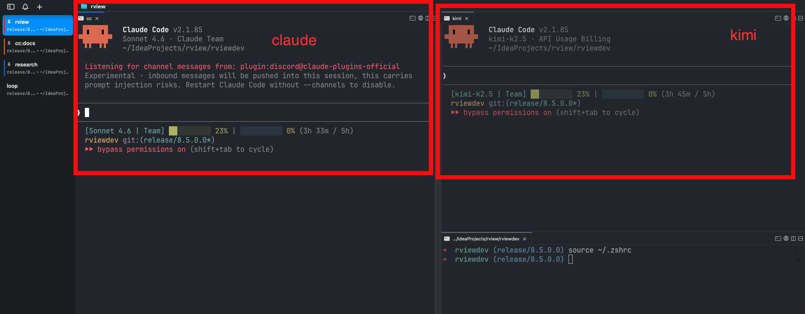

# Claude Code Multi-Model Guide

Claude Code에서 여러 모델을 동시에 운용하는 방법을 소개하려 합니다.

## 설정 방법

여러 모델을 사용할 때는 아래처럼 `shell` 함수로 등록해두면 편리합니다.

```bash
### Claude Code
#### kimi
kimi() {
    local model='kimi-k2.5'
    local auth_token='YOUR_MOONSHOT_API_KEY'

    env -u ANTHROPIC_API_KEY \
      ANTHROPIC_BASE_URL=https://api.moonshot.ai/anthropic \
      ANTHROPIC_AUTH_TOKEN=$auth_token \
      ANTHROPIC_MODEL=$model \
      ANTHROPIC_DEFAULT_OPUS_MODEL=$model \
      ANTHROPIC_DEFAULT_SONNET_MODEL=$model \
      ANTHROPIC_DEFAULT_HAIKU_MODEL=$model \
      CLAUDE_CODE_SUBAGENT_MODEL=$model \
      claude --dangerously-skip-permissions "$@"
}

#### anthropic
cc() {
    local model='sonnet'
    ANTHROPIC_MODEL=$model \
    CLAUDE_CODE_SUBAGENT_MODEL=$model \
    claude --dangerously-skip-permissions "$@"
}
```

1. `~/.zshrc`에 다음 명령어를 추가
2. `YOUR_MOONSHOT_API_KEY`에 기존 moonshot 인증 토큰 저장
3. `source ~/.zshrc`

> Windows 환경에서는 PowerShell `$PROFILE` 파일에 함수를 등록합니다.
>
> ```powershell
> function kimi {
>     $env:ANTHROPIC_BASE_URL = "https://api.moonshot.ai/anthropic"
>     $env:ANTHROPIC_AUTH_TOKEN = "YOUR_MOONSHOT_API_KEY"
>     $env:ANTHROPIC_MODEL = "kimi-k2.5"
>     $env:ANTHROPIC_DEFAULT_OPUS_MODEL = "kimi-k2.5"
>     $env:ANTHROPIC_DEFAULT_SONNET_MODEL = "kimi-k2.5"
>     $env:ANTHROPIC_DEFAULT_HAIKU_MODEL = "kimi-k2.5"
>     $env:CLAUDE_CODE_SUBAGENT_MODEL = "kimi-k2.5"
>     Remove-Item Env:ANTHROPIC_API_KEY -ErrorAction SilentlyContinue
>     claude --dangerously-skip-permissions @args
> }
> ```
>
> zsh의 `env -u`는 서브프로세스에만 일시적으로 적용되지만, PowerShell은 현재 세션의 환경 변수를 직접 수정합니다. 함수 실행 후 원래 값을 복원해야 할 수 있으니 주의하세요.

## 활용 예시



- `cc`: Claude 모델로 메인 작업 병행
- `kimi`: **토큰 소모가 큰 보조 작업에 활용** (ex. web research, Figma, Playwright 등 MCP 도구 호출 위주 작업)

> 팀 플랜은 시간당 토큰 제한과 주간 사용 제한이 있어서, 한 모델만 사용하는 것보다 모델을 나눠 병행하면 한도를 더 효율적으로 활용할 수 있습니다.

## 트러블슈팅

만약 기존에 `~/.claude/settings.json` 또는 `~/.claude/settings.local.json`에 인증 키 관련 설정이 되어 있다면 제거하세요. 

Claude Code의 설정 적용 우선순위는 다음과 같습니다.

1. 환경 변수 (가장 높음)
2. `claude --<options>` 
3. `settings.json`
4. `settings.local.json` (가장 낮음)

`settings.json`에 인증 관련 설정이 남아 있으면 환경 변수와 충돌할 수 있으므로, 셸 함수 방식을 사용할 때는 해당 설정을 제거해야 합니다.

> Claude Code CLI 실행 중 `/model` 명령어로 모델을 전환할 수 있지만, 공식 Anthropic 모델로만 제한됩니다.
>
> 3rd-party 모델(Kimi 등)을 사용하려면 `ANTHROPIC_BASE_URL`로 API 엔드포인트를 변경하고, `ANTHROPIC_AUTH_TOKEN`에 해당 provider의 API 키를 설정해야 합니다.  
> 이때 `ANTHROPIC_API_KEY`와 `ANTHROPIC_AUTH_TOKEN`이 동시에 환경 변수로 설정되어 있으면 아래처럼 충돌이 발생하며, 정상 동작을 보장할 수 없습니다.
>
>  ```bash
> ➜  ~  claude
> 
>  ▐▛███▜▌   Claude Code v2.1.85
> ▝▜█████▛▘  kimi-k2.5 · API Usage Billing
>   ▘▘ ▝▝    /Users/moongyeom
> 
>   /model to try Opus 4.6
> 
> ──────────────────────────────────────────────────────────────────────────────────────────────
> Auth conflict: Both a token (ANTHROPIC_AUTH_TOKEN) and an API key
> (/login managed key) are set. This may lead to unexpected behavior.
>   • Trying to use ANTHROPIC_AUTH_TOKEN? claude /logout
>   • Trying to use /login managed key? Unset the ANTHROPIC_AUTH_TOKEN environment variable
> 
> >
> ```
