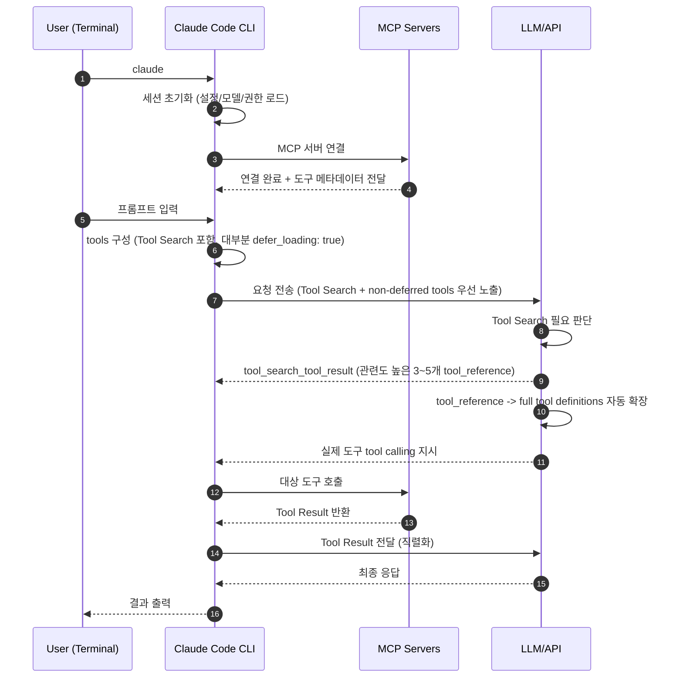
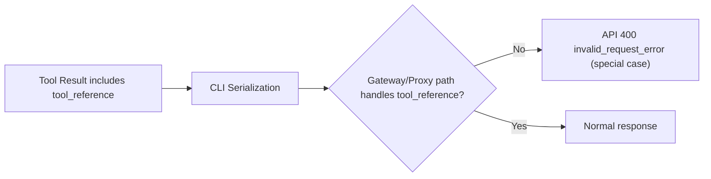

# Claude Code Stable 버전 가이드

이 글은 실무에서 Claude Code를 `stable` 버전으로 고정해 운영하는 방법을 소개합니다.

최신 버전에서 `API 400 (tool_reference)` 에러를 겪은 경험을 바탕으로, 팀 운영 기준을 `stable` 중심으로 정리했습니다.

> 바로 설정만 확인하려면 [Claude Code stable 버전 설정](#claude-code-버전을-stable로-고정하는-설정) 섹션으로 이동하세요.

## 들어가며

문서 리뷰 자동화 작업 중 아래 에러가 발생했습니다.

```text
API Error: 400
failed to convert tool result content: unsupported content type in ContentBlockParamUnion: tool_reference
```

처음에는 프롬프트 문제처럼 보였지만,
실제 원인은 Claude Code `2.1.69`에서 `ANTHROPIC_BASE_URL`로 third-party gateway/proxy를 경유할 때
`tool_reference`를 직렬화하는 단계에서 발생한 호환 이슈였습니다.

이 에러를 이해하려면 먼저 Tool Search와 `tool_reference`의 역할부터 짚고 넘어가면 좋습니다.

> 원인은 Claude Code 2.1.69의 `ANTHROPIC_BASE_URL` + third-party gateway/proxy 조합에서 나타난 `tool_reference` 직렬화 호환 문제였습니다.
>
> 해당 이슈는 현재 작성 기준 최신 버전인 [v2.1.70](https://github.com/anthropics/claude-code/releases/tag/v2.1.70)에서 핫픽스 패치됐습니다.

## 왜 Tool Search가 필요했나

먼저 배경부터 간단히 정리하겠습니다.

Claude Code는 외부 도구(MCP 서버의 tool)를 연결해서 작업할 수 있습니다.  
문제는 연결된 도구가 많아질수록, 사용자가 질문을 입력하기 전에도 도구 정보가 많이 로드되어 처리 비용(토큰)이 커질 수 있다는 점입니다.

이 문제를 줄이기 위해 도입된 방식이 **Tool Search Tool**입니다.  
핵심 아이디어는 단순합니다.

- 예전 방식: 도구 정보를 한꺼번에 많이 불러옴
- Tool Search 방식: 지금 필요한 도구만 찾아서 불러옴

그래서 도구가 많은 환경일수록 불필요한 로딩을 줄이고, 필요한 도구를 더 정확하게 고를 수 있습니다.

여기서 중요한 포인트는 병목이 두 가지라는 점입니다.

- 컨텍스트 낭비: 도구 정의를 미리 많이 올리면, 실제 질문을 처리하기 전부터 컨텍스트를 크게 사용합니다.
- 도구 선택 정확도 저하: 도구 수가 많아질수록(공식 문서 기준 30~50개 이상 구간) 올바른 도구를 고르는 난도가 높아집니다.

즉 Tool Search는 단순히 "토큰 절감"만이 아니라, CLI가 "도구 선택" 비용을 크게 절감될 수 있게됐습니다.

> Tool Search 기능은 `v2.1.7`부터 기본 활성화(`ENABLE_TOOL_SEARCH`) 되어 있습니다.
> - [Reddit - Tool Search now available in Claude Code](https://www.reddit.com/r/ClaudeAI/comments/1qczqsx/tool_search_now_available_in_claude_code/?tl=ko)
> - [Claude Code v2.1.7 release](https://github.com/anthropics/claude-code/releases/tag/v2.1.7)
> - [Tool Search Tool 공식 문서](https://platform.claude.com/docs/en/agents-and-tools/tool-use/tool-search-tool)

### CLI 실행부터 도구 호출까지 한 흐름으로 보기

`tool_reference`는 도구 본문 자체가 아니라 "이 도구를 로드/사용하라"는 참조 블록입니다.



- [1~2] 사용자가 `claude`를 실행하면 CLI 세션이 초기화됩니다.
- [3~4] CLI는 MCP 서버에 연결해 도구 메타데이터를 수집합니다.
- [5~6] CLI는 Tool Search + `defer_loading` 전략으로 요청을 구성하고 전송합니다.
- [7~8] LLM/API가 Tool Search 필요 여부를 판단합니다. (필요하지 않으면 `non-deferred tools`로 바로 진행)
- [9] 필요 시 `tool_search_tool_result`로 관련도 높은 3~5개 `tool_reference`를 반환합니다.
- [10] API가 `tool_reference`를 `full tool definitions`(실제 호출 가능한 도구 정의)로 자동 확장합니다.
- [11~13] 확장된 도구가 실제로 호출되고 Tool Result가 반환됩니다.
- [14~16] Tool Result 전달 후 최종 응답이 생성되어 사용자에게 출력됩니다.

> [Claude Code - How tool search works](https://platform.claude.com/docs/en/agents-and-tools/tool-use/tool-search-tool#how-tool-search-works)

이제 정상 흐름을 봤으니, 실제 장애가 어디에서 터졌는지 같은 흐름 위에서 확인해보겠습니다.

### API ERROR 400 `tool_reference` 발생한 지점

API 400 에러는

1. 8단계: 컨텍스트가 커지는 구간에서 Tool Search가 동작하고,
2. 9 ~ 10 단계: 그 결과인 `tool_reference`를 직렬화하는 단계에서 문제가 발생했습니다.

```text
API Error: 400
failed to convert tool result content: unsupported content type in ContentBlockParamUnion: tool_reference
```

아래 다이어그램은 공식 일반 동작 자체가 아니라, 이번 장애 케이스의 분기 지점을 설명하기 위한 보조 시각화입니다.



현재 버전을 유지하면서 Tool Search를 잠시 비활성화할 수 있습니다.

```json
{
  "env": {
    "ENABLE_TOOL_SEARCH": false
  }
}
```

- 파일: `~/.claude/settings.json`
- 장점: 즉시 우회 가능
- 단점: 임시 회피책이라 장기 운영 기본값으로는 비권장

원인을 확인했으니, 실무에서 바로 적용할 수 있는 안정화 전략으로 넘어가겠습니다.

---

## Claude Code 버전을 stable로 고정하는 설정

Claude Code 버전은 `claude install <stable|latest|version>` 명령으로 지정할 수 있습니다.

```bash
claude install stable
# 또는
claude update
```

클로드 코드의 latest/stable 버전은 아래 링크를 통해 확인할 수 있습니다.

- 패키지 버전 확인: [npm versions](https://www.npmjs.com/package/@anthropic-ai/claude-code?activeTab=versions)
- 버전 릴리즈 확인: [GitHub Releases](https://github.com/anthropics/claude-code/releases)

> 기존 Claude Code가 설치되어 있어도 `install` 명령을 실행하면 해당 버전으로 다시 설치됩니다.

### Claude Code CLI 업데이트 채널 stable 고정

마지막으로 CLI 설정에서 `/config` 명령어를 입력하여 업데이트 채널을 `stable`로 지정해야 합니다.

```bash
# Settings 화면에서 Auto-update channel을 stable로 변경
claude
❯ /config

 ▐▛███▜▌   Claude Code v2.1.58
▝▜█████▛▘  kimi-k2.5 · API Usage Billing
  ▘▘ ▝▝    ~/IdeaProjects/private/toy

  /model to try Opus 4.6

❯ /config
─────────────────────────────────────────────────────────────────────────────────────────
 ───────────────────────────────────────────────────────────────────────────────────────
  Settings:  Status   Config   Usage  (←/→ or tab to cycle)


  Configure Claude Code preferences

  ╭────────────────────────────────────────────────────────────────────────────────────╮
  │ ⌕ Search settings...                                                               │
  ╰────────────────────────────────────────────────────────────────────────────────────╯

    Auto-compact                              true
    Show tips                                 true
    Reduce motion                             false
    Thinking mode                             true
    Prompt suggestions                        true
    Rewind code (checkpoints)                 true
    Verbose output                            false
    Terminal progress bar                     true
    Default permission mode                   Default
    Respect .gitignore in file picker         true
  ❯ Auto-update channel                       stable
    Theme                                     Dark mode
    Notifications                             Auto
    Output style                              default
    Language                                  korean
    Editor mode                               normal
    Show PR status footer                     true
    Model                                     kimi-k2.5
    Auto-connect to IDE (external terminal)   false
    Claude in Chrome enabled by default       true
    Teammate mode                             auto

  Space to change · / to search · Esc to cancel
```

- `Auto-update channel` = `stable`

## 마무리

AI 제품은 매우 빠른 속도로 발전하고 있고, Claude Code도 GitHub 활동(PR/릴리즈)만 봐도 업데이트 주기가 상당히 빠릅니다.  
이런 제품 특성상 최신 버전에는 베타 성격의 기능이 먼저 들어오고, 버전에 따라 예상하지 못한 사이드 이슈가 발생할 수 있습니다.

그래서 실무 환경에서는 최신 기능 추종보다 운영 안정성을 우선해 `stable` 채널을 기본값으로 유지하는 전략이 더 현실적입니다.  
문제가 발생하면 `원인 확인 -> stable 복구 -> 재검증` 순서로 대응하는 것을 권장합니다.

1. 장애 발생 시 `claude --version`으로 버전 확인
2. issue/release에서 동일 증상 여부 확인
3. stable 복구 후 동일 프롬프트 재검증
4. 당시 버전, 모델, 로그, 링크를 문서로 남겨 재발 대응 시간 단축
