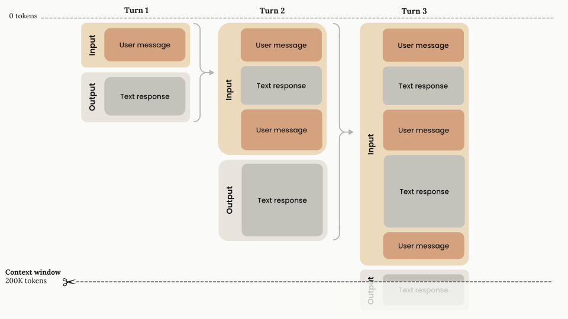
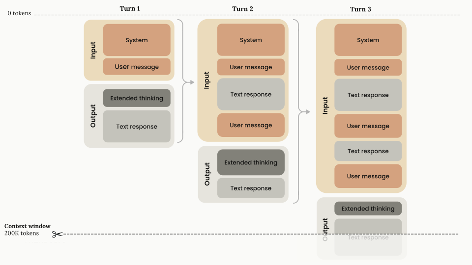
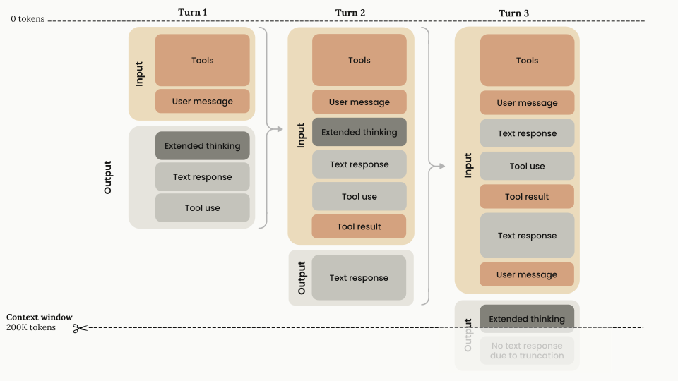

# [컨텍스트 윈도우](https://platform.claude.com/docs/en/build-with-claude/context-windows)

---

## 컨텍스트 윈도우 이해하기

"컨텍스트 윈도우"는 언어 모델이 새로운 텍스트를 생성할 때 참조하고 되돌아볼 수 있는 텍스트의 전체 양과 생성하는 새 텍스트를 합한 것을 의미합니다.

이것은 언어 모델이 훈련된 대규모 데이터 코퍼스와는 다르며, 대신 모델의 "작업 메모리"를 나타냅니다.<br/>
더 큰 컨텍스트 윈도우는 모델이 더 복잡하고 긴 프롬프트를 이해하고 응답할 수 있게 하며,
더 작은 컨텍스트 윈도우는 더 긴 프롬프트를 처리하거나 확장된 대화에서 일관성을 유지하는 모델의 능력을 제한할 수 있습니다.

아래 다이어그램은 API 요청에 대한 표준 컨텍스트 윈도우 동작을 보여줍니다<sup>1</sup>:



_<sup>1</sup>[claude.ai](https://claude.ai/)와 같은 채팅 인터페이스의 경우, 컨텍스트 윈도우는 롤링 "선입선출" 시스템으로 설정될 수도 있습니다._

- **점진적 토큰 축적:** 대화가 턴을 통해 진행됨에 따라 각 사용자 메시지와 어시스턴트 응답이 컨텍스트 윈도우 내에 축적됩니다. 이전 턴은 완전히 보존됩니다.
- **선형 성장 패턴:** 컨텍스트 사용량은 각 턴마다 선형적으로 증가하며, 이전 턴은 완전히 보존됩니다.
- **200K 토큰 용량:** 총 사용 가능한 컨텍스트 윈도우(200,000 토큰)는 대화 히스토리를 저장하고 Claude로부터 새로운 출력을 생성하기 위한 최대 용량을 나타냅니다.
- **입력-출력 흐름:** 각 턴은 다음으로 구성됩니다:
    - **입력 단계:** 모든 이전 대화 히스토리와 현재 사용자 메시지를 포함합니다
    - **출력 단계:** 미래 입력의 일부가 되는 텍스트 응답을 생성합니다

## 확장된 사고를 사용한 컨텍스트 윈도우

[확장된 사고](../02-capabilities/03-extended-thinking.md)를 사용할 때, </br>
사고에 사용되는 토큰을 포함한 모든 입력 및 출력 토큰이 컨텍스트 윈도우 제한에 포함되며, 다중 턴 상황에서 몇 가지 뉘앙스가 있습니다.

사고 예산 토큰은 `max_tokens` 매개변수의 하위 집합이며, 출력 토큰으로 청구되고 속도 제한에 포함됩니다.

그러나 이전 사고 블록은 Claude API에 의해 컨텍스트 윈도우 계산에서 자동으로 제거되며, 모델이 후속 턴에서 "보는" 대화 히스토리의 일부가 아니므로 실제 대화 콘텐츠를 위한 토큰 용량을 보존합니다.

아래 다이어그램은 확장된 사고가 활성화될 때의 전문적인 토큰 관리를 보여줍니다:



- **확장된 사고 제거:**
    - 확장된 사고 블록(짙은 회색으로 표시)은 각 턴의 출력 단계에서 생성되지만,
    - **후속 턴의 입력 토큰으로 전달되지 않습니다**. 사고 블록을 직접 제거할 필요가 없습니다.
    - 사고 블록을 다시 전달하면 Claude API가 자동으로 이를 수행합니다.
- **기술적 구현 세부 사항:**
    - API는 대화 히스토리의 일부로 다시 전달할 때 이전 턴의 사고 블록을 자동으로 제외합니다.
    - 확장된 사고 토큰은 생성 시 한 번만 출력 토큰으로 청구됩니다.
    - 효과적인 컨텍스트 윈도우 계산은 다음과 같습니다: `context_window = (input_tokens - previous_thinking_tokens) + current_turn_tokens`.
    - 사고 토큰에는 `thinking` 블록과 `redacted_thinking` 블록이 모두 포함됩니다.

이 아키텍처는 토큰 효율적이며, 사고 블록이 상당한 길이일 수 있으므로 토큰 낭비 없이 광범위한 추론을 가능하게 합니다.

> [확장된 사고 가이드](../02-capabilities/03-extended-thinking.md)에서 컨텍스트 윈도우와 확장된 사고에 대해 더 자세히 읽을 수 있습니다.

## 확장된 사고와 도구 사용이 결합된 컨텍스트 윈도우

아래 다이어그램은 확장된 사고와 도구 사용을 결합할 때의 컨텍스트 윈도우 토큰 관리를 보여줍니다:



1. 첫 번째 턴 아키텍처
    - **입력 구성 요소:** 도구 구성 및 사용자 메시지
    - **출력 구성 요소:** 확장된 사고 + 텍스트 응답 + 도구 사용 요청
    - **토큰 계산:** 모든 입력 및 출력 구성 요소가 컨텍스트 윈도우에 포함되며, 모든 출력 구성 요소는 출력 토큰으로 청구됩니다.
2. 도구 결과 처리(턴 2)
    - **입력 구성 요소:**
        - 첫 번째 턴의 모든 블록과 `tool_result`. 확장된 사고 블록은 해당 도구 결과와 함께 반환되어야 합니다.
        - 이것이 사고 블록을 반환**해야 하는** 유일한 경우입니다.
    - **출력 구성 요소:** 도구 결과가 Claude로 다시 전달된 후, Claude는 텍스트로만 응답합니다(다음 `user` 메시지까지 추가 확장된 사고 없음).
    - **토큰 계산:** 모든 입력 및 출력 구성 요소가 컨텍스트 윈도우에 포함되며, 모든 출력 구성 요소는 출력 토큰으로 청구됩니다.
3. 세 번째 단계
    - **입력 구성 요소:** 모든 입력과 이전 턴의 출력이 전달되지만, Claude가 전체 도구 사용 주기를 완료했으므로 사고 블록은 삭제될 수 있습니다. 사고 블록을 다시 전달하면 API가 자동으로
      제거하거나, 이 단계에서 직접 제거할 수도 있습니다. 여기에 다음 `User` 턴을 추가합니다.
    - **출력 구성 요소:** 도구 사용 주기 외부에 새로운 `User` 턴이 있으므로 Claude는 새로운 확장된 사고 블록을 생성하고 거기서부터 계속합니다.
    - **토큰 계산:** 이전 사고 토큰은 컨텍스트 윈도우 계산에서 자동으로 제거됩니다. 다른 모든 이전 블록은 여전히 토큰 윈도우의 일부로 계산되며, 현재 `Assistant` 턴의 사고 블록은 컨텍스트
      윈도우의 일부로 계산됩니다.

* **확장된 사고와 도구 사용에 대한 고려 사항:**
    - 도구 결과를 게시할 때, 특정 도구 요청과 함께 제공되는 수정되지 않은 전체 사고 블록(서명/수정된 부분 포함)을 포함해야 합니다.
    - 확장된 사고와 도구 사용에 대한 효과적인 컨텍스트 윈도우 계산은 다음과 같습니다: `context_window = input_tokens + current_turn_tokens`.
    - 시스템은 암호화 서명을 사용하여 사고 블록의 진위를 확인합니다. 도구 사용 중에 사고 블록을 보존하지 않으면 Claude의 추론 연속성이 깨질 수 있습니다. 따라서 사고 블록을 수정하면 API가 오류를
      반환합니다.

> Claude 4 모델은 [인터리브 사고](../02-capabilities/03-extended-thinking.md#interleaved-thinking)를 지원하여 Claude가 도구 호출 사이에 사고하고
> 도구 결과를 받은 후 더 정교한 추론을 할 수 있습니다.</br>
> Claude Sonnet 3.7은 인터리브 사고를 지원하지 않으므로, 중간에 `tool_result`가 아닌 사용자 턴 없이는 확장된 사고와 도구 호출을 인터리브할 수 없습니다.</br>
> 확장된 사고와 도구 사용에 대한 자세한 내용은 [확장된 사고 가이드](../02-capabilities/03-extended-thinking.md#extended-thinking-with-tool-use)를
> 참조하세요.

## 1M 토큰 컨텍스트 윈도우

Claude Sonnet 4와 4.5는 100만 토큰 컨텍스트 윈도우를 지원합니다.
이 확장된 컨텍스트 윈도우를 사용하면 훨씬 더 큰 문서를 처리하고,
더 긴 대화를 유지하며,
더 광범위한 코드베이스로 작업할 수 있습니다.

> 1M 토큰 컨텍스트 윈도우는 현재 [사용 등급](/en/api/rate-limits) 4의 조직과 커스텀 속도 제한이 있는 조직을 위한 베타 버전입니다. 1M 토큰 컨텍스트 윈도우는 Claude Sonnet 4와
> Sonnet 4.5에서만 사용할 수 있습니다.

1M 토큰 컨텍스트 윈도우를 사용하려면 API 요청에 `context-1m-2025-08-07` [베타 헤더](https://platform.claude.com/docs/en/api/beta-headers)를
포함하세요:

```bash cURL
curl https://api.anthropic.com/v1/messages \
  -H "x-api-key: $ANTHROPIC_API_KEY" \
  -H "anthropic-version: 2023-06-01" \
  -H "anthropic-beta: context-1m-2025-08-07" \
  -H "content-type: application/json" \
  -d '{
    "model": "claude-sonnet-4-5",
    "max_tokens": 1024,
    "messages": [
      {"role": "user", "content": "Process this large document..."}
    ]
  }'
```

**중요한 고려 사항:**

- **베타 상태**: 이것은 변경될 수 있는 베타 기능입니다. 기능과 가격은 향후 릴리스에서 수정되거나 제거될 수 있습니다.
- **사용 등급 요구 사항**: 
  - 1M 토큰 컨텍스트 윈도우는 [사용 등급](https://platform.claude.com/docs/en/api/rate-limits) 4의 조직과 커스텀 속도 제한이 있는 조직에서 사용할 수 있습니다. 
  - 하위 등급 조직은 이 기능에 액세스하려면 사용 등급 4로 올라가야 합니다.
- **가용성**: 1M 토큰 컨텍스트 윈도우는 현재 Claude API, [Microsoft Foundry](../07-claude-on-3rd-party/02-microsoft-foundry.md), [Amazon Bedrock](../07-claude-on-3rd-party/01-amazon-bedrock.md), [Google Cloud의 Vertex AI](../07-claude-on-3rd-party/03-vertex-ai.md) 에서 사용할 수 있습니다.
- **가격**: 200K 토큰을 초과하는 요청은 자동으로 프리미엄 요금(입력 2배, 출력 1.5배 가격)으로 청구됩니다. 
  - 자세한 내용은 [가격 문서](https://platform.claude.com/docs/ko/about-claude/pricing#long-context-pricing)를 참조하세요.
- **속도 제한**: 긴 컨텍스트 요청에는 전용 속도 제한이 있습니다. 
  - 자세한 내용은 [속도 제한 문서](https://platform.claude.com/docs/ko/api/rate-limits#long-context-rate-limits)를 참조하세요.
- **멀티모달 고려 사항**: 
  - 많은 수의 이미지 또는 PDF를 처리할 때, 파일의 토큰 사용량이 다를 수 있다는 점에 유의하세요. 
  - 큰 프롬프트를 많은 수의 이미지와 결합할 때 [요청 크기 제한](https://platform.claude.com/docs/ko/api/overview#request-size-limits)에 도달할 수 있습니다.

## Claude Sonnet 4.5 및 Haiku 4.5의 컨텍스트 인식

Claude Sonnet 4.5와 Claude Haiku 4.5는 **컨텍스트 인식** 기능을 갖추고 있어, 
이러한 모델이 대화 내내 남은 컨텍스트 윈도우(즉, "토큰 예산")를 추적할 수 있습니다. 

이를 통해 Claude는 작업할 공간이 얼마나 있는지 이해함으로써 작업을 더 효과적으로 실행하고 컨텍스트를 관리할 수 있습니다. 
Claude는 남은 토큰 수를 추측하는 대신 작업이 끝날 때까지 지속되도록 이 컨텍스트를 정확하게 사용하도록 기본적으로 훈련되었습니다. 
모델에게 컨텍스트 인식이 없는 것은 시계 없이 요리 쇼에서 경쟁하는 것과 같습니다. 
Claude 4.5 모델은 남은 컨텍스트에 대해 명시적으로 모델에 알려줌으로써 이를 변경하여, 사용 가능한 토큰을 최대한 활용할 수 있습니다.

**작동 방식:**

대화 시작 시 Claude는 전체 컨텍스트 윈도우에 대한 정보를 받습니다:

```
<budget:token_budget>200000</budget:token_budget>
```

예산은 200K 토큰(표준), 500K 토큰(Claude.ai Enterprise), 또는 1M 토큰(자격이 있는 조직의 베타)으로 설정됩니다.

각 도구 호출 후 Claude는 남은 용량에 대한 업데이트를 받습니다:

```
<system_warning>Token usage: 35000/200000; 165000 remaining</system_warning>
```

이러한 인식은 Claude가 작업에 남은 용량이 얼마나 되는지 판단하는 데 도움이 되며, 장기 실행 작업에서 더 효과적인 실행을 가능하게 합니다. 이미지 토큰은 이러한 예산에 포함됩니다.

**이점:**

컨텍스트 인식은 특히 다음에 유용합니다:

- 지속적인 집중이 필요한 장기 실행 에이전트 세션
- 상태 전환이 중요한 다중 컨텍스트 윈도우 워크플로
- 신중한 토큰 관리가 필요한 복잡한 작업

컨텍스트 인식을 활용하는 프롬프트 지침은 [Claude 4 모범 사례 가이드](03-prompting-best-practices.md#context-awareness-and-multi-window-workflows) 를 참조하세요.

## 최신 Claude 모델의 컨텍스트 윈도우 관리

최신 Claude 모델(Claude Sonnet 3.7부터)에서는 프롬프트 토큰과 출력 토큰의 합이 모델의 컨텍스트 윈도우를 초과하면 시스템이 컨텍스트를 조용히 자르는 대신 유효성 검사 오류를 반환합니다. 
이 변경 사항은 더 예측 가능한 동작을 제공하지만 더 신중한 토큰 관리가 필요합니다.

토큰 사용량을 계획하고 컨텍스트 윈도우 제한 내에 머물도록 하려면 [토큰 계산 API](../02-capabilities/09-token-counting.md)를 사용하여 메시지를 Claude에 보내기 전에 메시지가 사용할 토큰 수를 예상할 수 있습니다.

모델별 컨텍스트 윈도우 크기 목록은 [모델 비교](/en/about-claude/models/overview#latest-models-comparison) 표를 참조하세요.
