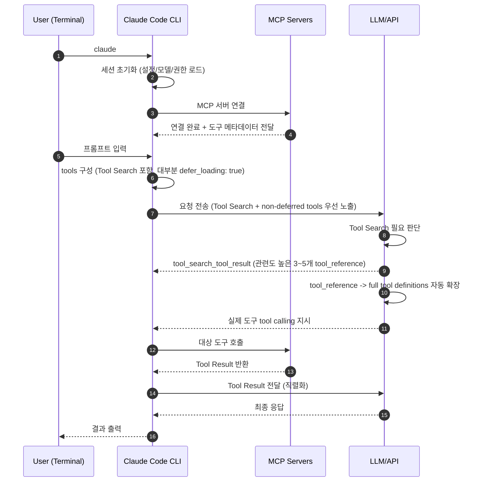
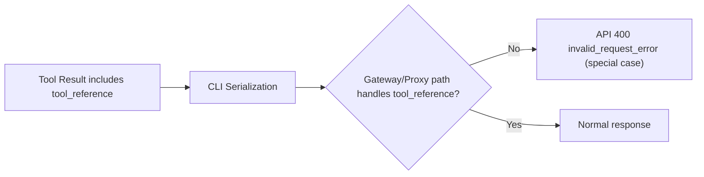

# Claude Code API 400 (`tool_reference`) 트러블슈팅

이 문서는 Claude Code 사용 중 아래 에러를 만났을 때 빠르게 확인할 수 있는 대응 가이드입니다.

## API Error: 400 tool_reference in v2.1.69

이 에러는 Claude Code의 `Tool Search Tool`이 반환한 `tool_reference`를 직렬화하는 과정에서 발생한 문제입니다.

```text
API Error: 400
failed to convert tool result content: unsupported content type in ContentBlockParamUnion: tool_reference
```

- Claude Code 실행 중 도구 호출 단계에서 API 400이 발생
- 메시지에 `tool_reference` 관련 변환 실패 문구 포함

> Claude Code `2.1.69`에서 `ANTHROPIC_BASE_URL`로 third-party gateway/proxy를 경유할 때`tool_reference`를 직렬화하는 단계에서 발생한 호환
> 이슈였습니다.
>
> 해당 이슈는 작성 시점 기준 [v2.1.70](https://github.com/anthropics/claude-code/releases/tag/v2.1.70)에서 핫픽스로 패치되었습니다.

## 왜 Tool Search가 필요했나

Claude Code는 외부 도구(MCP 서버의 tool)를 연결해서 작업할 수 있습니다.  
문제는 연결된 도구가 많아질수록, 사용자가 질문을 입력하기 전에도 도구 정보가 많이 로드되어 처리 비용(토큰)이 커질 수 있다는 점입니다.

이 문제를 줄이기 위해 도입된 방식이 **Tool Search Tool**입니다.

- 예전 방식: 도구 정보를 한꺼번에 많이 불러옴
- Tool Search 방식: 지금 필요한 도구만 찾아서 불러옴

그래서 도구가 많은 환경일수록 불필요한 로딩을 줄이고, 필요한 도구를 더 정확하게 고를 수 있습니다.

여기서 중요한 포인트는 병목이 두 가지라는 점입니다.

- 컨텍스트 낭비: 도구 정의를 미리 많이 올리면, 실제 질문을 처리하기 전부터 컨텍스트를 크게 사용합니다.
- 도구 선택 정확도 저하: 도구 수가 많아질수록(공식 문서 기준 30~50개 이상 구간) 올바른 도구를 고르는 난도가 높아집니다.

즉 Tool Search는 단순히 "토큰 절감"만이 아니라, CLI가 "도구 선택" 비용을 크게 절감될 수 있게됐습니다.

> Tool Search 기능은 `v2.1.7`부터 기본 활성화(`ENABLE_TOOL_SEARCH`) 되어 있습니다.
> - [Reddit - Tool Search now available in Claude Code](https://www.reddit.com/r/ClaudeAI/comments/1qczqsx/tool_search_now_available_in_claude_code/?tl=ko)
> - [Claude Code v2.1.7 release](https://github.com/anthropics/claude-code/releases/tag/v2.1.7)
> - [Tool Search Tool 공식 문서](https://platform.claude.com/docs/en/agents-and-tools/tool-use/tool-search-tool)

## CLI 실행부터 도구 호출까지 한 흐름으로 보기

`tool_reference`는 도구 본문 자체가 아니라 "이 도구를 로드/사용하라"는 참조 블록입니다.



- [1~2] 사용자가 `claude`를 실행하면 CLI 세션이 초기화됩니다.
- [3~4] CLI는 MCP 서버에 연결해 도구 메타데이터를 수집합니다.
- [5~6] CLI는 Tool Search + `defer_loading` 전략으로 요청을 구성하고 전송합니다.
- [7~8] LLM/API가 Tool Search 필요 여부를 판단합니다. (필요하지 않으면 `non-deferred tools`로 바로 진행)
- [9] 필요 시 `tool_search_tool_result`로 관련도 높은 3~5개 `tool_reference`를 반환합니다.
- [10] API가 `tool_reference`를 `full tool definitions`(실제 호출 가능한 도구 정의)로 자동 확장합니다.
- [11~13] 확장된 도구가 실제로 호출되고 Tool Result가 반환됩니다.
- [14~16] Tool Result 전달 후 최종 응답이 생성되어 사용자에게 출력됩니다.

> [Claude Code - How tool search works](https://platform.claude.com/docs/en/agents-and-tools/tool-use/tool-search-tool#how-tool-search-works)

## API ERROR 400 `tool_reference` 발생한 지점

API 400 에러는



1. 8단계: 컨텍스트가 커지는 구간에서 Tool Search가 동작하고,
2. 9 ~ 10 단계: 그 결과인 `tool_reference`를 직렬화하는 단계에서 문제가 발생했습니다.

## `ENABLE_TOOL_SEARCH`: Tool Search 기능 비활성화 방법

현재 버전을 유지하면서 `Tool Search`를 일시 비활성화할 수 있습니다.

```json
{
  "env": {
    "ENABLE_TOOL_SEARCH": false
  }
}
```

- `~/.claude/settings.json`에 해당 값을 추가해 적용할 수 있습니다.

## 관련 문서

- [Claude Code CLI 버전 관리 가이드](../claude-code-stable-version-guide.md)
- [Claude Code Doc - How tool search works](https://platform.claude.com/docs/en/agents-and-tools/tool-use/tool-search-tool#how-tool-search-works)
