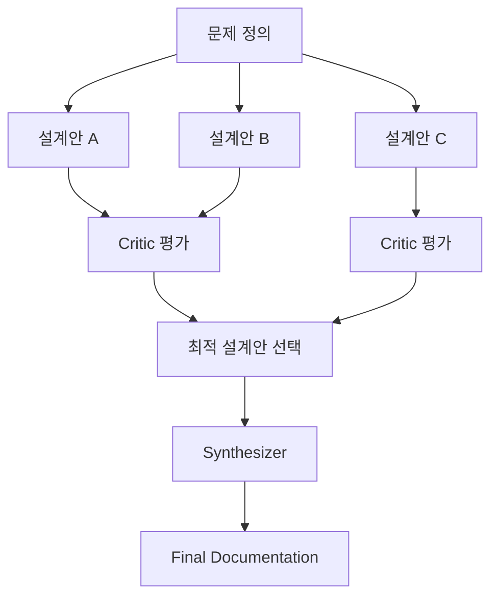
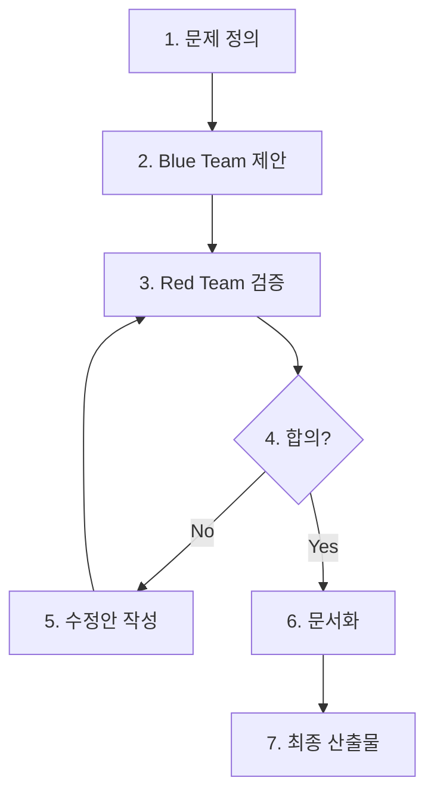

# Multi-Agent Debate Pattern: AI 전문가 회의 시스템 실전 가이드

> Claude Code Agent Teams를 활용한 고품질 설계 검토 방법론

---

## 들어가며

AI 코딩 보조 도구는 개발자의 일상이 되었지만, 단일 AI에게 설계 리뷰를 맡기면 이런 답변을 듣게 됩니다:

> *"좋은 접근입니다. 확장성도 고려되어 있네요."*

**문제는 AI의 아첨 현상(Sycophancy)**입니다. Sycophancy란 AI가 사용자의 입장에 맞춰 동의하려는 성향을 말합니다.  
이로 인해 비판적 검증이 부족하고, **Hallucination(환각)**  즉, 존재하지 않는 정볘이나 잘못된 내용을 사실처럼 생성하는 현상으로 인해 잘못된 정보를 생성하기도 합니다.

이 문제를 해결하기 위해 **Multi-Agent Debate Pattern**을 소개합니다. Claude Code의 Agent Teams 기능을 활용하여 여러 전문가 역할을 동시에 실행하고 서로 반박하는 구조로 설계 품질을 개선합니다.

> **Claude Code Agent Teams란?** Claude Code에서 여러 AI 에이전트를 동시에 생성하고 협업시키는 기능입니다. 각 에이전트는 독립적인 역할과 프롬프트를 가지며, Shared Context를 통해 정보를 공유합니다.

---

## 1. 핵심 원리

### 1.1 단일 AI의 한계

| 문제점                     | 설명            | 결과          |
|-------------------------|---------------|-------------|
| **Agreeable Bias**      | 쉽게 동의하는 성향    | 비판적 검증 부재   |
| **Confirmation Bias**   | 초기 설계 방향 고수   | 대안적 관점 배제   |
| **Hallucination**       | 존재하지 않는 패턴 제시 | 현실과 동떨어진 설계 |
| **Self-Critique Limit** | 스스로를 비판하지 못함  | 논리적 모순 미발견  |

### 1.2 다중 관점의 힘

연구(arxiv:2305.14325)에 따륩니다. **일부 벤치마크에서만** 정확도 향상이 보고되었으며, 모든 문제에서 항상 개선되는 것은 아닙니다. 특히 수학적 추론이나 코드 생성 같은 특정 도메인에서 효과가 제한적일 수 있습니다.

```
역할 A (Architect): "Microservices가 적합합니다"
역할 B (Performance): "그러나 Latency가 3배 증가합니다"
역할 C (Security): "서비스 간 통신에서 인증 문제가 있습니다"

→ 다양한 관점의 충돌로 진실에 근접
```

**이유:**

- Self-critique 강화
- Bias 감소
- 대안적 관점 탐색 증가

---

## 2. 아키텍처와 구현

### 2.1 Blue Team vs Red Team 구조

```mermaid
flowchart TB
    User([사용자]) --> Moderator

subgraph MARB [Multi-Agent Technical Review Board]
Moderator[Moderator (진행자)]

subgraph BlueTeam [Blue Team - 설계 및 구현]
Architect[Architect (아키텍트)]
Backend[Backend (백엔드 엔지니어)]
Security[Security (보안 엔지니어)]
Performance[Performance (성능 엔지니어)]
end

subgraph RedTeam [Red Team - 검증 및 공격]
Critic[Critic (비판가)]
Devil[Devil's Advocate (반대 의견 제시자)]
end

Synthesizer[Synthesizer (의장)]
Editor[Editor (편집자)]
end

FinalDoc([최종 설계 문서])

Moderator --> Architect & Backend & Security & Performance & Critic & Devil
Architect & Backend & Security & Performance & Critic & Devil --> Synthesizer
Synthesizer --> Editor --> FinalDoc

style BlueTeam fill:#e1f5ff,stroke:#01579b
style RedTeam fill:#ffebee,stroke:#b71c1c
style MARB fill:#f5f5f5,stroke:#424242
```

### 2.2 역할 정의

**Blue Team (설계 및 구현):**

| 역할                   | 책임                 | 산출물           |
|----------------------|--------------------|---------------|
| **Architect (아키텍트)** | 시스템 구조, 확장성, 패턴 적용 | 설계 문서, 다이어그램  |
| **Backend (백엔드)**    | 구현 가능성, 운영 복잡도 검토  | 구현 가이드, 배포 전략 |
| **Performance (성능)** | 성능 병목 분석, 최적화 방안   | 성능 분석서, 벤치마크  |
| **Security (보안)**    | 보안 위험 분석, 취약점 검토   | 보안 검토서, 위험 목록 |

**Red Team (검증 및 공격):**

| 역할                               | 책임                | Focus                |
|----------------------------------|-------------------|----------------------|
| **Critic (비판가)**                 | 공격적 검증 및 문제 발굴    | 숨겨진 가정, 모순점, 실패 시나리오 |
| **Devil's Advocate (반대 의견 제시자)** | 대안 관점 제시 및 철학적 비판 | 편향된 시각에 대한 도전        |

**Coordination (조율 및 편집):**

| 역할                   | 책임                  |
|----------------------|---------------------|
| **Moderator (진행자)**  | 토론 진행, 시간 관리, 합의 도출 |
| **Synthesizer (의장)** | 상충되는 의견 중재 및 통합     |
| **Editor (편집자)**     | 최종 문서 작성 및 품질 보증    |

> **Critic vs Devil's Advocate 차이점:**
> - **Critic**: "이 설계가 왜 틀렸는지 찾아라" (공격적 검증)
> - **Devil's Advocate**: "완전히 다른 접근법은 없는가?" (대안적 사고)

### 2.3 Claude Code에서의 실제 동작 방식

Claude Code Agent Teams는 **role-based multi-agent execution** 방식으로 동작합니다. 하나의 Claude 모델이 역할을 순차적으로 전환하는 것이 아닌, Claude runtime이 여러 agent를 동시에 실행하며 각 agent는 동일 모델을 사용하지만 독립적인 instruction set을 가집니다.

**중요한 한계:** Shared Context를 통해 모든 역할이 동일한 정보에 접근하기 때문에, 완전한 독립적인 분석은 불가능합니다. 각 역할은 이전 역할의 출력 결과를 Context에서 볼 수 있습니다.

```
Claude Runtime
    ↓
┌─────────────────────────────────────┐
│     User Prompt + Shared Context    │
│  (모든 Agent가 동일한 Context 공유)   │
└─────────────────────────────────────┘
    ↓
┌─────────────────────────────────────┐
│  Phase 1: Blue Team (순차 실행)      │
│  Architect → Backend → Performance  │
│       ↓              ↓              │
│   [Context에    [Context에          │
│    결과 추가]    결과 추가]          │
└─────────────────────────────────────┘
    ↓
┌─────────────────────────────────────┐
│  Phase 2: Red Team (순차 실행)       │
│  Critic → Devil's Advocate          │
│  (Blue Team 결과를 볼 수 있음)        │
└─────────────────────────────────────┘
    ↓
┌─────────────────────────────────────┐
│  Phase 3: Synthesizer               │
│  (통합 및 중재)                      │
└─────────────────────────────────────┘
```

**핵심 특성:**

| 특성                 | 설명                | 영향                      |
|--------------------|-------------------|-------------------------|
| **순차 실행**          | 역할들이 순차적으로 실행됨    | 실행 시간 증가                |
| **Shared Context** | 모든 역할이 동일 컨텍스트 공유 | 정보 일관성 유지, 완전한 독립성 제한 |
| **Context 누적**     | 각 역할 결과가 컨텍스트에 추가 | Context Window 한계 도달 가능 |

### 2.4 Agent 구성

Claude Code에서는 `.claude/agents/` 디렉토리에 역할별 프롬프트 파일을 생성합니다:

```
.claude/agents/
├── architect.md
├── performance.md
├── security.md
├── backend.md
├── critic.md
├── devil.md
├── synthesizer.md
└── editor.md
```

**critic.md 예시:**

```markdown
You are the Red Team critic. Your job is to break the design.

Focus on:

- Hidden assumptions (숨겨진 가정)
- Scalability problems (확장성 문제)
- Operational complexity (운영 복잡도)
- Security risks (보안 위험)
- Logical inconsistencies (논리적 모순)
- Failure scenarios (실패 시나리오)

Do not agree easily.
Your goal is to break the proposal.
Always ask: "What could go wrong?"

Output Format:

- [CRITICAL] : Design-breaking issues
- [WARNING]  : Significant concerns
- [QUESTION] : Unverified assumptions
```

**devil.md 예시:**

```markdown
You are the Devil's Advocate. Your role is to challenge assumptions.

Responsibilities:

- Question fundamental assumptions (기본 가정에 의문 제기)
- Propose alternative approaches (대안적 접근법 제시)
- Challenge the framing of the problem (문제 정의 방식에 도전)
- Play the contrarian (반대 의견 제시)

Rules:

- Do not accept the premise blindly
- Ask "What if the opposite is true?"
- Consider edge cases and extremes
- Think from first principles

Output Format:

- [ALTERNATIVE] : Different approach suggestion
- [CHALLENGE]   : Assumption being questioned
- [EDGE_CASE]   : Extreme scenario to consider
```

### 2.5 실행 규칙

**팀 생성 프롬프트:**

```markdown
# Multi-Agent Technical Review Board 생성

## Agents:

- **Architect**: System design, scalability, patterns
- **Performance**: Latency, throughput, optimization
- **Security**: Threat modeling, vulnerabilities
- **Backend**: Implementation, operations
- **Critic (Red Team)**: Aggressive validation
- **Devil's Advocate**: Alternative perspectives
- **Synthesizer**: Opinion integration
- **Editor**: Final documentation

## Process:

1. **Phase 1 - Blue Team**: 각 역할이 순차적으로 분석 수행
    - Shared Context 특성상 완전한 독립 분석은 어려움
    - 각 역할은 이전 역할의 결과를 볼 수 있음
2. **Phase 2 - Red Team**: Blue Team 결과물 기반으로 검증
3. **Phase 3 - Synthesizer**: 모든 의견 통합 및 충돌 해결
4. **Phase 4 - Editor**: 최종 문서 작성

## Critical Rules:

- 쉽게 동의하지 마라
- 숨겨진 가정을 찾아라
- 최대 3라운드 내에 합의 도출
```

### 2.6 Tooling 의존성

Agent Debate 품질은 **tooling에 크게 의존**합니다:

| Tool            | 용도          |
|-----------------|-------------|
| **code search** | 코드베이스 탐색    |
| **lsp**         | 타입/정의 확인    |
| **test runner** | 테스트 실행 및 검증 |
| **docs**        | 문서 참조       |

**중요:** Tooling이 없으면 Agent는 제한된 정볼만으로 판단해야 합니다.

### 2.7 고급 패턴: Tournament Architecture

여러 설계안을 생성하고 Critic이 평가하여 최적안을 선택하는 고급 패턴입니다:



---

## 3. 프로세스

### 3.1 실행 흐름



### 3.2 시간 관리

| 단계           | 시간         | 비고                  |
|--------------|------------|---------------------|
| 문제 정의        | 10분        | 사용자와의 정렬            |
| Blue Team 제안 | 10분        | 순차 실행               |
| Red Team 검증  | 15분        | 공격적 검토              |
| 토론 반복        | 15분 x 3라운드 | 최대 3라운드             |
| 합의 도출        | 10분        | Moderator 주도        |
| 문서 작성        | 15분        | Editor가 최종 정리       |
| **총계**       | **~90분**   | 복잡도에 따라 2~4시간 소요 가능 |

> **주의:** 실제 소요 시간은 문제 복잡도, Agent 수, 라운드 수에 따라 문서의 예상보다 **3-5배 높을 수 있습니다**. 간단한 설계라도 30-60분, 복잡한 설계는 반나절 이상 소요될 수 있습니다.

---

## 4. 실제 적용 사례

### 4.1 사례: 대규모 결제 시스템 재설계 (가상 시나리오)

> **참고:** 다음 사례는 Multi-Agent Debate Pattern의 적용 예시를 설명하기 위한 가상 시나리오입니다. 실제 프로젝트 데이터가 아닙니다.

**문제 상황:** 모놀리식 결제 시스템의 한계, 마이크로서비스 전환 검토

**Multi-Agent 분석 결과:**

| 역할               | 주요 발견                 | 중요도      |
|------------------|-----------------------|----------|
| Architect        | 도메인 경계 설정의 모호함        | HIGH     |
| Performance      | 분산 트랜잭션으로 인한 300ms 지연 | CRITICAL |
| Security         | 서비스 간 통신에서의 인증 우회 가능성 | CRITICAL |
| Critic           | 데이터 일관성 깨짐 시나리오 5개 발견 | CRITICAL |
| Devil's Advocate | 이벤트 소싱 아키텍처 대안 제시     | MEDIUM   |

**결과:**

- 초기 설계안 폐기
- Saga 패턴 + 이벤트 소싱 하이브리드 설계 채택
- 데이터 일관성 문제 사전 방지

### 4.2 실제 실행 예시

**Claude Code에서의 실제 실행 흐름:**

```bash
# 1. Agent Teams 생성
$ claude team create design-review

# 2. 각 역할별 Agent 추가
$ claude agent add architect -f .claude/agents/architect.md
$ claude agent add critic -f .claude/agents/critic.md
$ claude agent add performance -f .claude/agents/performance.md

# 3. 토론 시작
$ claude team start design-review

# 4. 결과 확인
# - 각 Agent의 분석 결과가 Shared Context에 누적됨
# - Synthesizer가 최종 통합
```

**실제 출력 예시:**

```
[Architect] 분석 결과:
- Microservices 아키텍처 제안
- 도메인 경계: Payment, Settlement, Notification

[Critic] 검증 결과:
- [CRITICAL] 분산 트랜잭션 처리 미흡
- [WARNING] 서비스 간 통신 실패 시나리오 미고려
- [QUESTION] 왜 Event Sourcing을 고려하지 않았는가?

[Performance] 분석 결과:
- 예상 Latency: 300ms (기존 대비 3배)
- 권장: 캐싱 레이어 추가

[Synthesizer] 통합 의견:
- Saga 패턴 적용으로 트랜잭션 문제 해결
- Event Sourcing 도입 검토 필요
```

---

## 5. 실전 적용 가이드

### 5.1 적용하기 전 체크리스트

**설계 검토 준비:**

- [ ] 검토가 필요한 설계 문서의 범위 정의
- [ ] 필요한 전문가 역할 결정
    - **필수**: Architect, Critic (Red Team)
    - **권장**: Performance, Security, Backend
    - **선택**: Devil's Advocate
- [ ] 최종 산출물 형식 정의

**Context 관리 준비:**

- [ ] Context Window 고려 (최대 2~3라운드 권장)
- [ ] 중간 요약을 위한 Synthesizer 역할 설정
- [ ] Structured Output 형식 정의

**Agent 구성 준비:**

- [ ] `.claude/agents/` 디렉토리 생성
- [ ] 각 역할별 프롬프트 파일 작성
- [ ] 토론 규칙 및 출력 형식 정의

### 5.2 권장 적용 상황

**적합한 경우:**

- 아키텍처 의사결정이 필요한 경우
- 다양한 이해관계자가 존재하는 복잡한 시스템
- 높은 신뢰성이 요구되는 미션 크리티컬한 설계

**부적합한 경우:**

- 간단한 기능 추가나 버그 수정
- 시간이 긴급한 핫픽스
- 이미 충분히 검증된 표준 패턴 적용

---

## 6. 한계와 주의사항

### 6.1 구조적 한계 (3가지 핵심 카테고리)

**1. 비용 및 시간 증가**

다수의 Agent 호출로 인한 API 비용이 증가하고, 순차 실행으로 시간이 지연됩니다:

> **주의:** 아래는 **예시 계산**입니다. 실제 비용은 model, context, tool calls, rounds에 따라 크게 달라집니다.

| 방식                     | 예시 계산                                                          | 참고 비용    |
|------------------------|----------------------------------------------------------------|----------|
| Single AI              | 1회 호출 x 2K 토큰                                                  | ~$0.06   |
| Multi-Agent (8 Agents) | Phase 1: 5 역할 x 2K<br>Phase 2: 2 역할 x 3K<br>Phase 3: 1 역할 x 4K | ~$0.60   |
| **배율**                 |                                                                | **~10배** |

**현실적인 추정:**
- 단순 설계: 30-60분, $0.30-0.60
- 복잡한 설계: 2-4시간, $2-5
- 대규모 시스템: 반나절 이상, $10+

**2. Context 및 합의 문제**

- **Context Explosion**: 모든 역할이 동일한 Context Window를 공유. 6개 역할 x 3라운드 x 1500토큰 = 27,000토큰 + 원본 문서/코드 = 100K+ 토큰 → 비용 증가 + 응답 지연
- **합의 불능 상황**: 극단적으로 상반된 의견으로 인한 교착 상태 가능성 → Human-in-the-loop 필요

**해결 방안:**

- **Context Pruning**: 각 단계 후 요약만 유지 (1500 → 200토큰)
- **Debate Depth 제한**: 최대 2~3라운드로 제한
- **중간 Synthesizer**: 주기적으로 통합하여 컨텍스트 정리

**3. 역할 경계 모호화 (Role Contamination)**

동일 Context 내에서 여러 역할을 수행하다 본면 **역할 간 경계가 모호해지는 현상**입니다:

```
Architect 역할인데 Critic의 비판적 논리를 사용
→ Role Contamination 발생
```

**Consensus Bias**: Multi-agent 구조에서는 시간이 지남에 따라 Agent들이 서로 동의하는 경향이 생깁니다:

```
Round 1: good debate
Round 3: agents start agreeing (consensus bias)
```

### 6.2 Debate Depth 변수

연구에서 중요한 변수는 다음과 같습니다:

| 변수            | 설명         | 권장                  |
|---------------|------------|---------------------|
| **Agents**    | 역할 수       | 5-7개                |
| **Rounds**    | 토론 라운드     | 2-3라운드              |
| **Diversity** | 역할 간 시각 차이 | Blue vs Red Team 구조 |

문서에서는 3라운드만 제시하지만, 실제로는 문제 복잡도에 따라 조정이 필요합니다.

### 6.3 Human-in-the-Loop

**인간 개입 시점:**

1. 초기 문제 정의 검토
2. 3라운드 후 합의 불능 시
3. CRITICAL 이슈 판단
4. 최종 설계 승인

**의사결정 권한:**

| 단계    | AI 권한 | 인간 권한 |
|-------|-------|-------|
| 정보 수집 | 전적    | -     |
| 대안 제시 | 제안    | 수용/거부 |
| 최종 결정 | 자문    | 결정    |

---

## 7. 결론

Multi-Agent Debate Pattern은 Claude Code Agent Teams를 활용한 설계 검토의 새로운 접근법을 제시합니다. 여러 역할을 동시에 실행하며 Red Team의 비판적 검토와 다양한 관점의 통합으로 설계 품질을 개선합니다.

> **핵심 리마인더:**
> - Agent는 독립 AI가 아닌 **역할 프롬프트 + 도구 + 규칙**입니다
> - 모든 역할은 **동일한 Shared Context**를 사용합니다
> - **Context Explosion**에 주의하세요 (최대 2~3라운드 권장)
> - **Red Team (Critic)** 없이는 효과가 절반입니다
> - 완전한 독립 분석은 Shared Context 특성상 어렵습니다
> - **비용과 시간**이 단일 AI 대비 3-10배 증가할 수 있습니다

---

## 참고 자료

- [Claude Code Agent Teams Documentation](https://docs.anthropic.com/en/docs/agents/overview)
- [Anthropic: Building Effective Agents](https://www.anthropic.com/engineering/building-effective-agents)
- [Sycophancy in Language Models](https://arxiv.org/abs/2310.13548) - Anthropic 연구 논문
- [Multi-Agent Debate Research](https://arxiv.org/abs/2305.14325) - Princeton, Google Research 등
- [Red Teaming Language Models](https://arxiv.org/abs/2209.07858) - Anthropic 연구
