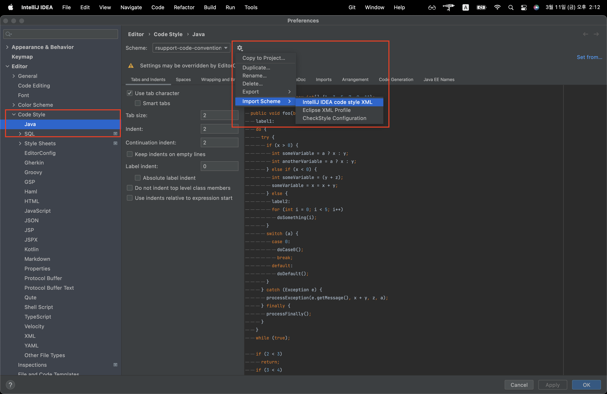
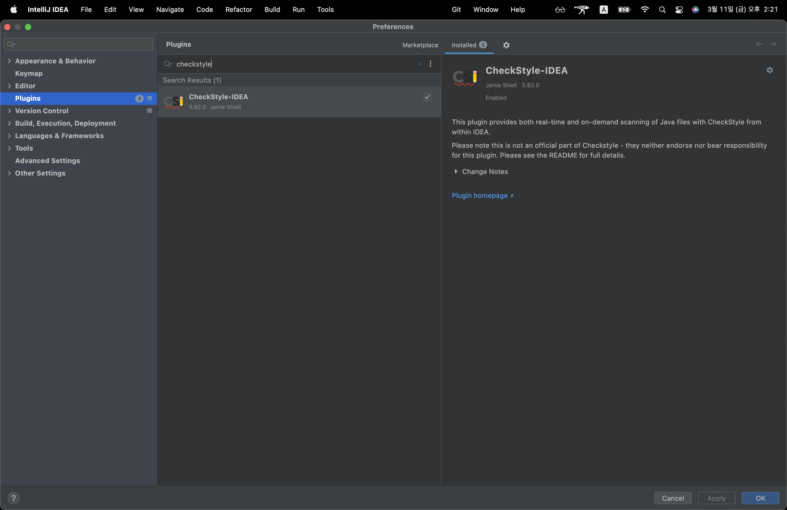
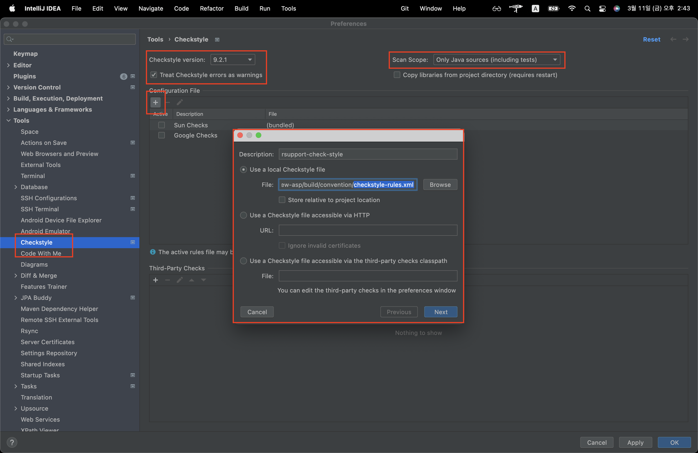
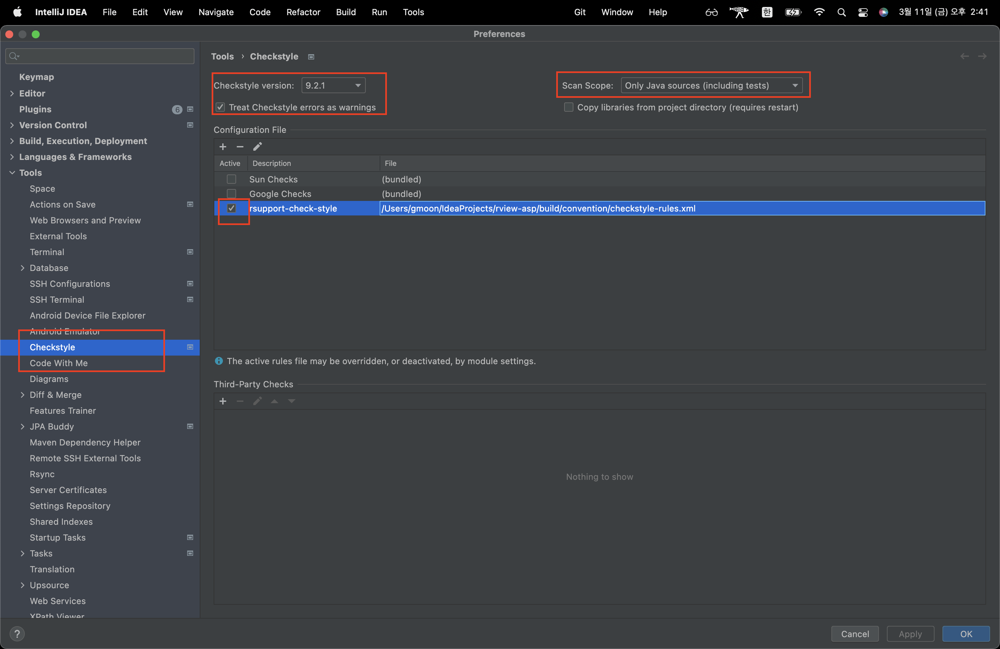
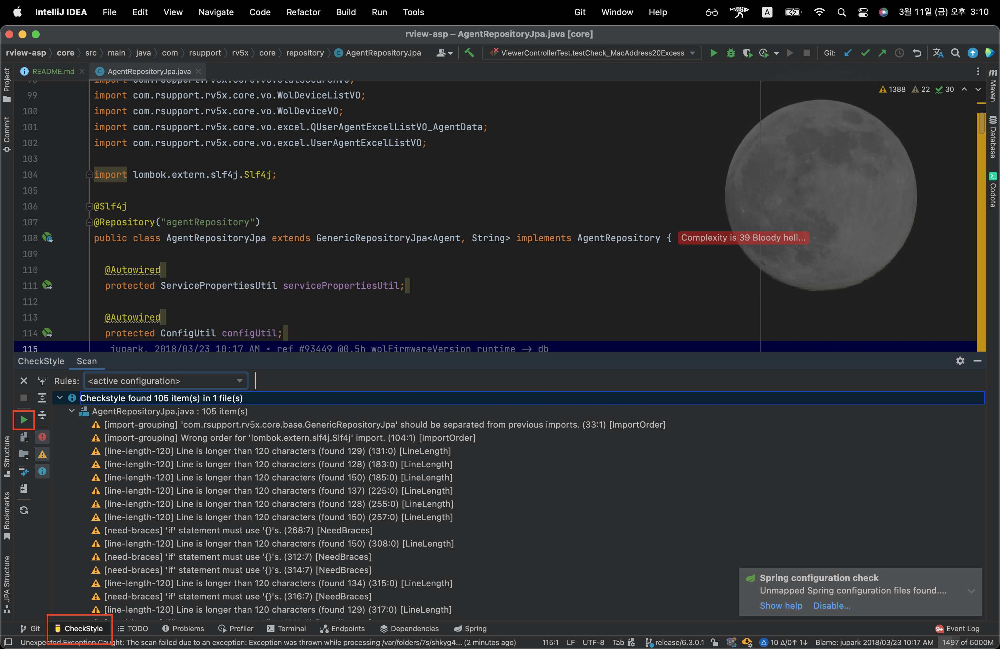
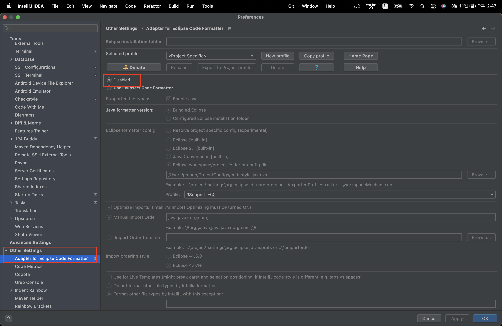
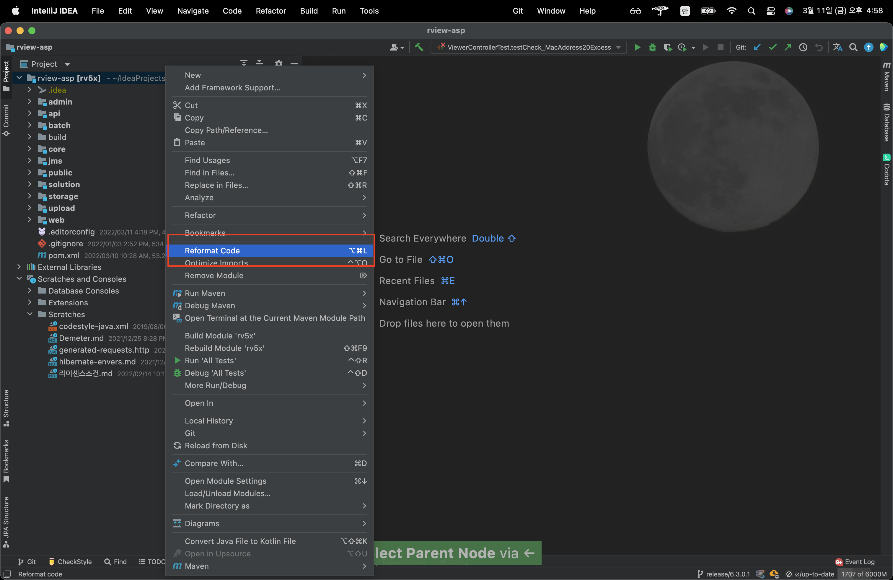

## Code Convention

1. [Code Convention Files](#code-convention-files)
2. [IntelliJ Formatter 설정](#intellij-formatter-settings)
3. [Check Style 설정](#checkstyle-settings)
    1. [`CheckStyle-IDEA` 플러그인 설치](#install-checkstyle-idea-plugin)
    2. [IntelliJ `CheckStyle` 플러그인 설정](#intellij-checkstyle-settings)
    3. [CheckStyle 확인](#checkstyle-confirm)
4. [기존 적용된 Eclipse Code Formatter Plugin 제거](#eclipse-code-formatter-plugin-disabled)
5. [프로젝트 코드 컨벤션 적용](#project-reformat-code)

## Code Convention Files

- [.editorconfig](https://editorconfig.org/)
- [intellij-formatter.xml](https://www.jetbrains.com/help/idea/code-style.html)
- [checkstyle-rules.xml](https://checkstyle.sourceforge.io/)

## IntelliJ Formatter Settings

1. `Editor` > `Code Style` > `Java`
2. `Schema` 항목 톱니바퀴 아이콘 클릭
3. `Import Scheme` > `IntelliJ IDEA code style XML` 선택
4. `intellij-formatter.xml` 파일 적용

## Checkstyle Settings

### Install CheckStyle-IDEA Plugin

`CheckStyle-IDEA` 플러그인 설치

> **`8.24 이상`** 설치

### IntelliJ CheckStyle Settings

IntelliJ `CheckStyle` 플러그인 설정

- `Checkstyle versions` : 8.24 이상 선택.
- `Scan Scope` : **`Only Java sources (including tests)`** 선택
- `Treat Checkstyle errors as warnings` : 체크
- **`checkstyle-rules.xml`** 파일 적용
    - `Configuration File` > `+`
    - `Use a local Checkstyle file` > `Browse`
    - **`checkstyle-rules.xml`** 파일 적용

- `Active` 체크

### CheckStyle Confirm

CheckStyle 확인 방법

## Eclipse Code Formatter Plugin Disabled

기존 설치된 `Adapter for Eclipse Code Formatter` 플러그인 제거 또는 Disabled

## Project Reformat Code

프로젝트 또는 파일 코드 컨벤션 적용 방법

1. 적용할 모듈 또는 파일 선택
2. `Reformat Code` 클릭

1. `Optimize imports` 체크
2. `Cleanup code` 체크
3. `File mask(s)` > `*.java` 설정
4. `Run`
