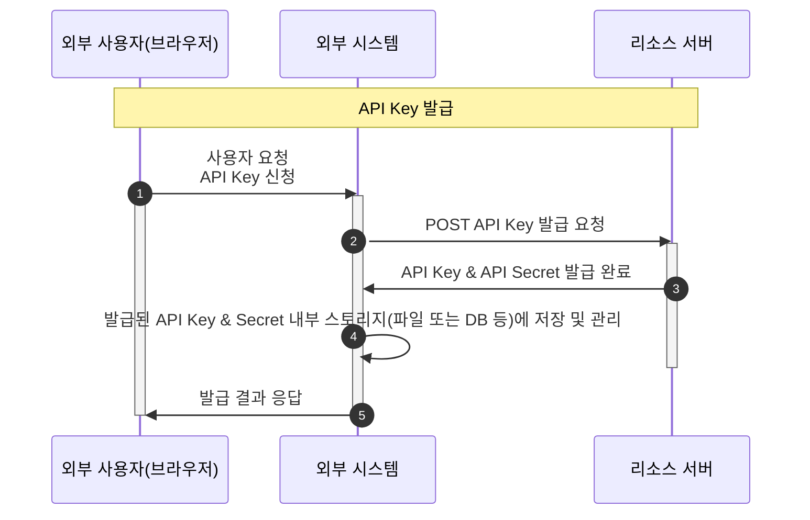
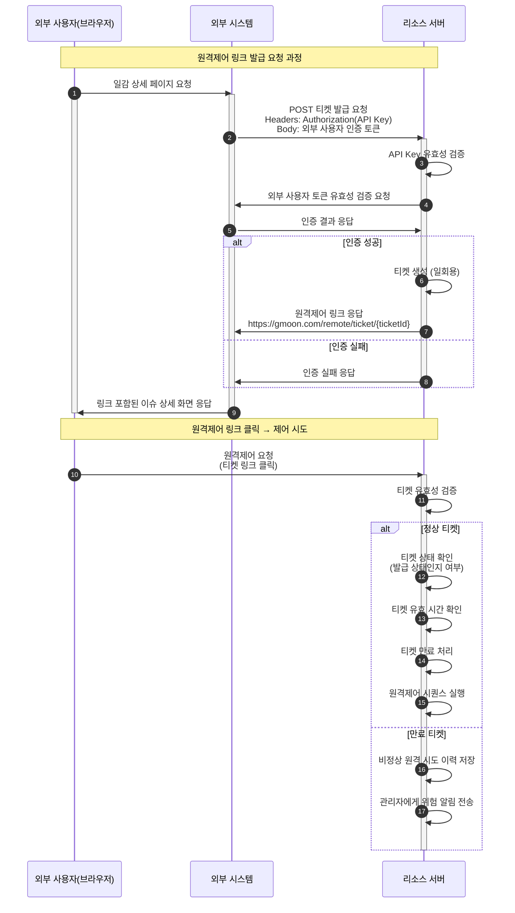

## 외부 요청 시스템과의 서버-투-서버 인증, 일회용 행동 권한 위임 설계

복수 시스템/파트너와 서버 to 서버(Backend to Backend) 방식 인증을 기반으로,
"일회용 권한(One Time Permission)" 부여 필요성이 있는 API 연동 시나리오

### 요구사항

- 이슈 등록 시, 등록자가 제어받을 자신의 에이전트(컴퓨터) 정보를 함께 제출
- 관리자는 이슈를 확인하고, 필요 시 등록자의 에이전트에 원격제어를 수행
- 별도의 로그인/추가 인증 없이 사용할 수 있는 **티켓 링크 기반** 원격제어 기능을 제공

### 티켓의 역할 및 정의

- 본 시스템에서 티켓은 "일회성 원격제어 인증 토큰" 역할을 한다.
- 외부 이슈 트래커에서 생성된 티켓 제어 링크를 사용자가 클릭하면, 별도 로그인 없이 곧바로 원격제어를 실행하도록 설계한다.

## 전체 흐름 요약

- [API Key 관리](#api-key-관리)
- [티켓 원격 제어](#티켓-원격-제어)

### API Key 관리



`API Key` 및 `API Secret`은 발급 시에만 조회할 수 있으며, 추후 별도 확인이 불가능하므로 반드시 안전한 내부 스토리지(파일 또는 DB 등)에 보관해야 한다. 분실할 경우 재발급한다.

- API Key: 서버 간 통신에서 인증 및 식별 목적으로 사용한다.
- API Secret: 메시지 HMAC 서명 등 데이터 무결성 및 위변조 방지를 위한 비밀값으로 활용한다.

#### HMAC Message Signature

데이터 무결성 및 위변조 방지가 필요한 경우, `API Secret`을 활용하여 HMAC 기반 메시지 서명 구조를 적용한다.

```text
HMAC(signature) = HMAC_SHA256(secret, message)

secret: API Secret (API Key 발급시 함께 제공)
message: 서명 대상 데이터 예시 
  - 본문 전체 JSON
  - 또는 "nonce=abcd1234&timestamp=1718020500"
```

요청 예시

```text
POST /v1/remote-control
Content-Type: application/json
X-Nonce: abcd1234
X-Timestamp: 1718020500
X-Signature: 12f938fae10e...
POST 
```

수신 서버는 동일한 방식으로 메시지와 `API Secret`을 사용해 HMAC을 계산한 후, 헤더로 전달받은 `X-Signature`와 일치하는지 검증한다.

시그니처는 `Replay Attack`(재생 공격) 방지를 위해 nonce와 timestamp 값을 조합한 메시지로 생성한다. nonce(또는 requestId) + timestamp 조합을 시그니처에 반드시 포함하여, 서버는 일정 시간 내 중복 시도를 감지하고 차단한다.

OAuth2, JWT 등 토큰 기반의 인증도 jti(Nonce 역할), exp(만료 시간) 필드 등으로 `Replay Attack`을 방어한다.

> `nonce`는 고유한 임의 문자열로, body가 없는 GET, DELETE, idempotent API에서 `requestId`처럼 식별자 역할을 대신할 수 있다.

#### 운영 보안 정책 체크리스트

#### 1. 인증 및 토큰 관리 정책

- `nonce` 중복 검증 정책
  - 서버는 최근 일정 기간(ex. 5~15분) 동안 사용된 nonce/requestId의 기록을 별도 저장소(Redis 등)에 보관한 뒤, 동일 값으로 요청이 들어올 경우 즉시 차단한다.
  - 서버가 스케일아웃 구조(다중 인스턴스)인 경우, 모든 인스턴스가 nonce 사용 내역을 공용 캐시 등으로 글로벌하게 공유한다.
- `timestamp` 허용 오차
  - 시스템 간 시간 차이를 고려해, timestamp 허용 오차를 ± 5분(300초) 이내로 제한한다.
  - 허용 범위 초과 시 요청을 무조건 거부한다.
  - 오차 범위가 너무 짧으면 정상 요청이 방해받을 수 있고, 너무 길면 Replay Window 확보 우려가 있으니 실시간성/보안성 균형을 고려해 정책을 결정한다.

#### 2. Key/Secret 라이프사이클 및 저장 정책

- `API Secret` 주기적 교체(롤링)
  - `API Secret`는 주기적으로(3~6개월) 교체한다.
  - 교체 시 일정 기간 동안에는 신규와 기존 `Secret`을 모두 허용(Grace Period) 후 완전히 전환해야 한다.
  - 위험 탐지 시 즉시 교체한다.
- Key/Secret 저장 보안
  - Key/Secret은 반드시 암호화 저장하고, 접근 로그도 별도로 기록한다.

#### 3. 시그니처 메시지 서명/포맷 정책

- 키 순서, 인코딩 규칙, 불필요 공백 등 메시지 포맷에 대해 시스템 간 명확히 사전 합의하고, 약속된 포매팅만 적용하여 시그니처 불일치(오인/오류)를 방지한다.

#### 4. 감사 및 이상/위험 탐지 정책

- 모든 서명 검증(성공/실패)에 대해 감사 로그에 기록한다.
  - nonce, timestamp, Key, 원격 IP, 요청 시간(UTC) 등
- 실패 또는 이상 요청, 중복·허위·Replay 시도 발생 시, 해당 내역을 로그에 남기고 위험 감지(알림) 시스템(ex. WATCHMON, SIEM)으로도 알린다.

#### 5. 시스템 시간 동기화 정책

- API 서버 및 외부 시스템 모두 NTP 등으로 시계를 항상 동기화하여 타임스탬프 오류를 예방한다.

### 티켓 원격 제어



1. **외부 시스템은 서버 간 호출로 티켓 발급 요청**
    - 이때, 서버 간 인증을 위해 사전에 발급받은 API Key(Authorization 헤더)를 포함시킴
    - 요청 Body에는 사용자 인증 토큰도 함께 전달한다.
2. **리소스 서버는 토큰을 외부 시스템에 검증 요청**
    - 인증 성공 시에만 티켓을 발급
3. **일회성 티켓 발급 후, 티켓 ID가 포함된 원격제어 링크 반환**
    - 티켓은 일회용이며, 사용 후 즉시 만료한다(One-Time Token, OTT)
4. **외부 시스템은 이 링크를 사용자 이슈 상세 화면에 노출**
5. **최종 사용자는 링크 클릭으로 원격제어를 시도**
    - 티켓 유효성, 상태, 만료 여부를 확인 후 원격제어를 실행
    - 이후 티켓은 만료 처리되고, 실패 시에는 관리자 알림을 발송하고 로그를 기록한다.

## 보안 설계 검토 Q&A

### Q. 티켓 링크 탈취 가능성은 없나?

티켓은 일회성으로 발급되며, 한 번 사용 시 즉시 만료한다.
설령 링크가 탈취되더라도 재사용할 수 없다. 또한, 티켓 발급은 서버 간 인증(API Key 기반) 통신으로만 이루어지며, 외부 시스템에서 직접 생성하는 것은 불가능하다.

### Q. 티켓 링크는 결국 URL 파라미터인데, 겟(HTTP GET) 방식이면 취약하지 않나?

티켓 링크 클릭 시 GET 요청이 발생하지만, 서버에서는 티켓 상태와 유효성을 엄격하게 검증한다.
정상적으로 발급된 티켓이 아니거나 이미 만료된 경우, 즉시 요청을 거부한다.

*참고: 만료된 티켓 링크를 재사용하는 등 비정상적인 호출 시도는 모두 이력으로 기록하며, 실시간 모니터링 및 관리자 알림(메일) 시스템과 연계하여 대응한다.

### Q. 외부 사용자가 실제 외부 시스템의 사용자인지 확인은 어떻게 해?

티켓 발급 시, 리소스 서버가 외부 시스템에 직접 서버 간 인증 요청을 수행하여 외부 사용자의 신원을 교차 검증한다.

1. 티켓 원격제어 생성 요청시 외부 사용자 토큰 포함
2. 리소스 서버는 사용자 토큰을 다시 외부 시스템의 인증 서버로 검증
3. 신원이 확인된 경우에만 티켓 원격 제어 링크를 응답 
 
이와 같이 서버 간 3단계 상호 교차 인증 절차를 거치도록 설계되어 있어, 요청 데이터 위변조 환경에서도 외부 사용자 신원이 객관적으로 보장됩니다.

이 구조는 PKI(공개키 기반 인증), OAuth2.0(토큰 기반 상호 인증) 등 업계 표준 다중 인증(Mutual/Stepwise Authentication) 절차와 유사하게 동작한다. 예를 들어 PKI는 서버와 외부 시스템 사이에 인증서 및 서명 확인 과정을 거치며, OAuth2.0은 Third-Party 앱, 인증 서버, API 서버간 토큰에 기반해 상호 검증을 반복한다.

### Q. Man-In-The-Middle(MITM) 공격에 취약하지 않나?

모든 통신은 HTTPS(SSL/TLS)로 암호화되어 있어 MITM(중간자 공격)은 원천적으로 방지된다.

```text
[MITM 공격 예시]
1. 공격자가 네트워크 중간에서 외부 시스템-서버 패킷을 가로챔
2. 인증 토큰이나 데이터가 평문(HTTP)이라면 탈취/변조 가능
3. 그러나 본 시스템에서는 반드시 암호화된 채널(HTTPS) 및 API Key로 통신이 이루어져,
4. 공격자가 데이터를 스니핑(snooping)하거나 변조하더라도 서버 유효성 검사와 암호화로 공격이 차단됨

[외부 시스템] ---암호화된 연결---> [공격자] (패킷 읽기 실패)
[공격자] ---암호화된 연결---> [서버]
```

또한, 데이터 무결성 위협(패킷 위변조/탈취 등)에 대비하기 위해
API Secret을 활용한 HMAC 서명 검증 구조 도입도 고려할 수 있다.

*참고: 티켓 원격 제어 기능은 민감한 사용자 정보를 포함하지 않으므로, 현재는 해당 구조(HMAC 서명 등)를 적용하지 않는다.

### Q. 서버 응답을 위조하거나 서명(signed response)을 변조하면?

현재 티켓 원격제어 구조는 서버-서버 인증, 일회성 토큰, 내부 일원적 상태 제어를 통해 데이터 위변조나 신뢰성 문제가 발생할 수 있는 취약점은 실질적으로 존재하지 않습니다.

다만, 외부의 특수한 규제/감사 기준으로 인해 모든 데이터 송수신 과정에 디지털 서명 등
최상위 수준의 보안이 요구될 경우엔, 추가적인 보안 강화 옵션으로 signed response 등의 도입을 검토할 수 있다.

### Q. 티켓 링크 URL은 예측 가능한 값이 아니야?

티켓 ID는 UUID 또는 해시 값을 사용해 생성하며, 정해진 길이와 무작위성을 갖춘다. 링크에는 사용자나 에이전트 정보가 노출되지 않고, 모든 조회와 제어는 내부적으로 안전하게 이루어진다.

### Q. CORS 이슈는 없어?

원격제어 서비스 특성상 다양한 외부 시스템(모바일, PC, 브라우저 등)에서 접근해야 하므로,
CORS 정책을 전체 오리진(*)으로 두고 운영한다.

따라서 브라우저의 `Cross-Origin` 차단 기능은 별도로 적용되지 않지만,
실제 원격제어 요청은 반드시 서버가 발급한 **유효한 티켓(일회성 토큰)** 을 통해서만 이루어진다.

티켓은 서버 간 통신(API Key를 통한 인증)에서만 발급 및 사용이 가능하고, 모든 원격제어 시도는 서버에서 유효성, 만료, 이력까지 철저히 검증하도록 설계한다.

즉 CORS로 차단하지 않더라도 티켓의 일회성, 서버 검증 구조와 허용된 IP에서만 발급 가능한 API Key 인증 절차로 인해 인가되지 않은 접근이나 공격 시도는 원천적으로 차단한다.

따라서 티켓 발급 등 서버-서버 API 요청은 CORS 정책과 무관하며, 실제 보안은 서버 기반의 인증·인가 프로세스로 안전하게 유지한다.

### Q. 동시성 공격은?

복수의 원격제어 요청이 동시에 도착하더라도,
서버는 최초 도착 티켓만 정상 처리하고, 나머지는 모두 만료된 티켓으로 간주하여 반려한다.

실제 사용자 인터페이스 역시 제어 시도는 모달 또는 새 창 방식으로 제한하여, 동시성(Concurrent) 공격 시나리오가 발생하지 않도록 설계한다.

## 티켓 엔티티 설계시 필수 기준

- 시스템 내부 원격제어 시퀀스는 사용자 및 에이전트 데이터가 모두 확보된 상태에서만 정상 동작한다.
- 티켓 링크가 생성되는 과정에서, 내부 티켓 테이블에는 반드시 사용자 정보와 제어 대상 에이전트 정보를 함께 저장·관리해야 한다.
- 이를 통해, 임의의 에이전트에 대한 무분별한 액세스를 차단하고, 실제 이슈 등록 시점에 등록자의 에이전트 정보를 명확하게 확보하여 원격제어 권한에 대한 정확성과 보안성을 높일 수 있다.
- 즉, 원격제어 허용 여부는 반드시 “이슈 등록자(사용자)와 그의 에이전트” 간의 확정된 연계 정보에 따라 결정되어야 하며, 등록되지 않은(권한 부여되지 않은) 에이전트는 제어 대상이 될 수 없다.
