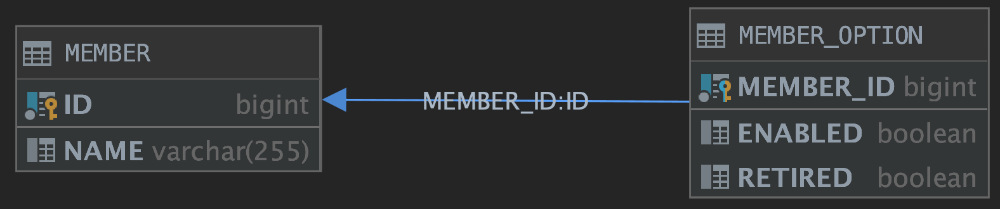
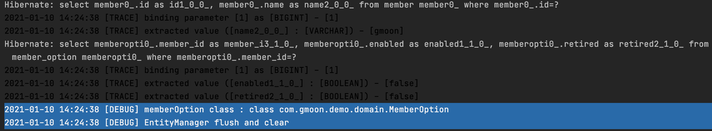
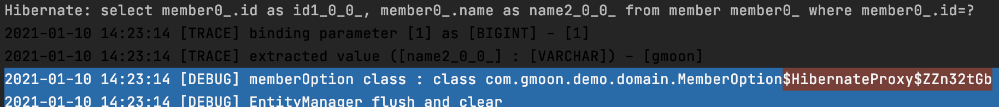
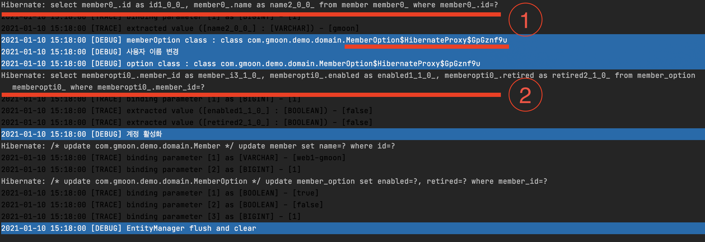
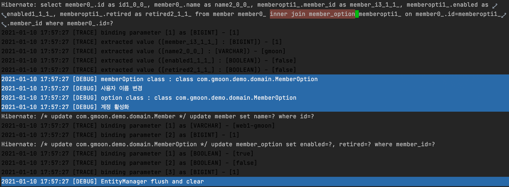
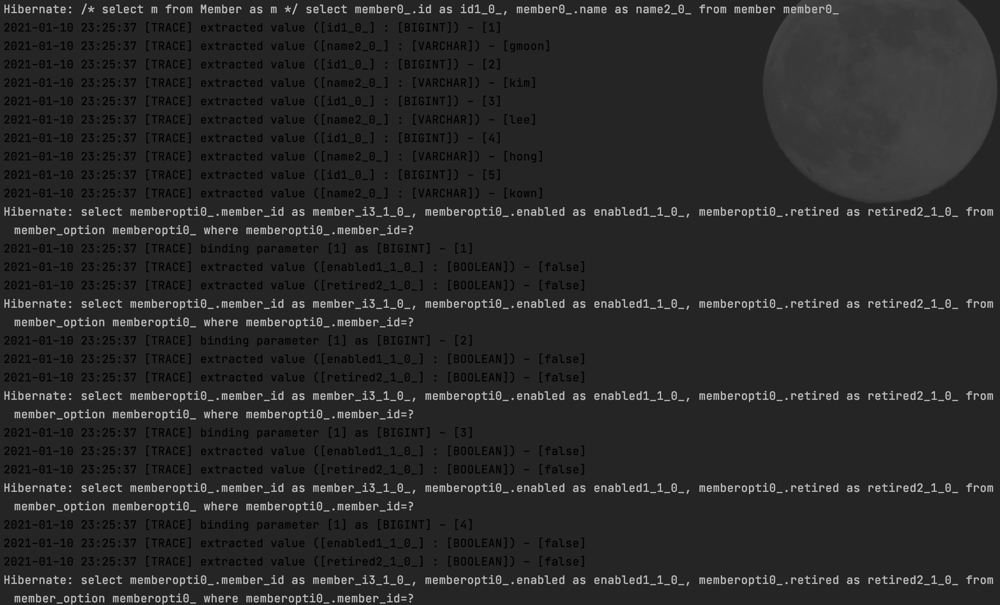
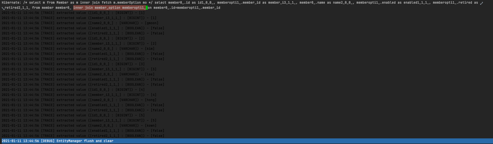
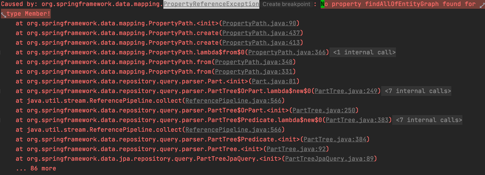
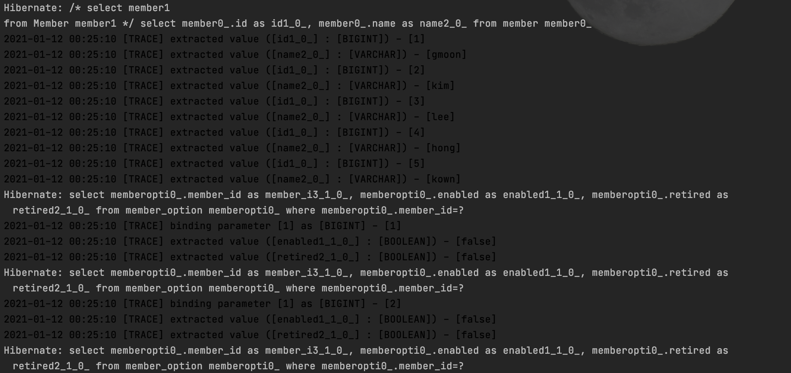

# OneToOne 성능 향상

# 들어가기전

JPA의 ORM 기술은 양날의 칼과 같다.
 
오늘날 ORM 기술은 개발자가 비즈니스 로직에 좀 더 집중할 수 있는 환경을 제공한다. 하지만 어떤 이들은 쿼리를 많이 발생시켜 애플리케이션의 성능 저하를 발생시킨다는 의견이 존재한다. 흔히 N+1 문제다.

 이는 JPA의 동작 방식을 이해한다면, JPA 어노테이션과 다양한 방법을 통해 해결할 수 있다. 필자는 일대일 연관 관계를 통해 JPA의 전반적인 메커니즘과 N+1 문제에 대해 소개하려 한다.

# 학습 목표

1. 글로벌 패치 전략과 Proxy
2. OneToOne과 N+1

----

## 1. @OneToOne 모델링

우선 사용자 - 사용자 옵션의 도메인 모델을 구성해보자.



- 식별 관계
- 대상 테이블에서 외래키 관리

다음 조건을 충족하기 위해선 양방향으로 매핑한다.

> 기본적으로 JPA의 일대일 관계에선 대상 테이블(MemberOption)에서 외래 키를 저장하는 단방향 매핑을 지원하지 않는다. 따라서 대상 테이블에서 외래 키를 관리하는 구조라면 양방향으로 매핑한다.

### 1.1. 사용자 도메인

```java
@Entity
public class Member {
    
    @Id
    @GeneratedValue
    private Long id;
    
    @Column(name = "name")
    private String name;
    
    @OneToOne(mappedBy = "member", cascade = CascadeType.ALL)
    private MemberOption memberOption;
}
```

### 1.2. 사용자 옵션 도메인

```java
@Entity
public class MemberOption {
    
    @Id
    @Column("member_id")
    private Long memberId;
    
    @MapsId
    @OneToOne
    @PrimaryKeyJoinColumn(name = "member_id") // 식별 관계
    private Member member;
    
    @Column(name = "enabled")
    private boolean enabled;
    
    @Column(name = "retired")
    private boolean retired;
}
```
> The PrimaryKeyJoinColumn annotation specifies a primary key column that is used as a foreign key to join to another table. - [Difference between @JoinColumn and @PrimaryKeyJoinColumn](https://stackoverflow.com/questions/3417097/jpa-difference-between-joincolumn-and-primarykeyjoincolumn)

여기까지 도메인 설계는 끝이 났다. 그 다음으로 글로벌 패치 전략을 고민해봐야된다. 기본적으로 양방향 연관관계의 글로벌 패치 전략은 EAGER이다.

|FetchType|장점|단점|
|---|---|---|
|LAZY|1. 빠른 클래스 로드 시간<br/>2. 적은 메모리 소비|1. N+1 : lazily-initialized 될 경우 성능에 영향을 미칠 수 있다.<br/>2. LazyInitializationException : 어떤 경우에는 특별한 주의를 기울여 lazily-initialized 된 개체를 처리해야 하거나 예외가 발생할 수 있다.|
|EAGER|1. lazily-initialized과 관련된 성능 영향 없음|1. 긴 클래스 로드 시간<br/>2. OOM heap : 불필요한 데이터를 너무 많이 메모리에 로드되면 성능에 영향을 미칠 수 있다.|

## 2. 글로벌 패치 전략

글로벌 패치 전략은 연관 관계 어노테이션의 fetch 속성을 통해 정의할 수 있다. Member 도메인에 fetch 옵션을 통해 Lazy 패치 전략을 설정하자.

## 2.1. @OneToOne - Lazy Loading

```java
public class Member {
    // ...
    @OneToOne(mappedBy = "member"
         , cascade = CascadeType.ALL
         , fetch = FetchType.LAZY) // Lazy loading
    private MemberOption memberOption;
 
}
```
 
다음으로 테스트 코드를 통해 Member 도메인을 조회할 때 MemberOption 도메인이 Lazy로 동작되는지 확인해보면 된다. Lazy 여부는 `Hibernate.isInitialized`를 통해 확인해볼 수 있다. 

```java
class MemberRepositoryTest{
    // ...
    @Test
    void testOneToOneLazy() {
        EntityManager em = getEntityManager();
        Member member = em.find(Member.class, 1L);
        MemberOption memberOption = member.getMemberOption();
        log.debug("memberOption class : {}", memberOption.getClass());
        assertEquals(false, Hibernate.isInitialized(memberOption), "isProxyObject");
    }
 
}
```



- MemberOption 클래스가 Proxy가 아니다.
- MemberOption 필드에 접근하지 않았음에도 MemberOption를 조회하는 쿼리가 발생하고 있다.

우선 결과를 보면 Lazy 패치가 정삭적으로 동작되지 않는다. 이 부분은 어플리케이션의 성능 저하를 발생시킬 수 있기에 @OneToOne 관계에서 주의해야될 점이다.

### 2.1.1. Lazy Loading - 객체 그래프 탐색 & Proxy

그렇다면 왜 Lazy 글로벌 패치 설정이 동작되지 않았을까?

JPA에선 객체 그래프 탐색이라는 논리적인 개념이 존재한다. 특정 도메인 객체를 조회할 때 연관 관계를 맺은 각각의 도메인의 글로벌 패치 전략을 판단하다. 이때 Lazy 전략으로 설정된 도메인에 대해선 내부적으로 default 생성자를 통해 Proxy 객체를 생성하고 조회할 도메인 객체는 이 Proxy 객체를 참조하게 된다.

즉 nullable한 도메인에 대해선 Proxy 객체 생성을 보장할 수 없다. 따라서 Lazy 패치 전략이더라도 내부적으로 객체간 참조를 보장하기 위해 쿼리를 발생시켜 연관된 객체에 데이터를 매핑시키는 동작 방식을 취하게 된다.

이를 토대로 앞서 본 테스트 결과를 분석하면 다음과 같다.

- MemberOption 클래스가 Proxy가 아니다.
  - OneToOne 관계에서 null이 허용된 매핑 관계라면 Proxy 객체를 감싸지 않고 내부적으로 객체를 반환한다.
- MemberOption 필드에 접근하지 않았음에도 MemberOption를 조회하는 쿼리가 발생하고 있다.
  - 하이버네이트는 객체 그래프 탐색하는 시점에 Lazy로 판단하여 쿼리 생성시 Member 쿼리만 생성하게 된다. 하지만 MemberOption은 Proxy 객체가 아니기 때문에 MemberOption 쿼리가 발생하여 참조 받을 수 있도록 쿼리를 발생시키게 된다.

### 2.1.2. Lazy Loading - Proxy를 보장하자

결과적으로 Proxy 생성을 보장하기 위해선 non-null 관계가 형성되어야 된다. JPA의 연관관계 관련된 어노테이션에는 `optional`이라는 속성이 존재한다. 다음 속성을 통해 Proxy 생성을 보장하면 된다.

```java
public class Member {
    // ...
    @OneToOne(mappedBy = "member"
         , cascade = CascadeType.ALL
         , fetch = FetchType.LAZY // Lazy loading
         , optional = false) // [1] non-null relationship
    private MemberOption memberOption;
}
```


[1] `optional=false` 속성을 지정해주면 하이버네이트는 내부적으로 MemberOption에 대한 null을 허용하지 않음으로 비로소 lazy loading이 된다.

> OneToOne lazy-loading 조건 : null을 허용하지 않거나 또는 단방향 관계 설정

## 2.2. 반드시 Lazy 패치 설정을 해야되나?

Lazy 패치에 대해 충분한 이해가 있다면 웬만하면 Lazy 패치로 잡는게 좋다. 하지만 예외적으로 비즈니스에 따라 Eager 패치를 고려할 필요가 있다.

예를 들어 `사용자 정보 변경`라는 사용자 인터페이스에 사용자의 이름, 이메일, 핸드폰 번호와 같은 기본적인 정보와 사용자 계정에 대한 활성화/비활성화 할 수 있는 옵션을 제공한다고 하자.

이런 경우엔 Lazy 보단 Eager 패치가 더 바람직할 수 있다. 테스트 코드 결과를 통해 Lazy 패치의 문제점을 살펴보자.

```java
@Test
void testOneToOneLazy() {
    EntityManager em = getEntityManager();
    Member member = em.find(Member.class, 1L);
    MemberOption memberOption = member.getMemberOption();

    // Proxy 확인
    log.debug("memberOption class : {}", memberOption.getClass());
    assertEquals(false, Hibernate.isInitialized(memberOption), "isProxyObject");
    
    member.setName("gmoon"); // [1] 사용자 이름 변경
    log.debug("사용자 이름 변경");
    
    log.debug("option class : {}", memberOption.getClass());
    memberOption.enabled();
    member.setMemberOption(memberOption); // [2] 계정 활성화
    log.debug("계정 활성화");
}
```


1. [1] Member를 조회하는 쿼리가 발생한다.
2. Lazy 패치 동작으로 하이버네이트에 의해 MemberOption은 Proxy 객체로 반환된다.
3. [2] `MemberOption.enabled` 필드에 접근하는 순간 MemberOption 쿼리가 발생한다.

[1] Member 조회 쿼리 1번과 [2] MemberOption에 대한 조회 쿼리 1번 즉 2번의 쿼리가 발생하게 된다. 드디어 N+1 문제에 직면하게 되었다. 

> 참고로 Collection 연관 관계(*ToMany)에선 대상 도메인의 수 만큼 쿼리가 발생한다. 흔히 N+1 문제라 하고 애플리케이션 성능에 치명적이다.

다음 처럼 필수적인 식별 관계의 @OneToOne 글로벌 패치 전략은 LAZY 보단 EAGER로 설정하는게 오히려 바람직할 수 있다.

## 2.3. @OneToOne - Eager Loading

앞서 설명했던 여러 LAZY 패치의 문제점 때문에, JPA의 @OneToOne의 기본 글로벌 패치 전략은 EAGER로 변경했다.

```java
@Entity
public class Member {
    //...
    @OneToOne(mappedBy = "member"
            , cascade = CascadeType.ALL
            , optional = false) // [1] non-null relationship
    private MemberOption memberOption;
}
```



Eager 패치를 통해 Member 도메인을 조회할 때 MemberOption 조인되어 하나의 쿼리만 발생됐다. 하지만 불필요한 객체 참조로 인해 메모리가 많이 차지한다는 단점이 존재한다.

기본적으로 JPA 컨셉은 Proxy 매커니즘을 지향한다. 따라서 초기에 Lazy 패치로 설정하며 도메인 모델링을 하는것을 추천한다.

> [Bealdung - Eager/Lazy Loading In Hibernate](https://www.baeldung.com/hibernate-lazy-eager-loading) - The idea of disabling proxies or lazy loading is considered a bad practice in Hibernate. It can result in a lot of data being fetched from a database and stored in a memory, irrespective of the need for it.


## 3. Spring Data JPA - 편리함은 늘 경계해야 된다.

지금까지 EntityManager를 통해 도메인을 조회하는 방식에 대해 설명했다.

요즘엔 EntityManager를 통해 조회하는 방식이 아닌 Spring Data JPA를 통해 `*Repository`를 통해 객체를 조회하는 방식을 사용하는 경우가 더 많을거라 생각한다.

```java
public interface MemberRepository extends JpaRepository<Member, Long> {
}
```

Spring Data JPA에서 제공하는 findAll 메서드 같은 경우엔 Eager/Lazy 든 N+1 이 발생할 수 있다.

```java
@Test
void testSpringDataJpaFindAll_n_plus_one() {
    memberRepository.findAll();
}
```


findAll 메서드에서 글로벌 패치가 제대로 동작되지 않는 이유는 Spring 내부에서 Criteria를 사용하여 JPQL 쿼리를 생성하게 된다. 이때  findAll 메서드는 대상 엔티티의 모든 필드를 가져오도록 생성하게 된다.  

```java
entityManager.createQuery("select m " 
                          + "from Member as m", Member.class)
                .getResultList();
```
> 참고) @see org.springframework.data.jpa.repository.support.SimpleJpaRepository#getQuery(Specification, Class, Sort)

따라서 엔티티에 지정된 글로벌 패치 설정과 무관하게 필드 값에 값을 채우기 위해 서브 쿼리가 발생하게 된다.

### 4. N+1 해결 방법
### 4.1. JPQL - Fetch Join

JPQL 문법에선 `join fetch` 문법을 사용하여 N+1 문제를 해결할 수 있다.

```java
// JPQL join fetch
em.createQuery("select m "
               + "from Member as m "
               + "inner join fetch m.memberOption mo", Member.class)
        .getResultList();
```


### 4.2. Spring Data JPA - @Query

Spring Data JPA에도 JPQL 문법을 지정하여 동작하게 되도록 @Query 어노테이션을 제공하고 있다.

```java
public interface MemberRepository extends JpaRepository<Member, Long> {
    @Query("select m from Member m inner join fetch m.memberOption mo")
    List<Member> findAllOfQueryAnnotation();
}
```

이처럼 JPQL 페치 조인을 사용하여 필요한 엔티티를 단일 쿼리로 가져올 수 있다. 그러나 페치 조인 같은 경우엔 중복된 쿼리가 발생한다는 단점이 존재한다.

```text
// 1. 이름 조회 - Member만 조회
select m from Member m where m.name = ?
 
// 2. 이름 조회 - MemberOption과 함께 조회
select m from Member m 
join fetch m.memberOption where m.name = ?
 
// 3. 이름 조회 - Team과 함께 조회
select m from Member m 
join fetch m.team where m.name = ? 
```

다음 JPQL 모두 사용자 이름을 조회하지만 상황에 따라 각기 다른 JPQL를 사용해야한다. JPA 2.1에 추가된 엔티티 그래프 기능을 사용한다면 엔티티를 조회하는 시점에 함께 조회할 엔티티를 선택할 수 있다.

### 4.3. @EntityGraph & @NamedEntityGraph

엔티티 그래프란 엔티티 조회시점에 연관된 엔티티들을 함께 조회하는 기능을 의미한다. 

> 참고) hibernate version 5.2 이상 or Spring Data JPA 2.0.0.RELEASE 이상

엔티티 그래프를 사용하게 된다면 root 엔티티만 JPQL로 작성하면 된다.

```text
select m from Member m where m.name = ?
```

엔티티 그래프 종류엔 정적/동작에 따라 2 가지로 분류할 수 있다.

1. @NamedEntityGraph(정적)
2. @EntityGraph(동적)

우선 @NamedEntityGraph 사용법에 대해 설명하겠다.

```java
@Entity
@NamedEntityGraph(name = "Member.withMemberOption"
        , attributeNodes = { @NamedAttributeNode(value = "memberOption") })
public class Member {

//    ...
    
    @OneToOne(mappedBy = "member", cascade = CascadeType.ALL, optional = false, fetch = FetchType.LAZY)
    private MemberOption memberOption;
}
```

@NamedEntityGraph 속성은 다음과 같다.

- name : 엔티티 그래프 이름
- attributeNodes : 함께 조회할 속성

### 4.3.1. EntityManager - @NamedEntityGraph

엔티티 매니저를 통한 조회 방법은 아래 코드와 같다.

```java
EntityManager em = getEntityManager();
EntityGraph graph = em.getEntityGraph("Member.withMemberOption");

// 단일건 조회
Map<String, Object> hints = new HashMap<>();
hints.put("javax.persistence.fetchgraph", graph);
long primaryKey = 1L;
Member member = em.find(Member.class, primaryKey, hints);

Query query = em.createQuery("select m from Member m"
                    + " inner join fetch m.memberOption");
//                      ^-- JPQL은 글로벌 패치를 고려하지 않고 
//                      항상 외부 조인을 사용하기 때문에 inner join fetch 명시한다.
query.setHint("javax.persistence.fetchgraph", graph);
List<Member> list = query.getResultList();
```
> 참고로 `Member -> MemberOption -> ChildEntity` 엔티티 구조에서 Member 엔티티를 조회할 때 MemberOption -> ChildEntity도 엔티티 그래프에 포함하려면 @NamedAttributeNode의 subgraph 속성을 사용하면 된다. 자세한 내용은 본 포스팅에선 다루지 않겠다.

### 4.3.2. EntityManager - @EntityGraph

동적 엔티티 그래프 기능은 다음과 같다.

```java
EntityManager em = getEntityManager();
EntityGraph<Member> graph = em.createEntityGraph(Member.class); // [1]
graph.addAttributeNodes("memberOption"); // [2]

Map<String, Object> hints = new HashMap<>();
hints.put("javax.persistence.fetchgraph", graph);
Member member = em.find(Member.class, 1L, hints);
```

1. EntityManager#createEntityGraph 메서드를 사용하여 동적 엔티티 그래프 생성
2. EntityGraph#addAttributeNodes 메서드를 사용하여 함께 조회할 속성 정의 

### 4.4. Spring Data JPA - @EntityGraph & @NamedEntityGraph

Spring Data JPA에선 다음과 같이 사용할 수 있다.

```java
public interface MemberRepository extends JpaRepository<Member, Long> {
    @EntityGraph(value = "Member.withMemberOption"
               , attributePaths = "memberOption"
               , type = EntityGraph.EntityGraphType.FETCH)
    Member findByName(String name);

    @EntityGraph(value = "Member.withMemberOption")
    @Query("select m from Member m") // [1] 엔티티 root 설정
    List<Member> findAllOfEntityGraph();
}
```
- value : 엔티티 그래프 이름 (`@NamedEntityGraph(name="Member.withMemberOption")`)
- attributePaths : 함께 조회할 속성
- ype : 엔티티 그래프 힌트
    - EntityGraph.EntityGraphType.FETCH (default)
        - javax.persistence.fetchgraph : 엔티티 그래프에서 정의한 속성만 함께 조회
    - EntityGraph.EntityGraphType.LOAD
        - javax.persistence.loadgraph : 엔티티 그래프에서 정의한 속성 + EAGER 패치로 설정된 연관관계도 포함

엔티티 그래프는 항상 조회하는 엔티티의 ROOT에서 시작해야 한다. 이점은 Spring Data JPA에서 엔티티 그래프 기능을 사용할 때 유의해야 한다.

Spring Data JPA는 내부적으로 result type이 단일 엔티티인 경우에만 ROOT 엔티티를 추적할 수 있고, 추적된 ROOT 엔티티 기준으로 엔티티 그래프 기능을 적용해준다. Collection과 같은 result type에선 ROOT 엔티티를 추적할 수 없기 때문에 [1] @Query 어노테이션을 사용하여 ROOT 엔티티를 지정해줘야 한다. 




> 참고) Spring Data JPA에선 @Fetch 모드를 무시한다. 이와 관련된 내용은 아래 링크를 참고하자. <br/>
> I think that Spring Data ignores the FetchMode. I always use the @NamedEntityGraph and @EntityGraph annotations when working with Spring Data JPA... - [stackoverflow - How does the FetchMode work in Spring Data JPA](https://stackoverflow.com/questions/29602386/how-does-the-fetchmode-work-in-spring-data-jpa)

### 4.5. QueryDsl - fetchJoin

마지막으로 QueryDsl에서 fetchJoin에 대해 설명하도록 하겠다.

```java
public class MemberRepositoryImpl implements MemberRepositoryCustom {

    public List<Member> getList() {
        QMember qMember = QMember.member;
        return jpaQueryFactory.select(qMember)
                .from(qMember)
                .fetch();
    }
}
```


다음 코드에서도 마찬가지로 N+1 문제가 발생한다. 이러한 이유엔 QueryDsl은 SQL, JPQL을 코드로 작성할 수 있도록 도와주는 빌더 API이기 때문이다.

### 4.5.1. QueryDsl - @QueryProjection

projection을 사용하여 필요한 부분만 가져온다.

````java
@Override
public List<MemberVO.Data> findAllOfQueryDslWithProjection() {
    QMember qMember = QMember.member;

    return jpaQueryFactory
            .select(new QMemberVO_Data(qMember.id, qMember.name))
            .from(qMember)
            .fetch();
}
````


----------------------------

## 마무리

정리하자면 LAZY 패치는 메모리 성능과 특정 도메인을 조회시 불필요한 컬럼이 포함하지 않기 때문에 비즈니스를 파악하기 수월하다는 장점이 존재하지만, 자칫 잘못 사용하는 경우   LazyInitializationException 와 N+1 문제를 직면하여 오히려 성능상의 이슈가 발생할 수 있다.

## TODO

- fetch join - pageable with
  - [bottom-to-top-blog - fetch join 과 limit 을 같이 쓸 때 주의하자.](https://bottom-to-top.tistory.com/45)

## 참고 

- [Baeldung - JPA OneToOne](https://www.baeldung.com/jpa-one-to-one)
- [Baeldung - EAGER/LAZY Loading In Hibernate](https://www.baeldung.com/hibernate-LAZY-EAGER-loading)
- [Spring Data JPA DOC - Entity Graph](https://docs.spring.io/spring-data/data-jpa/docs/current/reference/html/#jpa.entity-graph)
- [Spring Data JPA DOC - Custom Implementations for Spring Data Repositories](https://docs.spring.io/spring-data/data-jpa/docs/current/reference/html/#repositories.custom-implementations)
- [QueryDsl - Reference](http://www.querydsl.com/static/querydsl/4.4.0/reference/html_single/)
- [QueryDsl - JPAQueryBase](http://www.querydsl.com/static/querydsl/4.0.4/apidocs/com/querydsl/jpa/JPAQueryBase.html)
- [Hibernate5 - User Giude](https://docs.jboss.org/hibernate/orm/5.2/userguide/html_single/Hibernate_User_Guide.html)
- [Hibernate5 - Reference](https://docs.jboss.org/hibernate/stable/orm/javadocs/)
- [Hibernate3 - QueryHql](https://docs.jboss.org/hibernate/core/3.3/reference/en/html/queryhql.html)
- [Wiki - JPA OneToOne](https://kwonnam.pe.kr/wiki/java/jpa/one-to-one)
- [Wiki - Primary Keys through OneToOne and ManyToOne Relationships](https://en.wikibooks.org/wiki/Java_Persistence/Identity_and_Sequencing#Primary_Keys_through_OneToOne_and_ManyToOne_Relationships)
- [blog - Difference between @JoinColumn and @PrimaryKeyJoinColumn](https://thorben-janssen.com/hibernate-tip-difference-between-joincolumn-and-primarykeyjoincolumn/)
