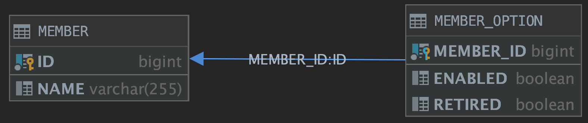

# OneToOne 성능 향상

# 학습 목표

1. 글로벌 패치 전략과 Proxy
2. N+1

# 들어가기전

JPA의 ORM 기술은 양날의 칼과 같다.
 
오늘날 ORM 기술은 개발자가 비즈니스 로직에 좀 더 집중할 수 있는 환경을 제공한다. 하지만 어떤 이들은 쿼리를 많이 발생시켜 애플리케이션의 성능 저하를 발생시킨다는 의견이 존재한다.

흔히 N+1 문제다. 이는 JPA에서 지원하는 애노테이션들을 통해 어느 정도 해소할 수 있다. 필자는 일대일 연관 관계를 통해 JPA의 전반적인 메커니즘과 N+1 에 대해 소개하려 한다.

----

## 1. @OneToOne 모델링

우선 다음 조건을 충족하는 사용자 - 사용자 옵션의 도메인 모델을 구성해보자.



- 식별 관계
- 대상 테이블에서 외래키 관리

대상 테이블에서 외래 키를 관리하기 때문에 양방향으로 맵핑한다.

> 기본적으로 JPA에선 대상 테이블(MemberOption)에 외래 키를 저장하는 단방향 일대일 관계는 지원하지 않는다.

### 1.1. 사용자 도메인

```java
@Entity
public class Member {
    
 @Id
 @GeneratedValue
 private Long id;

 @Column(name = "name")
 private String name;
 
 @OneToOne(mappedBy = "member"
         , fetch = FetchType.LAZY
         , cascade = CascadeType.ALL)
 private MemberOption memberOption;
}
```

### 1.2. 사용자 옵션 도메인

```java
@Entity
public class MemberOption {

 @Id
 @Column("member_id")
 private Long memberId;

 @MapsId
 @OneToOne
 @JoinColumn(name = "member_id")
 private Member member;
 
 @Column(name = "enabled")
 private boolean enabled;

 @Column(name = "retired")
 private boolean retired;
}
```

- fetch = FetchType.LAZY
- fetch = FetchType.EAGER

그 다음으로 글로벌 패치 전략을 선택해야 되는데 JPA에선 즉시 로딩(EAGER) 또는 지연 로딩(LAZY)으로 연관 관계를 맺을지 선택해야 한다.

## 2. 글로벌 패치 전략 - LAZY Loading

먼저 지연 로딩 글로벌 패치 전략을 설정하여, Member를 조회해보자.

```java
@Test
void testOneToOne() {
    EntityManager em = getEntityManager();
    em.find(Member.class, 1L);
}
```


우선 결과를 보면 MemberOption 글로벌 패치 전략을 LAZY로 설정했음에도 Member를 조회할 때, MemberOption을 조회하는 쿼리가 발생하게 된다. 이 부분은 성능 저하를 발생시킬 수 있다. 순수 사용자의 정보를 수정하려 Member 도메인을 조회할 때도 MemberOption를 조회하는 쿼리가 발생하기 때문이다. 

### 2.1. LAZY Loading - Proxy

그렇다면 왜 지연 로딩 글로벌 패치 설정이 동작되지 않았을까?

이러한 이유엔 지연 로딩에 대한 메커니즘에 대한 이해가 필요하다. JPA에선 객체 그래프 탐색이라는 논리적인 개념이 존재한다. 특정 도메인 객체를 조회할 때 연관 관계를 맺은 각각의 도메인의 글로벌 패치를 판단하고, 만약 지연 로딩으로 설정된 도메인에 대해선 내부적으로 default 생성자를 통해 프록시 객체를 생성하고 조회할 도메인 객체는 이 프록시 객체를 참조하게 된다.

따라서 null이 허용된 도메인에 대해선 프록시 객체 생성을 보장할 수 없으므로, LAZY 패치 전략이더라도 내부적으로 EAGER 패치 전략으로 판단하여 동작하게 된다.

### 2.2. LAZY Loading - @OneToOne(optional=false)

@OneToOne 애노테이션에는 `optional`이라는 속성이 존재한다.

```java
public class Member {
    //... 
    @OneToOne(mappedBy = "member"
            , fetch = FetchType.LAZY
            , cascade = CascadeType.ALL
            , optional = false) // [1]
    private MemberOption memberOption;
}
```

[1] 다음과 같이 `optional=false` 속성을 지정해줌으로써 프록시 객체 생성을 보장하게 되고 비로소 LAZY 패치가 정상적으로 동작함을 확인할 수 있다. 

> OneToOne LAZY Loading 조건 : null을 허용하지 않거나 또는 단방향 관계 설정
> [stackoverflow - one to one mapping using primary key join column](https://stackoverflow.com/questions/31119700/one-to-one-mapping-using-primary-key-join-column)

### 2.3. OneToOne에선 LAZY가 바람직할까?

하지만 지연 로딩으로 설정했다고 해서 N+1를 해결했다고 속단하기 이르다.

예를 들어, 사용자 인터페이스에 사용자의 이름, 이메일, 핸드폰 번호와 같은 기본적인 정보와 사용자 계정에 대한 활성화/비활성화 할 수 있는 옵션을 제공한다고 가정해보자.

```java
@Test
void testAccountEnabled() {
    EntityManager em = getEntityManager();
    Member member = em.find(Member.class, 1L); // [1] 계정 조회
    log.info("계정 조회");
    member.changeMemberInfo("web1_gmoon");
    log.info("계정 이름 변경");

    MemberOption option = member.getMemberOption(); // [2] 옵션 조회
    option.enabled(); // [2-1] 계정 활성화
    member.setMemberOption(option);
    log.info("계정 활성화");
}
```

1. 사용자 계정을 조회하는 쿼리가 발생한다.
2. LAZY 글로벌 패치로 인해 프록시 객체에서 해당 필드에 접근하는 순간 사용자 옵션 쿼리가 발생한다.


Member 조회 쿼리 1번과 MemberOption에 대한 조회 쿼리 1번 즉 2번의 쿼리가 발생하게 된다. 드디어 N+1 문제에 직면하게 되었다. 따라서 식별 관계의 OneToOne 맵핑에선 글로벌 패치 전략을 LAZY 보단 EAGER로 설정하는게 오히려 바람직할 수 있다.
 
> 참고로 하이버네이트에서 제공하는 @Fetch(org.hibernate.annotations.Fetch) 애노테이션으로 OneToOne 연관관계의 LAZY 패치 전략을 선택했더라도 EAGER 패치 전략 방식으로 동작하게 된다. 

### 2.3. OneToOne - 즉시 로딩(EAGER Loading)

앞서 설명했던 여러 LAZY 패치의 문제점 때문에, JPA의 @OneToOne의 기본 글로벌 패치 전략은 EAGER로 변경했다.

```java
@Entity
public class Member {
    //...
    @OneToOne(mappedBy = "member"
            , cascade = CascadeType.ALL
            , optional = false)
    private MemberOption memberOption;
}

@Test
void testEAGER(){
    EntityManager em = getEntityManager();
    em.find(Member.class, 1L);
}
```


쿼리에 조인이되어 하나의 쿼리만 발생됐음을 알 수 있다. 하지만 EAGER 패치의 장점은 하나의 쿼리로 참조를 할 수 있다는 장점이 있지만, 불필요한 객체 참조로 인해 메모리가 많이 차지한다는 단점이 존재한다.

> The idea of disabling proxies or LAZY loading is considered a bad practice in Hibernate. It can result in a lot of data being fetched from a database and stored in a memory, irrespective of the need for it.

|fetch|장점|단점|
|---|---|---|
|LAZY|1. 다른 접근 방식보다 훨씬 적은 초기로드 시간<br/><br/>2. 다른 접근 방식보다 적은 메모리 소비|1.지연된 초기화는 원하지 않는 순간에 성능에 영향을 미칠 수 있습니다.<br/><br/>2.어떤 경우에는 특별한주의를 기울여 느리게 초기화 된 개체를 처리해야하거나 예외가 발생할 수 있습니다.|
|EAGER|지연된 초기화 관련 성능 영향 없음|1. 긴 초기 로딩 시간<br/><br/>2. 불필요한 데이터를 너무 많이 로드하면 성능에 영향을 미칠 수 있습니다.|

### 3. JPQL - N+1 문제

하지만 우리는 N+1 문제에 대해 이제 해결해야 될 문제가 많다.

### 1. QueryDsl - fetchJoin

단일 쿼리를 발생하진 않고, LAZY 패치 전략으로 설정된 필드 값을 즉시 사용할 수 있다.

>If you are using property-level LAZY fetching (with bytecode instrumentation), it is possible to force Hibernate to fetch the LAZY properties in the first query immediately using fetch all properties.
>[Hibernate reference](https://docs.jboss.org/hibernate/core/3.3/reference/en/html/queryhql.html)
   
- [Fetch All Properties not working](https://forum.hibernate.org/viewtopic.php?p=2249643)

 2. @OneToMany fetchJoin과 pagination을 같이 사용되면 발생되는 문제점
 https://bottom-to-top.tistory.com/45
 

### 3. @Query


### 4. Spring Data JPA - @EntityGraph & @NamedEntityGraph

1. @Fetch
2. @EntityGraph

> I think that Spring Data ignores the FetchMode. I always use the @NamedEntityGraph and @EntityGraph annotations when working with Spring Data JPA...

- [Spring DOC - Entity Graph](https://docs.spring.io/spring-data/data-jpa/docs/current/reference/html/#jpa.entity-graph)
- [stackoverflow - How does the FetchMode work in Spring Data JPA](https://stackoverflow.com/questions/29602386/how-does-the-fetchmode-work-in-spring-data-jpa)
 
----------------------------

# 주의 사항

- fetch join - pageable with
- EAGER - 메모리
- LAZY - N+1

## TODO

fetchJoin의 문제점

- @OneToMany fetchJoin과 pagination을 같이 사용되면 발생되는 문제점 : [참고 링크](https://bottom-to-top.tistory.com/45)

## 참고 

- [Hibernate-QueryHql](https://docs.jboss.org/hibernate/core/3.3/reference/en/html/queryhql.html)
- [QueryDsl - JPAQueryBase](http://www.querydsl.com/static/querydsl/4.0.4/apidocs/com/querydsl/jpa/JPAQueryBase.html)
- [Baeldung - JPA OneToOne](https://www.baeldung.com/jpa-one-to-one)
- [Baeldung - EAGER/LAZY Loading In Hibernate](https://www.baeldung.com/hibernate-LAZY-EAGER-loading)
- [Wiki - JPA OneToOne](https://kwonnam.pe.kr/wiki/java/jpa/one-to-one)
- [Wiki - Primary Keys through OneToOne and ManyToOne Relationships](https://en.wikibooks.org/wiki/Java_Persistence/Identity_and_Sequencing#Primary_Keys_through_OneToOne_and_ManyToOne_Relationships)
- [Difference between @JoinColumn and @PrimaryKeyJoinColumn](https://thorben-janssen.com/hibernate-tip-difference-between-joincolumn-and-primarykeyjoincolumn/)
