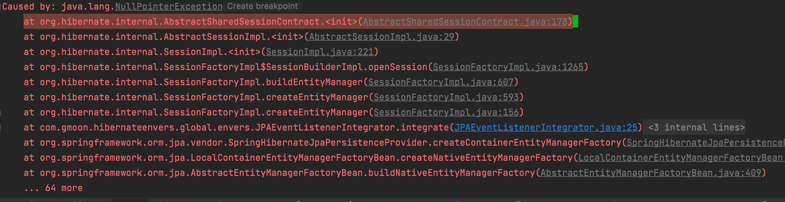

# java.lang.NullPointerException



```java
@Slf4j
public class JPAEventListenerIntegrator implements Integrator {

  @Override
  public void integrate(Metadata metadata,
                        SessionFactoryImplementor sessionFactory,
                        SessionFactoryServiceRegistry serviceRegistry) {
    final EventListenerRegistry listenerRegistry = serviceRegistry.getService(EventListenerRegistry.class);
    EntityManager em = sessionFactory.createEntityManager();
    listenerRegistry.appendListeners(EventType.POST_COMMIT_INSERT, new RevisionHistoryEventListener(em));
  }

  @Override
  public void disintegrate(SessionFactoryImplementor sessionFactoryImplementor, SessionFactoryServiceRegistry sessionFactoryServiceRegistry) {
  }
}
```

```text
sessionFactoryImplementor.createEntityManager();
```

## hibernate version

## 5.4.27.Final -> 5.4.4.Final

Spring boot version 2.4.2 에선 내부적으로 하이버네이트 5.4.27 버전 사용

```xml

<hibernate.version>5.4.27.Final</hibernate.version>
```

하이버네이트 EntityManager는 Session을 이용해서 생성하게 된다.

이 Session을 생성하기 위해 하이버네이트 core에선 SessionFactory 를 통해 내부적으로 생성하게 되는데

5.4.27 버전에선 AbstractSharedSessionContract 를 사용하여 Session 를 생성하기 위한 정보를
fastSessionServices 를 통해 받아 오게 되는데 fastSessionServices 가 Null 이기 때문에
NullPointException 이 발생하게 되었다.

fastSessionServices는 Session 를 생성하기 위한 정보들을 캐싱하여 데이터를 좀더 빠르게 생성하기 위해 추가된 클래스인데,
구성이 잘못되었는지 받아 올 수 없었다.

```java
package org.hibernate.internal;

public abstract class AbstractSharedSessionContract implements SharedSessionContractImplementor {
  private transient SessionEventListenerManagerImpl sessionEventsManager;
  protected transient FastSessionServices fastSessionServices;
  private transient SessionEventListenerManagerImpl sessionEventsManager;

  // ... 생략
  public AbstractSharedSessionContract(SessionFactoryImpl factory, SessionCreationOptions options) {
    // ... 생략
    if (customSessionEventListener == null) {
      sessionEventsManager = new SessionEventListenerManagerImpl(fastSessionServices.defaultSessionEventListeners.buildBaseline());
    }
  }

  // ... 생략
}
```

5.4.4.Final 버전에선 fastSessionServices 를 사용하지 않고 직접 Session을 생성함으로 하이버네이트 코어 버전을
내려 문제를 해결했다.

# 참고

- https://docs.jboss.org/hibernate/orm/5.2/integrationguide/html_single/Hibernate_Integration_Guide.html
