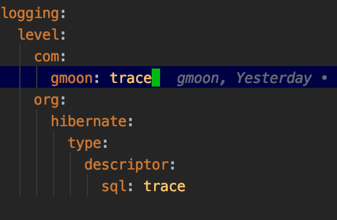
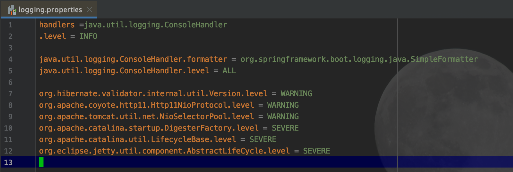
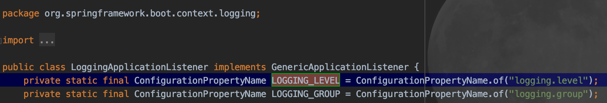
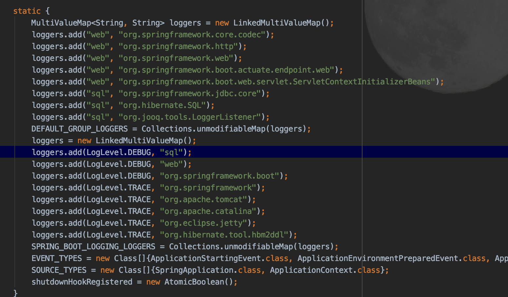

# Spring Boot Project Config

- Spring Boot 2.4.1 ver

## SLF4J log.debug() not work




```
# Application Global Config
logging.level.root=info
```

1. ERROR
2. WARN
3. INFO
4. DEBUG
5. TRACE

## logging.properties
## org.springframework.boot.logging.logging.properties



### LoggingApplicationListener.class




---

## TODO

- slf4j 사용, 구현은 log4j2 고려
    - [https://www.baeldung.com/spring-boot-testing-log-level](https://www.baeldung.com/spring-boot-testing-log-level)
    - [https://goddaehee.tistory.com/206](https://goddaehee.tistory.com/206)
