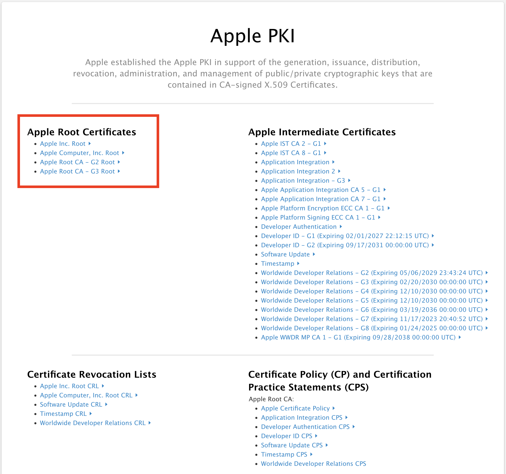

# App Store

## 앱스토어 서버 API 및 서명된 데이터 검증 개요

이 영상은 앱스토어 서버 API와 관련된 주요 개념, 특히 **서명된 데이터(Signed Data)** 검증 및 **App Store Server API**를 활용하는 방법을 다룬다. 여기서는 보안, 데이터 검증, API 마이그레이션 등의 주제를 다루며, **App Store Server Library**를 사용해 개발자들이 더 안전하고 효율적인 방법으로 서버 측 검증을 수행하는 방법을 보여준다.

## 1. [App Store APIs](https://developer.apple.com/documentation/appstoreserverapi)


- JWT creation App Store Server API
    - JWT 생성 간소화
    - App Store Server API가 제공하는 수십 가지의 엔드포인트 사용
- Verify JWS signed data
    - JWS 서명 데이터 검증
    - 트랜잭션과 서버 알림을 반드시 Apple이 생성하고 서명하도록 보증
- Extract receipt transaction ID
    - 영수증 추출 트랜잭션 유틸리티
    - 앱 영수증에서 트랜잭션 식별자 추출
    - verifyReceipt 엔드포인트를 쓰는 부담을 덜고, App Store Server API로 데이터를 옮겨 구입을 검증하고 추가적인 기능을 제공
    - 레거시 버전 데이터를 최신 버전으로 마이그레이션 기능 지원
- Create promotional offer signatures
    - 구독 프로모션 특가 시그니처를 생성하는 유틸리티
    - 앱 내 구입 프리이빗 키를 이용해, 프로모션 특가에 서명하고 생성.

[참고 Meet the App Store Server Library](https://developer.apple.com/videos/play/wwdc2023/10143/)

## 2. 서명된 데이터(Signed Data)

1. [인증서 체이닝 검증](#32-인증서-체인-검증)
2. [JWS 데이터 서명 검증](#33-jws-서명-검증)
3. [애플리케이션 및 환경 확인](#34-애플리케이션-및-환경-확인)

### 2.1 서명된 데이터란?

- **서명된 데이터**는 **JWS (JSON Web Signature)** 포맷으로, 앱스토어에서 앱 구매, 인앱 구매, 고객 이벤트 및 구독 상태 등의 정보를 포함한다.
- **주요 서명된 데이터 종류**:
    - **JWS Transaction**: 구매 내역, 인앱 구매 내역을 포함
    - **JWS Renewal Info**: 구독 갱신 관련 정보
    - **App Store Server Notifications V2**: 알림 자체도 서명된 데이터이며, JWS Transaction 및 Renewal Info를 포함할 수 있다.

### 2.2 서명된 데이터 검증의 필요성

- 데이터가 **앱스토어 서버에서 생성 및 서명**된 것임을 보장한다.
- **보안 강화를 위한 필수 절차**:
    - 앱에서 콘텐츠를 제공하거나 잠금 해제할 때
    - 서버가 앱에서 받은 서명된 데이터를 받을 때
    - App Store Server API의 응답을 받을 때

## 3. 서명된 데이터 검증 절차
### 3.1 서명된 데이터의 기본 구조

```json
{
  "alg": "ES256",
  "x5c":[
    "MII...", # leaf CA
    "MII...", # middle CA
    "MII..." # root CA
  ]
}
```

- 헤더(Header)
  1. alg: 서명에 사용된 알고리즘(ES256)
  2. x5c: Apple의 인증서 배열(x5c)
     - 인증서 체인
     - JWS를 서명한 예상되는 공개키를 산출하는 데 사용

### 3.2 인증서 체인 검증

- 인증서 체인의 각 인증서가 올바르게 서명되었는지 확인한다.
- **온라인 인증서 상태 프로토콜(OCSP)** 을 사용해 인증서가 폐기되지 않았는지 확인한다.
- 각 인증서가 **App Store 데이터 서명** 용도로 유효한지 확인한다.


- Leaf 인증서
  - 인증서의 공개키로 JWS 서명한다.
  - 실제로 데이터를 서명한 공개키가 포함
- Intermediate 인증서
  - `Apple Worldwide Developer Relations`의 중간 인증서 OID를 확인
- 루트 인증서 
  - Apple의 신뢰할 수 있는 루트 인증서
    - leaf 인증서의 출처가 Apple 임을 증명하기 위한 인증서
  - 어느 Apple 기관에서 이 인증서 체인을 생성했는지 확인 가능

```text
# 결제 영수증 데이터 서명 예시
1. Leaf CA
Mac App Store 영수증 서명을 위한 **객체 식별자(OID)** 가 있는지 확인.
 -> 데이터 목적 확인

2. Middle CA
Apple Worldwide Developer Relations 의 중간 인증 기관 OID를 확인

3. Root CA
Apple의 신뢰할 수 있는 루트 인증서인지 검증 
```

### 3.3 JWS 서명 검증

인증서 검증 이후엔 JWS가 리프 인증서의 공개 키로 서명됐는지 확인 절차가 필요하다.


1. Leaf 인증서의 **공개 키**를 추출한다.
2. 추출한 공개 키를 사용해 원본 JWS 서명을 검증한다.
   - 서명된 데이터를 **공개 키**로 검증하여 데이터가 변경되지 않았음을 확인한다.
3. 서명된 걸 확인 후 페이로드를 디코딩한다.

### 3.4 애플리케이션 및 환경 확인

마지막으로 요청한 서명된 데이터가 올바른 앱과 환경을 대상으로 하는지 검증해야 한다.

> 이전 단계인 `인증서 체인 검증`, `JWS 서명 검증`은 App Store에서 응답한 데이터를 검증하는 단계이다.

```json
// decoded App Store Server Notification
{
  "notificationType": "TEST",
  "notificationUUID": "f751ee64-0b35-4135b2c7-2a71d4e20333",
  "data": {
    "appAppleId": 6448401697,
    "bundleId": "com.example",
    "environmnet": "Production"
  },
  "version": "2.0",
  "signedDate": 1681326368753
}
```

- `appAppleId`, `bundleId`, `environment`를 통해 앱을 식별한다.
- 알림의 환경(environment)이 예상하는 환경과 일치하는지 확인한다.

## 4. App Store Server API로의 마이그레이션

### 4.1 verifyReceipt API 중단 예정


- **verifyReceipt** 엔드포인트는 더 이상 사용되지 않으며, **App Store Server API**로의 마이그레이션이 권장된다.
- **App Store Server API**는:
    - **구매 검증** 및 **고객 지원** 관련 유용한 엔드포인트를 제공한다.
    - 서명된 데이터(JWS)를 사용하여 **신뢰할 수 있는 서버 측 검증**을 처리한다.

### 4.2 마이그레이션 단계

- **App Receipt**에서 **거래 ID(transaction ID)**를 추출하여 **Get Transaction History** 엔드포인트에 전달한다.
- `originalTransactionId` 외에도 모든 거래 ID를 지원하여 더 많은 유연성을 제공한다.

## [5. App Store Server Library 사용법](https://github.com/apple/app-store-server-library-java)

### 5.1 SignedDataVerifier 클래스 활용

```java
/**
 * 
 * @link <a href="https://github.com/apple/app-store-server-library-java">app store server library java</a>
 * **/
public class ExampleMigration {
    public static void main(String[] args) throws Exception {
        String issuerId = "99b16628-15e4-4668-972b-eeff55eeff55";
        String keyId = "ABCDEFGHIJ";
        String bundleId = "com.example";
        Path filePath = Path.of("/path/to/key/SubscriptionKey_ABCDEFGHIJ.p8");
        String encodedKey = Files.readString(filePath);
        Environment environment = Environment.SANDBOX;

        AppStoreServerAPIClient client =
                new AppStoreServerAPIClient(encodedKey, keyId, issuerId, bundleId, environment);

        String appReceipt = "MI...";
        ReceiptUtility receiptUtil = new ReceiptUtility();
        String transactionId = receiptUtil.extractTransactionIdFromAppReceipt(appReceipt);
        if (transactionId != null) {
            TransactionHistoryRequest request = new TransactionHistoryRequest()
                    .sort(TransactionHistoryRequest.Order.ASCENDING)
                    .revoked(false)
                    .productTypes(List.of(TransactionHistoryRequest.ProductType.AUTO_RENEWABLE));
            HistoryResponse response = null;
            List<String> transactions = new LinkedList<>();
            do {
                String revision = response != null ? response.getRevision() : null;
                response = client.getTransactionHistory(transactionId, revision, request, GetTransactionHistoryVersion.V2);
                transactions.addAll(response.getSignedTransactions());
            } while (response.getHasMore());
            System.out.println(transactions);
        }
    }
}
```

- `SignedDataVerifier` 클래스를 사용해 서명된 데이터를 쉽게 검증할 수 있다.
- Apple의 루트 인증서 목록, 앱의 `AppleId`, 온라인 인증서 체크 여부를 입력값으로 사용한다.
- 서명된 데이터를 받은 후 **서명 검증**, **앱 및 환경 검증**을 자동으로 수행한다.

### 5.2 서버 측 앱 영수증 검증

- **앱 영수증(App Receipt)**을 받아 **거래 ID**를 추출한 뒤, **Get Transaction History** 엔드포인트를 사용하여 거래 내역을 확인한다.
- **컨슈머블(소모성)** 제품만 필터링하고, 취소된 거래는 제외하여 최신 거래 목록을 얻을 수 있다.

## 6. Best Practices & 권장 사항

- In-app purchase private keys를 안전하게 저장한다.
- 개발 시 sandbox 환경을 활용한다.
- Apple 루트 CA가 주기적으로 업데이트되는지 확인한다.

### 6.1 인증서 관리

- **서버 측, 클라이언트 측**에서 인증서를 하드코딩하지 말고 항상 **유효성 검증**을 수행한다.
- 인증서의 **만료** 및 **폐기** 상태를 주기적으로 확인한다.

### 6.2 App Store Server API의 중요성

- **verifyReceipt**의 폐지에 따라 **App Store Server API**로의 전환은 장기적인 안정성을 위해 필수이다.
- **서명된 데이터**를 사용하는 방식으로의 전환은 보안성과 데이터 정확성을 높인다.

## Settings

```xml
<dependency>
    <groupId>com.apple.itunes.storekit</groupId>
    <artifactId>app-store-server-library</artifactId>
    <version>3.2.0</version>
</dependency>
```
### Apple Root Certificates

[Apple PKI](https://www.apple.com/certificateauthority/)에서 루트 인증서를 다운로드한다.



- Apple Inc. Root
- Apple Computer, Inc. Root
- Apple Root CA - G2 Root
- Apple Root CA - G3 Root

# Reference

- [Meet the App Store Server Library](https://developer.apple.com/videos/play/wwdc2023/10143/)
- [github - app store server library java](https://github.com/apple/app-store-server-library-java)
