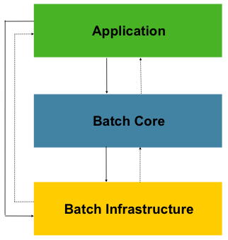

# Spring Batch

## 배치 처리(Batch Processing) 

배치 처리는 대량의 데이터를 일괄적으로 처리하는 방법이다.

예를 들어, 하루 동안 발생한 거래 데이터를 밤에 한 번에 처리하거나, 주기적으로 시스템 상태를 점검하고 보고서를 생성하는 작업이 배치 처리에 해당한다.

**실시간 처리와 달리, 특정 시간이나 트리거에 의해 대량의 작업을 한 번에 처리하는 것이 핵심이다.**

```text
# 배치 처리 시나리오
1. 은행에서 하루 동안 발생한 거래 "데이터 저장"
2. 트래픽이 적은 특정 시간대에 스케줄링된 작업을 통해 "데이터 가공"
    2-1 사용자 거래 데이터를 분석
    2-2 분석한 데이터를 기반으로 보고서 파일 생성
3. 대규모 파일을 주기적으로 읽어서 데이터베이스에 "다시 저장"
```

## Spring Batch

스프링 배치는 스프링 프레임워크를 기반으로 대량의 데이터를 효율적으로 처리할 수 있도록 제공되는 오픈 소스 배치 처리 프레임워크다. 복잡한 배치 작업을 쉽게 구성하고 실행할 수 있도록 다양한 기능을 제공한다.

스프링 배치는 세 가지 주요 계층으로 구성된 구조를 가지고 있다.



- Application
    - 이 계층은 스프링 배치를 사용하는 개발자가 작성하는 배치 `Job`과 관련된 모든 커스텀 코드를 포함한다.
    - 개발자는 이 계층에서 자신의 비즈니스 로직에 맞게 배치 작업을 정의하고 설정한다.
    - 예를 들어, 특정 데이터를 읽어서 처리하고 저장하는 `Job`을 작성할 때 이 계층에서 코드를 작성한다.
- Batch Core
    - 이 계층은 스프링 배치의 핵심 런타임 클래스를 포함하여 `Job`을 실행하고 제어하는 데 필요한 모든 핵심 기능을 제공한다.
    - 이 계층에는 `JobLauncher`, `Job`, `Step`의 구현체가 포함된다.
    - `JobLauncher`는 배치 작업을 시작하는 역할을 하며, `Job`과 `Step`은 배치 작업의 구성 요소와 흐름을 정의한다.
- Infrastructure
    - 이 계층은 공통적으로 사용되는 `reader`와 `writer`와 같은 구성 요소, 그리고 다양한 서비스(예: `RetryTemplate`)를 포함한다.
    - `ItemReader`, `ItemWriter`와 같은 구성 요소는 어플리케이션 개발자가 사용할 수 있으며, 코어 프레임워크 자체에서도 활용된다.
    - 예를 들어, `RetryTemplate`은 배치 작업이 실패했을 때 자동으로 재시도하는 기능을 제공한다.

각 계층은 공통 **Infrastructure** 위에서 빌드된다.

- **Application** 계층은 비즈니스 로직과 배치 작업을 정의하며, 이 과정에서 **Infrastructure**의 기능을 사용한다. **Application**은 **Batch Core**와 **Infrastructure**를 활용하여 배치 작업을 구성하고 실행한다.
- **Batch Core**는 스프링 배치의 핵심 기능을 제공하며, 이 기능은 **Infrastructure**에서 제공되는 공통 기능들을 활용하여 동작한다. 즉, **Batch Core**는 **Infrastructure**의 기능을 통해 배치 작업을 처리한다.

결과적으로, **Application**과 **Batch Core**는 모두 **Infrastructure**의 기능을 활용하여 개발된다. 이로 인해 스프링 배치의 모든 구성 요소가 공통된 **Infrastructure** 위에서 효과적으로 작동하게 된다.

### 주요 기능

- **반복 작업 처리**: 주기적으로 반복되는 대규모 작업을 자동화
- **대량 데이터 처리**: 대규모 파일 읽기/쓰기, 대량 데이터베이스 처리 등을 쉽게 처리할 수 있는 API 제공
- **트랜잭션 관리**: Step 단위로 트랜잭션을 관리하며, 실패 시 자동으로 롤백하거나 재시도할 수 있는 기능 제공
- **오류 처리 및 검증**: 작업 실패 시 자동으로 오류를 기록하고 재시도, 또는 재시작을 지원
- **병렬 처리**: Chunk 기반 병렬 처리를 지원하여 대규모 데이터를 빠르게 처리할 수 있음
- **부분 처리**: 레코드를 건너뛰는 기능 등을 제공해 오류 발생 시 유연한 처리 가능

## 구성 요소

스프링 배치는 **Job**과 **Step**이라는 두 가지 주요 구성 요소로 나뉜다.

### Job

`Job`은 배치 처리의 전체 흐름을 정의하는 단위로써, 하나의 배치 작업을 의미한다.

예를 들어, "파일 읽기 -> 데이터 처리 -> 데이터베이스에 저장"과 같은 전체 배치 흐름이 하나의 Job으로 구성될 수 있다. 

`Job`은 **여러 개의 Step**으로 구성되며, 각 `Step`은 하나의 작업 단위를 의미한다.

### Step

`Step`은 Job을 구성하는 하나의 단위로, 데이터 처리 단계를 나타낸다.

각 Step은 데이터의 읽기, 처리, 쓰기를 담당하는 특정 작업을 수행한다. Step은 다음과 같은 주요 구성 요소로 이루어진다.

- **ItemReader**: 데이터를 읽어오는 역할 (예: 파일, 데이터베이스)
- **ItemProcessor**: 데이터를 변환하거나 검증하는 역할 (예: 데이터 포맷 변경)
- **ItemWriter**: 처리된 데이터를 최종적으로 저장하는 역할 (예: 데이터베이스나 파일에 쓰기)

### 구성 요소 예시 코드

다음은 간단한 스프링 배치 예시 코드로, 각 구성 요소의 역할을 보여준다.

- `ItemReader`는 파일에서 데이터를 읽어오고,
- `ItemProcessor`는 데이터를 대문자로 변환하며,
- `ItemWriter`는 처리된 데이터를 출력한다. 
- 각 단계는 `chunk` 크기(이 경우 10)만큼 데이터를 처리한다.

```java
@Configuration
@EnableBatchProcessing
public class BatchConfig {

    @Autowired
    private JobBuilderFactory jobBuilderFactory;

    @Autowired
    private StepBuilderFactory stepBuilderFactory;

    @Bean
    public Job sampleJob() {
        return jobBuilderFactory.get("sampleJob")
                .start(sampleStep()) // Job은 여러 개의 Step으로 구성
                .build();
    }

    @Bean
    public Step sampleStep() {
        return stepBuilderFactory.get("sampleStep")
                .<String, String>chunk(10) // Chunk 단위로 처리 (ItemReader -> ItemProcessor -> ItemWriter)
                .reader(itemReader())      // 데이터를 읽어오는 ItemReader
                .processor(itemProcessor()) // 데이터를 처리하는 ItemProcessor
                .writer(itemWriter())       // 데이터를 저장하는 ItemWriter
                .build();
    }

    @Bean
    public ItemReader<String> itemReader() {
        return new FlatFileItemReaderBuilder<String>()
                .name("sampleItemReader")
                .resource(new FileSystemResource("input/sample-data.csv"))
                .delimited().names(new String[]{"field1", "field2"})
                .fieldSetMapper(new BeanWrapperFieldSetMapper<>() {{
                    setTargetType(String.class);
                }})
                .build();
    }

    @Bean
    public ItemProcessor<String, String> itemProcessor() {
        return item -> item.toUpperCase(); // 데이터를 대문자로 변환
    }

    @Bean
    public ItemWriter<String> itemWriter() {
        return items -> {
            for (String item : items) {
                System.out.println("Writing item: " + item); // 처리된 데이터를 출력 (데이터베이스나 파일에 저장 가능)
            }
        };
    }
}
```

## 배치 작업 흐름

스프링 배치의 실행 흐름은 아래와 같다.

1. `Job`이 시작되면, 등록된 `Step`들이 순차적으로 실행된다.
2. `ItemReader`가 데이터를 읽어오고, `ItemProcessor`가 이를 처리한 후, `ItemWriter`가 데이터를 저장한다.
3. 모든 `Step`이 정상적으로 완료되면 `Job`이 완료된다.
4. 만약 `Step` 도중 오류가 발생하면, 스프링 배치는 설정된 **재시도 정책(Retry Policy)** 또는 **건너뛰기 정책(Skip Policy)** 에 따라 해당 `Step`을 롤백하거나 재시도한다.
    ```java
    @Bean
    public Step sampleStep() {
        return stepBuilderFactory.get("sampleStep")
                .<String, String>chunk(10) // 10개의 데이터를 Chunk 단위로 처리
                .reader(itemReader())      // 데이터를 읽어오는 ItemReader
                .processor(itemProcessor()) // 데이터를 처리하는 ItemProcessor
                .writer(itemWriter())       // 데이터를 저장하는 ItemWriter
                .faultTolerant()            // 오류 허용 설정
                .skipLimit(5)               // 최대 5번의 오류를 건너뛰도록 설정
                .skip(Exception.class)      // 특정 예외 발생 시 건너뛰기
                .retryLimit(3)              // 최대 3번 재시도
                .retry(Exception.class)     // 특정 예외 발생 시 재시도
                .build();
    }
    ```

## 스프링 배치를 사용해야 하는 이유

- **효율적인 대량 데이터 처리**: 데이터를 대량으로 처리할 때 복잡한 작업을 자동화하여 효율적으로 처리 가능
- **안정성**: 오류 발생 시 작업을 중단하고 재시도하는 기능을 통해 데이터 손실을 최소화
- **유연한 구성**: 다양한 데이터 소스를 유연하게 처리하고 여러 작업 단계를 자유롭게 구성 가능
    ### 기술적 목표
    - 배치 개발자가 스프링 프로그래밍 모델을 활용할 수 있게 함
    - 비즈니스 로직에 집중하고, 인프라 구조는 프레임워크가 관리
    - 기본 제공 인터페이스와 간단한 디폴트 구현체로 빠른 개발 지원
    - 스프링 프레임워크의 계층 구조를 활용해 설정 및 확장이 용이
    - 배포 모델이 간단하며, 애플리케이션과 완전히 분리된 형태로 배치 가능

## 마무리

Spring Batch는 대량 데이터를 효율적으로 처리하고, 반복적인 작업을 안정적으로 자동화할 수 있도록 설계된 오픈 소스 배치 처리 프레임워크이다.

- 주요 기능
    - 대량 데이터 처리
    - 트랜잭션 및 오류 관리
    - 병렬 처리 지원
- 구성 요소
    - **Job**: 배치 작업의 전체 흐름을 정의
    - **Step**: Job을 구성하는 작업 단위
        - **ItemReader**: 데이터 읽기
        - **ItemProcessor**: 데이터 처리
        - **ItemWriter**: 데이터 저장
- 실행 흐름
    - `Job`이 시작되면 `Step`들이 순차적으로 실행된다.
    - `ItemReader`가 데이터를 읽고, `ItemProcessor`가 이를 처리하며, `ItemWriter`가 데이터를 저장한다.
    - 오류 발생 시 자동으로 롤백 및 재시도 기능을 제공한다.
- 사용 이유
    - 대규모 데이터를 효율적으로 처리하고, 안정성과 유연성을 제공하여 대규모 배치 작업을 효과적으로 관리할 수 있다.

## Reference

- https://spring.io/projects/spring-batch
- https://docs.spring.io/spring-batch/reference/index.html
