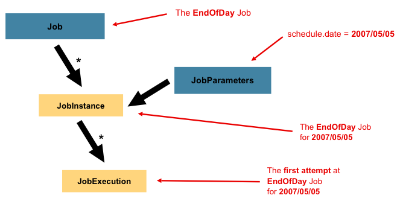
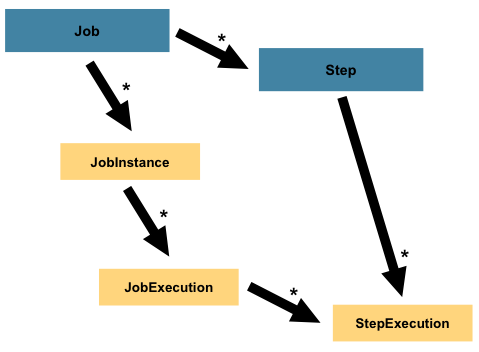

# The Domain Language of Batch

이 문서에서는 스프링 배치에서 사용하는 주요 개념과 그에 관련된 코드 예제를 제공하여, 배치 처리 시스템의 구성 및 구현을 돕는다.

---

스프링 배치(Spring Batch)의 도메인 언어는 배치 처리의 핵심 개념을 정의한다. 이 문서에서는 스프링 배치에서 사용되는 주요 개념과 코드 예제를 함께 설명한다.


이 다이어그램은 스프링 배치의 도메인 언어를 구성하는 핵심 개념을 나타내고 있다.

`JobLauncher` 에 의해 `Job`이 실행되며, `Job` 하나는 1~n개의 `Step`을 가지고 있다.

각 `Step`은 `ItemReader`, `ItemProcessor`, `ItemWrite`를 딱 한 개씩 가지고 있다. 

현재 실행 중인 프로세스의 메타정보는 `JobRepository`에 저장된다.

## TOC

- [Job](#job)
  - [JobInstance](#jobinstance)
  - [JobParameters](#jobparameters)
  - [JobExecution](#jobexecution)
- [Step](#step)
  - [StepExecution](#stepexecution)
- [ExecutionContext](#executioncontext)
- [JobRepository](#jobrepository)
- [JobLauncher](#joblauncher)
- [ItemReader](#itemreader)
- [ItemProcessor](#itemprocessor)
- [ItemWriter](#itemwriter)

## **Job**

`Job` 은 전체 배치 프로세스를 캡슐화한 엔티티로, 단순히 `Step` 인스턴스의 컨테이너 개념이다.


위 다이어그램을 보듯이, `Job`은 전체 계층 구조에의 가장 위에 있는 개념으로 배치 처리의 전체적인 단위를 정의한다.

```java
import org.springframework.batch.core.repository.JobRepository;
import org.springframework.batch.core.job.builder.JobBuilder;

@Bean
public Job footballJob(
        JobRepository jobRepository,
        Step playerLoad, 
        Step gameLoad, 
        Step playerSummarization
) {
    return new JobBuilder("footballJob", jobRepository)
            .start(playerLoad)
            .next(gameLoad)
            .next(playerSummarization)
            .build();
}
```

- 단순한 이름 명시
- `Step` 정의와 순서
- Job 재시작 여부

### Deprecated JobBuilderFactory

```java
// JobBuilderFactory deprecated since v5.0
@Bean
public Job job(JobBuilderFactory jobBuilderFactory, Step step) {
    return jobBuilderFactory.get("job")
            .start(step)
            .build();
}
```

- Spring Batch5 부터 `StepBuilderFactory`, `JobBuilderFactory`가 Deprecated 되었다.
- 기존 팩토리 설정 방식에선 `JobRepository`가 생성되고 설정된다는 사실을 숨기고 있기 때문에, 스프링에선 팩토리를 통한 설정 방식 대신, 명시적으로 `JobBuilder`, `StepBuilder`를 사용하도록 권장하고 있다. - [참고 #4188](https://github.com/spring-projects/spring-batch/issues/4188)
  - AbstractBatchConfiguration#afterPropertiesSet
    ```java
    package org.springframework.batch.core.configuration.annotation;
    
    @Configuration(proxyBeanMethods = false)
    @Import(ScopeConfiguration.class)
    public abstract class AbstractBatchConfiguration implements ImportAware, InitializingBean {
    
        @Bean
        public abstract JobRepository jobRepository() throws Exception;
    
        @Override
        public void afterPropertiesSet() throws Exception {
            this.jobBuilderFactory = new JobBuilderFactory(jobRepository());
            this.stepBuilderFactory = new StepBuilderFactory(jobRepository(), transactionManager());
        }
    }
    ```
  - SimpleBatchConfiguration#jobRepository
    ```java
    @Configuration(proxyBeanMethods = false)
    public class SimpleBatchConfiguration extends AbstractBatchConfiguration {
    
        private AtomicReference<JobRepository> jobRepository = new AtomicReference<>();
        
        @Override
        @Bean
        public JobRepository jobRepository() throws Exception {
            return createLazyProxy(jobRepository, JobRepository.class);
        }
    }
    ```

## **JobInstance**

Job의 `논리적 실행 단위`를 나타낸다.

"논리적 실행 단위"란 하나의 작업(Job)이 여러 번 실행될 때, 각 실행을 개별적으로 추적하고 관리하는 단위다.

`JobInstance`는 작업이 언제, 어떻게 실행되었는지를 추적하지만, 데이터가 어떻게 로드되는지는 직접적으로 관여하지 않는다. 동일한 `JobInstance`를 사용하면 이전 실행의 상태를 이어받아 재실행할 수 있으며, 새로운 `JobInstance`를 생성하면 처음부터 다시 실행하게 된다. 데이터 로드 방식은 `ItemReader`가 결정하며, `JobInstance`는 데이터 로드 방식을 변경하거나 영향을 미치지 않는다.

`JobInstance`는 `JobParameters`로 구분된다.

예를 들어, `JobParameters`에 날짜 값(date=2024-01-01)을 전달하면, 2024년 1월 1일에 대한 `JobInstance`가 생성된다. 동일한 `JobParameters`를 사용하면 해당 `JobInstance`를 재실행할 수 있지만, 새로운 날짜 값(date=2024-01-02)을 전달하면 새로운 `JobInstance`가 생성된다.

## **JobParameters**

`JobInstance`를 구분하는 핵심 요소는 `JobParameters`이다. 

`JobParameters`는 배치 작업 실행 시 사용되는 매개변수 세트로, 각 `JobInstance`를 고유하게 식별하는 기준이 된다. 배치 작업에서 동일한 `Job`이라도, 서로 다른 `JobParameters`를 사용하면 다른 `JobInstance`가 생성된다.



예를 들어, 1월 1일과 1월 2일에 실행된 `Job`이 있다고 가정하자. 실제로는 동일한 `Job`이지만, 1월 1일에 대한 `JobParameters`와 1월 2일에 대한 `JobParameters`가 각각 다르기 때문에 두 개의 별도 `JobInstance`로 관리된다.

따라서 다음과 같은 공식이 성립된다.

**JobInstance = Job + 고유한 JobParameters**

이와 같이, 개발자는 전달하는 파라미터에 따라 `JobInstance`를 효과적으로 제어할 수 있다.

```java
@Bean
public JobParameters jobParameters() {
    return new JobParametersBuilder()
            .addString("date", "2024-01-01")  // 고유한 식별자로 날짜를 추가
            .addLong("run.id", System.currentTimeMillis())  // 유니크한 실행 ID
            .toJobParameters();
}
```

- **`JobParameters`는 `JobInstance`를 구분하는 기준**이 된다.
- **동일한 `Job`** 이라도 **서로 다른 `JobParameters`**(예: 1월 1일, 1월 2일)를 전달하면 서로 다른 `JobInstance`가 생성된다.
- **`JobParameters`의 일부는 `JobInstance`의 식별에 영향을 주지 않을 수** 있으며, 이는 프레임워크에 의해 유연하게 처리된다. 즉, 특정 파라미터는 `JobInstance`를 구분하지 않는 용도로 사용될 수도 있다.

## **JobExecution**

**`Job`의 `실행 시도`** 를 나타낸다. 실행 상태와 관련된 정보를 포함한다.

`Job`은 여러 번 시도될 수 있고, 각각의 시도는 새로운 `JobExecution`으로 기록된다. 
그러나 동일한 `JobParameters`로 실행된 시도들은 하나의 `JobInstance`에 속한다. 즉, 여러 번의 실패나 재시도에도 불구하고 `JobInstance`는 하나지만, 실행 시도는 각각 `JobExecution`으로 저장된다.

> `JobInstance`와 `JobExecution`의 차이
> - `JobInstance`: **"하나의 배치 작업(Job)을 한 번 실행하는 단위"**. 예를 들어, 2017년 1월 1일에 실행된 배치 작업은 하나의 `JobInstance`로 간주된다.
> - `JobExecution`: **"하나의 `JobInstance`에 대해 실행 시도"** 를 의미한다. `Job`이 실패했다가 재시도되면 새로운 `JobExecution`이 기록되지만, 여전히 같은 `JobInstance`에 속한다.

### JobExecution Properties

| 속성                    | 정의                                                                                                                                                                  |
|-----------------------|---------------------------------------------------------------------------------------------------------------------------------------------------------------------|
| **Status**            | `BatchStatus` 객체로, 실행의 상태를 나타낸다. <br/>`BatchStatus#STARTED`: 실행 중<br/>`BatchStatus#FAILED`: 실패<br/>`BatchStatus#COMPLETED`: 성공적으로 완료                                |
| **startTime**         | `java.time.LocalDateTime` 객체로, 실행이 시작된 현재 시스템 시간을 나타낸다.<br/>**`Job`이 아직 시작되지 않은 경우 이 필드는 비어 있다.**                                                                   |
| **endTime**           | `java.time.LocalDateTime` 객체로, 실행이 완료된 현재 시스템 시간을 나타낸다.<br/>**`Job`이 아직 완료되지 않은 경우 이 필드는 비어 있다.**                                                                   |
| **exitStatus**        | 실행 결과를 나타내는 `ExitStatus` 객체로, 호출자에게 반환되는 종료 코드가 포함되어 있다. 자세한 내용은 5장 참조.<br/>**`Job`이 아직 완료되지 않은 경우 이 필드는 비어 있다.**                                                   |
| **createTime**        | `java.time.LocalDateTime` 객체로, `JobExecution`이 처음으로 영구 저장된 현재 시스템 시간을 나타낸다.<br/>`Job`이 시작되지 않았더라도 항상 `createTime`이 있으며, 이는 작업 수준의 `ExecutionContexts`를 관리하는 데 필요하다. |
| **lastUpdated**       | `java.time.LocalDateTime` 객체로, 마지막으로 `JobExecution`이 저장된 시간을 나타낸다.<br/>**`Job`이 아직 시작되지 않은 경우 이 필드는 비어 있다.**                                                        |
| **executionContext**  | 실행 간에 유지해야 하는 사용자 데이터를 포함하는 "속성 집합"이다.                                                                                                                              |
| **failureExceptions** | `Job` 실행 중 발생한 예외의 목록이다. 작업 실패 시 여러 예외가 발생할 수 있으며 유용할 수 있다.                                                                                                            |

### JobExecution 데이터 저장 방식

JobExecution에 대한 정보는 배치 메타데이터 테이블에 저장되며, 각 실행에 대한 상태 추적을 돕는다.

- JobInstance 정보는 `BATCH_JOB_INSTANCE` 테이블에 저장된다.
    ```text
    ### BATCH_JOB_INSTANCE
    |-------------|-------------|
    | JOB_INST_ID | JOB_NAME    |
    |-------------|-------------|
    | 1           | EndOfDayJob |
    ```
- JobParameters 정보는 `BATCH_JOB_EXECUTION_PARAMS` 테이블에 저장되며, 각 `JobExecution`과 관련된 실행 파라미터를 포함한다.
    ```text
    ### BATCH_JOB_EXECUTION_PARAMS
    |------------------|---------|---------------|------------|-------------|
    | JOB_EXECUTION_ID | TYPE_CD | KEY_NAME      | DATE_VAL   | IDENTIFYING |
    |------------------|---------|---------------|------------|-------------|
    | 1                | DATE    | schedule.Date | 2017-01-01 | TRUE        |
    ```
- JobExecution 정보는 `BATCH_JOB_EXECUTION` 테이블에 저장되며, 각 실행의 시작/종료 시간과 상태를 포함한다.
    ```text
    ### BATCH_JOB_EXECUTION
    |-------------|-------------|------------------|------------------|--------|
    | JOB_EXEC_ID | JOB_INST_ID | START_TIME       | END_TIME         | STATUS |
    |-------------|-------------|------------------|------------------|--------|
    | 1           | 1           | 2017-01-01 21:00 | 2017-01-01 21:30 | FAILED |
    ```

### JobInstance 재실행과 동시 실행 기록

- 동일한 `JobInstance`는 여러 번 실행될 수 있지만, 새로운 실행 시도는 새로운 `JobExecution`으로 기록된다.
- 서로 다른 `JobInstance`는 동시에 실행될 수 있지만, 같은 `JobInstance`를 동시에 실행하려고 하면 `JobExecutionAlreadyRunningException` 오류가 발생한다.
- 실패한 `JobExecution`은 새로운 시도에서 동일한 `JobInstance`를 사용하며, 이전 실패 상태를 이어받아 처리될 수 있다.

---

## **Step**

`Step`은 배치 작업의 기본 구성 단위로, `Job`을 구성하는 독립적인 처리 단계다. 

`Job`은 하나 이상의 `Step`으로 이루어지며, 각 `Step`은 데이터를 읽고(`ItemReader`), 처리하고(`ItemProcessor`), 저장(`ItemWriter`)하는 작업을 수행할 수 있다. 이때, 각 `Step`의 복잡성은 개발자의 요구에 따라 달라질 수 있다.



- `Step`은 배치 작업의 개별 단위로, `Job`의 한 단계를 나타낸다.
- `Job`은 여러 `Step`으로 구성되며, 각 `Step`은 독립적이고 순차적으로 실행된다.
- 간단한 `Step`은 데이터 로드와 같은 기본 작업을 처리할 수 있고, 복잡한 `Step`은 비즈니스 규칙을 적용하는 처리 과정을 포함할 수 있다.
- 각 `Step`의 실행 결과는 `StepExecution` 객체로 관리되며, `JobExecution`이 여러 `StepExecution`을 포함할 수 있다.

따라서 `Step`은 배치 작업을 관리 가능한 작은 단위로 나누어 처리하고, 각각의 실행 상태를 추적할 수 있게 해준다.

다음은 Step을 설정하는 간단한 예시다.

```java
@Bean
public Step step(
        JobRepository jobRepository,
        PlatformTransactionManager transactionManager,
        ItemReader<MyItem> reader,
        ItemProcessor<MyItem, MyProcessedItem> processor,
        ItemWriter<MyProcessedItem> writer
) {
    return new StepBuilder("step", jobRepository)
            .chunk(10, transactionManager) // 10개 단위로 데이터를 처리
            .reader(reader)                // 데이터 읽기
            .processor(processor)          // 데이터 처리
            .writer(writer)                // 처리된 데이터 저장
            .build();
}
```

## **StepExecution**

`StepExecution`은 `Step`의 실행 시도를 나타내며, 읽기 및 쓰기 카운트 등을 포함한다.

이는 [`JobExecution`](#jobexecution)과 유사하게, 매번 `Step`이 실행될 때마다 새로운 `StepExecution`이 생성된다. 다만, 이전 단계의 `Step`이 실패하여 실행되지 않은 경우에는 `StepExecution`이 생성되지 않는다. `Step`이 실제로 실행될 때만 `StepExecution`이 생성된다.

`StepExecution` 객체는 `Step`과 해당 `Step`을 포함하는 `JobExecution`과 관련된 데이터, 그리고 커밋 및 롤백 횟수, 시작 및 종료 시간 등의 트랜잭션 관련 데이터를 포함한다. 또한, 각 `StepExecution`에는 `ExecutionContext`가 포함되어 있어, 배치 실행 간 유지해야 할 데이터(통계 정보나 재시작에 필요한 상태 정보)를 보관할 수 있다.

### StepExecution Properties

| 속성                   | 정의                                                                                                                                       |
|----------------------|------------------------------------------------------------------------------------------------------------------------------------------|
| **Status**           | 실행 상태를 나타내는 `BatchStatus` 객체. <br> 실행 중일 때는 `BatchStatus.STARTED`, 실패 시 `BatchStatus.FAILED`, 성공적으로 완료되면 `BatchStatus.COMPLETED` 상태가 된다. |
| **startTime**        | `Step`이 시작된 시간을 나타내는 `java.time.LocalDateTime` 객체.<br> `Step`이 아직 시작되지 않았으면 이 필드는 비어 있다.                                                 |
| **endTime**          | `Step`이 완료된 시간을 나타내는 `java.time.LocalDateTime` 객체.<br> 성공 여부와 관계없이 `Step`이 종료된 시간을 나타내며, `Step`이 완료되지 않았으면 이 필드는 비어 있다.                  |
| **exitStatus**       | 실행 결과를 나타내는 `ExitStatus` 객체. 이 값은 호출자에게 반환되며, 배치가 끝나지 않았으면 이 필드는 비어 있다. 자세한 내용은 5장을 참조.                                                  |
| **executionContext** | 각 `StepExecution` 간 데이터를 저장할 수 있는 "속성 집합". 재시작을 위한 상태 정보나 통계 정보가 포함된다.                                                                   |
| **readCount**        | 성공적으로 읽어들인 아이템의 개수.                                                                                                                      |
| **writeCount**       | 성공적으로 기록된 아이템의 개수.                                                                                                                       |
| **commitCount**      | 이 실행 동안 커밋된 트랜잭션 횟수.                                                                                                                     |
| **rollbackCount**    | `Step`이 제어하는 비즈니스 트랜잭션이 롤백된 횟수.                                                                                                          |
| **readSkipCount**    | 읽기 실패로 인해 스킵된 아이템의 개수.                                                                                                                   |
| **processSkipCount** | 처리 실패로 인해 스킵된 아이템의 개수.                                                                                                                   |
| **filterCount**      | `ItemProcessor`에 의해 "필터링"된 아이템의 개수.                                                                                                      |
| **writeSkipCount**   | 기록 실패로 인해 스킵된 아이템의 개수.                                                                                                                   |

### StepExecution의 역할

- `StepExecution`은 **실제 실행한 결과**를 추적하고 관리하는 데 사용된다. 각 `Step` 실행에 대한 성공 여부, 실패 여부, 커밋, 롤백 정보 등을 기록하여 해당 실행에 대한 상태를 명확히 파악할 수 있다.
- `ExecutionContext`는 `StepExecution` 간 데이터를 공유하거나, 배치 작업이 재시작될 때 필요한 상태 정보를 저장하는 데 사용된다.
- `StepExecution`은 `JobExecution`과 밀접한 관계가 있으며, 하나의 `JobExecution`에는 여러 개의 `StepExecution`이 포함될 수 있다.

### StepExecution의 데이터 저장 방식

`StepExecution`에 대한 정보는 Spring Batch 메타데이터 테이블에 저장된다. 이는 배치 작업의 상태를 추적하고 필요 시 재시작을 위해 중요한 역할을 한다.

```text
### BATCH_STEP_EXECUTION
|-------------|-------------|------------------|------------------|-----------|
| STEP_EXEC_ID| JOB_EXEC_ID | START_TIME       | END_TIME         | STATUS    |
|-------------|-------------|------------------|------------------|-----------|
| 1           | 1           | 2023-09-17 10:00 | 2023-09-17 10:05 | COMPLETED |
```

---

## ExecutionContext

`ExecutionContext`는 배치 작업의 상태를 저장하는 저장소다. 배치 작업이 중간에 실패하거나 중단되었을 때, 작업을 재시작하는 데 유용하다.

각 배치 작업에서 `JobExecution`과 `StepExecution` 각각에 대해 별도의 `ExecutionContext`가 존재하며, 두 `ExecutionContext`는 서로 다른 데이터를 저장한다.

```java
// JobExecution과 StepExecution 각각에 대해 ExecutionContext가 존재한다.
ExecutionContext stepContext = stepExecution.getExecutionContext();
ExecutionContext jobContext = jobExecution.getExecutionContext();
```

- **JobExecution과 연결된 ExecutionContext**: 전체 배치 작업과 관련된 데이터를 저장한다.
- **StepExecution과 연결된 ExecutionContext**: 개별 단계와 관련된 데이터를 저장한다.

> **중요**: `ExecutionContext`에 저장되는 데이터는 반드시 **Serializable**해야 한다. 그렇지 않으면 작업 재시작 시 데이터가 복원되지 않을 수 있다.

### ExecutionContext 활용

- [재시작 기능](#executioncontext-활용-재시작-기능)
- [통계 정보 저장](#executioncontext-활용-통계-정보-저장)

#### ExecutionContext 활용: 재시작 기능

`ExecutionContext`는 배치 작업의 상태를 저장하고, 중단된 지점부터 재시작할 수 있도록 도와준다. 예를 들어, 파일에서 데이터를 읽어 데이터베이스에 저장하는 작업이 중단되면, `ExecutionContext`에 현재까지 읽은 줄 번호를 저장해 두면 다음에 작업을 재시작할 때 중단된 지점부터 계속 진행할 수 있다.

```java
// 현재까지 읽은 줄 번호를 ExecutionContext에 저장
executionContext.putLong("linesRead", reader.getPosition());
```

이렇게 저장된 줄 번호는 다음에 작업이 재시작될 때 중단된 지점부터 이어서 작업을 계속할 수 있게 해준다. 재시작 시 `ExecutionContext`를 읽어와서 다음과 같이 중단된 지점부터 다시 작업을 시작할 수 있다.

```java
if (executionContext.containsKey("linesRead")) {
    long lineCount = executionContext.getLong("linesRead");

    // 중단된 줄부터 다시 시작하기
    while (reader.getPosition() < lineCount) {
        reader.readLine();
    }
}
```

#### ExecutionContext 활용: 통계 정보 저장

`ExecutionContext`는 재시작 기능 외에도 통계 정보 저장에 사용할 수 있다. 예를 들어, 처리된 주문의 개수를 저장하고 작업이 끝난 후 이메일로 통계를 보낼 수 있다.

```java
// 작업이 끝난 후 통계 정보를 이메일로 보내는 예시
int totalOrders = executionContext.getInt("ordersProcessed");
sendEmail("Summary of processed orders: " + totalOrders);
```

`ExecutionContext`를 활용하면 배치 작업의 상태를 효과적으로 관리하고, 다양한 정보를 저장할 수 있다.

---

## **JobRepository**

`JobRepository`는 배치 작업의 상태를 저장하고 관리하는 영속성 메커니즘이다. 이 구성 요소는 배치 작업의 상태를 영구적으로 저장하며, 작업의 재시작과 관리를 지원한다.

`JobRepository`는 다음과 같은 CRUD(생성, 읽기, 업데이트, 삭제) 작업을 제공하여 배치 작업의 다양한 요소를 처리한다.

- **JobExecution**: 배치 작업이 처음 시작될 때 생성되며, `JobRepository`에서 관리된다.
- **StepExecution**: 각 단계의 실행 상태를 추적하고 저장한다.
- **기타 구성 요소**: `JobLauncher`, `Job`, 및 `Step` 구현의 상태도 저장하고 관리한다.

> `@EnableBatchProcessing` 애너테이션을 사용하면 `JobRepository`가 자동으로 구성된다.

---

## JobLauncher

`JobLauncher`는 주어진 `JobParameters`를 사용하여 `Job`을 실행하는 간단한 인터페이스이다.

```java
public interface JobLauncher {

    JobExecution run(Job job, JobParameters jobParameters)
            throws JobExecutionAlreadyRunningException, 
                   JobRestartException,
                   JobInstanceAlreadyCompleteException,
                   JobParametersInvalidException;
}
```

- **인터페이스 메서드**: `run(Job job, JobParameters jobParameters)` 메서드는 `Job`을 시작하고, `JobExecution` 객체를 반환한다.
- **예외 처리**: 이 메서드는 다음과 같은 예외를 처리한다:
    - `JobExecutionAlreadyRunningException`: 작업이 이미 실행 중인 경우
    - `JobRestartException`: 작업을 재시작할 수 없는 경우
    - `JobInstanceAlreadyCompleteException`: 작업이 이미 완료된 경우
    - `JobParametersInvalidException`: 제공된 파라미터가 유효하지 않은 경우

JobLauncher 구현체는 `JobRepository`에서 유효한 `JobExecution`을 조회하고 `Job`을 실행하는 기능을 구현한다. [참고 - Configuring a JobLauncher](https://docs.spring.io/spring-batch/reference/job/configuring-launcher.html)

---

## ItemReader

`ItemReader`는 `Step`에서 입력을 한 번에 하나씩 읽어오는 추상화이다. 항목이 모두 소진되면 `null`을 반환한다.

> ItemReader 인터페이스와 다양한 구현체에 대한 자세한 내용은 [Spring Batch - Readers And Writers](https://docs.spring.io/spring-batch/reference/readersAndWriters.html) 참고하자.

---

## ItemProcessor

`ItemProcessor`는 항목을 비즈니스 로직에 따라 변환하거나 처리하는 추상화이다. 항목이 유효하지 않으면 `null`을 반환하여 해당 항목을 쓰지 않는다.

> ItemProcessor 인터페이스와 다양한 구현체에 대한 자세한 내용은 [Spring Batch - Readers And Writers](https://docs.spring.io/spring-batch/reference/readersAndWriters.html) 참고하자.

---

## ItemWriter

`ItemWriter`는 `Step`의 출력을 한 번에 하나의 배치 또는 청크 단위로 처리하는 추상화이다. 

일반적으로 `ItemWriter`는 다음에 받을 입력에 대한 정보는 알지 못하며, 현재 호출에서 전달된 항목만을 처리한다.

> ItemWriter 인터페이스와 다양한 구현체에 대한 자세한 내용은 [Spring Batch - Readers And Writers](https://docs.spring.io/spring-batch/reference/readersAndWriters.html) 참고하자.

## Reference

- https://docs.spring.io/spring-batch/reference/domain.html
