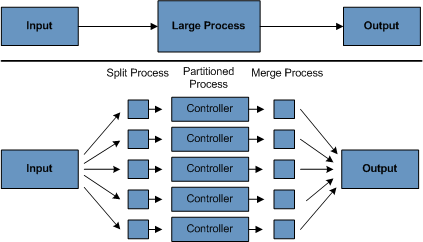

# General Batch Pipelines and Guidelines

배치 솔루션을 개발할 때는 다음의 핵심 원칙과 가이드라인을 고려해야 한다.

- 배치 아키텍처는 온라인 아키텍처와 서로 영향을 주고받으므로, 공통 구성 요소를 활용하고 아키텍처와 환경을 모두 고려하여 설계하라.
- 단일 배치 애플리케이션은 가능한 단순화하고 복잡한 로직은 피하라.
- 데이터 처리와 저장은 물리적으로 가까운 곳에서 수행하라. 즉, 데이터가 처리되는 곳에서 데이터를 저장하라.
- 시스템 리소스 사용, 특히 I/O를 최소화하고, 가능한 한 내부 메모리에서 많은 연산을 실행하라.
- 애플리케이션 I/O를 점검하여 불필요한 물리적 I/O를 줄여라. 특히 다음 네 가지 결함에 주의하라:
    - 매 트랜잭션마다 읽는 데이터가 캐시되거나 작업 스토리지에 저장될 수 있는 경우.
    - 같은 트랜잭션 내에서 이미 읽은 데이터를 다시 읽는 경우.
    - 불필요한 테이블 스캔이나 인덱스 스캔을 유발하는 경우.
    - SQL 구문에서 WHERE 절에 키를 지정하지 않는 경우.
- 배치 실행 중 같은 작업을 두 번 하지 않도록 하라. 예를 들어, 리포팅 목적으로 데이터를 요약하는 애플리케이션이라면, 처음 처리할 때 저장된 토탈값을 증가시켜 같은 데이터를 다시 처리하지 않도록 하라.
- 애플리케이션 시작 시 충분한 메모리를 할당하여 실행 중 재할당에 시간을 쏟지 않도록 하라.
- 데이터 무결성은 최악의 상황도 고려하여 유지하라. 적절한 유효성 검증 로직을 추가하여 데이터 무결성을 보장하라.
- 가능한 곳에 내부 검증을 위한 체크섬을 구현하라. 예를 들어, 플랫(flat) 파일의 경우 파일의 총 레코드 수와 주요 필드의 집계 결과를 알 수 있는 트레일러 레코드가 필요하다.
- 실제 프로덕션 환경과 유사한 데이터 볼륨을 가지고 가능한 빨리 부하 테스트를 계획하고 실행하라. 배치 규모가 크면, 특히 시스템이 온라인과 동시에 무중단으로 실행된다면 백업이 매우 어려울 수 있다. 파일 백업도 중요하므로, 파일 백업 절차를 수립하고 문서화하며 정기적으로 테스트해야 한다.

## Batch Processing Strategies

배치 시스템을 설계하고 구현할 때는 

기본 배치 `애플리케이션 빌딩 블록`과 `패턴`을 고려해야 한다. 배치 작업을 설계할 때 비즈니스 로직을 여러 단계로 나누어 다음의 표준 빌딩 블록을 사용하여 구현한다.

### 기본 애플리케이션 빌딩 블록

1. **변환(Conversion)**: 외부 시스템에서 제공되거나 생성된 각 유형의 파일에 대해 트랜잭션 레코드를 처리에 필요한 표준 형식으로 변환하는 애플리케이션을 생성한다. 이 애플리케이션은 변환 유틸리티 모듈로 구성될 수 있다.
2. **검증(Validation)**: 입력 및 출력 레코드의 정확성과 일관성을 보장한다. 검증은 파일 헤더와 트레일러, 체크섬, 검증 알고리즘, 레코드 수준 교차 검사를 통해 수행된다.
3. **추출(Extract)**: 데이터베이스나 입력 파일에서 레코드를 읽고, 사전 정의된 규칙에 따라 레코드를 선택하여 출력 파일에 기록한다.
4. **추출/업데이트(Extract/Update)**: 데이터베이스나 입력 파일에서 레코드를 읽고, 입력 레코드에서 발견된 데이터에 따라 데이터베이스나 출력 파일을 변경한다.
5. **처리 및 업데이트(Processing and Updating)**: 추출 또는 검증 애플리케이션의 입력 트랜잭션을 처리하며, 데이터베이스를 읽어 처리에 필요한 데이터를 얻고, 데이터베이스를 업데이트하거나 출력 처리 레코드를 생성한다.
6. **출력/형식(Output/Format)**: 입력 파일을 읽고, 데이터를 표준 형식으로 재구성하여 출력 파일을 생성한다.

### 표준 유틸리티 단계

어플리케이션은 메인 구성 요소 외에도, 아래 같은 표준 유틸리티 `step`을 하나 이상 사용할 수 있다.

- **정렬(Sort)**: 입력 파일을 읽고, 레코드를 정렬 키 필드에 따라 재배열하여 출력 파일을 생성한다. 정렬은 보통 표준 시스템 유틸리티를 통해 수행된다.
- **분할(Split)**: 단일 입력 파일을 읽고, 필드 값을 기준으로 여러 출력 파일로 분할하여 쓴다. 분할은 맞춤형으로 수행하거나 매개변수 기반의 표준 시스템 유틸리티를 사용할 수 있다.
- **병합(Merge)**: 여러 입력 파일에서 레코드를 읽고, 입력 파일의 데이터를 결합하여 하나의 출력 파일을 생성한다. 병합은 맞춤형으로 수행하거나 매개변수 기반의 표준 시스템 유틸리티를 사용할 수 있다.

### 배치 애플리케이션의 입력 소스

- **데이터베이스 기반 애플리케이션**: 데이터베이스에서 검색한 행 또는 값에 의해 구동된다.
- **파일 기반 애플리케이션**: 파일에서 검색한 레코드 또는 값에 의해 구동된다.
- **메시지 기반 애플리케이션**: 메시지 큐에서 검색한 메시지에 의해 구동된다.

### 배치 처리 전략 선택 기준

배치 시스템의 핵심은 처리 전략을 선택하는 것이다. 배치 처리 전략을 선택할 때는 다음과 같은 요소들을 고려해야 된다.

1. **배치 시스템의 예상 볼륨**: 처리할 데이터의 양이나 작업의 크기에 따라 전략이 달라질 수 있다.
2. **온라인 시스템과의 동시성**: 배치 작업이 온라인 시스템과 동시에 실행될 때, 서로 간섭하지 않도록 조정해야 한다.
3. **배치 윈도우**: 배치 작업을 실행할 수 있는 시간대가 얼마나 되는지를 의미한다. 요즘은 24시간 운영하는 시스템이 많아서 명확한 배치 윈도우가 점점 줄어들고 있다.

### 배치 처리 전략

배치 시스템을 설계할 때는 다음과 같은 처리 전략을 고려해야 한다. 각 전략은 배치 작업의 성격과 시스템 환경에 따라 다르게 적용된다.

1. **정상 처리 (Normal processing)**
    - **설명**: 배치 윈도우에서 오프라인 모드로 배치 작업을 실행한다. 이때 데이터 업데이트는 필요하지 않으며, 단일 커밋 지점에서 처리 완료를 수행한다.
    - **예시**: 밤에 시스템 사용이 없는 시간대에 배치 작업을 실행하는 경우.
2. **동시 배치 또는 온라인 처리 (Concurrent batch or online processing)**
    - **설명**: 데이터가 온라인 사용자에 의해 동시에 업데이트될 수 있을 때, 데이터베이스나 파일을 잠그지 않고, 트랜잭션마다 업데이트를 커밋하여 다른 프로세스가 데이터를 사용할 수 있도록 한다. 데이터 잠금은 낙관적 잠금 또는 비관적 잠금으로 관리할 수 있다.
        - **낙관적 잠금**: 타임스탬프를 사용하여 업데이트 충돌을 방지하며, 충돌 시 업데이트를 취소한다.
        - **비관적 잠금**: 데이터베이스의 물리적 또는 논리적 잠금을 사용하여 충돌을 방지한다.
    - **예시**: 웹사이트에서 실시간으로 주문을 처리하면서 동시에 데이터 분석 작업을 수행하는 경우.
3. **병렬 처리 (Parallel processing)**
    - **설명**: 여러 배치 작업을 동시에 실행하여 총 배치 처리 시간을 줄인다. 데이터 파일이나 데이터베이스 테이블을 공유하지 않는 경우에 적합하며, 공유 자원에 대한 종속성은 제어 테이블을 통해 관리할 수 있다.
    - **예시**: 대규모 데이터 처리 작업을 여러 서버에서 동시에 처리하는 경우.
4. **파티셔닝 (Partitioning)**
   
    - **설명**: 큰 배치 애플리케이션의 여러 버전을 동시에 실행하여 작업 시간을 단축한다. 입력 파일이나 데이터베이스 테이블을 나누어 애플리케이션이 다양한 데이터 집합을 처리할 수 있도록 한다.
        - **기본 및 균등 분할**: 입력 레코드를 균등한 부분으로 나누어 각 부분을 처리한다.
        - **키 열에 의한 분할**: 키 열을 기준으로 레코드를 나누어 처리한다.
        - **뷰에 의한 분할**: 데이터베이스에서 레코드를 나누어 각 애플리케이션 인스턴스가 처리한다.
        - **처리 지시자 추가**: 입력 테이블에 새로운 열을 추가하여 처리 상태를 표시한다.
        - **테이블을 플랫 파일로 추출**: 테이블을 플랫 파일로 추출하고, 이를 여러 세그먼트로 나누어 처리한다.
        - **해싱 열 사용**: 해시 열을 추가하여 각 인스턴스가 특정 행을 처리하도록 한다.
    - **예시**: 큰 고객 데이터베이스를 지역별로 나누어 각 지역의 데이터를 동시에 처리하는 경우.
5. **조합 (Combination)**
    - **설명**: 위의 전략들을 조합하여 사용하는 방법이다. 예를 들어, 동시 처리와 병렬 처리를 함께 사용하는 경우이다.
    - **예시**: 데이터 분석 작업을 병렬로 처리하면서 동시에 온라인 사용자 요청을 처리하는 경우.

이러한 처리 방법들은 상업용 스케줄러에 의해 지원될 수 있으며, 시스템의 요구 사항과 제약 사항에 맞춰 적절한 방법을 선택하는 것이 중요하다. 각 방법의 복잡성과 필요성을 잘 이해하고 적절하게 선택하면 배치 시스템의 효율성을 높일 수 있다.

### 데이터베이스 및 애플리케이션 설계 원칙

- **파티션 리포지토리**: 다중 파티셔닝 애플리케이션을 지원하는 아키텍처는 파티션 매개변수를 저장하는 중앙 리포지토리를 포함해야 한다. 이 리포지토리는 일반적으로 하나의 테이블로 구성된다.
- **데드락 최소화**: 데이터베이스 리소스에 대한 경쟁을 피하고 성능을 고려하여 데이터베이스 인덱스 테이블을 설계해야 한다. 스트레스 테스트를 통해 병목 현상을 식별하고, 데이터베이스 연결 시 대기 및 재시도 메커니즘을 제공해야 한다.
- **파라미터 전달 및 검증**: 애플리케이션 개발자가 파티션 아키텍처를 투명하게 사용할 수 있도록, 아키텍처는 애플리케이션 시작 시 파라미터를 가져오고 검증하며 전달한다. 검증은 전체 데이터 범위를 커버할 수 있는 파티션이 있는지 확인하고, 파티션 간의 간격이 없는지 확인해야 한다.

## Reference

- https://docs.spring.io/spring-batch/reference/spring-batch-architecture.html
