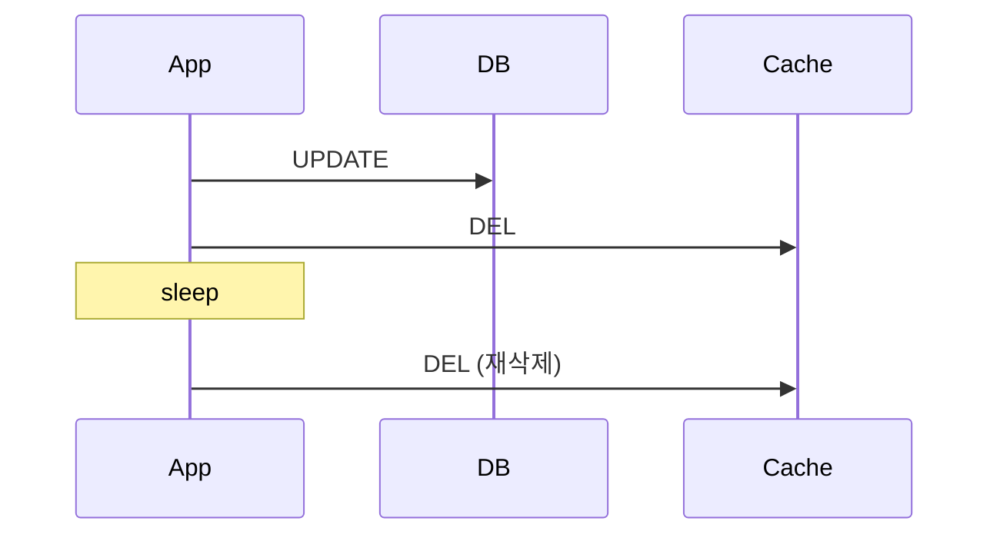

# 비표준 기법

널리 회자되지만 권위 있는 출처가 없거나, 표준 기법으로 오인되는 것들을 기록한다.
**전략으로 채택하지 않되, 왜 부족한지는 알아둔다.**

## Delayed Double Delete (延迟双删)

Cache-Aside 경합을 완화하려고 삭제를 두 번 수행한다는 기법.

### 표준이 아니다

| 항목 | 실태 |
|-----|-----|
| 출처 | 중국 기술 커뮤니티에서 자생한 용어. **권위 있는 원출처 없음** |
| 영어권 명칭 | **없다.** 영어 문헌은 Cache-Aside의 알려진 경쟁 조건으로만 다루고 별도 이름을 붙이지 않는다 |
| 정의 | **두 판본이 충돌한다** — `캐시 삭제 → DB 갱신 → sleep → 재삭제` vs `DB 갱신 → 캐시 삭제 → sleep → 재삭제` |
| 유통 경로 | 대부분 면접 정형문제(八股) |

정의조차 통일되지 않았다는 것이 권위 있는 정의 소스가 없다는 증거다.

### 왜 부족한가

| 문제 | 내용 |
|-----|-----|
| sleep 시간 추측 | **조회 트랜잭션의 최대 소요 시간보다 길어야** 의미가 있는데, 이 값을 사전에 알 수 없다 |
| 확률만 낮춘다 | 강한 일관성을 보장하지 못하고 불일치 확률만 줄인다 |
| 양날 | 짧으면 무의미하고, 길면 불일치 창이 커진다 |
| 두 번째 삭제도 실패한다 | MQ 재시도·DLQ나 스케줄러를 또 붙여야 하고, 재기동 시 태스크가 유실된다 |
| 분산 환경 | 지연 삭제를 어느 인스턴스가 수행할지 조정이 필요하다 |

중국어 커뮤니티 내부에서도 같은 이유로 비판받으며,
대체안으로 미는 것이 **binlog 구독 기반 비동기 무효화 + TTL 백스톱**이다.
이는 [cdc-invalidate](../invalidation/cdc-invalidate.md)와 정확히 같은 방향이다.

### 이 저장소의 취급

독립 전략 모듈로 만들지 않는다.
[write-invalidate](../invalidation/write-invalidate.md)의 경합을 재현하는 테스트에서
"재삭제로도 왜 닫히지 않는가"를 보이는 용도로만 다룬다.

---

## Read-Aside

`Cache-Aside`의 읽기 경로를 가리키려고 쓰이는 표현이지만, **표준 용어가 아니다.**

| 확인 대상 | 결과 |
|---------|-----|
| Microsoft Azure Architecture Center | `Cache-Aside`만 등재 |
| Oracle Coherence | `Read-Through` / `Write-Through` / `Write-Behind` / `Refresh-Ahead` |
| AWS · Redis | `Cache-Aside`(= Lazy Loading), `Write-Around` |

어느 공식 문서에도 `Read-Aside`는 없다.
팀 문서에서는 **`Cache-Aside`** 로 통일한다.

---

## 흔히 잘못 알려진 주장

| 주장 | 실제 |
|-----|-----|
| Meta의 Polaris는 OSDI/SOSP 논문이다 | **엔지니어링 블로그 글**이다. 제목이 "Paxos Made Live"를 닮아 논문으로 오인된다 |
| Kafka를 쓰면 exactly-once 무효화가 된다 | Kafka EOS는 **Kafka→Kafka**에서만 성립. Redis가 종점이면 at-least-once |
| Outbox를 쓰면 메시지가 정확히 한 번 간다 | **중복 발행 가능**. Outbox는 dual-write 원자성만 해결한다 |
| TAO의 무효화는 유실돼도 곧 수렴한다 | 자동 수렴하지 않는다. **샤드 단위 bulk invalidation**이라는 별도 복구 작업이 필요하다 |
| stale-while-revalidate를 켜면 stampede가 사라진다 | 저트래픽 키에서는 효과 없음 (RFC 5861 §3.1) |
| RFC 5861은 RFC 9111로 대체됐다 | RFC 9111이 폐기한 것은 **RFC 7234뿐**. 다만 RFC 5861이 전제하는 Warning 헤더는 폐기됨 |
| 분산 락은 stampede의 정석 해법 | 쓰기 2배, TTL 튜닝 필요, **락 보유자 실패 시 무방비** (VLDB 2015) |
| single-flight면 백엔드 요청이 1회로 준다 | 프로세스 로컬 기준. 인스턴스 N개면 **N회** |
| CDC면 강한 일관성이 된다 | eventual consistency. read-own-writes가 깨진다 |
| `Read-Aside`가 표준 패턴명이다 | 공식 문서에 없다. `Cache-Aside`가 정식 명칭 |
| Cache-Aside·Write-Through는 만료 전략이다 | **적재·쓰기 전략**이다. 만료·무효화·축출은 별개 축 |

## Reference

- [Meta - Cache Made Consistent (blog)](https://engineering.fb.com/2022/06/08/core-infra/cache-made-consistent/)
- [Vattani et al., VLDB 2015](http://www.vldb.org/pvldb/vol8/p886-vattani.pdf)
- [RFC 5861](https://www.rfc-editor.org/rfc/rfc5861.html)
- [Microsoft Azure - Cache-Aside pattern](https://learn.microsoft.com/en-us/azure/architecture/patterns/cache-aside)
