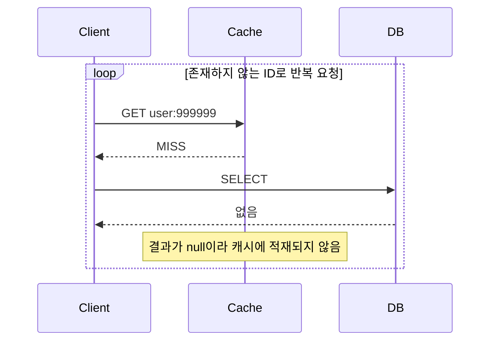
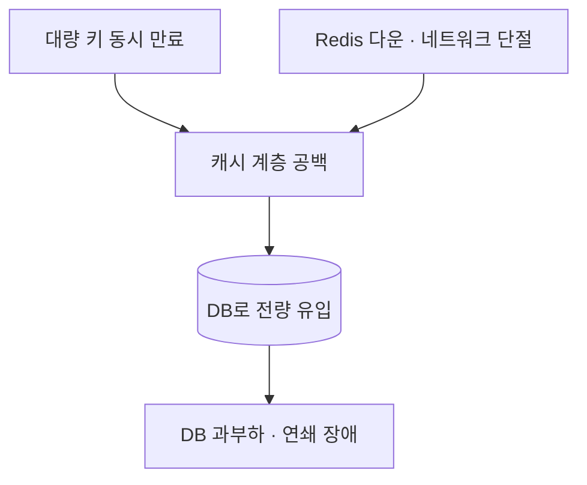

# 캐시 장애 유형

> **캐시는 성능 장치이지 가용성 장치가 아니다.**

캐시를 붙이면 성능은 오르지만 **장애 지점이 하나 늘어난다.**
아래 네 가지는 이름이 비슷해 자주 섞이지만 원인과 대응이 전부 다르다.

| 유형 | 언제 | 원인 | 대응 |
|-----|-----|-----|-----|
| **Stampede** | 인기 키가 **만료·무효화된 직후** | 동시 MISS가 DB로 몰림 | single-flight, 조기 갱신 |
| **Penetration** | **존재하지 않는 키**를 반복 조회 | 캐시가 방어하지 못하고 매번 DB 직행 | not-found 캐싱, Bloom filter |
| **Avalanche** | 대량 키 **동시 만료** 또는 캐시 전체 다운 | 캐시 계층이 통째로 사라짐 | TTL jitter, 폴백, 서킷 브레이커 |
| **캐시 장애 전파** | Redis가 죽거나 느려짐 | 캐시 예외가 요청을 실패시킴 | `CacheErrorHandler`, 타임아웃 |

[Stampede](stampede.md)는 별도 문서에서 다룬다. 여기서는 나머지 셋을 다룬다.

---

## Penetration — 없는 데이터를 계속 찾는다



**캐시가 전혀 일을 하지 않는다.** 요청이 그대로 DB를 때린다.
악의적으로 존재하지 않는 ID를 대량 요청하면 캐시를 우회하는 공격이 된다.

### `disableCachingNullValues()`의 함정

Spring Data Redis에서 이 옵션을 켜면 null을 캐시하지 않는다.
"쓸데없는 null을 캐시에 쌓지 말자"는 의도지만, **penetration을 그대로 열어둔다.**

### 대응 — not-found를 짧은 TTL로 캐싱

```java
return (key, value) -> value instanceof NullValue
     ? jitteredTtl.apply(properties.notFoundTtl())
     : jitteredTtl.apply(baseTtl);
```

`RedisCacheWriter.TtlFunction`(Spring Data Redis 3.2+)으로 **값이 `NullValue`일 때만 짧은 TTL**을 준다.

| 항목 | 판단 |
|-----|-----|
| not-found TTL 길이 | 정상 TTL보다 훨씬 짧게. 데이터가 곧 생길 수 있으므로 |
| 메모리 | 존재하지 않는 키가 캐시를 채울 수 있어 상한 관리 필요 |
| 대안 | 키 공간이 매우 크면 Bloom filter로 "확실히 없음"을 먼저 거른다 |

> `@Cacheable(unless = "#result == null")` 을 쓰면 null이 캐시되지 않아 이 대응이 무력화된다.
> penetration을 막으려면 그 조건을 빼야 한다.

---

## Avalanche — 캐시 계층이 통째로 사라진다

두 가지 경로가 있다.



| 경로 | 대응 |
|-----|-----|
| 동시 만료 | [TTL jitter](ttl.md) — 만료 시점을 흩뜨린다 |
| 캐시 다운 | `CacheErrorHandler` 폴백 + 짧은 커넥션·명령 타임아웃 |
| DB 보호 | 동시 조회 수 제한, 서킷 브레이커, 부하 차단 |

캐시가 죽으면 **평소 캐시가 흡수하던 트래픽이 전부 DB로 간다.**
hit rate가 95%였다면 DB 부하가 순간적으로 **20배**가 된다.
"캐시가 죽어도 DB로 폴백하면 된다"는 말은 **DB가 그 부하를 견딜 때만** 참이다.

---

## 캐시 장애 전파 — 기본 설정이 위험하다

Spring Cache의 기본 `CacheErrorHandler`는 `SimpleCacheErrorHandler`이고,
**네 개 핸들러가 전부 예외를 그대로 다시 던진다.**

| 핸들러 | 기본 동작 |
|-------|---------|
| `handleCacheGetError` | rethrow |
| `handleCachePutError` | rethrow |
| `handleCacheEvictError` | rethrow |
| `handleCacheClearError` | rethrow |

즉 **Redis가 죽으면 `@Cacheable` 메서드가 예외를 던지고 요청이 실패한다.**

> Look Aside의 구조적 장점("캐시가 죽어도 DB로 조회 가능")은
> **`CacheErrorHandler`를 등록해야 비로소 실현된다.**
> 기본 설정만으로는 캐시가 단일 장애점이 된다.

### 대응

```java
@Configuration
@EnableCaching
public abstract class AbstractRedisCacheConfig implements CachingConfigurer {

    @Bean
    @Override
    public CacheErrorHandler errorHandler() {
        return new FallbackCacheErrorHandler(cacheFailureRecorder);
    }
}
```

**`CachingConfigurer`를 구현해야 한다.**
`@Bean CacheErrorHandler` 만으로는 등록되지 않는다 —
`AbstractCachingConfiguration`이 `ObjectProvider<CachingConfigurer>`에서만 가져오기 때문이다.

### 삼킬 때 반드시 기록한다

예외를 삼키면 장애가 보이지 않게 된다.

| 연산 | 삼켰을 때의 결과 |
|-----|---------------|
| GET 실패 | 원본 조회로 폴백. 느려지지만 정상 응답 |
| PUT 실패 | 캐시에 적재되지 않음. 다음 요청도 MISS |
| **EVICT 실패** | **stale이 그대로 남는다.** TTL 만료까지 잘못된 값 제공 |
| CLEAR 실패 | 전체 무효화가 안 됨 |

**EVICT 실패가 가장 위험하다.** 반드시 카운터와 알람으로 관측해야 한다.
→ [metrics.md](metrics.md)

### 훅별로 삼킬 것인가 재던질 것인가

| 훅 | 권고 | 근거 |
|---|-----|-----|
| `handleCacheGetError` | **삼킨다** | 원본 조회로 폴백하면 정상 응답이 가능하다 |
| `handleCachePutError` | **삼킨다** | 적재 실패는 다음 요청의 미스일 뿐이다 |
| `handleCacheEvictError` | **판단 필요** | 삼키면 stale이 남고, 재던지면 커밋 후 흐름이 깨진다 |
| `handleCacheClearError` | 판단 필요 | 전체 무효화 실패는 광범위한 stale |

이 저장소는 **EVICT도 삼키되 반드시 기록**하는 쪽을 택했다.
post-commit 경로에서 예외를 던지면 이미 커밋된 트랜잭션 이후 흐름이 깨지기 때문이다.
대신 실패 건수를 관측 지점으로 삼아 stale을 추적한다.

> **`@Cacheable(sync = true)`에서는 get 실패를 삼켜도 put 재시도가 없다.**
> get과 put이 결합된 단일 단계이기 때문이다. javadoc이 직접 경고한다.

### 역직렬화 실패도 같은 경로다

캐시 값의 스키마가 바뀌어 역직렬화가 깨지면 `handleCacheGetError`로 들어온다.
폴백이 있으면 **캐시 미스로 처리되어 DB에서 읽고 새 형식으로 다시 적재**된다.
배포 중 무중단으로 넘어가는 데 이 경로가 결정적이다.

다만 이 재적재가 롤링 배포 중 **구/신 버전 간 write thrash**를 만든다.
안전장치일 뿐 해결책이 아니다 → [schema-evolution.md](schema-evolution.md)

---

## 타임아웃 — 캐시가 지연 원인이 되지 않게

캐시는 빠르라고 두는 것인데, Redis가 **느려지면** 오히려 지연을 만든다.
죽는 것보다 느린 것이 더 위험하다 — 스레드가 묶여 서비스 전체가 정지한다.

| 설정 | 역할 |
|-----|-----|
| `spring.data.redis.connect-timeout` | 연결 수립 상한 |
| `spring.data.redis.timeout` | 명령 응답 상한 |

캐시 조회 타임아웃은 **DB 조회 시간보다 짧아야** 의미가 있다.
그렇지 않으면 "캐시를 기다리다 DB보다 느려지는" 상황이 된다.

---

## 검증

```
□ Redis를 내린 상태에서 조회 요청이 성공하는가 (DB 폴백)
□ Redis를 내린 상태에서 쓰기 요청이 성공하는가
□ 무효화 실패가 카운터에 기록되는가
□ 존재하지 않는 키를 반복 조회할 때 DB 조회가 1회로 수렴하는가
□ 대량 키의 만료 시점이 흩어져 있는가
□ 캐시 응답 지연이 설정한 타임아웃을 넘지 않는가
```

## Reference

- [Spring - Cache abstraction (CachingConfigurer)](https://docs.spring.io/spring-framework/reference/integration/cache.html)
- [Spring Data Redis - Redis Cache](https://docs.spring.io/spring-data/redis/reference/redis/redis-cache.html)
- [Redis - Cache-aside](https://redis.io/docs/latest/develop/use-cases/cache-aside/)
