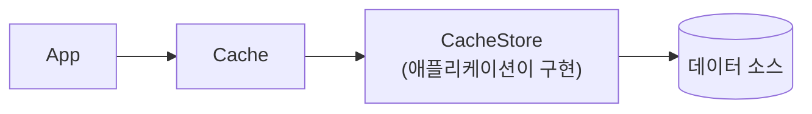

# 공식 패턴 정의

이 문서의 전략 이름은 임의로 지은 것이 아니라 **벤더·표준 문서에 정의된 용어**다.
어떤 이름이 어디서 왔는지 확인해 두면, 자료마다 용어가 조금씩 달라 보여도 헷갈리지 않는다.

## 출처별 정의 위치

| 출처 | 정의하는 패턴 | 성격 |
|-----|------------|-----|
| **Microsoft Azure Architecture Center** | Cache-Aside | 클라우드 디자인 패턴 카탈로그의 정식 항목 |
| **Oracle Coherence** | Read-Through · Write-Through · Write-Behind · Refresh-Ahead | 캐시 제품의 4대 전략. `CacheStore` 인터페이스와 함께 정의 |
| **AWS** | Cache-Aside(Lazy Loading) · Write-Through | 데이터베이스 캐싱 백서 |
| **Redis** | Cache-Aside · Write-Around | use-case 가이드 및 아키텍처 가이드 |

`Write-Around`는 위 넷보다 표준화 정도가 낮지만, 여러 자료에서 "쓰기가 캐시를 우회한다"는 뜻으로 일관되게 쓰인다.

## Oracle Coherence의 4대 전략

Coherence는 이 넷을 **`CacheStore`라는 플러그형 어댑터를 통한 캐싱**으로 묶어 정의한다.
전제는 *"the cache and database must be kept fully synchronized"* — 캐시와 DB를 완전히 동기화된 상태로 유지한다는 것이다.

| 전략 | 트리거 | 동기/비동기 | `CacheStore` 메서드 |
|-----|------|-----------|------------------|
| Read-Through | 캐시 미스 시 읽기 | 동기 | `load` / `loadAll` |
| Write-Through | `put()` 호출 | 동기 | `store` |
| Write-Behind | `put()` 후 지연 | 비동기 (write-behind queue) | `store` / `storeAll` |
| Refresh-Ahead | 만료 임박 엔트리 접근 | 비동기 (만료 전) / 동기 (만료 후) | `load` / `loadAll` |

### CacheStore — 네 전략의 공통 기반



> "A `CacheStore` is an application-specific adapter used to connect a cache to an underlying data source."

읽기 전용이면 `CacheLoader`(`load`, `loadAll`), 읽기·쓰기면 `CacheStore`(`store`, `storeAll`, `erase`, `eraseAll`)를 구현한다.

### inline caching — Coherence가 붙인 이름

Coherence는 read-through/write-through 계열을 **inline caching**이라 부르며 cache-aside와 대비시킨다.

| | 캐시의 위치 | DB 접근 주체 |
|---|-----------|-----------|
| Cache-Aside | 경로 **옆** | 애플리케이션 |
| inline caching (`through` 계열) | 경로 **위** | 캐시(`CacheStore`) |

Coherence는 cache-aside의 단점으로 클러스터 환경에서의 중복 DB 조회와
double-checked locking 오버헤드(*"up to 10 additional network hops"*)를 든다.

### 멱등성 요구

> "All `CacheStore` operations should be designed to be **idempotent**."

write-through/write-behind에서 부분 갱신을 재시도로 복구하기 위해서다.
이 문서의 [dual-write](dual-write.md)에서 "중복보다 유실이 위험하다"고 정리한 것과 같은 맥락이다.

### 적용 제약

> "Read-through/write-through caching (and variants) are intended for use only with the
> Partitioned (Distributed) cache topology (and by extension, Near cache)."

## Microsoft의 Cache-Aside

Azure Architecture Center는 Cache-Aside를 **정식 디자인 패턴**으로 등재하고,
Coherence 같은 inline 기능이 없는 캐시에서 read-through를 흉내 내는 방식으로 설명한다.

> "An application can **emulate the functionality of read-through caching** by implementing the Cache-Aside pattern."

정의된 절차는 세 단계다.

1. 캐시에서 읽기를 시도해 항목이 있는지 판단한다
2. 없으면(cache miss) 데이터 저장소에서 가져온다
3. 캐시에 추가하고 호출자에게 반환한다

쓰기는 **"writes the change to the data store and then invalidates the corresponding item in the cache"** 다.

### 순서에 대한 명시

> "The order of the steps is important. **Update the data store before removing the item from the cache.**"

이 근거는 [why-invalidate-not-update](why-invalidate-not-update.md)에서 다룬다.

### Cache-Aside가 보장하지 않는 것

Microsoft가 직접 명시하는 한계다.

| 항목 | 원문 요지 |
|-----|---------|
| 일관성 | *"doesn't guarantee consistency between the data store and the cache"* — 외부 프로세스가 저장소를 바꾸면 캐시는 다시 로드될 때까지 모른다 |
| 쓰기 직후 staleness | 무효화 후 다음 읽기 사이에 miss 또는 짧은 stale이 발생한다. 이 점이 write-through와의 차이다 |
| 로컬 캐시 | 인스턴스별 사설 캐시는 서로 어긋나기 쉬우므로 공유·분산 캐시를 검토해야 한다 |

## 이름이 겹쳐 보이는 이유

같은 구현이 추상화 수준에 따라 다르게 불릴 수 있다.

```java
@Cacheable(cacheNames = CachePolicy.Name.USER, key = "#id")
public User findById(Long id) { ... }
```

| 관점 | 분류 |
|-----|-----|
| 프로그래밍 모델 | 앱은 메서드만 호출하므로 **Read-Through처럼** 보인다 |
| 아키텍처 | 미스 시 실행되는 것은 애플리케이션 코드이고 DB를 읽는 주체도 애플리케이션이므로 **Cache-Aside** 다 |

Microsoft의 표현대로 Cache-Aside가 read-through를 *emulate* 하는 것이다.
캐시가 죽어도 대상 메서드는 호출되어 DB 조회가 이어진다는 점이 결정적 차이다.

## 표준이 아닌 이름

| 이름 | 실태 |
|-----|-----|
| `Read-Aside` | **표준 용어가 아니다.** Cache-Aside의 읽기 경로를 지칭하려는 자체 표현. 문서에서는 `Cache-Aside`를 쓴다 |
| `Delayed Double Delete` | 권위 있는 출처 없음 → [appendix](../appendix/non-standard-techniques.md) |

## Reference

- [Microsoft - Cache-Aside pattern](https://learn.microsoft.com/en-us/azure/architecture/patterns/cache-aside)
- [Microsoft - Caching guidance](https://learn.microsoft.com/en-us/azure/architecture/best-practices/caching)
- [Oracle Coherence - Read-Through, Write-Through, Write-Behind, Refresh-Ahead](https://docs.oracle.com/cd/E16459_01/coh.350/e14510/readthrough.htm)
- [AWS - Caching patterns](https://docs.aws.amazon.com/whitepapers/latest/database-caching-strategies-using-redis/caching-patterns.html)
- [Redis - Cache-aside](https://redis.io/docs/latest/develop/use-cases/cache-aside/)
