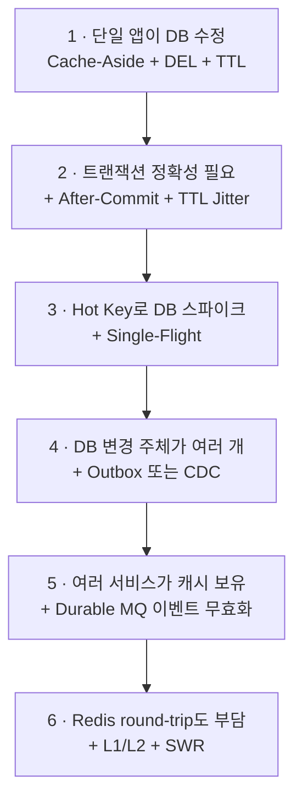

# 정합성 수준

정합성 요구를 먼저 정하면 전략이 거의 결정된다.
"어떤 기법이 좋은가"가 아니라 **"얼마나 오래된 데이터를 허용할 수 있는가"**에서 시작한다.

## 수준별 권장 구성

| 수준 | 요구사항 | 권장 구성 | 예시 데이터 |
|-----|--------|---------|-----------|
| Level 0 | 몇 분 전 데이터여도 무방 | Cache-Aside + TTL Only | 공지사항, 통계, 지역 코드, UI 메타데이터 |
| Level 1 | 평소 거의 즉시, 장애 시 몇 분 stale 허용 | + After-Commit 무효화 | 일반 업무 데이터 |
| Level 2 | 무효화 유실까지 막아야 함 | + Outbox/CDC + Durable MQ + 멱등 무효화 | 권한, 과금 정책 |
| Level 3 | 본인 쓰기 직후 조회는 반드시 최신 | + 쓰기 주체 캐시 우회 | 사용자 본인 설정 |
| Level 4 | 모든 사용자에게 즉시 최신값 | **캐시 사용 자체를 재검토** | 결제 승인 상태 |

**대부분의 일반 서비스는 Level 1이면 충분하다.**

## stale의 두 축 — 지속시간과 크기

TTL은 stale의 **지속시간**만 제한한다. **크기는 제한하지 못한다.**

| 축 | 상한 | 의미 |
|---|-----|-----|
| 지속시간 | TTL | 잘못된 값이 살아있는 최대 시간 |
| 크기(magnitude) | **없음** | 무효화 1건이 실패하면 1년 전 값을 TTL 내내 서빙할 수 있다 |

Uber는 CacheFront 사례에서 이 구분을 명시한다.
"TTL이 10분이니 최대 10분 뒤처진 값"이 아니라 **"최대 10분 동안 임의로 오래된 값"**이다.

## Read-after-write는 별도 문제다

같은 데이터라도 요구 수준이 다를 수 있다.

| 관점 | 요구 |
|-----|-----|
| 본인이 저장 후 즉시 조회 | 반드시 최신값 |
| 다른 사용자가 조회 | 100ms 정도 stale 허용 가능 |

전체 시스템에 강한 일관성을 만드는 것보다 read-your-writes만 보장하는 편이 훨씬 싸다.

단, 두 가지를 구분해야 한다.

| 문제 | 원인 | 대응 |
|-----|-----|-----|
| 캐시가 기존 값을 반환 | 무효화 지연·유실 | 해당 세션의 캐시 우회 |
| replica가 기존 값을 반환 | 복제 지연 | 해당 조회를 primary로 라우팅 |

캐시를 우회해도 replica 지연이 남으면 여전히 기존 값을 읽는다. **두 대응은 별개다.**

> CDC 기반 무효화만으로는 read-own-writes가 깨진다.
> Uber도 이 때문에 CDC에 더해 쓰기 경로 무효화를 함께 둔다.

## 규모별 진화 경로

기술 수준 순서로 도입하는 것이 아니라 **필요가 생길 때 추가**한다.

소규모 모놀리식에 Outbox·Kafka·CDC를 넣으면 얻는 정합성보다 운영 복잡도가 더 크다.

## Reference

- [Uber - How Uber serves over 150 million reads (CacheFront)](https://www.uber.com/us/en/blog/how-uber-serves-over-150-million-reads/)
- [AWS - Caching patterns](https://docs.aws.amazon.com/whitepapers/latest/database-caching-strategies-using-redis/caching-patterns.html)
