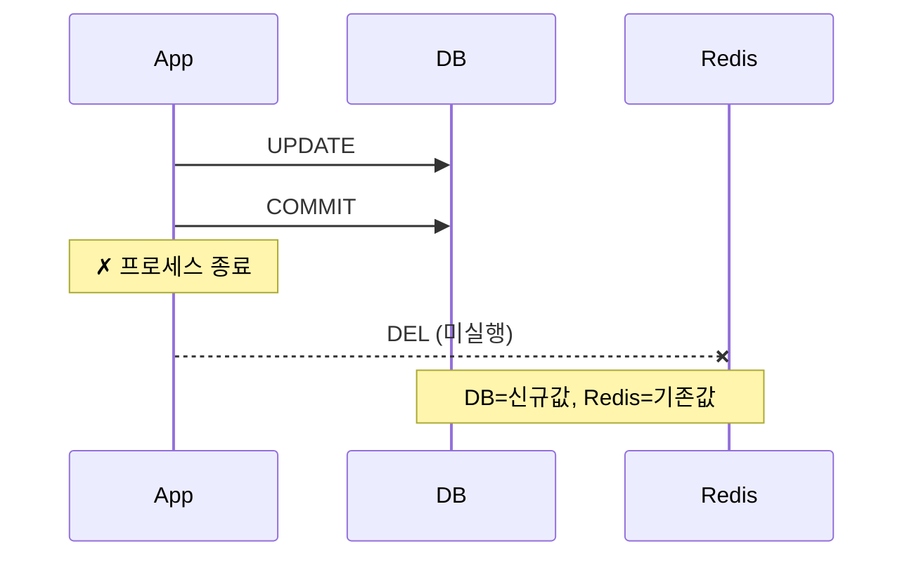
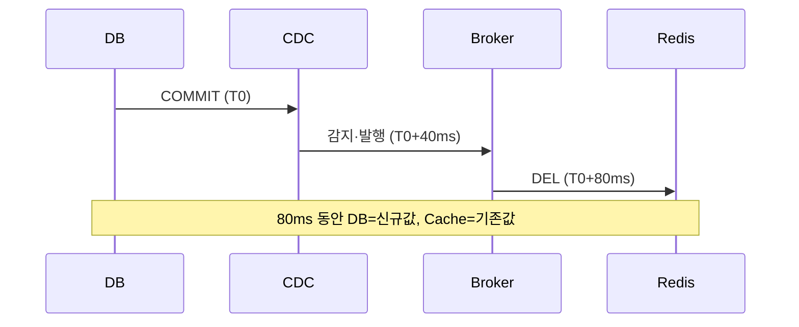
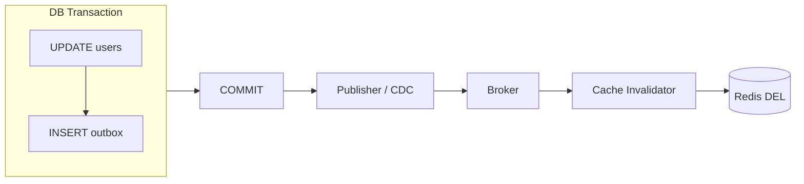
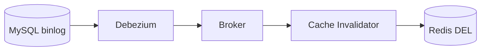
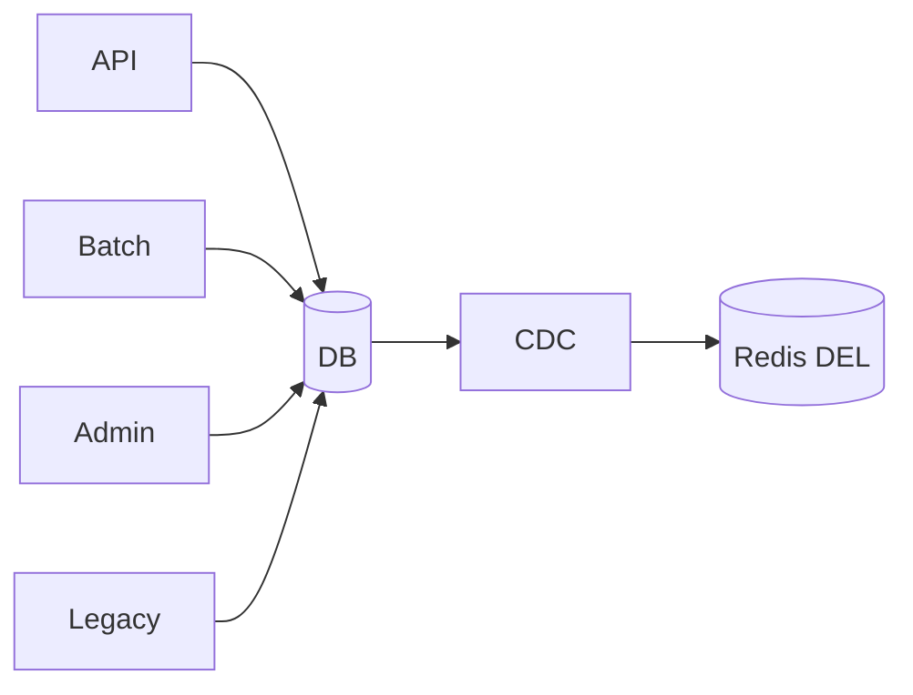

# Dual-Write 문제

DB와 Redis는 별도 시스템이다. 하나의 트랜잭션으로 묶을 수 없다.



두 시스템에 각각 써야 하는데 한쪽만 성공할 수 있다. 이것이 **dual-write problem**이다.

## 무엇이 해결되고 무엇이 남는가

| 구성 | 해결하는 것 | 남는 것 |
|-----|-----------|--------|
| 동기 `DEL` | 없음 | 커밋 후 종료 시 무효화 유실 |
| After-Commit `DEL` | 커밋 전 stale 재적재 | 커밋 후 종료 시 무효화 유실 |
| Outbox | **이벤트 자체의 유실** | 중복 발행, 전파 지연 |
| CDC | **이벤트 자체의 유실**, 변경 주체 누락 | 중복 발행, 전파 지연 |

**Outbox와 CDC는 이벤트 유실을 막을 뿐 stale window를 0으로 만들지 않는다.**



결국 eventual consistency다.

## Transactional Outbox

DB 변경과 이벤트 저장을 같은 트랜잭션에 넣는다.

```sql
BEGIN;
UPDATE users SET username = ? WHERE user_id = ?;
INSERT INTO outbox (event_type, aggregate_id, payload) VALUES ('USER_UPDATED', 100, ?);
COMMIT;
```



"DB는 변경됐는데 이벤트 자체가 없는" 상황을 제거한다. 발행기가 죽어도 outbox 행이 남는다.

### 비용

| 항목 | 내용 |
|-----|-----|
| at-least-once | 발행 후 기록 전 종료 시 **중복 발행**. 컨슈머 멱등성 필수 |
| 발행 누락 | 개발자가 `INSERT outbox`를 빠뜨리기 쉽다 |
| 테이블 운용 | outbox는 큐로만 사용. Debezium은 UPDATE를 경고/오류로 처리, DELETE는 필터링 |
| 정리 부담 | 처리 완료된 행의 cleanup이 별도 작업 |

## CDC

outbox 테이블 없이 DB 변경 로그를 직접 관찰한다.



DB를 수정하는 주체가 여러 개일 때 유용하다.



각 애플리케이션마다 무효화 코드를 넣으면 하나라도 누락된다.
CDC는 **DB에 실제 변경이 발생했다는 사실 자체**를 기준으로 한다.

## 전달 보장 — 중복보다 유실이 위험하다

캐시 삭제는 **멱등**하다. `DEL` 을 1번 하든 10번 하든 결과가 같다.

| | 결과 |
|---|-----|
| `DEL` 2번 | 캐시 미스 1회 추가. 무해 |
| `DEL` 0번 | **오래된 데이터를 계속 제공** |

따라서 `at-most-once`보다 **`at-least-once` + 멱등 무효화**가 적합하다.

> **Kafka의 exactly-once는 Redis 같은 외부 시스템이 종점이면 성립하지 않는다.**
> Kafka EOS는 오프셋이 내부 토픽 메시지라 출력과 같은 트랜잭션에 묶이는 Kafka→Kafka에서만 성립한다.
> 외부 저장소는 오프셋과 출력을 같은 곳에 저장할 수 없어 기본값이 at-least-once다.

## 장애 시나리오 비교

| 장애 | 동기 DEL | Redis Pub/Sub | Durable MQ | Outbox+MQ | CDC |
|-----|---------|--------------|-----------|----------|-----|
| 커밋 후 앱 종료 | stale | stale | 발행 전이면 stale | **복구 가능** | **복구 가능** |
| Redis 순간 장애 | DEL 실패 | 전달 실패 | 재시도 | 재시도 | 재시도 |
| Consumer 중단 | 해당 없음 | **유실** | backlog | backlog | backlog |
| 중복 이벤트 | 해당 없음 | 가능 | 가능 | 가능 | 가능 |
| 최종 안전장치 | TTL | TTL | TTL | TTL | TTL |

모든 구성에서 [TTL](ttl.md)이 최종 안전장치로 남는다.

## Reference

- [AWS - Transactional outbox pattern](https://docs.aws.amazon.com/prescriptive-guidance/latest/cloud-design-patterns/transactional-outbox.html)
- [microservices.io - Transactional outbox](https://microservices.io/patterns/data/transactional-outbox.html)
- [Debezium - Outbox Event Router](https://debezium.io/documentation/reference/stable/transformations/outbox-event-router.html)
- [Apache Kafka - Message Delivery Semantics](https://kafka.apache.org/documentation/#semantics)
