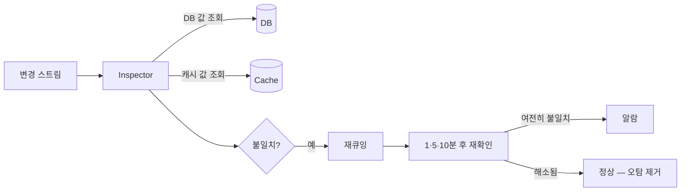

# 측정

기법 선택보다 상위 원칙이 있다.

> **무효화 유실률을 상시 측정하는 채널을 갖는 것.**

Meta와 Uber가 각각 다른 시기에 같은 결론에 도달했다.
무효화는 반드시 실패하므로, 실패를 **감지할 수 있는가**가 전략의 품질을 결정한다.

## Hit Ratio만 보면 안 된다

```text
Hit Rate = 98%
```

인데 DB가 부하를 견디지 못한다면 다음 중 하나다.

- 2%의 miss가 특정 hot key에 집중된다
- 만료 순간 순간적으로 대량 조회가 발생한다

평균값으로는 보이지 않는다.

## 지표 목록

| 지표 | 무엇을 알 수 있는가 |
|-----|------------------|
| Cache Hit / Miss Rate | 캐시의 기본 효율 |
| DB Query Count | 캐시가 실제로 줄인 부하 |
| Stale Read Count | 무효화 전략의 정합성 품질 |
| Cache SET / DEL Count | 쓰기 부하와 무효화 빈도 |
| **Invalidation Failure** | 무효화 유실 발생 여부 |
| **Invalidation Lag** (P50/P95/P99/MAX) | 이벤트 기반 무효화의 실제 지연 |
| Stampede Count | 동시 MISS로 인한 DB 동시 조회 |
| Cache Load Time | MISS 시 응답 지연 |

Cache-Aside에서는 **miss가 곧 DB 조회**이므로 `DB Query Count`가 miss 수의 대리 지표가 된다.

## 직접 만들지 않는다 — 프레임워크가 제공하는 것

| 지표 | 제공 수단 |
|-----|---------|
| hits · misses · puts · deletes · lockWaitDuration | `RedisCacheManagerBuilder.enableStatistics()` → `RedisCache.getStatistics()` |
| Micrometer 연동 | Actuator의 `RedisCacheMeterBinderProvider`, `CacheMetricsRegistrar` |
| DB 실행 문장 수 | `hibernate.generate_statistics=true` → `Statistics.getPrepareStatementCount()` |

직접 카운터를 만들기 전에 위를 먼저 확인한다.
**프레임워크가 주지 않는 것만** 직접 만든다.

| 직접 만들어야 하는 것 | 이유 |
|-------------------|-----|
| 무효화 **실패** 건수 | `CacheStatistics`는 성공만 집계한다 |
| 프로그래밍 방식 무효화 실패 | `CacheErrorHandler`는 애노테이션 경로만 감싼다 |
| Stale Read 건수 | 캐시 값과 DB 값을 대조해야 알 수 있다 |
| Invalidation Lag | 커밋 시각과 삭제 시각의 차이 |

## Invalidation Lag

이벤트 기반 무효화에서 정합성을 가장 직접적으로 보여주는 지표다.

```mermaid
gantt
    dateFormat SSS
    axisFormat %L ms
    title Invalidation Lag 구간
    section 전파
    DB commit          :milestone, m1, 000, 0d
    Broker 발행        :a1, 000, 10ms
    Consumer 수신      :a2, after a1, 30ms
    Redis DEL          :a3, after a2, 5ms
```



평균이 아니라 **P95·P99·MAX**를 본다.
평균 45ms여도 P99가 3초라면 그 구간의 사용자는 stale을 본다.

## 유실을 어떻게 감지하는가

무효화 유실은 **아무 로그도 남기지 않는다.** 그래서 별도 채널이 필요하다.



핵심은 **즉시 알람하지 않고 재확인**하는 것이다.
전파 지연과 진짜 유실을 구분해야 오탐이 0이 된다.

Uber의 Cache Inspector는 같은 CDC 파이프라인을 1분 지연시켜
binlog 값과 캐시 값을 비교하고, 테이블별 mismatch율과 staleness 히스토그램을 만든다.
이 근거를 확보한 뒤에야 특정 테이블 TTL을 24시간으로 늘리면서 hit rate 99.9%+를 달성했다.

## 두 가지 경고 사례

| 사례 | 교훈 |
|-----|-----|
| 에러 핸들링 경로에 숨은 버그 | 예외 처리기가 "캐시 버전이 더 오래된 경우에만 삭제"하도록 되어 있어 아무 일도 하지 않았고, stale이 **무기한** 남았다 |
| 로그가 없다는 것 자체가 신호 | 무효화 이벤트가 아예 도착하지 않은 경우, 실패 로그도 남지 않는다 |

무효화 경로의 **성공 로그**만 보면 유실을 영원히 놓친다.

## 결과 기록 원칙

측정 전에 값을 추정해 기입하지 않는다.

| 원칙 | 내용 |
|-----|-----|
| 측정 조건을 함께 기록 | 일시, OS/JDK/Boot/Redis/MySQL 버전, 요청 수, 동시성, Read:Write 비율, TTL |
| 미측정은 빈칸이 아니라 `미측정` | 빈칸은 0으로 오해된다 |
| 효과 없음도 기록 | "no significant change"도 결과다 |

## Reference

- [Meta - Cache Made Consistent (engineering blog)](https://engineering.fb.com/2022/06/08/core-infra/cache-made-consistent/)
- [Uber - How Uber serves over 150 million reads](https://www.uber.com/us/en/blog/how-uber-serves-over-150-million-reads/)
- [Bronson et al., TAO, USENIX ATC '13](https://www.usenix.org/system/files/conference/atc13/atc13-bronson.pdf)
