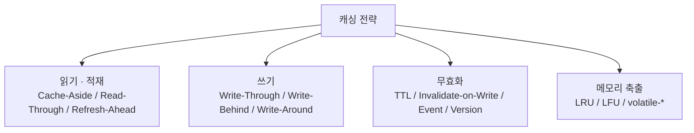
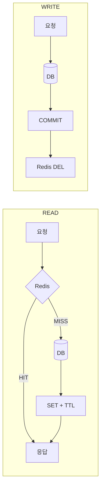

# 개요 — 두 개의 축

## 문제 정의

```text
DB    = Source of Truth
Redis = 부하 감소용 복제본

READ   Cache hit → 반환 / miss → DB 조회 후 Cache 저장
CUD    DB 변경 → 기존 Cache를 어떻게 처리할 것인가?
```

**원본을 캐시에 어떻게 복제하고, 언제 무효화하며, 장애 시 어디까지 보장할 것인가**의 문제다.

## 네 개의 축

캐시 설계는 흔히 "읽기 전략 / 쓰기 전략"으로 소개된다.
그런데 이 둘만으로는 **"DB가 바뀌었을 때 옛 캐시를 언제 지우는가"**도,
**"메모리가 꽉 차면 무엇이 밀려나는가"**도 결정되지 않는다.



| 축 | 결정하는 것 | 문서 |
|---|-----------|-----|
| 읽기·적재 | 누가 DB를 읽는가 | [read/](../read/) |
| 쓰기 | 쓰기가 캐시를 거치는가 | [write/](../write/) |
| **무효화** | **옛 캐시를 언제 어떻게 지우는가** | [invalidation/](../invalidation/) |
| **축출** | **메모리가 부족하면 무엇이 밀려나는가** | [eviction/](../eviction/) |

`Write Around`는 "캐시에 쓰지 않는다"만 정할 뿐, 옛 캐시를 언제 지울지는 정하지 않는다.
그 빈칸을 채우는 것이 무효화 전략이다.

그리고 무효화를 아무리 잘 설계해도, **우리가 지우지 않았는데 사라지는 경로**가 하나 더 있다.
그것이 축출이다.

> 이 저장소의 주제를 정확히 이름 붙이면 "Redis 만료 전략"이 아니라
> **Caching Pattern + Cache Invalidation Strategy** 다.

이름의 출처와 공식 정의는 [canonical-patterns.md](canonical-patterns.md) 참조.

## 읽기 전략

| 전략 | DB 조회 주체 | 캐시 장애 시 | 문서 |
|-----|------------|------------|-----|
| Look Aside (Cache Aside) | 애플리케이션 | 서비스 유지 | [look-aside](../read/look-aside.md) |
| Read Through | 캐시 | **서비스 중단 위험** | [read-through](../read/read-through.md) |
| Refresh Ahead | 캐시 (만료 전 선갱신) | 서비스 중단 위험 | [refresh-ahead](../read/refresh-ahead.md) |

### 이름이 말해주는 것

전치사가 캐시의 위치를 가리킨다.

| 단어 | 뜻 | 캐시의 위치 |
|-----|---|-----------|
| `aside` | 옆에, 비켜서 | 앱↔DB 경로 **옆**. 앱이 둘을 각각 상대한다 |
| `through` | 통과해서 | 요청이 캐시를 **통과해** DB로 간다. 경로 **위**에 있다 |
| `around` | 우회해서 | 쓰기가 캐시를 **돌아서** DB로 간다 |
| `behind` / `back` | 뒤에, 나중에 | DB 반영이 **뒤로** 미뤄진다 |
| `ahead` | 미리, 앞서 | 만료 **전에** 미리 갱신한다 |

Oracle Coherence는 `through` 계열을 **inline caching**이라 부르며 cache-aside와 대비시킨다.
`aside`는 캐시가 경로 밖에 있고, `through`는 경로 위에 있다.

## 쓰기 전략

| 전략 | 쓰기 대상 | 유실 위험 | 문서 |
|-----|---------|---------|-----|
| Write Around | DB만 | 없음 | [write-around](../write/write-around.md) |
| Write Through | 캐시 + DB (동기) | 없음 | [write-through](../write/write-through.md) |
| Write Back | 캐시 → 배치로 DB | **flush 전 유실** | [write-back](../write/write-back.md) |

## 조합

| 조합 | 특징 |
|-----|-----|
| **Look Aside + Write Around** | **가장 일반적.** 이 저장소의 기준 구성 |
| Read Through + Write Around | 항상 DB에 쓰므로 정합성 안전장치가 강하다 |
| Read Through + Write Through | 쓸 때 캐시에 먼저 쓰므로 읽을 때 최신 보장 (예: AWS DAX) |
| Look Aside + Write Back | 쓰기 부하는 낮지만 유실 위험 — 로그성 데이터 한정 |

## 기준 구성

이 저장소는 `Look Aside + Write Around + 무효화 + TTL`을 기준으로 삼는다.



레거시가 아니라 **여전히 표준적인 기본값**이다.
규모가 커질 때 달라지는 것은 이 패턴을 버리는 것이 아니라 안전장치를 덧붙이는 것이다
→ [consistency-levels.md](consistency-levels.md)

## 저장 대상 선별

| 지침 | 내용 |
|-----|-----|
| 자주 읽히고 자주 바뀌지 않는 데이터 | 캐시 효과가 가장 크다 |
| 파레토(8:2) | 20%의 데이터만 캐싱해도 대부분의 요청을 커버한다 |
| 민감 정보 제외 | 캐시는 휘발성이며 접근 통제가 DB보다 약하다 |
| 캐시는 성능 장치이지 영속 저장소가 아니다 | 캐시 장애 시 지연은 있어도 중단되지 않도록 설계한다 |

## Reference

- [Redis - Cache-aside](https://redis.io/docs/latest/develop/use-cases/cache-aside/)
- [AWS - Caching patterns](https://docs.aws.amazon.com/whitepapers/latest/database-caching-strategies-using-redis/caching-patterns.html)
