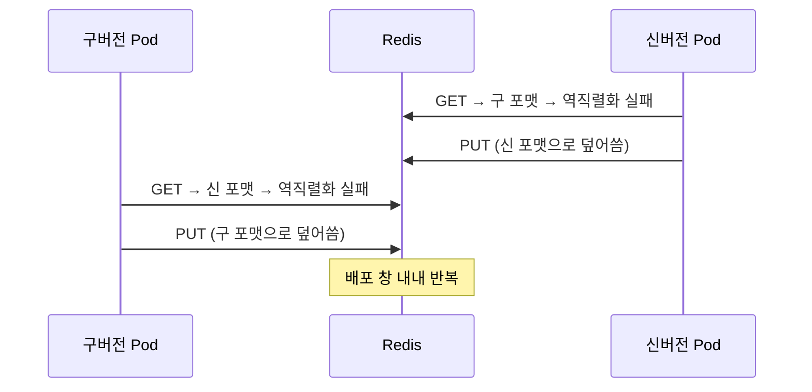
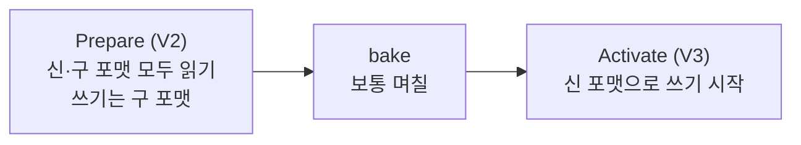

# 캐시 스키마 변경

> **캐시 문제가 아니라 배포 프로토콜 문제다.**

롤링 배포를 쓰는 이상 **구/신 버전 공존은 선택이 아니라 전제**다.
Kubernetes `Deployment` 기본 전략이 `RollingUpdate`이고 `maxSurge`/`maxUnavailable` 기본값이 25%다.

AWS Builders' Library의 표현:

> "The writer and the reader could be running different versions of the software.
> As a result, they could interpret the data differently. **The reader may even fail to read the data altogether, causing an outage.**"
> "the most common reason for not being able to roll back is **a change of protocol**"

AWS는 캐시를 별도 취급하지 말라고 명시한다 — **캐시된 데이터를 영속 저장소처럼 취급**하라는 것이다.

---

## fail-open은 안전장치이지 해결책이 아니다

역직렬화 실패를 캐시 미스로 강등하는 것은 **최소 안전장치**다.
Google App Engine memcache의 `ErrorHandler` javadoc이 이 설계 의도를 명확히 적는다.

> "This normally indicates **an application upgrade** since the cache entry was stored,
> and should thus be **treated as a cache miss**."

여기서 멈추면 안 된다. 미스 강등 후 무슨 일이 일어나는지가 핵심이다.

### 구/신 write thrash



`@Cacheable`은 미스 시 메서드를 실행하고 **같은 키를 자기 포맷으로 다시 쓴다.**
따라서 배포 중 **히트율이 0에 수렴하면서 Redis 쓰기 QPS는 오히려 증가**한다.

AWS도 같은 위험을 지적한다.

> "simply detecting a version mismatch and throwing the data away can lead to
> **mass refreshes of caches**" — downstream을 throttle/brownout 시킬 수 있다.

즉 **미스 강등은 의도치 않은 캐시 flush와 부하 프로파일이 같다.**
다른 점은 flush가 명시적 결정인 반면, 미스 강등은 **배포 트리거로 아무도 모르게** 같은 일을 한다는 것이다.

### `sync = true` 제약

`@Cacheable(sync = true)`에서는 get과 put이 결합된 단일 단계라
**get 실패를 삼켜도 그 호출은 캐시에 다시 채워지지 않는다.** javadoc이 직접 경고한다.

---

## 배포 시나리오별 위험

전제: 롤링 배포, 공유 Redis, 구버전 V1과 신버전 V2 동시 가동.

| 전략 | V2가 V1 값을 읽을 때 | 무효화 | 배포 중 DB 부하 | 잔여 위험 |
|-----|------------------|------|-------------|---------|
| **A. 대응 없음** (Spring 기본) | **요청 실패** | 정상 | 낮음(요청이 실패하므로) | 최악. TTL 없으면 롤백 후에도 영구 실패 |
| **B. 미스 강등만** | 미스 → 신 포맷 덮어씀 | 정상 | **높음.** 히트율 ≈ 0 | **양방향 thrash.** 쓰기 QPS 증가 |
| **C. 키 버전** (`prefixCacheNameWith`) | 서로 다른 키 — 충돌 없음 | **⚠️ V1의 evict가 V2 키에 안 닿음 → stale** | 중간 | 메모리 2배, **구버전 키 정리 필요** |
| **D. 값에 스키마 버전 + 미스 강등** | 버전 불일치 감지 → 미스 | 정상 | 높음 (B와 동일) | B와 같은 thrash |
| **E. 값 버전 + 구버전 읽기 지원** | **정상 읽기** | 정상 | 낮음 | V1→V2 방향만 해결. 롤백 미확보 |
| **F. unknown field 보존 포맷** | **정상** (모르는 필드 무시) | 정상 | **거의 없음** | 필드 추가·삭제만. 타입 변경 불가 |
| **G. 2단계 배포** | 정상 | 정상 | 거의 없음 | Prepare 100% 미적용 시 즉시 장애 |
| **H. 전체 flush** | 공존 없음 | N/A | **최고** | modal behavior 붕괴 |

### 권고 조합

| 수준 | 구성 |
|-----|-----|
| **최소선** | **B** — 어떤 전략을 쓰든 예외 전파는 항상 차단 |
| **표준** | **F + B** — unknown field 관용 포맷 + 안전장치 |
| 타입 변경 등 F로 안 되는 변경 | **G**(2단계 배포) 또는 **C**(키 버전) + TTL 소멸 |
| H | 캐시 없이 SLA를 만족한다는 **측정된 증거가 있을 때만** |

---

## 2단계 배포 (AWS 표준 절차)



| 단계 | 내용 |
|-----|-----|
| Prepare | 모든 인스턴스가 **신·구 포맷을 모두 읽을 수** 있게 만든다. 쓰기는 구 포맷 유지 |
| bake | 두 단계를 한꺼번에 롤백할 수 없으므로 **며칠** 간격을 둔다 |
| Activate | 신 포맷으로 쓰기 전환. Prepare 덕분에 모든 인스턴스가 읽을 수 있다 |

### 세 가지 함정

| 함정 | 내용 |
|-----|-----|
| **Prepare 누락** | 단 한 대라도 빠지면 Activate에서 그 인스턴스가 읽기 실패. `minimumHealthyHosts` 같은 "일정 비율 성공" 설정을 그대로 쓰면 안 된다 |
| **bake 생략** | 두 변경을 한꺼번에 롤백할 수 없다 |
| **단일 인스턴스 테스트 환경** | 배포가 atomic이 되어 **버전 공존 버그를 구조적으로 검출할 수 없다.** AWS가 실제 실패 사례로 기록 |

순서 규칙: **"readers go before writers while rolling forward, writers before readers while rolling backward."**

캐시가 DB보다 유리한 유일한 지점은 **TTL이 backfill을 대신해준다**는 것이다.

---

## 값에 버전을 심는다 — AWS 1순위 권고

> "With each change, we **explicitly assign a distinct version to serializers**.
> We do this **independent of source code or build versioning**.
> We also **store the serializer version with the serialized data or in the metadata.**
> Older serializer versions continue to function in the new software.
> We find it's usually helpful to **emit a metric for the version of data written or read.**"

마지막 문장이 대부분의 캐시 문서가 빠뜨리는 항목이다.
**버전별 읽기·쓰기 건수를 메트릭으로 내보내지 않으면 배포 중 무슨 일이 벌어지는지 관측할 수 없다.**

그리고 unknown field를 보존하는 포맷을 쓰면:

> "Thus, **a two-phase deployment isn't necessary.**"

---

## 키에 버전을 넣는 방법

Spring Boot는 한 줄로 전역 캐시 버전 스위치를 제공한다.

```yaml
spring:
  cache:
    redis:
      key-prefix: "v2:"
```

자동설정이 `prefixCacheNameWith(keyPrefix)`를 호출하므로 최종 키는 `v2:{cacheName}::{key}` 가 된다.
직접 `computePrefixWith`를 구현하기 전에 이 표준 프로퍼티를 먼저 확인한다.

캐시별로 다르게 하려면 `computePrefixWith`를 쓴다.

```java
.computePrefixWith(cacheName -> schemaVersionOf(cacheName) + ":" + cacheName + "::")
```

### 청구서 두 장

| 비용 | 내용 |
|-----|-----|
| **무효화 누락** | 구 namespace가 보낸 evict가 신 namespace에 닿지 않는다. **카나리·단계 배포가 이 창을 넓힌다** |
| **키 쓰레기** | 구버전 키가 남아 eviction 압력이 올라간다 |

> **구버전 키 정리 방법을 정하지 않은 키 버전 전략은 미완성이다.**

정리 방법은 사실상 셋뿐이다.

| 방법 | 판단 |
|-----|-----|
| TTL로 자연 소멸 | **가장 안전. 대부분의 경우 정답** |
| `SCAN` + `UNLINK` 배치 | 가능하나 별도 도구 필요 |
| eviction에 맡김 | 캐시 효율이 떨어진다 |

### ⚠️ `clear()`가 `KEYS`를 쓴다

`RedisCache#clear()`의 **기본 구현이 `KEYS` + `DEL`** 이다.
Redis 공식 문서의 경고:

> "Use extreme care when using this command in production environments.
> It may ruin performance when it is executed against large databases...
> **Don't use `KEYS` in your regular application code.**"

즉 캐시 버전 정리 목적으로 `clear()`를 호출하면 **그 자체가 사고**다.

```java
RedisCacheWriter.nonLockingRedisCacheWriter(connectionFactory, BatchStrategies.scan(1_000))
```

---

## 스키마 변경은 우리 코드만의 문제가 아니다

**DTO를 하나도 바꾸지 않아도 캐시 포맷은 깨질 수 있다.**

| 사례 | 내용 |
|-----|-----|
| 라이브러리 업그레이드 | Spring Data Redis 2.6 → 2.7에서 `GenericJackson2JsonRedisSerializer`의 default typing 설정이 바뀌어 **기존 JSON 전량 읽기 불가** (이슈 #2361) |
| JDK 업그레이드 | 통제하지 않는 자료구조(Java collection 등)를 reflection으로 직렬화하면 JDK 내부 구현 변경으로 역직렬화 실패 |
| 직렬화기 교체 | Jackson 2 → 3 전환은 출력이 달라진다 |

**직렬화 라이브러리·프레임워크 업그레이드도 스키마 변경과 같은 위험 카테고리다.**

---

## 되돌리기 어려운 결정

| # | 결정 | 왜 되돌리기 어려운가 |
|---|-----|------------------|
| 1 | JDK 네이티브 직렬화로 출발 | 다른 포맷으로 옮기는 것 자체가 스키마 변경. unknown field 보존이 없어 2단계 배포 무력화 불가 |
| 2 | **값에 버전 필드 없이 출발** | 나중에 넣으려면 "버전 없는 값"과 "있는 값"을 구분해야 하고, 그 구분이 또 스키마 변경이다. **첫 배포부터 넣어야 한다** |
| 3 | Protobuf 필드 번호 재사용 | wire-unsafe. `reserved` 없이는 되돌릴 수 없는 데이터 오독 |
| 4 | **TTL 없이 운영** | TTL이 있으면 실수도 TTL 안에 소멸한다. **TTL은 스키마 실수에 대한 가장 값싼 보험** |
| 5 | Prepare와 Activate를 한 배포에 합침 | 두 단계를 한꺼번에 롤백할 수 없다 |
| 6 | 단일 인스턴스 테스트 환경 | 버전 공존 버그를 구조적으로 검출 불가 |

---

## 검증

```
□ 절반만 배포한 상태에서 구/신 공존을 재현했는가
□ 롤백 배포까지 수행해봤는가
□ 배포 중 캐시 히트율과 Redis 쓰기 QPS를 관측했는가
□ 읽은/쓴 데이터의 스키마 버전을 메트릭으로 내보내는가
□ clear()가 KEYS가 아니라 SCAN을 쓰는가
□ 구버전 키 정리 방법이 정해져 있는가
□ 테스트 환경 인스턴스가 2대 이상인가
```

## Reference

- [Amazon Builders' Library - Ensuring rollback safety during deployments](https://d1.awsstatic.com/builderslibrary/pdfs/ensuring-rollback-safety-during-deployments.pdf)
- [Amazon Builders' Library - Caching challenges and strategies](https://aws.amazon.com/builders-library/caching-challenges-and-strategies/)
- [AWS Well-Architected - Ensure backwards compatibility for data store and schema changes](https://docs.aws.amazon.com/wellarchitected/latest/devops-guidance/dl.ads.5-ensure-backwards-compatibility-for-data-store-and-schema-changes.html)
- [Google App Engine - memcache ErrorHandler](https://github.com/GoogleCloudPlatform/appengine-java-standard/blob/main/api/src/main/java/com/google/appengine/api/memcache/ErrorHandler.java)
- [Redis - KEYS](https://redis.io/docs/latest/commands/keys/)
- [Spring Data Redis - Redis Cache](https://docs.spring.io/spring-data/redis/reference/redis/redis-cache.html)
- [Shopify IdentityCache #535 (미채택 제안)](https://github.com/Shopify/identity_cache/issues/535)
- [spring-data-redis #2361](https://github.com/spring-projects/spring-data-redis/issues/2361)
