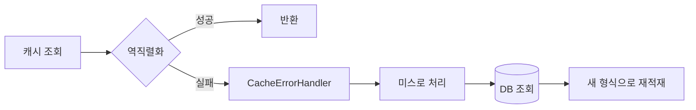

# 직렬화

> **되돌리기 가장 어려운 결정이다.**

무효화 전략은 바꿔도 기존 캐시가 TTL로 사라지면 끝이다.
직렬화는 **이미 저장된 바이트의 형식**을 정하므로, 바꾸는 순간 기존 캐시 전부가 읽히지 않는다.

## 먼저 정할 것 — fail-open

포맷을 고르기 전에 이 규칙을 먼저 못 박는다.

> **역직렬화 실패는 예외가 아니라 캐시 미스로 처리한다.**

이 규칙이 있으면 스키마 변경 실패가 **데이터 손상이 아니라 일시적 히트율 저하**로 강등된다.
[cache-failure-modes.md](cache-failure-modes.md)의 `CacheErrorHandler`가 이 경로를 담당한다.



이것 없이는 배포 중 스키마가 바뀌는 순간 **요청이 실패한다.**

> **⚠️ 다만 fail-open은 안전장치이지 해결책이 아니다.**
> 미스 강등 후 `@Cacheable`이 같은 키를 자기 포맷으로 덮어쓰므로,
> 롤링 배포 중 구/신 버전이 서로를 계속 갈아엎어 **히트율 0 + 쓰기 QPS 증가**가 발생한다.
> 반드시 키 버전 또는 값 버전과 **조합**해야 한다 → [schema-evolution.md](schema-evolution.md)

---

## 포맷 비교

| 포맷 | 크기(JSON=1.0)¹ | 스키마 진화 | redis-cli로 읽기 | 언어 간 | JVM 전용 |
|-----|--------------|-----------|---------------|-------|--------|
| **JSON** | 1.0 | 라이브러리 의존² | ★ 그대로 | ★ | |
| MessagePack | ~0.60 | **스펙에 개념 없음** | ✗ | ★ | |
| CBOR | ~0.62 | **스펙에 개념 없음** | ✗ | ★ (RFC 8949) | |
| **Protocol Buffers** | ~0.24 | **★ 최상** | ✗ | ★ | |
| Avro | ~0.13 | ★ 최상, **단 조건부**³ | ✗ (스키마 없이 해독 불가) | ★ | |
| Kryo | 작음 | 직렬화기 선택에 종속 | ✗ | ✗ | ● |
| FlatBuffers | **1.58** | 끝에만 추가 가능 | ✗ | ★ | |
| Java 기본 | 큼 | **최악** | ✗ | ✗ | ● |

¹ arXiv:2201.03051 소형 문서 실측 2건 기준. **순위 참고용이지 절대 수치가 아니다.**
² Jackson `FAIL_ON_UNKNOWN_PROPERTIES` 기본값이 **true**라 끄지 않으면 필드 추가 시 구버전이 예외를 던진다.
³ 읽을 때 **writer 스키마가 반드시 필요**하다. 값에 스키마 ID를 붙이거나 레지스트리가 있어야 한다.

### 크기에 대한 세 가지 오해

| 오해 | 사실 |
|-----|-----|
| 바이너리는 항상 JSON보다 작다 | **FlatBuffers +58%, BSON +41%**. 우위는 "바이너리"가 아니라 **스키마 보유**에서 나온다 |
| MessagePack/CBOR은 스키마 진화를 지원한다 | 두 스펙 모두 **호환성 개념 자체가 없다.** Jackson을 쓰면 JSON과 완전히 동일하게 동작한다 |
| 바이트를 줄이면 메모리가 준다 | 할당자 단위(jemalloc size class, memcached 슬랩)를 못 넘으면 **절감이 0**일 수 있다 |

---

## 압축 — 포맷보다 임계값이 중요하다

**Redis는 값을 압축하지 않는다.** `rdbcompression`은 RDB 파일 전용이고 인메모리 표현을 바꾸지 않는다.
압축은 전적으로 클라이언트 책임이다.

### 작은 값은 압축하면 오히려 커진다

```text
JSON 34B → gzip -9 → 54B
```

그래서 실무 구현은 **임계값**을 둔다.

| 구현 | 압축 임계값 |
|-----|-----------|
| Netflix EVCache | **120 bytes** |
| spymemcached 기본 | 16 KB |

Netflix가 최적화한 것은 포맷이 아니라 **압축 임계값과 알고리즘**이었다.
(EVCache 기본 경로는 여전히 Java 직렬화 + gzip/zstd다.)

### 알고리즘 선택

Silesia 코퍼스 실측(zstd 공식):

| 알고리즘 | 압축비 | 압축 MB/s | **복원 MB/s** |
|--------|------|---------|------------|
| lz4 | 2.10 | 675 | **3850** |
| snappy | 2.09 | 520 | 1500 |
| zstd -1 | **2.90** | 510 | 1550 |
| zlib -1 | 2.74 | 105 | 390 |

| 상황 | 선택 |
|-----|-----|
| 읽기 지배 · 지연이 중요 | **lz4** (복원 3850 MB/s) |
| 메모리 비용이 지배 | **zstd** (같은 압축 속도대에서 비율 우위) |
| gzip/zlib | 권장하지 않음 — 두 축 모두 열세 |

---

## 스키마 진화가 필요한 구간

**TTL 길이 × 워밍업 비용**으로 판단한다.

|  | 워밍업 비용 낮음 | 워밍업 비용 높음 |
|---|---------------|---------------|
| **TTL 짧음** (분 단위) | 진화 불필요. 버리고 재적재 | 진화 불필요하나 **재적재 부하 확인** |
| **TTL 김** (시간~일) | 키 버저닝으로 충분 | **★ 진화 능력 필수** |

TTL이 5분이면 구스키마 바이트가 5분 뒤 사라진다. 진화 요구가 거의 없다.
TTL이 하루면 롤링 배포 중 신버전이 **반드시 구버전 바이트를 읽게 된다.**

### "캐시는 유실 가능하니 버리면 된다"는 조건부다

Uber CacheFront 기준, 어떤 유스케이스가 **99.9% 히트율을 3K Redis 코어**로 처리하는데
같은 트래픽을 스토리지에서 직접 서빙하려면 **약 60K 코어**가 필요하다.

캐시를 통째로 버리면 백엔드 필요 용량이 **약 20배**가 된다.
**히트율이 용량 산정의 전제인 캐시에서는 이 명제가 성립하지 않는다.**

### 두 가지 대응 — 택일이 아니라 트레이드오프

| 방식 | 얻는 것 | 잃는 것 |
|-----|-------|-------|
| **키에 스키마 버전** (`user:v3:100`) | 구/신 버전이 다른 키 공간을 써 조율 불필요 | 배포 시 해당 엔트리군이 **100% 미스** |
| **포맷 진화 능력** | 콜드 스타트 없음 | 호환성 코드 유지 부담 |

---

## Spring에서의 선택

### `GenericJackson2Json` vs 타입별 직렬화기

| | `GenericJackson2JsonRedisSerializer` | `Jackson2JsonRedisSerializer<T>` |
|---|-----------------------------------|--------------------------------|
| 저장 형태 | `{"@class":"com.gmoon...User","id":1}` | `{"id":1}` |
| 타입 정보 | 페이로드에 FQCN 포함 | 설정에 타입 고정 |
| 패키지 이동 | **기존 캐시 전부 깨짐** | 영향 없음 |
| 제네릭 반환 | 유연 | 캐시별 타입 지정 필요 |
| 보안 | polymorphic 역직렬화 표면 존재 | 없음 |

`@class`는 **FQCN을 캐시 스키마의 일부로 만든다.** 리팩토링이 곧 캐시 무효화가 된다.

### `@class` 오버헤드는 계산 가능하다

`Id.CLASS` + `As.PROPERTY` 조합은 타입 대상 노드마다 `"@class":"<FQCN>",` 를 추가한다.
노드당 정확히 **`len(FQCN) + 12` 바이트**다.

```text
{"@class":"com.example.domain.user.UserResponse","id":1,"name":"kim"}   69 bytes
{"id":1,"name":"kim"}                                                   21 bytes
```

FQCN 36자 → 48바이트 증가, 원본 대비 **약 3.3배**.
Spring Data Redis 3.5.x는 `DefaultTyping.EVERYTHING`이라
**중첩 컬렉션의 각 요소 노드에도 붙어** 리스트 길이에 비례해 누적된다.

`typeHintPropertyName("@c")`로 **키**는 줄일 수 있으나 **값(FQCN)은 바꿀 수 없다.**
Spring Data Redis는 `Id.MINIMAL_CLASS`나 `Id.NAME`을 노출하지 않는다.

### 지금 확정된 사실

> `GenericJackson2JsonRedisSerializer`는 **Spring Data Redis 4.0부터 `@Deprecated(forRemoval=true)`** 이며
> Jackson 3(`tools.jackson`) 기반 `GenericJacksonJsonRedisSerializer`로 대체된다.

와이어 포맷 호환은 **보장되지 않는다.** 공식 마이그레이션 가이드:

> "The Jackson 3 serializer can produce JSON output that **differs from Jackson 2 output**.
> Continue using `GenericJackson2JsonRedisSerializer` to read existing values until those values have been migrated."

타이핑 범위도 `EVERYTHING` → `NON_FINAL`로 바뀌어 enum 캐싱이 깨지는 미해결 이슈가 있다.

이름이 뒤바뀌는 함정도 있다 — 3.5.x의 `JacksonObjectReader`는 Jackson 2용이지만
4.x의 같은 이름은 Jackson 3용이다. **컴파일은 통과하고 의미만 달라진다.**

`@class`가 박힌 캐시를 쓰고 있다면 **이 마이그레이션 자체가 캐시 포맷 변경 이벤트**다.
직렬화기 교체도 스키마 변경으로 간주해야 한다.

### Spring이 조용히 JDK 직렬화로 되돌리는 지점

**Boot의 캐시 기본 value serializer는 3.5.x·4.0.x 모두 `JdkSerializationRedisSerializer`다.**
Jackson 3 전환과 무관하게 바뀌지 않았다.

Spring Data Redis 공식 문서의 경고:

> "By default, `RedisCache` and `RedisTemplate` are configured to use **Java native serialization**.
> Java native serialization is known for allowing the running of remote code caused by payloads
> that exploit vulnerable libraries and classes... **do not use serialization in untrusted environments.**"

기본값으로 되돌아가는 경로가 두 개 있다.

| 경로 | 결과 |
|-----|-----|
| `cacheDefaults(...)`를 지정하지 않음 | 모든 캐시가 JDK 직렬화 |
| **정책에 없는 캐시명으로 `@Cacheable`** | `getMissingCache()`가 **런타임에 조용히 생성**하고 기본 설정(JDK)을 적용 |

```java
protected RedisCache getMissingCache(String name) {
    return isAllowRuntimeCacheCreation() ? createRedisCache(name, getDefaultCacheConfiguration()) : null;
}
```

**대응 — 조용히 넘어가지 않게 만든다.**

```java
builder.disableCreateOnMissingCache()
       .cacheDefaults(configWith(rejectingSerializer()))
```

미등록 캐시명은 캐시가 생성되지 않아 즉시 드러난다.
기본 설정에 도달하면 예외를 던지는 직렬화기를 두어 **JDK 직렬화로 흘러가는 경로 자체를 차단**한다.

### `activateDefaultTyping` 안전 설정 — 통념 3가지가 틀렸다

| 통념 | 사실 |
|-----|-----|
| `enableDefaultTyping` → `activateDefaultTyping` 치환이 보안 개선 | **무의미하다.** deprecated 메서드가 내부에서 기본 `LaissezFaire`를 넘겨 호출한다. 리네임 목적은 코드 검색성이었다 |
| `GenericJackson2JsonRedisSerializer`는 항상 `@class`를 붙인다 | **`ObjectMapper`를 넘기는 생성자는 default typing을 켜지 않는다.** 타이핑 책임이 사용자에게 넘어온다 |
| Spring Data Redis 4.0은 default typing이 기본 꺼짐 | **`GenericJacksonJsonRedisSerializer` 빌더 기준일 뿐이다.** `RedisSerializer.json()`은 4.x에서도 `enableUnsafeDefaultTyping()`을 호출한다 |

`LaissezFaireSubTypeValidator`는 **아무것도 검증하지 않는다.**

```java
public Validity validateSubType(...) { return Validity.ALLOWED; }
```

Jackson 3은 이 클래스를 **public API에서 제거**했다 —
*"its use can easily open up security holes"*.

> **`MapperFeature.BLOCK_UNSAFE_POLYMORPHIC_BASE_TYPES`를 켜도 Spring Data Redis 3.5.x 경로에서는 효과가 없다.**
> 검증기가 빌더 생성 시점에 캡처되어 config 경로를 우회하기 때문이다.

default typing이 꼭 필요하다면 allowlist를 명시한다.

```java
BasicPolymorphicTypeValidator.builder()
    .allowIfSubType("com.gmoon.")
    .build();
```

빈 빌더(`builder().build()`)는 LaissezFaire와 정반대로 **전부 거부**한다.

### 제네릭 반환 타입

| 반환 타입 | 처리 |
|---------|-----|
| `User` | `Jackson2JsonRedisSerializer<>(mapper, User.class)` |
| `List<User>` | **`Class`로는 부족하다.** `JavaType` 생성자 필요 — 아래 참조 |
| `Optional<User>` | **Spring Cache가 언랩한다.** 직렬화기는 `User`로 설정 — `Optional.class`로 잡으면 안 된다 |
| `Page<User>` | **캐싱하지 않는다.** `PageImpl`의 JSON 구조는 안정성이 보장되지 않는다 |

`Optional` 언랩은 `CacheAspectSupport`가 담당한다.

> "If an `Optional` value is present, it will be stored in the associated cache.
> If an `Optional` value is not present, `null` will be stored."

빈 `Optional`이 `null`로 저장되므로, `disableCachingNullValues()`를 켜면
**빈 결과가 매번 캐시 미스**가 된다 → [cache-failure-modes.md](cache-failure-modes.md)의 Penetration.

```java
new Jackson2JsonRedisSerializer<>(
    TypeFactory.defaultInstance().constructParametricType(List.class, User.class));
```

`List<User>.class`가 Java에 존재하지 않으므로 `Class<T>` 생성자로는 raw `List.class`만 전달되어
**요소가 `LinkedHashMap`으로 퇴화**한다.

한 캐시명에 여러 반환 타입이 섞이면 타입별 직렬화기가 성립하지 않는다.
**캐시명을 타입 단위로 나눈다.**

### Spring Boot 자동설정이 백오프하는 조건

| 정의한 빈 | 결과 |
|---------|-----|
| `CacheManager` | **자동설정 전체 비활성.** `RedisCacheManagerBuilderCustomizer`가 **호출되지 않는다** |
| `RedisCacheConfiguration` | 그것이 defaults가 되고 **`spring.cache.redis.*`가 전부 무시된다** |
| 둘 다 없음 + customizer만 | 자동설정 유지 + per-cache 제어 — **권장 조합** |

빌더 호출 순서도 의존적이다. `initialCacheNames`는 **호출 시점의 `cacheDefaults`**를 사용하므로
`cacheDefaults()`를 먼저 호출해야 한다.
커스터마이저는 `orderedStream()` 순으로 적용되어 **뒤에 오는 것이 앞을 덮는다**(`@Order`로 제어).

### JSON을 쓴다면 반드시

```java
objectMapper.disable(DeserializationFeature.FAIL_ON_UNKNOWN_PROPERTIES);
```

기본값이 `true`라 끄지 않으면 **필드를 추가한 신버전이 쓴 값을 구버전이 읽을 때 예외**가 난다.
끄면 필드 추가는 무시되고 삭제된 필드는 기본값이 되어 **"충분히 좋은" 양방향 호환이 공짜로** 생긴다.

---

## 규모별 권고

| 규모 | 권고 | 근거 |
|-----|-----|-----|
| **PoC · 소규모** | JSON + 타입별 직렬화기 + `FAIL_ON_UNKNOWN_PROPERTIES=false` | 운영 중 값 확인이 가능하고 진화가 공짜 |
| **중간 규모** | 위 + 압축(임계값 1KB 내외, lz4) + 키 스키마 버전 | 메모리·대역폭 절감이 체감되기 시작 |
| **대규모 · TTL 김** | Protobuf 검토 | 유일하게 양방향 호환을 **스펙 수준에서 보장** |
| **다국어 서비스** | Protobuf | 언어 간 상호운용 |
| **JVM 전용 · 극단적 지연 요구** | Kryo (Pool 필수, 스레드 안전하지 않음) | 속도 우위. 단 진화 능력을 직렬화기 선택으로 사야 함 |

**Avro는 캐시에 권장하지 않는다.** 읽을 때 writer 스키마가 필요해
값마다 스키마 ID를 붙이거나 레지스트리를 전역 가용하게 만들어야 한다. 캐시에는 과한 부담이다.

**Java 기본 직렬화는 배제한다.** 보안·진화·상호운용 세 축 모두 최악이고,
JDK가 한 일은 제거가 아니라 필터링(JEP 290/415)이다. 계속 쓸 거라면 역직렬화 필터가 필수 방어선이다.

---

## 리스크

| 리스크 | 영향 | 완화 |
|-------|-----|-----|
| 클래스 리네임·패키지 이동 | `@class` 사용 시 **캐시 전부 무효** | 타입별 직렬화기로 `@class` 제거 |
| 롤링 배포 중 구/신 공존 | 역직렬화 실패 → 요청 실패 | **fail-open** + 키/값 버전 → [schema-evolution.md](schema-evolution.md) |
| fail-open 단독 적용 | 구/신 write thrash, 히트율 0 | 버전 전략과 조합 |
| `clear()` 호출 | 기본이 `KEYS`+`DEL` — **프로덕션 금지 명령** | `BatchStrategies.scan(1000)` |
| 직렬화기 버전 업 | Jackson 2→3 전환 시 **출력이 달라진다** | 스키마 변경으로 간주하고 키 버전 올림 |
| 미등록 캐시명 사용 | **JDK 직렬화로 조용히 동작** | `disableCreateOnMissingCache()` |
| `cacheDefaults` 미지정 | 전체가 JDK 직렬화 | 반드시 명시 |
| polymorphic 역직렬화 | 보안 표면 | `activateDefaultTyping` 제거 또는 allowlist validator |
| 압축 무분별 적용 | 작은 값이 **더 커짐** | 임계값 필수 |
| 캐시 전량 폐기 | 백엔드 부하 급증 | 히트율이 용량 전제인지 먼저 확인 |

---

## 검증

```
□ 역직렬화 실패가 예외가 아니라 캐시 미스로 처리되는가
□ 필드를 추가한 값을 구버전 코드가 읽을 수 있는가
□ 필드를 삭제한 값을 신버전 코드가 읽을 수 있는가
□ 클래스를 다른 패키지로 옮겨도 기존 캐시가 읽히는가
□ 압축 임계값 미만의 값이 압축되지 않는가
□ 실제 페이로드로 압축 후 크기를 비교했는가
□ 저장된 값을 redis-cli로 확인할 수 있는가 (운영 디버깅)
□ 정책에 등록하지 않은 캐시명이 조용히 생성되지 않는가
□ 저장된 바이트가 JDK 직렬화(`\xac\xed` 헤더)가 아닌가
```

## Reference

- [Viotti & Kinderkhedia, A Benchmark of JSON-compatible Binary Serialization Specifications, arXiv:2201.03051](https://arxiv.org/abs/2201.03051)
- [Protocol Buffers - Proto3 (Updating a message type)](https://protobuf.dev/programming-guides/proto3/)
- [Apache Avro - Specification (Schema Resolution)](https://avro.apache.org/docs/1.11.1/specification/)
- [RFC 8949 - CBOR](https://www.rfc-editor.org/rfc/rfc8949.html)
- [Goetz, Towards Better Serialization (OpenJDK Amber)](https://openjdk.org/projects/amber/design-notes/towards-better-serialization)
- [JEP 290 - Filter Incoming Serialization Data](https://openjdk.org/jeps/290)
- [Redis - Memory optimization](https://redis.io/docs/latest/operate/oss_and_stack/management/optimization/memory-optimization/)
- [zstd - Benchmarks](https://github.com/facebook/zstd)
- [Netflix EVCache - SerializingTranscoder](https://github.com/Netflix/EVCache/blob/master/evcache-core/src/main/java/com/netflix/evcache/EVCacheSerializingTranscoder.java)
- [Uber - How Uber Serves Over 40 Million Reads Per Second](https://www.uber.com/en-US/blog/how-uber-serves-over-40-million-reads-per-second-using-an-integrated-cache/)
- [Spring Data Redis - GenericJackson2JsonRedisSerializer](https://docs.spring.io/spring-data-redis/reference/api/java/org/springframework/data/redis/serializer/GenericJackson2JsonRedisSerializer.html)
