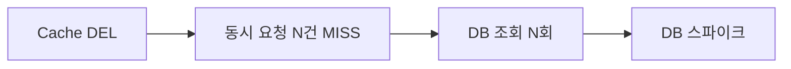
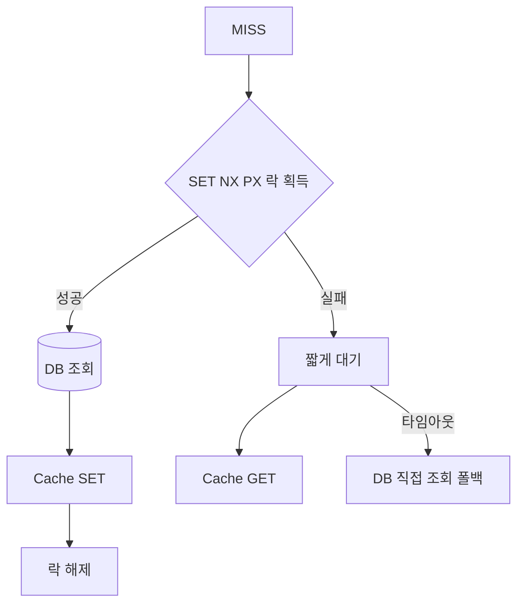
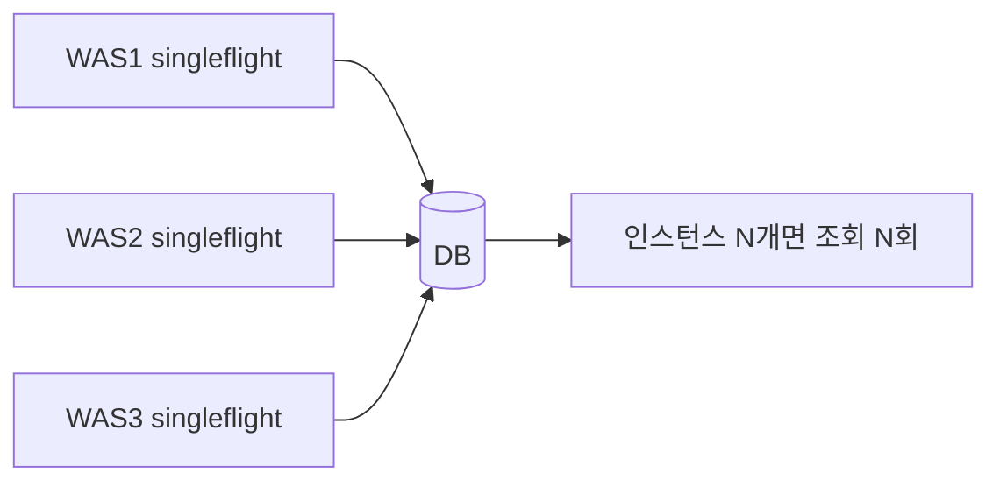
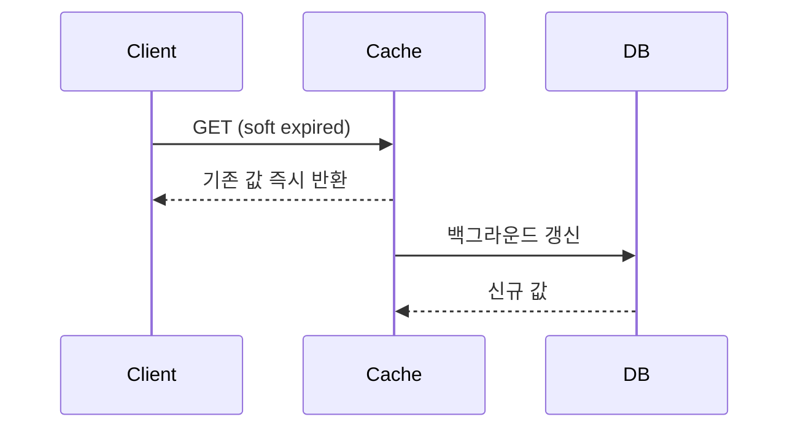
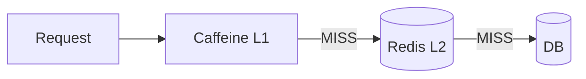
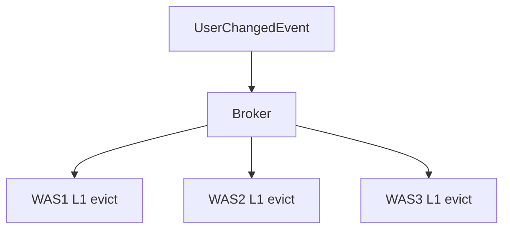

# Cache Stampede

무효화를 정확히 하는 것만큼 중요한 것이 **삭제 직후 누가 DB를 다시 채우는가**이다.

> Stampede는 캐시 장애 유형 중 하나다. Penetration·Avalanche·장애 전파는
> [cache-failure-modes.md](cache-failure-modes.md)에서 함께 비교한다.



무효화를 잘 할수록 이 문제는 오히려 더 자주 발생한다.
Redis 공식 cache-aside 가이드도 인기 키 만료 시의 stampede를 주요 문제로 지적한다.

## 대응 비교

| 기법 | 조정 필요 | 락 쓰기 비용 | 실패 내성 | 저트래픽 키 |
|-----|---------|-----------|---------|-----------|
| Single-Flight (분산 락) | 필요 | 쓰기 2배 | **락 보유자 실패 시 무방비** | 효과 있음 |
| Probabilistic Early Expiration (XFetch) | 불필요 | 없음 | 무방비 구간 없음 | 효과 있음 |
| Stale-While-Revalidate | 불필요 | 없음 | 무방비 구간 없음 | **효과 없음** |

---

## Single-Flight (분산 락)

MISS 시 한 요청만 DB를 조회하도록 제한한다.



```text
SET cache:lock:user:100 <token> NX PX 3000
```

해제는 토큰 소유자만 가능해야 한다. Redis 8.4+는 `DELEX key IFEQ <token>`,
그 이전은 Lua 스크립트로 `GET` 후 일치 시 `DEL` 한다.

| 항목 | 결정 근거 |
|-----|---------|
| Lock TTL | DB 조회 + 캐시 적재 최대 소요 시간보다 길게 |
| 대기 시간 | Lock TTL보다 짧게, 초과 시 DB 직접 조회로 폴백 |
| 토큰 | 자신이 획득한 락만 해제하기 위한 소유권 식별자 |

### 알려진 비용

VLDB 2015 논문이 락 방식의 비용을 명시한다.

| 비용 | 내용 |
|-----|-----|
| 쓰기 2배 | 락 획득·해제가 추가 쓰기 연산 |
| TTL 튜닝 | 락 TTL을 재계산 시간에 맞춰야 한다 |
| 반환값 없음 | 락을 못 잡은 요청은 돌려줄 값이 없다 |
| **fault-tolerant 아님** | 락 보유자가 재계산 중 실패하면 **락 만료까지 무방비** |

### Redlock까지 필요한가

**아니다.** stampede 방지 락의 실패 비용은 안전성 위반이 아니라 DB 조회 1회다.
Redis 공식 문서도 "가끔의 경쟁 조건이 허용되는 경우"에는 단일 인스턴스 방식이 적합하다고 하며,
공식 cache-aside 가이드 자체가 단일 인스턴스 `SET NX PX`를 채택한다.

> 단, `SET` 명령 문서는 단일 인스턴스 락 패턴을 "Redlock을 권장한다"며 지양하라고 적는다.
> 두 공식 문서의 톤이 일치하지 않으므로 인용 시 출처를 구분한다.

### 프로세스 로컬 single-flight의 한계

`golang.org/x/sync/singleflight` 같은 프로세스 내 중복 억제는 **인스턴스마다 독립**이다.



Discord는 키 기반 consistent hash 라우팅으로 같은 키를 한 인스턴스에 모아 적중률을 높였다.
그리고 이것이 **완전한 해결책이 아니라 완화책**이었다고 명시한다.

---

## Probabilistic Early Expiration (XFetch)

재계산 소요 시간 `Δ`를 캐시 값과 함께 저장하고, 만료 **이전에 확률적으로** 조기 재계산한다.

```text
갱신 조건:  now - Δ · β · log(rand()) ≥ expiry
```

조정(coordination)이 전혀 없고 락 쓰기도 없다는 것이 장점이다.

---

## Stale-While-Revalidate

만료 이후에도 짧은 기간 기존 값을 제공하면서 백그라운드로 갱신한다.



| 장점 | 단점 |
|-----|-----|
| miss 스파이크 방지 | **의도적으로 stale 값을 제공** |
| 응답 지연 안정적 | 구현 복잡도 증가 |

| 적합 | 부적합 |
|-----|-------|
| 상품 목록, 추천, 랭킹, 홈 화면, 통계 | 권한, 결제 상태, 보안 정책 |

> **저트래픽 키에서는 효과가 없다.**
> RFC 5861 §3.1 — 비동기 재검증은 stale 직후~윈도우 종료 전에 요청이 도착해야만 트리거된다.
> 윈도우가 짧거나 트래픽이 희박하면 요청은 그대로 블로킹된다.

---

## L1(Local) + L2(Redis)

Redis 조회도 network round-trip 비용이 되는 규모에서 쓴다.



`DB UPDATE → Redis DEL` 만으로는 부족하다. 각 WAS의 로컬 캐시가 그대로 남는다.



| 판단 기준 | 내용 |
|---------|-----|
| L1 TTL은 짧게 | 전파 실패 시 stale 상한을 낮춘다 |
| L1 대상은 선별적으로 | 변경이 드물고 조회가 압도적인 데이터만 |
| 전파 채널 신뢰성 | Pub/Sub 유실 가능성을 짧은 TTL로 보완 |

> **클러스터에서 keyspace notification은 전 노드로 브로드캐스트되지 않는다.**
> 클라이언트가 각 노드에 개별 구독해야 한다. 이를 모르면 무효화가 조용히 누락된다.

Redis client-side caching(RESP3 tracking)을 쓰더라도 공식 권고는 동일하다 —
**"TTL이 없는 키에도 max TTL을 걸어라."**

## Reference

- [Redis - Cache-aside](https://redis.io/docs/latest/develop/use-cases/cache-aside/)
- [Redis - Distributed locks](https://redis.io/docs/latest/develop/clients/patterns/distributed-locks/)
- [Redis - Client-side caching](https://redis.io/docs/latest/develop/clients/client-side-caching/)
- [Vattani et al., Optimal Probabilistic Cache Stampede Prevention, VLDB 2015](http://www.vldb.org/pvldb/vol8/p886-vattani.pdf)
- [RFC 5861 - stale-while-revalidate](https://www.rfc-editor.org/rfc/rfc5861.html)
- [Discord - How Discord Stores Trillions of Messages](https://discord.com/blog/how-discord-stores-trillions-of-messages)
