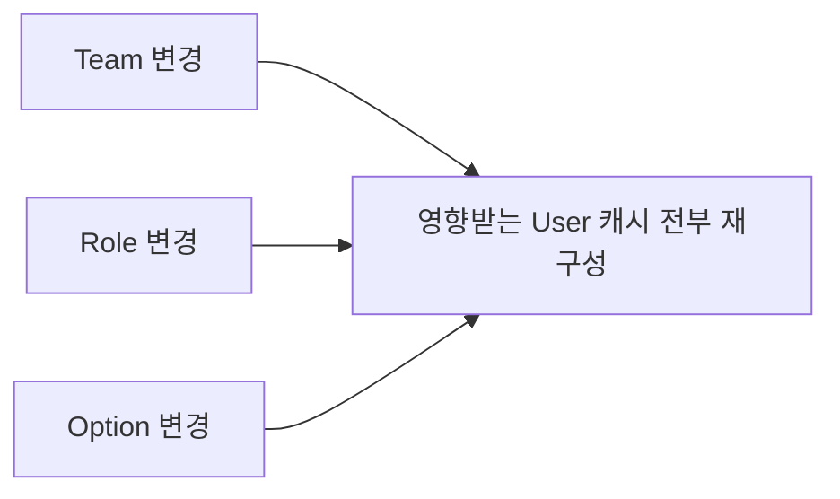
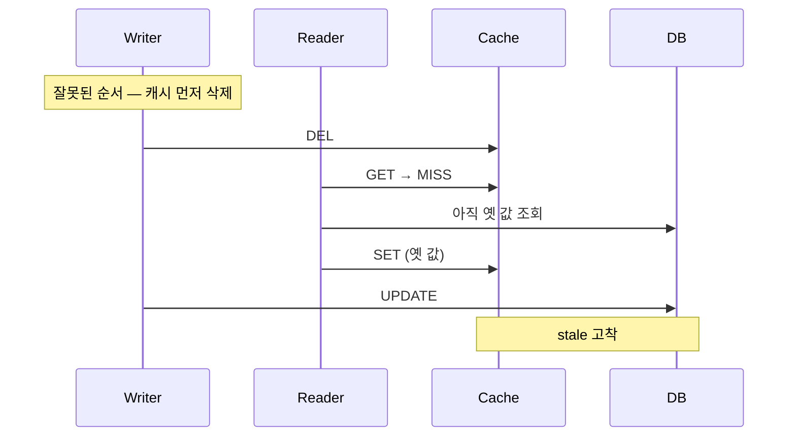
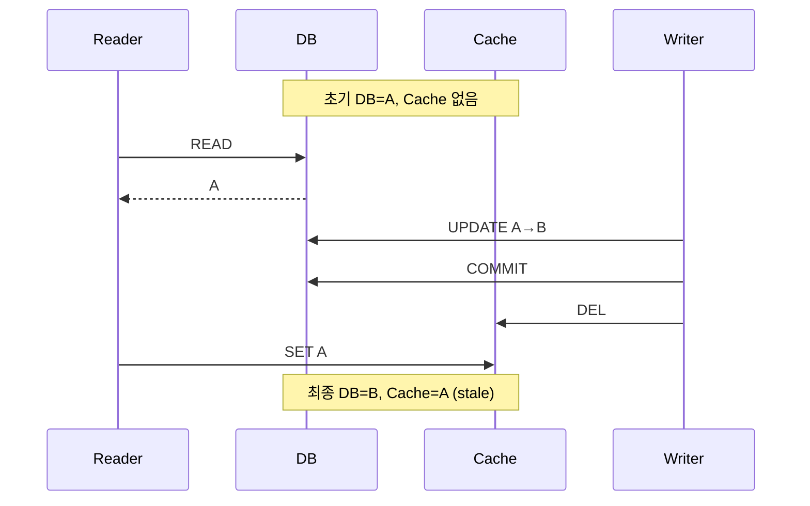

# 왜 갱신이 아니라 삭제인가

Redis 공식 cache-aside 가이드의 권고는 명확하다.

> **"Invalidate, don't try to keep the cache in sync."**

DB가 바뀌었을 때 캐시를 새 값으로 맞추려 하지 말고 삭제하라는 뜻이다. 근거는 세 가지다.

## 1. 캐시 값이 DB 엔티티와 1:1이 아니다

```json
{ "userId": 100, "username": "alice", "teamName": "platform", "roleName": "ADMIN", "deviceCount": 7 }
```

DB 변경은 단일 컬럼 갱신 하나다.

```sql
UPDATE users SET username = ? WHERE user_id = ?
```

그런데 캐시를 덮어쓰려면 여러 소스를 다시 조합해야 한다.
즉 **쓰기 로직이 캐시 조립 로직을 알아야 한다.**

캐시 모델이 성장하면 부담이 곱해진다.



삭제는 "무엇이 바뀌었고 → 어떤 키가 영향받는가 → 지운다"로 끝난다.

## 2. 책임이 분리된다

| 경로 | 책임 |
|-----|-----|
| Write Path | DB 변경 + 무효화까지만 |
| Read Path | 캐시 생성 |

캐시의 최신 값을 만드는 일은 조회 로직이 이미 하고 있다. 중복 구현할 이유가 없다.

> 구현이 귀찮아서 삭제하는 것이 아니라,
> **쓰기 경로에서 캐시 재구성 책임을 제거하고 캐시 생성을 읽기 경로로 단일화**하는 것이다.

## 3. 실패 시 위험도가 다르다

| 방식 | 롤백·실패 시 결과 | 비용 |
|-----|----------------|-----|
| `DEL` | DB=기존값, Cache=없음 | 캐시 미스 1회 |
| `SET` | DB=기존값, Cache=새값 | **불일치 지속 — 잘못된 데이터 제공** |

다시 만드는 비용보다 잘못된 값을 넣는 비용이 크다.

## 순서 — DB를 먼저 바꾸고 캐시를 지운다

Microsoft Azure Architecture Center가 순서를 명시한다.

> "The order of the steps is important. **Update the data store before removing the item from the cache.**
> If you remove the cached item first, there's a small window of time when a client might fetch the item
> before the data store is updated... The cache miss causes the application to retrieve the outdated item
> from the data store and add it back to the cache. This sequence leads to **stale data in the cache**."



이 창(window)을 없애려면 DB 갱신·커밋이 끝난 뒤에 삭제해야 한다
→ [after-commit-invalidate](../invalidation/after-commit-invalidate.md)

## 삭제해도 완벽하지 않다



**DB 갱신 후 캐시를 삭제해도 강한 일관성이 생기지는 않는다.**
조회 트랜잭션이 길고 쓰기와 겹칠 때 발생한다.

이 경합과 무효화 유실 때문에 [TTL](ttl.md)이 최종 안전장치로 필요하다.
경합을 지연 재삭제로 닫으려는 시도에 대해서는
[비표준 기법](../appendix/non-standard-techniques.md)을 참고한다.

## 예외 — 갱신이 나은 경우

| 조건 | 이유 |
|-----|-----|
| 캐시가 단일 엔티티와 1:1 | 조립 부담이 없다 |
| 쓰기 직후 조회가 매우 잦다 | MISS 비용이 크다 |
| 롤백이 사실상 없다 | 불일치 위험이 낮다 |

→ [write-through.md](../write/write-through.md)

## 목록·검색 캐시

단일 엔티티는 삭제 대상이 명확하다.

```text
user:100  →  DEL user:100
```

목록 캐시는 그렇지 않다.

```text
team:10:users:page:1
team:10:admins
search:name:alice
```

User 하나가 바뀔 때 어떤 키가 영향받는지 특정하기 어렵다.

| 대응 | 내용 |
|-----|-----|
| 짧은 TTL만 사용 | 무효화를 포기하고 stale 상한만 관리 |
| Version 기반 폐기 | [versioned-cache](../invalidation/versioned-cache.md) |
| 캐시하지 않음 | 무효화 그래프 비용이 이득보다 클 때 |
| CQRS / Read Model | 조회 전용 데이터를 별도 관리 |

모든 쿼리 결과를 캐시하려 하면 무효화 그래프가 감당할 수 없이 커진다.

## Reference

- [Redis - Cache-aside](https://redis.io/docs/latest/develop/use-cases/cache-aside/)
- [Microsoft - Cache-Aside pattern](https://learn.microsoft.com/en-us/azure/architecture/patterns/cache-aside)
