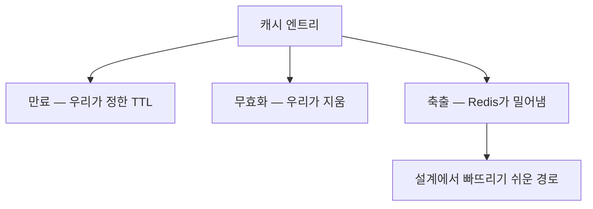

# 메모리 축출 (Eviction)

> **자리가 모자라서 밀어낸다.**

만료(expiration)와 축출(eviction)은 다르다.

| | 만료 | 축출 |
|---|-----|-----|
| 원인 | **시간**이 다 됐다 | **메모리**가 부족하다 |
| 대상 | TTL이 설정된 키 | 정책에 따라 선정된 키 |
| 예측 가능성 | TTL로 예측 가능 | **언제 누가 밀려날지 모른다** |
| 설정 | `EXPIRE`, `entryTtl` | `maxmemory-policy` |

TTL을 아무리 잘 설계해도 메모리가 꽉 차면 **TTL이 남은 키도 밀려난다.**
이 사실을 모르면 "왜 캐시가 갑자기 안 맞지?"의 원인을 영원히 못 찾는다.

## 왜 무효화 전략과 함께 봐야 하는가

무효화 설계는 "우리가 지운다"를 전제한다.
축출은 **우리가 지우지 않았는데 사라지는** 경로다.

버전 비교 무효화를 쓰는 경우 특히 중요하다.
버전 정보를 담은 엔트리가 먼저 축출되면 **"더 최신 데이터를 봤다"는 사실 자체가 사라진다.**

## Redis 축출 정책

`maxmemory`에 도달했을 때의 동작을 `maxmemory-policy`로 정한다.

| 정책 | 대상 | 선정 기준 |
|-----|-----|---------|
| `noeviction` | — | 축출하지 않고 쓰기에 오류를 반환한다 |
| `allkeys-lru` | 전체 키 | 가장 오래 사용되지 않은 것 |
| `allkeys-lfu` | 전체 키 | 가장 적게 사용된 것 (Redis 4.0+) |
| `allkeys-random` | 전체 키 | 무작위 |
| `volatile-lru` | **TTL이 설정된 키만** | 가장 오래 사용되지 않은 것 |
| `volatile-lfu` | TTL이 설정된 키만 | 가장 적게 사용된 것 |
| `volatile-random` | TTL이 설정된 키만 | 무작위 |
| `volatile-ttl` | TTL이 설정된 키만 | 남은 TTL이 짧은 것 |

### LRU vs LFU

| | LRU | LFU |
|---|-----|-----|
| 기준 | 최근에 썼는가 | 자주 쓰는가 |
| 약점 | 한 번 훑고 지나가는 스캔에 캐시가 오염된다 | 과거에 인기였던 키가 오래 남는다 |
| 적합 | 시간적 지역성이 뚜렷한 워크로드 | 인기 키가 뚜렷하게 갈리는 워크로드 |

Redis의 LRU는 **정확한 LRU가 아니라 샘플링 근사**다(`maxmemory-samples`).
정확도를 높이면 CPU를 더 쓴다.

### `volatile-*` 선택 시 함정

TTL이 없는 키는 축출 대상에서 제외된다.
따라서 **TTL 없는 키가 메모리를 채우면 축출할 대상이 없어져** `noeviction`처럼 동작하며 쓰기가 실패한다.

> [ttl.md](../concepts/ttl.md)에서 다룬 `SET`이 기존 TTL을 버리는 함정과 결합하면
> 의도치 않게 영구 키가 쌓여 이 상황에 도달할 수 있다.

## 설계 판단

| 질문 | 판단 |
|-----|-----|
| 캐시 전용 인스턴스인가 | 전용이면 `allkeys-*`, 다른 용도와 공유하면 `volatile-*` |
| 모든 키에 TTL이 있는가 | 없다면 `volatile-*`는 위험하다 |
| 워킹셋이 메모리에 들어가는가 | 넘치면 축출이 상시 발생하므로 hit rate가 구조적으로 낮아진다 |
| 축출을 관측하고 있는가 | `evicted_keys` 지표를 본다 → [metrics.md](../concepts/metrics.md) |

## 측정

| 지표 | 확인 방법 |
|-----|---------|
| 축출된 키 수 | `INFO stats` 의 `evicted_keys` |
| 메모리 사용량 | `INFO memory` 의 `used_memory`, `maxmemory` |
| 만료된 키 수 | `INFO stats` 의 `expired_keys` |

`evicted_keys`가 꾸준히 증가하는데 hit rate가 낮다면, 무효화 전략이 아니라 **용량 문제**다.

## Reference

- [Redis - Key eviction](https://redis.io/docs/latest/develop/reference/eviction/)
- [Redis - EXPIRE (How Redis expires keys)](https://redis.io/docs/latest/commands/expire/)
