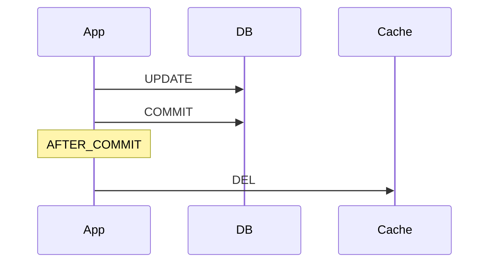

# After Commit Invalidate

> **커밋이 확정된 뒤에 버린다.**

아직 확정되지 않은 변경으로 캐시를 건드리지 않는다.
커밋 전에 지우면, 그 틈에 누군가 옛 값을 읽어 캐시에 도로 채워 넣을 수 있다.

---

커밋이 확정된 뒤에만 캐시를 삭제한다.

## 동작



## 구현

```java
@Transactional
public void updateUser(Long userId, UpdateUserCommand command) {
    userRepository.update(userId, command);
    eventPublisher.publishEvent(new UserChangedEvent(userId));
}
```

```java
@TransactionalEventListener(phase = TransactionPhase.AFTER_COMMIT)
public void evictOnUserChanged(UserChangedEvent event) {
    cacheEvictor.evict(CacheEntryRef.of(CachePolicy.USER, event.userId()));
}
```

## 보장하는 것

| 항목 | 내용 |
|-----|-----|
| 커밋 전 재적재 제거 | 커밋 확정 후에만 삭제하므로 미커밋 값이 캐시에 남지 않는다 |
| 롤백 시 무동작 | 롤백되면 리스너가 호출되지 않는다 |
| 실행 순서 명시성 | `@CacheEvict`의 order 불확실성이 사라진다 |

일반적인 모놀리식·중간 규모 서비스에서는 이 구성까지가 현실적인 기본값이다.

## 보장하지 않는 것

| 항목 | 내용 |
|-----|-----|
| 커밋 후 유실 | 커밋 성공 직후 프로세스가 죽으면 DEL이 실행되지 않는다 |
| **트랜잭션 없는 경로** | `fallbackExecution` 기본값이 `false`라 **트랜잭션 없이 발행하면 이벤트가 폐기된다** |
| 리스너 예외 전파 | AFTER_COMMIT 예외는 `commit()` 호출자에게 전파되고, **이후 순번의 afterCommit 콜백이 실행되지 않는다** |
| 리스너 내 DB 쓰기 | 원본 트랜잭션에 참여만 하고 **커밋되지 않는다.** `REQUIRES_NEW` 필요 |
| 조회-갱신 경합 | 긴 조회와 겹치면 여전히 stale 적재 가능 |

배치·스케줄러처럼 트랜잭션 없이 도는 경로에서 무효화가 **조용히 누락**되는 것이 가장 위험하다.

## 선택 기준

| 적합 | 부적합 |
|-----|-------|
| 트랜잭션 정확성이 필요한 일반 업무 데이터 | 무효화 유실까지 막아야 하는 경우 → [outbox-invalidate](outbox-invalidate.md) |

## 검증

```
□ 커밋 성공 시에만 캐시가 삭제된다
□ 롤백 시 캐시가 삭제되지 않는다
□ 트랜잭션 없이 이벤트를 발행하면 리스너가 호출되지 않음을 확인한다
□ 리스너 예외가 후속 afterCommit 콜백을 건너뛰게 함을 확인한다
□ write-invalidate 대비 stale read 건수가 감소한다
```

## 관련

- [write-invalidate.md](write-invalidate.md) · [entity-event-invalidate.md](entity-event-invalidate.md) · [dual-write.md](../concepts/dual-write.md)
