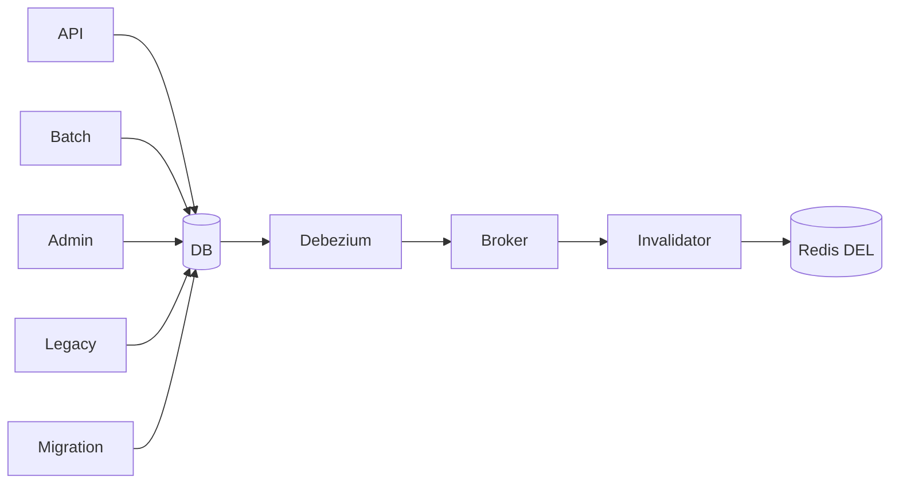

# CDC Invalidate

> **애플리케이션에 묻지 않고, DB가 남긴 변경 기록을 직접 본다.**

누가 바꿨는지는 상관없다. API든 배치든 관리자 도구든 직접 실행한 SQL이든,
**DB에 변경이 찍혔다는 사실**만 보고 캐시를 지운다.

---

DB 변경 로그(binlog)를 직접 관찰해 무효화한다. outbox 테이블이 필요 없다.

## 언제 필요한가

DB를 수정하는 주체가 여러 개일 때, 각 애플리케이션마다 무효화 코드를 넣으면 하나라도 누락된다.



CDC는 **DB에 실제 변경이 발생했다는 사실 자체**를 기준으로 하므로 중앙에서 관리할 수 있다.
[entity-event-invalidate](entity-event-invalidate.md)가 놓치는 벌크 연산도 포착한다.

## 보장하는 것

| 항목 | 내용 |
|-----|-----|
| 변경 주체 무관 | 어떤 애플리케이션이 바꿔도 감지된다 |
| 벌크 연산 포착 | 영속성 컨텍스트를 거치지 않는 변경도 감지된다 |
| 재처리 가능 | 컨슈머가 죽어도 backlog로 남는다 |

## 보장하지 않는 것

| 항목 | 내용 |
|-----|-----|
| **강한 일관성** | 감지·전파 지연만큼 stale window가 존재한다 |
| **read-own-writes** | 본인 쓰기 직후 조회가 옛 값을 볼 수 있다 |
| exactly-once | at-least-once. 멱등 무효화 필요 |
| 재시작 갭 | 커넥터 재시작·배포·리밸런싱 시 지연이 커진다 |

> **CDC는 이벤트 유실을 해결하는 기술이지 stale window를 0으로 만드는 기술이 아니다.**

Uber는 이 때문에 CDC만 쓰지 않고 **TTL + CDC + 쓰기 경로 무효화 3중**으로 운용한다.

## 참고 — 삭제 대신 무효화 마커

Uber CacheFront는 캐시 엔트리를 `DEL` 하는 대신 **무효화 마커로 덮어쓰고**,
row timestamp 기반 Lua 스크립트로 경합하는 재적재를 걸러낸다.
버전 비교 무효화의 실제 구현 사례다.

## 선택 기준

| 적합 | 부적합 |
|-----|-------|
| DB 변경 주체가 여러 개, 벌크 연산이 존재 | 단일 애플리케이션만 DB를 수정 — 운영 비용이 이득보다 크다 |

## 검증

```
□ 애플리케이션을 거치지 않은 직접 SQL UPDATE도 무효화된다
□ 벌크 UPDATE가 무효화를 유발한다
□ 커밋부터 DEL까지의 Invalidation Lag P50/P95/P99를 측정한다
□ 커넥터를 중단·재기동해도 backlog가 처리된다
□ read-own-writes가 깨지는 구간을 재현한다 (한계 고정)
```

## 관련

- [dual-write.md](../concepts/dual-write.md) · [outbox-invalidate.md](outbox-invalidate.md) · [consistency-levels.md](../concepts/consistency-levels.md)
