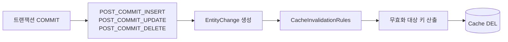

# Entity Event Invalidate

> **무효화를 선언하지 않고 파생시킨다.**

메서드마다 "이건 이 캐시를 지워라"라고 붙이지 않는다.
**엔티티가 바뀌었다는 사실 자체**에서 지울 키가 나온다.
어느 경로로 바꾸든 같은 이벤트가 발생하므로, 새 메서드를 추가해도 빠뜨릴 일이 없다.

---

Hibernate post-commit 엔티티 이벤트로 무효화한다.
무효화가 **메서드마다 선언되는 것이 아니라 엔티티 변경에서 파생**된다.

## 왜 이 방식인가

`@CacheEvict`를 메서드마다 붙이면 저장 쪽과 삭제 쪽이 각각 캐시 키를 알아야 하고,
새 서비스 메서드를 추가할 때 누락되면 조용히 stale이 남는다.
또한 [write-invalidate](write-invalidate.md)의 **실행 순서 불확실성**을 구조적으로 제거한다.

## 동작



조회는 `@Cacheable`만 남고, 쓰기 경로에는 캐시 코드가 없다.

## 구현

무효화 대상 산출은 규칙(Rule)이 담당하고, 단순한 엔티티는 단축 인터페이스를 쓴다.

```java
public interface CacheInvalidationRule {
    boolean supports(EntityChange change);
    Collection<CacheEntryRef> resolve(EntityChange change);
}
```

```java
public record EntityChange(
    Object entity, ChangeType type, Object id,
    Object[] previousState, String[] propertyNames
) {
    public Optional<Object> previousValueOf(String propertyName) { ... }
}
```

단축 인터페이스 — 엔티티가 자기 키를 선언한다.

```java
@Entity
public class User implements CacheEvictable {

    @Override
    public List<CacheEntryRef> cacheEntriesToEvict() {
        return List.of(CacheEntryRef.of(CachePolicy.USER, id));
    }
}
```

조회는 `@Cacheable`만 선언한다.

```java
@Cacheable(cacheNames = CachePolicy.Name.USER, key = "#id")
public User findById(Long id) { ... }
```

## 보장하는 것

| 항목 | 내용 |
|-----|-----|
| 누락 방지 | 어느 서비스 메서드로 변경하든 영속성 컨텍스트를 거치면 무효화된다 |
| 실행 시점 확정 | `POST_COMMIT_*` 이므로 커밋 이후가 보장된다 |
| 옛 키 산출 | `previousState`로 변경 전 자연키를 재구성할 수 있다 |
| 교차 엔티티 | 별도 Rule 빈을 추가하면 다른 엔티티의 캐시도 무효화할 수 있다 |
| 책임 분리 | 조회는 `@Cacheable`만, 쓰기는 캐시를 모른다 |

## 보장하지 않는 것

| 경로 | 이유 |
|-----|-----|
| **벌크 연산** | `@Modifying` JPQL, 네이티브 UPDATE, Querydsl `update()` 는 영속성 컨텍스트를 거치지 않아 **이벤트가 발생하지 않는다** |
| 목록·검색 캐시 | 엔티티는 자기 키만 알 뿐, 자신이 속한 목록 캐시를 모른다 |
| 다른 애플리케이션의 변경 | 리스너는 이 애플리케이션 안에서만 동작한다 → [cdc-invalidate](cdc-invalidate.md) |
| 커밋 후 유실 | 커밋 직후 프로세스가 죽으면 DEL이 실행되지 않는다 |
| 키 합의 | `@Cacheable`이 만든 키와 Rule이 만든 키가 **다르면 조용히 실패한다** |

벌크 연산 경로가 존재한다면 TTL이 유일한 복구 수단이 된다.

## 선택 기준

| 적합 | 부적합 |
|-----|-------|
| JPA/Hibernate 기반, 단일 애플리케이션이 DB를 수정 | 벌크 연산·외부 앱이 DB를 자주 수정하는 환경 |

## 검증

```
□ INSERT / UPDATE / DELETE 각각에서 캐시가 무효화된다
□ @Cacheable이 적재한 키와 Rule이 무효화하는 키가 일치한다
□ 자연키가 변경되면 옛 키도 함께 무효화된다
□ 벌크 UPDATE는 이벤트를 발생시키지 않음을 확인한다 (한계 고정)
□ 롤백 시 무효화가 수행되지 않는다
□ Rule 하나가 예외를 던져도 나머지 Rule은 계속 수행된다
```

## 관련

- [after-commit-invalidate.md](after-commit-invalidate.md) · [cdc-invalidate.md](cdc-invalidate.md) · [metrics.md](../concepts/metrics.md)
