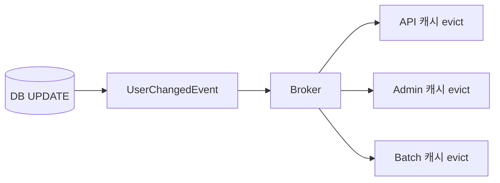

# Event Driven Invalidate

> **무효화를 방송한다.**

캐시를 가진 프로세스가 여럿이면 한 곳에서 지우는 것으로는 부족하다.
"이게 바뀌었다"를 알리고, 각자 자기 캐시를 정리하게 한다.

---

변경 이벤트를 발행하고 소비자가 캐시를 삭제한다.

## 언제 필요한가

Redis 하나를 공용 캐시로 쓴다면 같은 키를 삭제하면 되므로 **이벤트가 불필요한 경우가 많다.**
필요한 경우는 다음과 같다.

- 서비스마다 캐시 구조가 다르다
- 로컬 캐시(Caffeine 등)가 함께 존재한다
- 파생 캐시(집계·검색 결과)가 존재한다

## 동작



## 보장하는 것

| 항목 | 내용 |
|-----|-----|
| 다중 소비자 전파 | 여러 프로세스의 캐시를 함께 무효화한다 |
| 멱등성 활용 | `DEL`은 멱등하므로 at-least-once로 충분하다 |

## 보장하지 않는 것

| 항목 | 내용 |
|-----|-----|
| 이벤트 자체의 유실 | 커밋 후 발행 전 종료하면 이벤트가 없다 → [outbox-invalidate](outbox-invalidate.md) |
| 즉시성 | 전파 지연만큼 stale window가 존재한다 |
| exactly-once | 외부 저장소가 종점이면 성립하지 않는다 |

### Redis Pub/Sub은 유실된다

Redis 공식 문서가 명시한다.

> "Redis' Pub/Sub exhibits **at-most-once** message delivery semantics.
> If the subscriber is unable to handle the message (for example, due to an error or a network disconnect)
> **the message is forever lost.**"

| 채널 | 전달 보장 |
|-----|---------|
| Redis Pub/Sub | at-most-once — 구독 끊긴 동안 유실 |
| Redis Streams | 영속. at-most-once / at-least-once 선택 |
| Durable MQ | at-least-once |

**클러스터에서 keyspace notification은 전 노드로 브로드캐스트되지 않는다.**
클라이언트가 각 노드에 개별 구독해야 하며, 모르면 무효화가 조용히 누락된다.

```text
Pub/Sub + 짧은 TTL   → 빠른 무효화 + TTL로 최종 복구
Durable MQ           → 정합성이 중요할 때
```

## 선택 기준

| 적합 | 부적합 |
|-----|-------|
| 여러 서비스·로컬 캐시가 동일 데이터를 캐싱 | Redis 하나만 공용으로 쓰는 단일 애플리케이션 |

## 검증

```
□ 이벤트 소비자가 각자의 캐시를 무효화한다
□ 중복 이벤트가 도착해도 결과가 같다 (멱등성)
□ 소비자를 중단시킨 뒤 재기동하면 Pub/Sub은 유실되고 MQ는 backlog를 처리한다
□ 발행부터 DEL까지의 Invalidation Lag P95/P99를 측정한다
```

## 관련

- [dual-write.md](../concepts/dual-write.md) · [outbox-invalidate.md](outbox-invalidate.md) · [stampede.md](../concepts/stampede.md)
