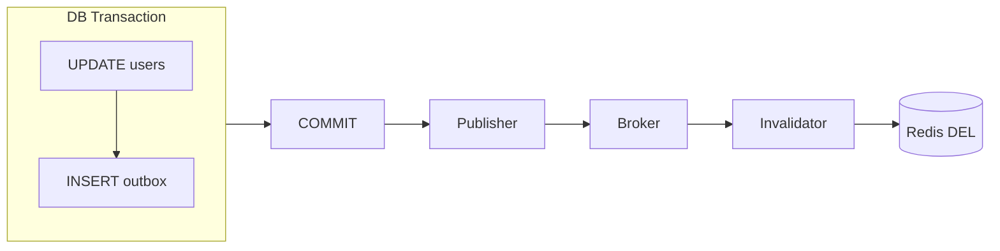

# Outbox Invalidate

> **무효화 지시를 DB에 같이 적어둔다.**

데이터 변경과 "이걸 지워라"는 지시를 **한 트랜잭션**에 넣는다.
그러면 변경만 남고 지시가 사라지는 일이 없다.
프로세스가 죽어도 지시는 테이블에 남아 있다가 나중에 실행된다.

---

DB 변경과 이벤트 저장을 같은 트랜잭션에 넣어, 무효화 이벤트 자체의 유실을 막는다.

## 동작



```sql
BEGIN;
UPDATE users SET username = ? WHERE user_id = ?;
INSERT INTO outbox (event_type, aggregate_id, payload) VALUES ('USER_UPDATED', 100, ?);
COMMIT;
```

## 보장하는 것

| 항목 | 내용 |
|-----|-----|
| 이벤트 존재 | "DB는 변경됐는데 이벤트가 없는" 상황이 제거된다 |
| 재처리 가능 | 발행기가 죽어도 outbox 행이 남아 재기동 후 발행된다 |
| 순서 | `aggregate_id`를 메시지 키로 쓰면 파티션 내 순서가 유지된다 |

## 보장하지 않는 것

| 항목 | 내용 |
|-----|-----|
| **exactly-once** | 발행 후 기록 전 종료 시 **중복 발행**. 컨슈머 멱등성 필수 |
| 즉시성 | 폴링·전파 지연만큼 stale window가 존재한다 |
| 발행 누락 | 개발자가 `INSERT outbox`를 빠뜨리면 무효화가 사라진다 |
| stale 크기 | TTL은 지속시간만 제한한다 → [consistency-levels.md](../concepts/consistency-levels.md) |

Outbox가 해결하는 것은 **dual-write 원자성**이지 중복 제거가 아니다.

### 운용 제약

| 항목 | 내용 |
|-----|-----|
| 큐로만 사용 | Debezium은 INSERT만 유효로 보고 UPDATE는 경고/오류, DELETE는 필터링한다 |
| 커넥터 범위 | outbox 테이블만 캡처해야 하며, 복수 outbox는 구조가 동일할 때만 가능 |
| 정리 부담 | 처리 완료 행의 cleanup이 별도 작업 |

## 선택 기준

| 적합 | 부적합 |
|-----|-------|
| 무효화 유실을 허용하기 어려운 데이터(권한, 과금 정책) | 소규모 모놀리식 — 운영 복잡도가 이득보다 크다 |

## 검증

```
□ 커밋 직후 프로세스를 강제 종료해도 재기동 후 무효화가 수행된다
□ 롤백 시 outbox 행이 남지 않는다
□ 중복 발행 시에도 최종 캐시 상태가 같다 (멱등성)
□ 커밋부터 DEL까지 Invalidation Lag P99를 측정한다
```

## 관련

- [dual-write.md](../concepts/dual-write.md) · [cdc-invalidate.md](cdc-invalidate.md) · [event-driven-invalidate.md](event-driven-invalidate.md)
