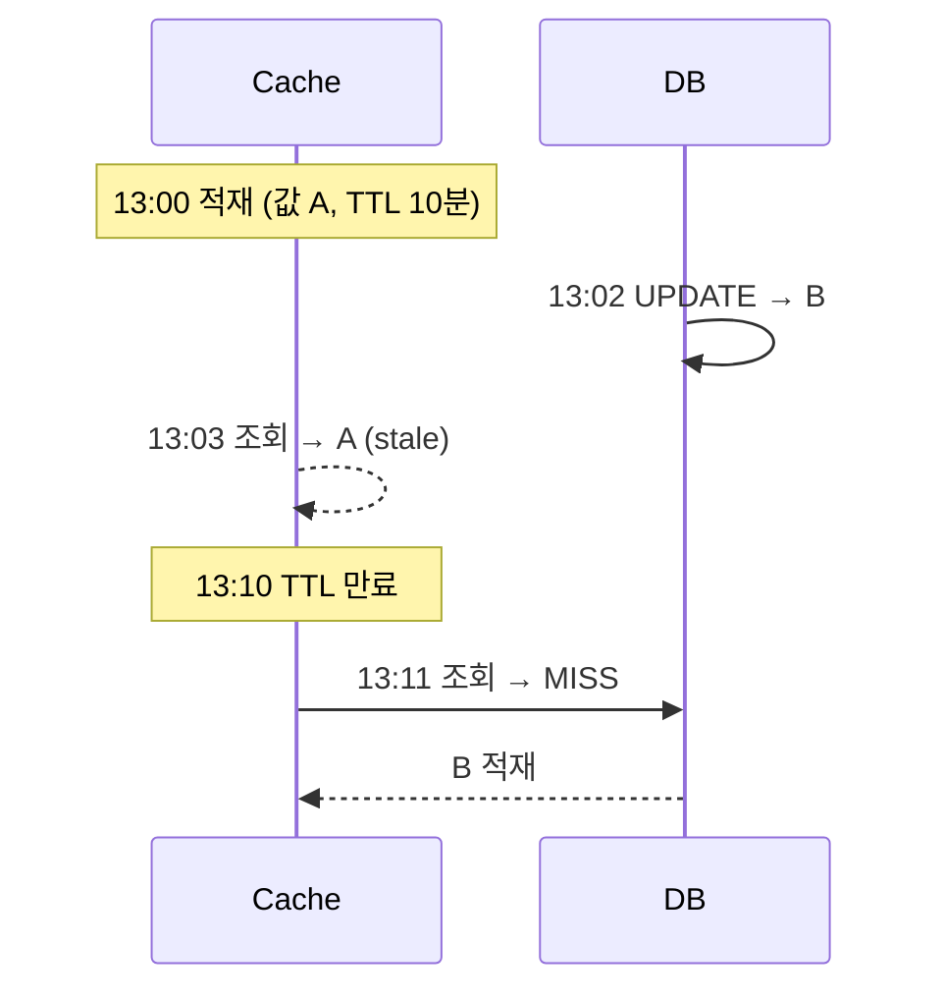

# TTL Only

> **아무것도 하지 않고 수명이 다하기를 기다린다.**

DB가 바뀌어도 캐시는 그 사실을 모른다.
붙여둔 수명이 끝나면 저절로 사라지고, 그때 다시 채워진다.
가장 단순한 대신, 그 수명만큼 옛 값을 보게 된다.

---

DB가 변경되어도 캐시에 아무 조치를 하지 않고, TTL 만료만 기다린다.

## 동작



## 구현

```java
@Cacheable(cacheNames = CachePolicy.Name.USER, key = "#id")
public User findById(Long id) {
    return userRepository.findById(id)
            .orElseThrow(UserNotFoundException::new);
}
```

쓰기 경로는 캐시를 전혀 모른다.

## 보장하는 것

| 항목 | 내용 |
|-----|-----|
| stale 지속시간 상한 | TTL과 같다 |
| 쓰기 경로 단순성 | 캐시 코드가 0줄 |
| 장애 내성 | 무효화 경로가 없으므로 무효화가 실패할 일도 없다 |

## 보장하지 않는 것

| 항목 | 내용 |
|-----|-----|
| 변경 직후 최신성 | TTL 만료 전까지 옛 값을 반환한다 |
| stale 크기 | 지속시간만 유계일 뿐, 얼마나 오래된 값인지는 제한되지 않는다 |
| 만료 시점의 정확성 | Redis 만료는 lazy + 샘플링이라 지연될 수 있다 → [ttl.md](../concepts/ttl.md) |
| 동시 만료 | jitter가 없으면 대량 키가 같이 만료되어 DB 스파이크 → [stampede.md](../concepts/stampede.md) |

## 선택 기준

| 적합 | 부적합 |
|-----|-------|
| 공지사항, 상품 설명, 코드 테이블, 지역 코드, UI 메타데이터 | 사용자 권한, 설정, 상태 값, 결제 상태 |

## 검증

이 전략이 동작함을 증명하는 테스트 명제.

```
□ TTL 만료 전 조회는 DB를 읽지 않는다
□ DB를 변경해도 TTL 만료 전에는 옛 값을 반환한다
□ 관측된 stale window의 상한이 TTL과 일치한다
□ jitter를 적용하면 동일 시각 대량 만료가 발생하지 않는다
```

## 관련

- [why-invalidate-not-update.md](../concepts/why-invalidate-not-update.md) · [ttl.md](../concepts/ttl.md) · [metrics.md](../concepts/metrics.md)
