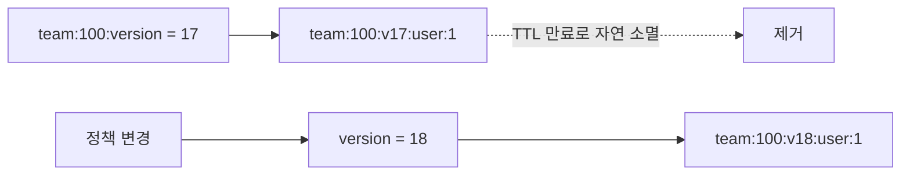

# Versioned Cache

> **지우지 않고 주소를 바꾼다.**

키에 버전을 달아두고, 무효화할 때 **버전만 올린다.**
옛 키는 아무도 찾지 않게 되어 사실상 폐기되고, 수명이 다하면 저절로 사라진다.
5만 개를 지우는 대신 숫자 하나를 바꾼다.

---

키에 버전을 포함시켜, 버전을 올리는 것만으로 기존 키 전체를 폐기한다.

## 언제 필요한가

fan-out이 큰 무효화에서 개별 `DEL`이 비현실적일 때 쓴다.

```text
team:100:user:1
team:100:user:2
...
team:100:user:50000
```

팀 정책 하나가 바뀌면 5만 개 키를 삭제해야 한다.

## 동작



구버전 키를 일일이 삭제할 필요가 없다.

## 보장하는 것

| 항목 | 내용 |
|-----|-----|
| 상수 시간 대량 무효화 | 버전 하나만 올리면 된다 |
| 삭제 실패 위험 없음 | 삭제 연산 자체가 없다 |
| 즉시성 | 버전이 바뀌는 순간 구버전 키는 조회되지 않는다 |

## 보장하지 않는 것

| 항목 | 내용 |
|-----|-----|
| **메모리 효율** | 구버전·신버전이 TTL 만료까지 **동시에 메모리를 점유한다** |
| 단순성 | 키 설계와 버전 조회 경로가 추가된다 |
| 버전 조회 비용 | 매 조회마다 현재 버전을 알아야 한다 (자체 캐싱 필요) |
| 부분 무효화 | 그룹 전체가 폐기되므로 일부만 무효화할 수 없다 |

## 선택 기준

| 적합 | 부적합 |
|-----|-------|
| 그룹 단위 대량 무효화가 잦은 경우 | 단일 엔티티 캐시 — 그냥 `DEL`이 낫다 |

## 검증

```
□ 버전을 올리면 구버전 키가 조회되지 않는다
□ 구버전 키가 TTL 만료 시점까지 메모리에 남음을 확인한다 (비용 고정)
□ 버전 조회가 매 요청마다 Redis 왕복을 유발하지 않는다
□ 개별 DEL 방식과 대량 무효화 소요 시간을 비교한다
```

## 관련

- [why-invalidate-not-update.md](../concepts/why-invalidate-not-update.md) · [ttl.md](../concepts/ttl.md)
