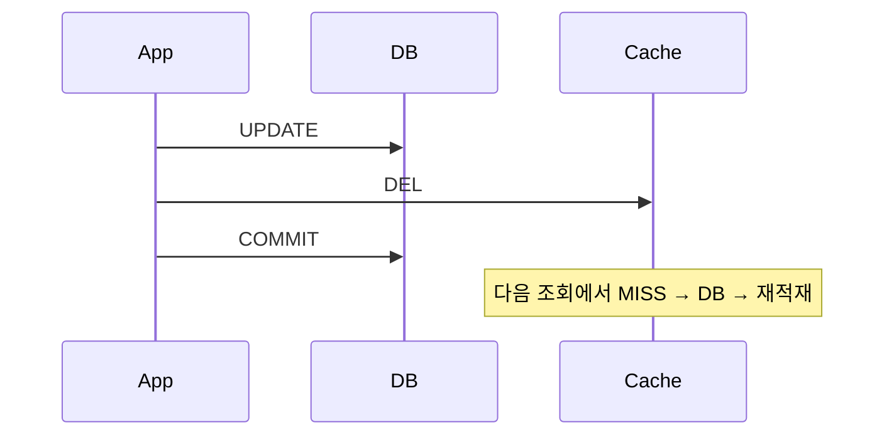
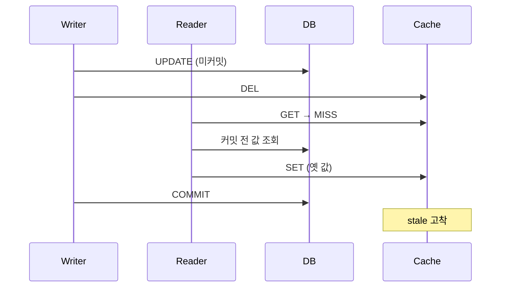

# Write Invalidate

> **쓰는 즉시 옛 캐시를 버린다.**

새 값으로 고쳐 넣지 않고 **지우기만** 한다.
다시 만드는 일은 다음에 읽는 쪽이 맡는다.
쓰기 경로는 "무엇이 틀렸는지"만 알면 되고, "무엇이 맞는지"는 몰라도 된다.

---

DB 변경 직후 캐시를 삭제한다. Cache-Aside의 표준 무효화 방식이다.

## 동작



## 구현

```java
@Transactional
@CacheEvict(cacheNames = CachePolicy.Name.USER, key = "#command.userId")
public void updateUser(UpdateUserCommand command) {
    userRepository.update(command);
}
```

## 보장하는 것

| 항목 | 내용 |
|-----|-----|
| 정상 경로 최신성 | 변경 후 첫 조회가 DB를 읽는다 |
| 쓰기 경로 단순성 | 캐시 값을 재구성할 필요가 없다 |
| 롤백 안전성 | 롤백되어도 캐시 미스 1회로 끝난다 |

## 보장하지 않는 것

**실행 순서가 프레임워크 계약으로 보장되지 않는다.**

`@EnableCaching`과 `@EnableTransactionManagement`는 **둘 다 기본 order가 `Integer.MAX_VALUE`** 이고,
Spring AOP 레퍼런스는 같은 order일 때 상대 순서를 **undefined**로 규정한다.
이 문제를 다룬 이슈 `spring-framework#23527`은 **not planned**로 닫혔다.

| 어드바이저 배치 | `beforeInvocation=false` evict 시점 |
|--------------|--------------------------------|
| 캐시가 바깥 | 트랜잭션 **커밋 후** |
| 트랜잭션이 바깥 | **커밋 전** |

커밋 전에 evict되면 이 경합이 발생한다.



| 항목 | 내용 |
|-----|-----|
| 실행 순서 | order를 명시하지 않으면 보장되지 않는다 |
| 커밋 전 재적재 | 위 경합으로 stale이 고착될 수 있다 |
| 커밋 후 유실 | DEL 직전 프로세스가 죽으면 무효화가 사라진다 → [dual-write.md](../concepts/dual-write.md) |
| 조회-갱신 경합 | 커밋 후 evict라도 긴 조회와 겹치면 stale 적재 가능 |

### 완화 옵션

`RedisCacheManager.builder(...).transactionAware()` 는 `put`/`evict`/`clear`를 after-commit으로 지연시킨다.
단 `evictIfPresent`/`invalidate`는 **지연되지 않고 즉시** 수행된다(Spring 5.2+).
`@CacheEvict(beforeInvocation = true)`는 내부적으로 이 즉시 경로를 타므로 transactionAware의 지연이 적용되지 않는다.

## 선택 기준

| 적합 | 부적합 |
|-----|-------|
| 단일 애플리케이션이 DB를 수정하는 일반 서비스 | 커밋 순서 보장이 필요한 경우 → [after-commit-invalidate](after-commit-invalidate.md) |

## 검증

```
□ @CacheEvict가 커밋 전에 실행되는지 후에 실행되는지 테스트로 고정한다
□ transactionAware() 적용 전후의 실행 시점 차이를 확인한다
□ 조회 지연을 주입해 커밋 전 재적재 경합을 재현한다
□ 무효화 이후 첫 조회에서 DB 조회가 정확히 1회 발생한다
```

## 관련

- [dual-write.md](../concepts/dual-write.md) · [after-commit-invalidate.md](after-commit-invalidate.md)
