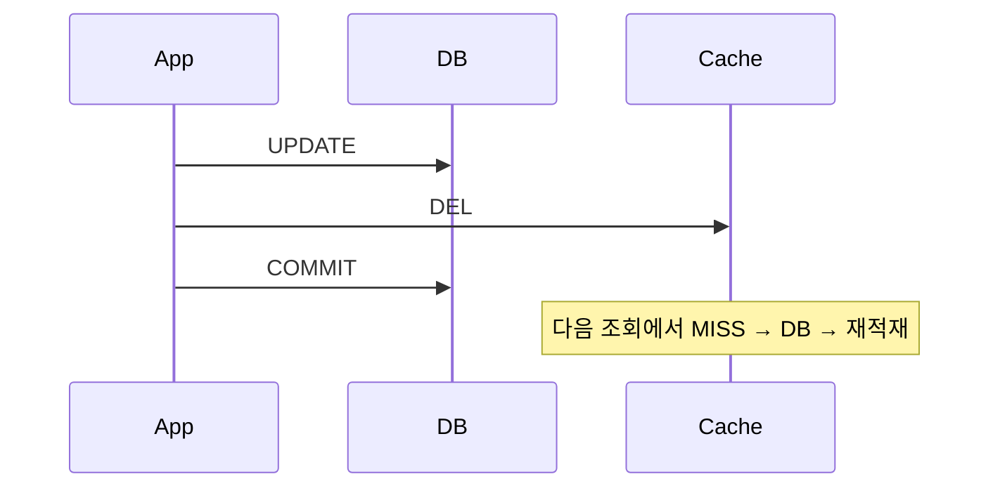
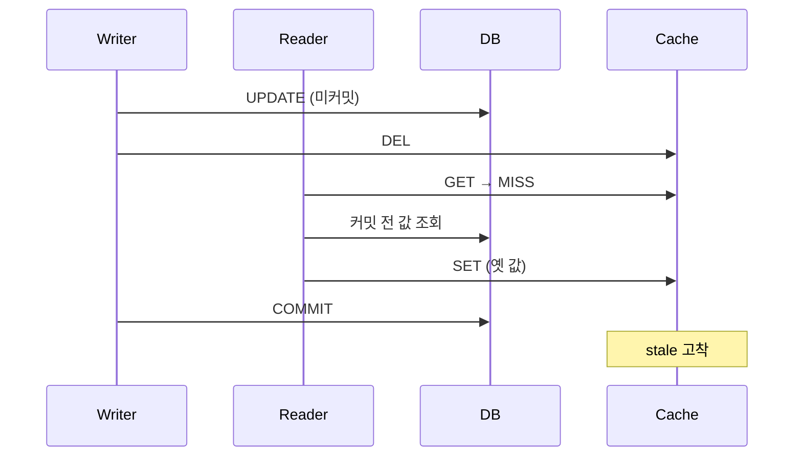

# Write Invalidate

> **쓰는 즉시 옛 캐시를 버린다.**

새 값으로 고쳐 넣지 않고 **지우기만** 한다.
다시 만드는 일은 다음에 읽는 쪽이 맡는다.
쓰기 경로는 "무엇이 틀렸는지"만 알면 되고, "무엇이 맞는지"는 몰라도 된다.

---

DB 변경 직후 캐시를 삭제한다. Cache-Aside의 표준 무효화 방식이다.

## 동작



## 구현

```java
@Transactional
@CacheEvict(cacheNames = CachePolicy.Name.USER, key = "#command.userId")
public void updateUser(UpdateUserCommand command) {
    userRepository.update(command);
}
```

## 보장하는 것

| 항목 | 내용 |
|-----|-----|
| 정상 경로 최신성 | 변경 후 첫 조회가 DB를 읽는다 |
| 쓰기 경로 단순성 | 캐시 값을 재구성할 필요가 없다 |
| 롤백 안전성 | 롤백되어도 캐시 미스 1회로 끝난다 |

## 보장하지 않는 것

**실행 순서가 프레임워크 계약으로 보장되지 않는다.**

`@EnableCaching`과 `@EnableTransactionManagement`는 **둘 다 기본 order가 `Integer.MAX_VALUE`** 이고,
Spring AOP 레퍼런스는 같은 order일 때 상대 순서를 **undefined**로 규정한다.
이 문제를 다룬 이슈 `spring-framework#23527`은 **not planned**로 닫혔다.

| 어드바이저 배치 | 메서드가 트랜잭션을 소유할 때 evict 시점 |
|--------------|--------------------------------|
| 캐시가 바깥 | 트랜잭션 **커밋 후** |
| 트랜잭션이 바깥 | **커밋 전** |

PoC 환경(Spring Boot 3.5.0)에서 실제 프록시 체인을 관측하면 `CacheInterceptor`가 바깥,
`TransactionInterceptor`가 안쪽이고 **둘 다 order가 `Integer.MAX_VALUE`** 로 동률이다.
동률의 tie-break 결과일 뿐이므로 계약이 아니며, 버전·설정에 따라 뒤집힐 수 있다.

**배치가 안전한 쪽이어도 안전하지 않다.**
위 표는 그 메서드가 트랜잭션을 **직접 소유할 때만** 성립한다.
쓰기 메서드가 바깥 트랜잭션에 참여(`REQUIRED`)하면
어드바이저 배치와 무관하게 evict가 **바깥 커밋보다 먼저** 끝난다.
파사드·오케스트레이션 계층이 여러 쓰기를 한 트랜잭션으로 묶는 순간 이 조건이 성립한다.

커밋 전에 evict되면 이 경합이 발생한다.



| 항목 | 내용 |
|-----|-----|
| 실행 순서 | order를 명시하지 않으면 보장되지 않는다 |
| 커밋 전 재적재 | 위 경합으로 stale이 고착될 수 있다 |
| 커밋 후 유실 | DEL 직전 프로세스가 죽으면 무효화가 사라진다 → [dual-write.md](../concepts/dual-write.md) |
| 조회-갱신 경합 | 커밋 후 evict라도 긴 조회와 겹치면 stale 적재 가능 |

### 완화 옵션

`RedisCacheManager.builder(...).transactionAware()` 는 `put`/`evict`/`clear`를 after-commit으로 지연시킨다.
단 `evictIfPresent`/`invalidate`는 **지연되지 않고 즉시** 수행된다(Spring 5.2+).
`@CacheEvict(beforeInvocation = true)`는 내부적으로 이 즉시 경로를 타므로 transactionAware의 지연이 적용되지 않는다.

**실측.** PoC 모듈에 `transactionAware()` 를 켜고 테스트를 재실행하면 세 케이스가 뒤집힌다.

| 테스트 명제 | `transactionAware()` 적용 시 |
|-----------|---------------------------|
| 커밋을 기다리지 않고 캐시를 지운다 | 더 이상 성립하지 않음 (커밋까지 유지) |
| 커밋 전 조회가 옛 값을 재적재한다 | **stale 고착이 닫힘** |
| 롤백해도 캐시는 지워져 있다 | 롤백 시 evict 자체가 취소됨 |

즉 `@CacheEvict` 의 **시점 문제는 설정으로 해결된다.**
남는 것은 누락 축이다 — 어노테이션을 붙이지 않은 쓰기 경로는 여전히 조용히 stale을 남긴다.

**다만 엔티티 이벤트와 함께 쓰면 위험하다.** `transactionAware()` 는 `put` 도 지연시키는데,
`CacheEvictor` 는 커밋 이후에 실행되므로 지연된 `put` 이 `evict` 보다 늦게 착지할 수 있다.
두 축을 섞을 때는 켜지 않는다.

### evictIfPresent 의 반환값은 Redis 에서 의미가 없다

`Cache.evictIfPresent` 의 **기본 구현은 `evict()` 를 호출한 뒤 무조건 `false` 를 반환**하고,
`RedisCache` 는 이를 재정의하지 않는다(spring-context 6.2.7 / spring-data-redis 3.5.0 바이트코드 확인).

따라서 "실제로 지웠는지"를 반환값으로 판별할 수 없다.
`ConcurrentMapCache` 는 참을 반환하므로, 이 값을 결과로 노출하면 **캐시 구현에 따라 의미가 달라진다.**
코어는 `EVICT_REQUESTED` / `CACHE_NOT_REGISTERED` / `FAILED` 세 값만 기록한다.

## 선택 기준

| 적합 | 부적합 |
|-----|-------|
| 단일 애플리케이션이 DB를 수정하는 일반 서비스 | 커밋 순서 보장이 필요한 경우 → [after-commit-invalidate](after-commit-invalidate.md) |

## 검증

```
□ @CacheEvict가 커밋 전에 실행되는지 후에 실행되는지 테스트로 고정한다
□ transactionAware() 적용 전후의 실행 시점 차이를 확인한다
□ 조회 지연을 주입해 커밋 전 재적재 경합을 재현한다
□ 무효화 이후 첫 조회에서 DB 조회가 정확히 1회 발생한다
```

## PoC 구현

`write-invalidate` 모듈은 두 방식을 한 모듈에 나란히 둔다.
같은 엔티티에 둘 다 걸면 엔티티 이벤트가 `@CacheEvict`의 실패를 가려버리므로 **엔티티로 분리**했다.
이 분리 자체가 리스너의 `instanceof` 선별을 증명한다.

| 엔티티 | `CacheEvictable` | 무효화 경로 | 쓰기 서비스 |
|-------|-----------------|-----------|-----------|
| `User` | 구현 | Hibernate `POST_COMMIT_*` | 캐시 코드 없음 |
| `Article` | 미구현 | Spring `@CacheEvict` | `@CacheEvict` 선언 |

### 테스트로 고정한 명제

| 상황 | `@CacheEvict` (Article) | 엔티티 이벤트 (User) |
|-----|------------------------|--------------------|
| 쓰기가 트랜잭션을 직접 소유 | 새 값 반환 | 새 값 반환 |
| 바깥 트랜잭션에 참여, 커밋 전 | 캐시가 이미 비워짐 | 캐시 유지 |
| 커밋 전 조회가 끼어듦 | **stale 고착** | 커밋 후 무효화가 걷어냄 |
| 롤백 | 캐시는 이미 삭제됨 (미스 1회 손실) | 무효화 없음 |

경합은 스레드 타이밍이 아니라 **바깥 트랜잭션 경계**로 재현한다.
`TransactionTemplate`으로 커밋 시점을 테스트가 쥐고, 조회는 다른 스레드에서 수행해
호출자의 트랜잭션에 참여하지 않게 한다. 어드바이저 순서에 의존하지 않으므로 결정적이다.

미보장 동작인 어드바이저 순서는 **테스트로 고정하지 않는다.** 버전 업그레이드에서 깨지는 것이 정상이다.

## 관련

- [dual-write.md](../concepts/dual-write.md) · [after-commit-invalidate.md](after-commit-invalidate.md)
