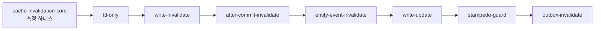

# PoC 시나리오

Redis 기능 데모가 아니라 **Cache Consistency Lab**으로 구성한다.
모든 전략이 동일한 API·DB 스키마를 쓰고 무효화 구현만 다르게 한다.

```text
GET  /users/{id}
PUT  /users/{id}
```

## 시나리오

| # | 모듈 | 검증할 명제 | 필요 인프라 | 상태 |
|---|-----|-----------|-----------|-----|
| 1 | `ttl-only` | stale window의 상한이 TTL과 일치한다 | Redis, MySQL | 완료 |
| 2 | `write-invalidate` | 커밋 전 무효화는 stale을 고착시키고, 커밋 후 무효화는 그러지 않는다 | Redis, MySQL | 완료 |
| 3 | `after-commit-invalidate` | `@TransactionalEventListener(AFTER_COMMIT)`가 같은 보장을 선언적으로 제공한다 | Redis, MySQL | 예정 |
| 4 | `entity-event-invalidate` | 벌크 연산·자연키 변경·교차 엔티티까지 확장된다 | Redis, MySQL | 부분 |
| 5 | `write-update` | 롤백 시 DB와 캐시가 어긋난다 | Redis, MySQL | 예정 |
| 6 | `stampede-guard` | 무효화를 잘 할수록 stampede가 잦아진다 | Redis, MySQL | 예정 |
| 7 | `outbox-invalidate` | 앱이 죽어도 무효화가 복구된다 | + RabbitMQ | 예정 |
| 8 | `cdc-invalidate` | 벌크 UPDATE도 무효화된다 | + Debezium, Kafka | 예정 |

2번 모듈이 `@CacheEvict`와 Hibernate `POST_COMMIT_*` 엔티티 이벤트를 **한 모듈에 나란히** 담는다.
따라서 4번의 기본 메커니즘은 2번에서 이미 검증됐고, 4번에 남은 것은 위 표의 확장 명제다.

`_settings/docker/docker-compose.yml` 기준으로 1~6은 현재 컨테이너(redis, mysql)로 바로 가능하다.
7은 rabbitmq를 쓰고, 8은 Debezium·Kafka 추가가 필요하다.

## 구현 순서



**2번을 3번보다 먼저** 만든다.
순진한 버전의 실패를 먼저 봐야 `@TransactionalEventListener`가 왜 필요한지 설득력을 갖는다.

## 측정 지표

지표 정의는 [concepts/metrics.md](concepts/metrics.md) 단일 출처를 따른다.

| 지표 | 수집 방법 |
|-----|---------|
| DB Query Count | Hibernate `Statistics.getPrepareStatementCount()` |
| Cache DEL Count | `CacheEvictionRecorder` |
| Invalidation Failure | `CacheEvictionRecorder` |
| Stale Read Count | 조회 결과와 DB 최신값을 대조하는 검증 컴포넌트 |
| Invalidation Lag | commit 타임스탬프와 DEL 타임스탬프의 차이 |

## 결과 기록

> 아래 표는 **측정 후 채운다.** 실행 전에 추정치를 기입하지 않는다.

측정 조건을 함께 기록한다.

```text
측정 일시    :
실행 환경    : OS / JDK / Spring Boot / Redis / MySQL 버전
요청 수      :
동시성       :
Read : Write :
TTL          :
```

| 시나리오 | DB Query | Cache DEL | Stale Read | Invalidation Lag P99 | Response P99 |
|---------|---------|----------|-----------|--------------------|-------------|
| ttl-only | | | | 해당 없음 | |
| write-invalidate | | | | | |
| after-commit-invalidate | | | | | |
| entity-event-invalidate | | | | | |
| write-update | | | | | |
| stampede-guard | | | | | |
| outbox-invalidate | | | | | |

측정하지 않은 항목은 빈칸이 아니라 `미측정`으로 기록한다.
효과가 없었던 경우도 그대로 기록한다.
