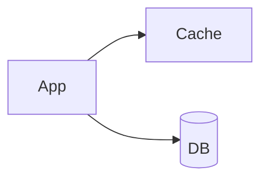
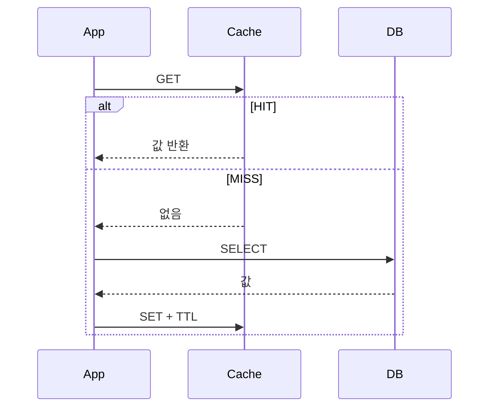

# Look Aside (Cache Aside)

> **`aside`** — 옆에, 비켜서

캐시를 DB 앞에 세우지 않고 **앱 옆에 따로 두고 직접 챙긴다.**
앱은 캐시도 알고 DB도 안다. 바구니를 먼저 들여다보고, 없으면 직접 창고에 다녀와 바구니를 채운다.



---

애플리케이션이 캐시를 먼저 확인하고, 없으면 DB에서 읽어 캐시에 채운다.
**가장 널리 쓰이는 읽기 전략이다.**

## 동작



캐시는 DB 접근 경로에 끼어들지 않는다. 애플리케이션이 두 저장소를 모두 직접 다룬다.

## 구현

```java
@Cacheable(cacheNames = CachePolicy.Name.USER, key = "#id")
public User findById(Long id) {
    return userRepository.findById(id)
            .orElseThrow(UserNotFoundException::new);
}
```

## 장점

| 항목 | 내용 |
|-----|-----|
| 캐시 장애 격리 | 구조상 DB 조회 경로가 살아 있다 (단, 아래 조건 필요) |
| 선별적 캐싱 | 실제 요청된 데이터만 적재되어 메모리를 효율적으로 쓴다 |
| 구현 단순 | 캐시 제공자에 대한 의존이 적다 |

> **주의 — 구조적 장점일 뿐 기본 설정으로는 실현되지 않는다.**
> Spring Cache의 기본 `SimpleCacheErrorHandler`는 캐시 예외를 그대로 던져
> **Redis 장애가 곧 요청 실패**가 된다.
> `CachingConfigurer.errorHandler()`로 폴백 처리기를 등록해야 비로소 "캐시가 죽어도 서비스 유지"가 참이 된다.
> → [cache-failure-modes.md](../concepts/cache-failure-modes.md)

## 단점

| 항목 | 내용 |
|-----|-----|
| 정합성 책임 | 캐시-DB 동기화를 애플리케이션이 책임진다 → [무효화 전략](../invalidation/) 필요 |
| 첫 조회 비용 | 최초 조회는 반드시 DB를 거친다 |
| 캐시 장애 시 부하 전이 | Redis가 죽으면 커넥션이 순간적으로 DB에 몰린다 |
| Stampede | 인기 키 만료 시 동시 MISS가 DB를 때린다 → [stampede.md](../concepts/stampede.md) |
| Penetration | 존재하지 않는 키 조회는 캐시가 방어하지 못한다 → [cache-failure-modes.md](../concepts/cache-failure-modes.md) |

## 적합성

| 적합 | 부적합 |
|-----|-------|
| 동일 쿼리가 반복되는 읽기 중심 워크로드 | 단건 조회 빈도가 높고 재사용이 적은 경우 |

## Cache Warming

서비스 초기 또는 배포 직후에는 캐시가 비어 있어 대량 MISS가 발생한다(Thundering Herd).
자주 조회되는 데이터를 미리 적재해 완화한다.

| 시점 | 대응 |
|-----|-----|
| 서비스 기동 직후 | 핫 데이터 선적재 |
| TTL 동시 만료 | jitter 적용 → [ttl.md](../concepts/ttl.md) |

## 조합

| 쓰기 전략 조합 | 비고 |
|--------------|-----|
| [Write Around](../write/write-around.md) | **가장 일반적인 조합** |
| [Write Through](../write/write-through.md) | 캐시 최신성이 필요할 때 |

## 관련

- [why-invalidate-not-update.md](../concepts/why-invalidate-not-update.md)
- [read-through.md](read-through.md) · [stampede.md](../concepts/stampede.md)

## Reference

- [Microsoft - Cache-Aside pattern](https://learn.microsoft.com/en-us/azure/architecture/patterns/cache-aside)
- [Redis - Cache-aside](https://redis.io/docs/latest/develop/use-cases/cache-aside/)
