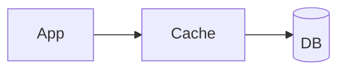
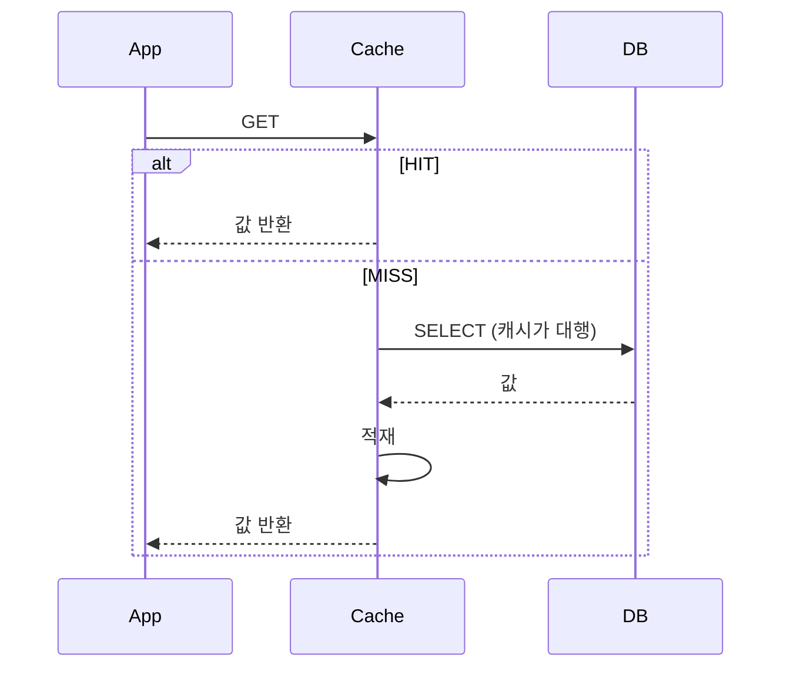

# Read Through

> **`through`** — ~를 통과해서

읽기가 **캐시를 통과해** DB로 간다. 캐시가 경로 위에 가로막고 서 있다.
앱은 캐시에게만 말을 걸고, **DB의 존재를 모른다.** 없으면 캐시가 알아서 다녀온다.

---

애플리케이션은 캐시에서만 읽고, **캐시가 DB 조회를 대행**한다.
동기화 주체가 애플리케이션이 아니라 캐시 제공자(또는 라이브러리)다.

## 동작

Look Aside와의 차이는 **누가 DB를 읽는가**이다.

| 전략 | DB 조회 주체 | 캐시 장애 시 |
|-----|------------|------------|
| Look Aside | 애플리케이션 | DB로 조회 가능 — 서비스 유지 |
| Read Through | 캐시 | **서비스 중단 위험** |

## 장점

| 항목 | 내용 |
|-----|-----|
| 정합성 부담 감소 | 적재 시점이 캐시에 위임되어 애플리케이션 코드가 단순해진다 |
| 로직 중앙화 | 조회·적재 로직이 한 곳에 모인다 |
| 중복 조회 억제 | 구현체가 내부적으로 single-flight를 제공하기도 한다 |

## 단점

| 항목 | 내용 |
|-----|-----|
| **캐시가 SPOF** | 캐시 장애가 곧 서비스 중단으로 이어진다. Replication/Cluster 구성이 사실상 필수 → [cache-failure-modes.md](../concepts/cache-failure-modes.md) |
| 조회 지연 | MISS 경로가 캐시를 한 번 더 거친다 |
| 제공자 의존 | 캐시 구현체의 기능에 종속된다 |

## Spring에서의 위치

Spring Cache의 `@Cacheable`은 **선언 형태만 보면 Read Through처럼** 보이지만,
실제로는 프록시가 애플리케이션 코드(리포지토리 호출)를 실행하므로 **Look Aside에 가깝다.**
캐시가 죽어도 대상 메서드가 호출되어 DB 조회가 이어진다.

진짜 Read Through는 캐시 제품이 백엔드 로더를 직접 호출하는 구성이다
(예: Hazelcast `MapLoader`, Ehcache `CacheLoaderWriter`).

## 적합성

| 적합 | 부적합 |
|-----|-------|
| 캐시 계층을 고가용으로 운영할 수 있는 환경 | 캐시 장애 시에도 서비스가 유지되어야 하는 경우 |

## Cache Warming

Look Aside와 마찬가지로 초기 대량 MISS를 피하기 위해 선적재가 권장된다.

## 조합

| 쓰기 전략 조합 | 비고 |
|--------------|-----|
| [Write Around](../write/write-around.md) | 항상 DB에 쓰므로 정합성 안전장치가 강하다 |
| [Write Through](../write/write-through.md) | 쓸 때 캐시에 먼저 쓰므로 읽을 때 최신 보장 (예: AWS DAX) |

## 관련

- [look-aside.md](look-aside.md) · [write-through.md](../write/write-through.md)

## Reference

- [Oracle Coherence - Read-Through, Write-Through, Write-Behind, Refresh-Ahead](https://docs.oracle.com/cd/E16459_01/coh.350/e14510/readthrough.htm)
- [Microsoft - Cache-Aside pattern](https://learn.microsoft.com/en-us/azure/architecture/patterns/cache-aside)
