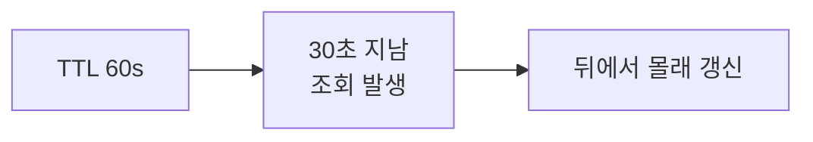
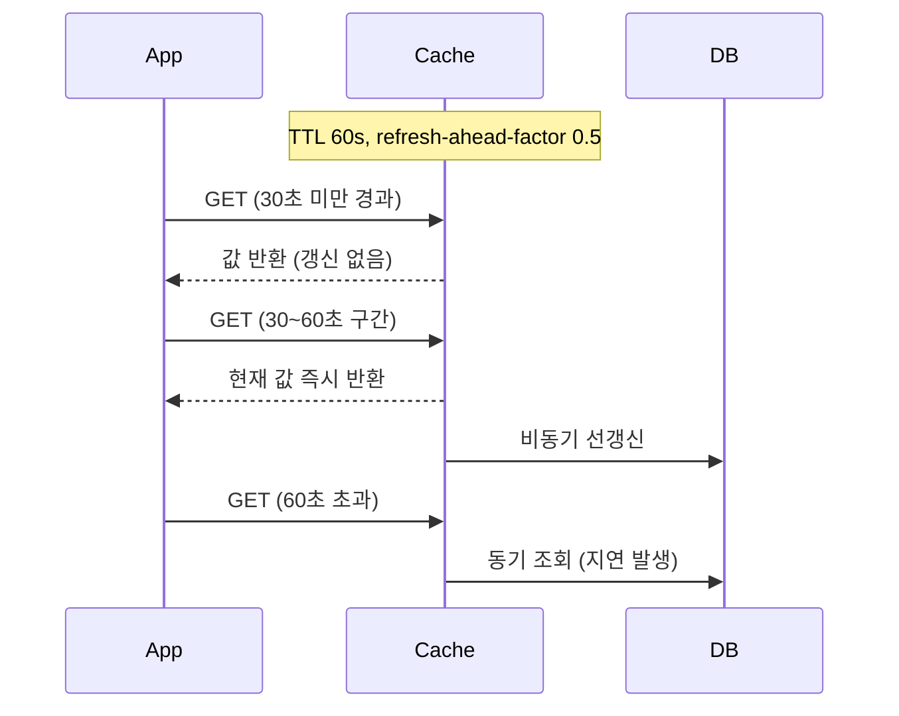

# Refresh Ahead

> **`ahead`** — 미리, 앞서

만료를 기다리지 않고 **만료되기 전에 미리** 새로 채워둔다.
사용자가 "만료된 순간"을 만나지 않게 하는 것이 목적이다.

---

만료가 임박한 엔트리를 **만료 전에 비동기로 미리 갱신**한다.
`ahead` = 앞서, 미리.

## 동작

만료 전 구간에서 접근이 발생해야 트리거된다.
**이미 만료된 뒤 접근하면 동기 조회로 떨어진다.**

## 장점

| 항목 | 내용 |
|-----|-----|
| 지연 감소 | 자주 접근되는 엔트리는 만료로 인한 MISS 지연을 겪지 않는다 |
| Stampede 완화 | 만료 시점에 몰리는 동시 조회를 분산한다 |
| 조정 불필요 | 락이나 인스턴스 간 협조가 없다 |

## 단점

| 항목 | 내용 |
|-----|-----|
| **예측 실패 비용** | 앞으로 필요할 엔트리를 잘못 예측하면 불필요한 DB 요청이 늘어난다 |
| 저트래픽 키 무효 | 갱신 구간에 접근이 없으면 트리거되지 않는다 |
| TTL 의존 | 만료 시간이 설정되어 있어야 동작한다 |

Oracle 문서의 표현대로, 예측 정확도가 낮으면 처리량에 악영향을 주고
DB가 밀리기 시작하면 **오히려 지연이 늘어날 수 있다.**

## Stale-While-Revalidate와의 차이

| | Refresh Ahead | [SWR](../concepts/stampede.md) |
|---|-------------|-----|
| 갱신 시점 | **만료 전** | **만료 후** |
| 반환하는 값 | 아직 유효한 값 | **의도적으로 stale한 값** |
| 만료 후 접근 | 동기 조회로 대기 | stale 값 즉시 반환 |

Refresh Ahead는 stale을 제공하지 않는다는 점이 다르다.

## Spring에서

Spring Cache에는 refresh-ahead 기본 구현이 없다.
`RedisCacheConfiguration.enableTimeToIdle()`(Spring Data Redis 3.2+)은
읽기 시 TTL을 연장할 뿐 선갱신은 하지 않는다.

직접 구현하려면 캐시 값에 `refreshAt`을 함께 저장하고,
조회 시 임계를 넘으면 비동기 갱신을 트리거한다.

## 적합성

| 적합 | 부적합 |
|-----|-------|
| 접근 패턴이 예측 가능하고 조회가 몰리는 핫 데이터 | 접근이 희소하거나 예측이 어려운 데이터 |

## 관련

- [look-aside.md](look-aside.md) · [read-through.md](read-through.md) · [ttl.md](../concepts/ttl.md) · [stampede.md](../concepts/stampede.md)

## Reference

- [Oracle Coherence - Refresh-Ahead Caching](https://docs.oracle.com/cd/E16459_01/coh.350/e14510/readthrough.htm)
