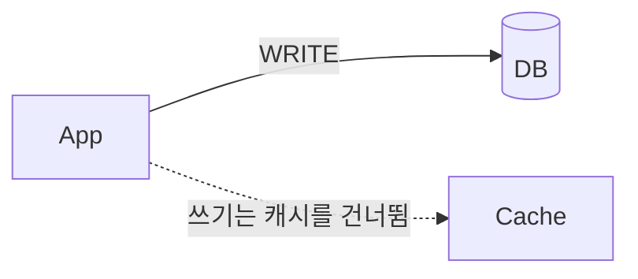
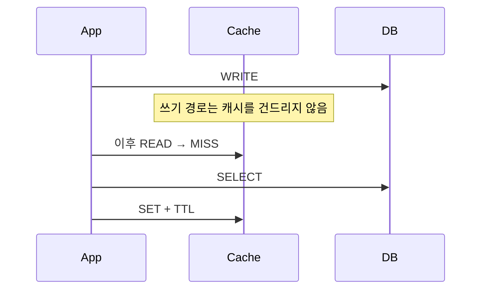

# Write Around

> **`around`** — ~를 돌아서, 우회해서

쓰기가 **캐시를 비켜 지나** DB로 직행한다.
캐시는 쓰기 때 채워지지 않고, 나중에 **누군가 읽을 때** 비로소 채워진다.

---

쓰기는 DB에만 하고, 캐시는 **읽기 MISS 시점에만** 채워진다.

## 동작

## 장점

| 항목 | 내용 |
|-----|-----|
| 쓰기 성능 | Write Through 대비 쓰기가 훨씬 빠르다 |
| 메모리 효율 | 읽히지 않는 데이터가 캐시를 차지하지 않는다 |
| 쓰기 경로 단순성 | 캐시 조립 로직을 몰라도 된다 |

## 단점

| 항목 | 내용 |
|-----|-----|
| **정합성** | 캐시에 옛 값이 남아 있으면 DB 변경이 반영되지 않는다 |
| 첫 조회 비용 | 쓰기 직후 조회는 반드시 MISS |

> DB를 수정·삭제할 때 캐시도 함께 삭제하거나 TTL을 짧게 가져가야 한다.
> **이 "언제 어떻게 지울 것인가"가 곧 [무효화 전략](../invalidation/)이다.**

## 적합성

| 적합 | 부적합 |
|-----|-------|
| 한 번 쓰이고 자주 읽히지 않는 데이터, 읽기 중심 워크로드 | 쓰기 직후 즉시 조회가 잦은 데이터 |

## 무효화와의 관계

Write Around는 "캐시에 쓰지 않는다"만 정할 뿐, **옛 캐시를 언제 지울지는 정하지 않는다.**
그 선택이 무효화 전략이다.

| 무효화 선택 | 문서 |
|-----------|-----|
| 지우지 않고 TTL만 | [ttl-only](../invalidation/ttl-only.md) |
| 쓰기 직후 즉시 삭제 | [write-invalidate](../invalidation/write-invalidate.md) |
| 커밋 후 삭제 | [after-commit-invalidate](../invalidation/after-commit-invalidate.md) |
| 엔티티 이벤트로 삭제 | [entity-event-invalidate](../invalidation/entity-event-invalidate.md) |
| 이벤트·CDC로 삭제 | [cdc-invalidate](../invalidation/cdc-invalidate.md) |

## 조합

`Look Aside + Write Around`가 **가장 일반적인 조합**이다.

## 관련

- [look-aside.md](../read/look-aside.md) · [why-invalidate-not-update.md](../concepts/why-invalidate-not-update.md)

## Reference

- [Microsoft - Cache-Aside pattern](https://learn.microsoft.com/en-us/azure/architecture/patterns/cache-aside)
